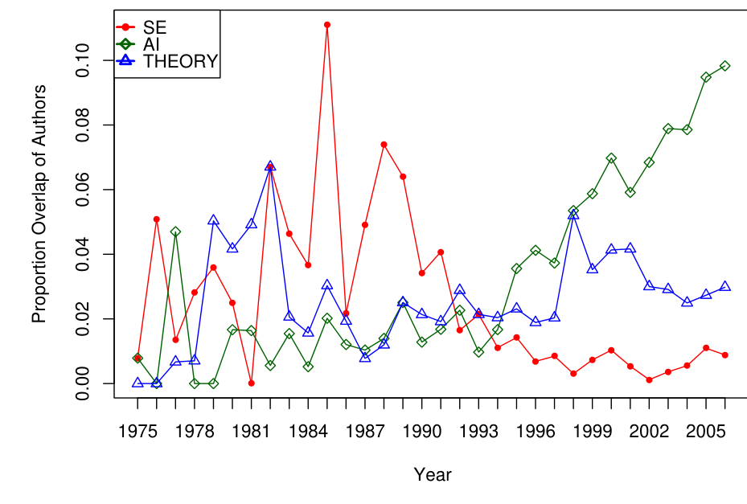
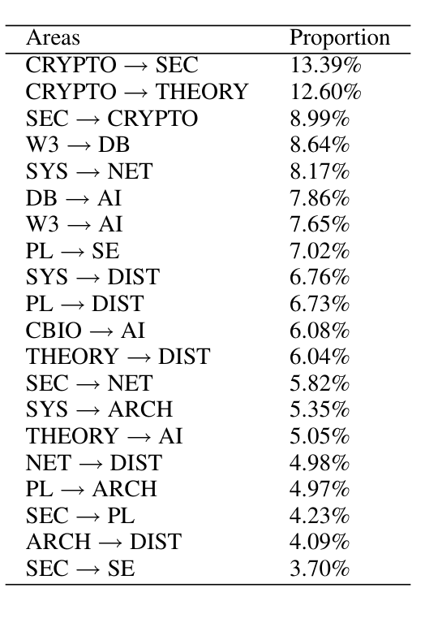

Figure 6: Overlap of DB with other areas over time.

(5.9) A1(r, y) = argmax_a S1(r, a, y)

(5.10) A2(r, y) = argmax_a S2(r, a, y)

For all authors over the span of their careers, we found that A1 and A2 differed in less than one percent of the (researcher, year) cases.

Computing the migration of authors between areas is fairly straightforward. Let R(a, y) be the set of researchers who have area a as their main research area in year y. The number researchers that migrated from area a to area b between y and y + 1 is |R(a, y) ∩ R(b, y + 1)|. We normalize this measure to derive the proportion of total authors in a that entered b.

(5.11) |R(a, y) ∩ R(b, y + 1)| / |R(a, y)|

### RESULTS

We use area overlap and migration to examine the changing relationships between different research areas. Of particular note are cases where the overlap and migration with one area wanes while another is rising.

Figure 6 depicts one example, which shows the number of authors who published in both software engineering and other disciplines in the same year over time. In the mid to late 80’s, 8–10% of the authors publishing in the top tier database conferences were also publishing in SE. This “interest” dies off by the mid to late 90’s with a nearly monotonic increase in the proportion of authors from DB publishing in machine learning conferences (AI). This confirms the folklore that the two areas are converging.

Our overlap metric is an asymmetric ratio which is normalized and thus comparable. Table 4 shows areas with highest and lowest overlap in 2005. A row that reads Area1 → Area2 x% indicates that x% of the authors that published in Area1 also published in Area2. For instance, the first row indicates that just over 13% of the authors that

Table 4: Pairs of areas with highest overlap

Areas Proportion  
CRYPTO → SEC 13.39%  
CRYPTO → THEORY 12.60%  
SEC → CRYPTO 8.99%  
W3 → DB 8.64%  
SYS → NET 8.17%  
DB → AI 7.86%  
W3 → AI 7.65%  
PL → SE 7.02%  
SYS → DIST 6.76%  
PL → DIST 6.73%  
CBIO → AI 6.08%  
THEORY → DIST 6.04%  
SEC → NET 5.82%  
SYS → ARCH 5.35%  
THEORY → AI 5.05%  
NET → DIST 4.98%  
PL → ARCH 4.97%  
SEC → PL 4.23%  
ARCH → DIST 4.09%  
SEC → SE 3.70%

published in top cryptography conferences also published in top security conferences. The first three rows show that cryptography, security, and theory have many authors in common. Compared to overlap values from prior years (not shown), this confirms the folklore that the areas of software engineering and programming languages are moving closer together and attracting the same authors. We also see a rise in the authors in computational biology that are publishing in machine learning conferences (AI) as new algorithms and analysis techniques are devised for dealing with the scale and kinds of data now available. Of the 182 possible area pairs, 32, or 18%, had no overlap whatsoever.

Turning to migration over time, one key result is that migration partitions the areas into a set in which the net flows are nearly zero, i.e., each migration path had roughly the same people leaving as entering, and a set in which the flows are not zero. All areas except for DB, SE, PL, NET, and W3 had a net flow of nearly 0 along all migration paths. Among these areas, we find a flow of people from DB to PL and thence to NET and no corresponding flow of equivalent magnitude in the other direction.

### 5.3 Interdisciplinariness

We quantify each author’s publication record as a vector whose components are the scores calculated, at a particular point in time, using Equation 5.8 from section 5.2. We call this vector a publication profile. For each area and conference, we create a matrix from the publication profiles of its authors. Since a publication profile is a snapshot of an author’s activity, these matrices may contain distinct publication profiles for an author who publishes more than once in the interval under consideration. Principal Components Analysis (PCA) of the resulting matrices illuminate the degree to which the associated conference or area is diverse or interdisciplinary.

A scree plot shows how much of the variance in each author’s publication profile is described by each eigenvector.