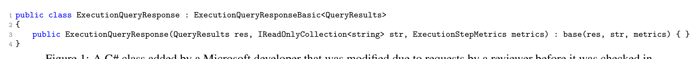
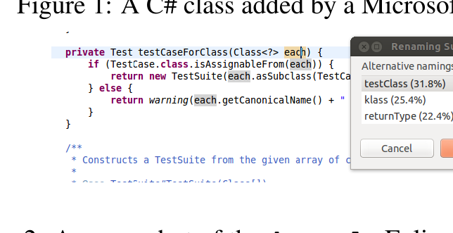

Figure 1: A C# class added by a Microsoft developer that was modified due to requests by a reviewer before it was checked in.

Figure 2: A screenshot of the devstyle Eclipse plugin. The user has requested suggestion for alternate names of each argument.

For this reason, our use cases focus on times when the code is already being changed. To support our use cases, we have built four tools:

- devstyle: A plugin for Eclipse IDE that gives suggestions for identifier renaming and formatting both for a single identifier or format point and for the identifiers and formatting in a selection of code.
- styleprofile: A code review assistant that produces a profile that summarizes the adherence of a code snippet to the coding conventions of a codebase and suggests renaming and formatting changes to make that snippet more stylistically consistent with a project.
- genrule: A rule generator for Eclipse’s code formatter that generates rules for those conventions that NATURALIZE has inferred from a codebase.
- stylish?: A high precision pre-commit script for Git that rejects commits that have highly inconsistent and unnatural naming or formatting within a project.

The devstyle plugin offers two types of suggestions, single point suggestion under the mouse pointer and multiple point suggestion via right-clicking a selection. A screenshot from devstyle is shown in Figure 2. For single point suggestions, devstyle displays a ranked list of alternatives to the selected name or format. If devstyle has no suggestions, it simply flashes the current name or selection. If the user wishes, she selects one of the suggestions. If it is an identifier renaming, devstyle renames all uses, within scope, of that identifier under its previous name. This scope traversal is possible because our use cases assume an existing and compiled codebase. Formatting changes occur at the suggestion point. Multiple point suggestion returns a style profile, a ranked list of the top k most stylistically surprising naming or formatting choices in the current selection that could benefit from reconsideration. By default, k = 5 based on HCI considerations [23, 48]. To accept a suggestion here, the user must first select a location to modify, then select from among its top alternatives. The styleprofile tool outputs a style profile. genrule (Section 3.5) generates settings for the Eclipse code formatter. Finally, stylish? is a filter that uses the Eclipse code formatter with the settings from genrule to accept or reject a commit based on its style profile.

NATURALIZE uses an existing codebase, called a training corpus, as a reference from which to learn conventions. Commonly, the training corpus will be the current codebase, so that NATURALIZE learns domain-specific conventions related to the current project. Alternatively, NATURALIZE comes with a pre-packaged suggestion model, trained on a corpus of popular, vibrant projects that presumably embody good coding conventions. Developers can use this engine if they wish to increase their codebase’s adherence to a larger community’s consensus on best practice. Projects that are just starting and have little or no code written can also use as the training corpus a pre-existing codebase, for example another project in the same organization, whose conventions the developers wish to adopt. Here, again, we avoid normative comparison of coding conventions, and

do not force the user to specify their desired conventions explicitly. Instead, the user specifies a training corpus, and this is used as an implicit source of desired conventions. The NATURALIZE framework and tools are available at groups.inf.ed.ac.uk/naturalize.

## 3 The NATURALIZE Framework

In this section, we introduce the generic architecture of NATURALIZE, which can be applied to a wide variety of different types of conventions and is language independent. NATURALIZE is general and can be applied to any language for which a lexer and a parser exist, as token sequences and abstract syntax trees (ASTs) are used during analysis. Figure 3 illustrates its architecture. The input is a code snippet to be naturalized. This snippet is selected based on the user input, in a way that depends on the particular tool in question. For example, in devstyle, if a user selects a local variable for renaming, the input snippet would contain all AST nodes that reference that variable (Section 3.3). The output of NATURALIZE is a short list of suggestions, which can be filtered, then presented to the programmer. In general, a suggestion is a set of snippets that may replace the input snippet. The list is ranked by a naturalness score that is defined below. Alternately, the system can return a binary value indicating whether the code is natural, so as to support applications such as stylish?. The system makes no suggestion if it deems the input snippet to be sufficiently natural, or is unable to find good alternatives. This reduces the “Clippy effect” where users ignore a system that makes too many bad suggestions. In the next section, we describe each element in the architecture in more detail.

### Terminology

A language model (LM) is a probability distribution over strings. Given any string x = x0, x1, ... xM, where each xi is a token, a LM assigns a probability P(x). Let G be the grammar of a programming language. We use x to denote a snippet, that is, a string x such that αxβ ∈ L(G) for some strings α, β. We primarily consider snippets that are dominated by a single node in the file’s AST. That is, there is a node within the AST whose subtree comprises the entire snippet and nothing else. We use x to denote the input snippet to the framework, and y, z to denote arbitrary snippets.

### 3.1 The Core of NATURALIZE

The architecture contains two main elements: proposers and the scoring function. The proposers modify the input code snippet to produce a list of suggestion candidates that can replace the input snippet. In the example from Figure 1, each candidate replaces all occurrences of res with a different name used in similar contexts elsewhere in the project, such as results or queryResults. In principle, many implausible suggestions could ensue, so, in practice, proposers contain filtering logic.

A scoring function sorts these candidates according to a measure of naturalness. Its input is a candidate snippet, and it returns a real number measuring naturalness. Naturalness is measured with respect to a training corpus that is provided to NATURALIZE — thus allowing us to follow our guiding principle that naturalness must be measured with respect to a particular codebase. For example, the training corpus might be the set of source files A from the current application. A powerful way to measure the naturalness[2][3]

2 In extreme cases, such systems can be so widely mocked that they are publicly disabled by the company’s CEO in front of a cheering audience: http://bit.ly/pmHCwI.

3 The application of NATURALIZE to academic papers in software engineering is left to future work.