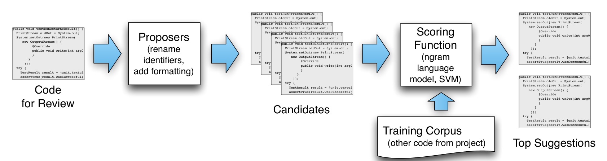

Figure 3: The architecture of NATURALIZE: a framework for learning coding conventions. A contiguous snippet of code is selected for review through the user interface. A set of proposers returns a set of candidates, which are modified versions of the snippet, e.g., with one local variable renamed. The candidates are ranked by a scoring function, such as an n-gram language model, which returns a small list of top suggestions to the interface, sorted by naturalness.

of a snippet is provided by statistical language modeling. We use P_A(y) to indicate the probability that the language model P, which has been trained on the corpus A, assigns to the string y. The key intuition is that an LM P_A is trained so that it assigns high probability to strings in the training corpus, i.e., snippets with higher log probability are more like the training corpus, and presumably more natural. There are several key reasons why statistical language models are a powerful approach for modeling coding conventions. First, probability distributions provide an easy way to represent soft constraints about conventions. This allows us to avoid many of the pitfalls of inflexible, rule-based approaches. Second, because they are based on a learning approach, LMs can flexibly adapt to the conventions in a new project. Intuitively, because P_A assigns high probability to strings t ∈ A that occur in the training corpus, it also assigns high probability to strings that are similar to those in the corpus. So the scoring functions tend to favor snippets that are stylistically consistent with the training corpus.

We score the naturalness of a snippet y = y_1:N as

s(y, P_A) = (1 / N) log P_A(y); (1)

that is, we deem snippets that are more probable under the LM as more natural in the application A. Equation 1 is cross-entropy multiplied by -1 to make s a score, where s(x) > s(y) implies x is more natural than y. Where it creates no confusion, we write s(y), eliding the second argument. When choosing between competing candidate snippets y and z, we need to know not only which candidate the LM prefers, but how “confident” it is. We measure this by a gap function g, which is the difference in scores g(y, z, P) = s(y, P) − s(z, P). Because s is essentially a log probability, g is the log ratio of probabilities between y and z. For example, when g(y, z) > 0 the snippet y is more natural — i.e., less surprising according to the LM — and thus is a better suggestion candidate than z. If g(y, z) = 0 then both snippets are equally natural.

Now we define the function suggest(x, C, k, t) that returns the top candidates according to the scoring function. This function returns a list of top candidates, or the empty list if no candidates are sufficiently natural. The function takes four parameters: the input snippet x, the list C = (c1, c2, ... , cr) of candidate snippets, and two thresholds: k ∈ N, the maximum number of suggestions to return, and t ∈ R, a minimum confidence value. The parameter k controls the size of the ranked list that is returned to the user, while t controls the suggestion frequency, that is, how confident NATURALIZE needs to be before it presents any suggestions to the user. Appropriately setting t allows NATURALIZE to avoid the Clippy effect by making no suggestion rather than a low quality one. Below, we present an automated method for selecting t.

The suggest function first sorts C = (c1, c2, ... , cr), the candidate list, according to s, so s(c1) ≥ s(c2) ≥ ... ≥ s(cr). Then, it trims the list to avoid overburdening the user: it truncates C to include only the top k elements, so that length(C) = min(k, r), and removes candidates ci ∈ C that are not sufficiently more natural than the original snippet; formally, it removes all ci from C where g(ci, x) < t. Finally, if the original input snippet x is the highest ranked in C, i.e., if c1 = x, suggest ignores the other suggestions, sets C = ∅ to decline to make a suggestion, and returns C.

Binary Decision
If an accept/reject decision on the input x is required, e.g., as in stylish?, NATURALIZE must collectively consider all of the locations in x at which it could make suggestions. We propose a score function for this binary decision that measures how good is the best possible improvement that NATURALIZE is able to make. Formally, let L be the set of locations in x at which NATURALIZE is able to make suggestions, and for each ℓ ∈ L, let C_ℓ be the system’s set of suggestions at ℓ. In general, C_ℓ contains name or formatting suggestions. Recall that P is the language model. We define the score

G(x, P) = max_{ℓ ∈ L} max_{c ∈ C_ℓ} g(c, x). (2)

If G(x, P) > T, then NATURALIZE rejects the snippet as being excessively unnatural. The threshold T controls the sensitivity of NATURALIZE to unnatural names and formatting. As T increases, fewer input snippets will be rejected, so some unnatural snippets will slip through, but as compensation the test is less likely to reject snippets that are in fact well-written.

Setting the Confidence Threshold
The thresholds t in the suggest function and T in the binary decision function are on log probabilities of strings, which can be difficult for users to interpret. Fortunately, these can be set automatically using the false positive rate (FPR), i.e. the proportion of snippets x that in fact follow convention but that the system erroneously rejects. We would like the FPR to be as small as possible, but, unless we wish the system to make no suggestions at all, we must accept some false positives. So we set a maximum acceptable FPR α, and search for a threshold t or T that ensures that NATURALIZE’s FPR is at most α. The principle is similar to statistical hypothesis testing. To make this work, we estimate the FPR for a given t or T. To do so, we select a random set of snippets from the training corpus, e.g., random method bodies, and compute the proportion of these snippets that are rejected using T. Again leveraging our assumption that our training corpus contains natural code, this proportion estimates the FPR. We use a grid search [11] to find the greatest value of T < α (t < α), the user-specified acceptable FPR bound.

### 3.2 Choices of Scoring Function

The generic framework described in Section 3.1 can, in principle, employ a wide variety of machine learning or NLP methods for its scoring function. Indeed, a large portion of the statistical NLP