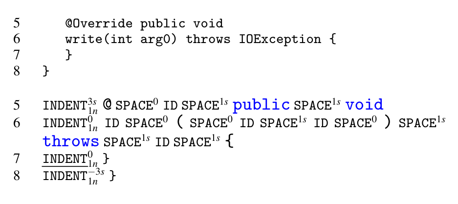

Figure 4: A code snippet from TextRunnerTest.java in JUnit and the corresponding formatting tokenization.

### 3.4 Suggesting Natural Formatting

function could be good at the single source problem but bad at the multiple source problem, e.g., if the score values have a different dynamic range when applied at different locations.

We adapt NATURALIZE slightly to address the multiple point setting. For all identifier names v that occur in x, we first compute the candidate suggestions S_v as in the single suggestion case. Then the full candidate list for the multiple point suggestion is S = ∪_{v∈x} S_v; each candidate arises from proposing a change to one name in x. For the scoring function, we need to address the fact that some names occur more commonly in x than others, and we do not want to penalize names solely because they occur more often. So we normalize the score according to how many times a name occurs. Formally, a candidate c ∈ S that has been generated by changing a name v, we use the score function s'(c) = |C_v|^{-1} s(c).

We apply NATURALIZE to build a language-agnostic code formatting suggester that automatically and adaptively learns formatting conventions and generates rules for use by code formatters, like the Eclipse formatter. An n-gram model works over token streams; for the n-gram instantiation of NATURALIZE to provide formatting suggestions, we must tokenize whitespace. We change the tokenizer to encode contiguous whitespace into tokens using the grammar:

S ::= T W S | ε  
W ::= SPACE (space/tab) | INDENT (space/tabs | lines)  
T ::= ID | LIT | { | } | . | ( | ) | <keywords>.

Figure 4 shows a code snippet drawn from JUnit followed by our tokenization of it. We collapse all identifiers to a single ID token and all literals to a single LIT token because we presume that the actual identifier and literal lexemes do not convey formatting information. Starting whitespace determines the indentation level and usually signifies nesting. We replace it with a special INDENT token, along with metadata encoding the increase of whitespace (that may be negative or zero) relative to the previous line. We also annotate INDENT with the number of newlines before any proceeding (non-whitespace) token. This captures code that is visually separated with at least one empty line. In Figure 4, line 5 indents by 3 spaces from the previous line. Whitespace within a line controls the appearance of operators and punctuation: “if(vs. if (” and “x<y vs. x < y”. We encode this whitespace into the special token SPACE, along with the number of spaces/tabs that it contains. When no space occurs between two non-whitespace tokens, we inject SPACE0. To capture the increasing probability of an INDENT in a long line, we annotate all tokens of type T with their size (number of characters) and the current column of that token. To reduce sparsity, we quantize these annotations into buckets of size q.

In the original code listing, an empty method is straddling lines 6–7 in Figure 4. If a programmer asks “Is this conventional?”, NATURALIZE considers alternatives for the underlined token. We train the LM over the whitespace-modified tokenizer, then, since the vocabulary of whitespace tokens (assuming bounded numbers in the metadata) is small, we rank all whitespace token alternatives according to the scoring function (Section 3.2).

### 3.5 Converting Conventions into Rules

NATURALIZE can convert the conventions it infers from a codebase into rules for a code formatter. We formalize a code formatter’s rule as the set of settings S = {s1, s2, ..., sn} and C, a set of constraints over the elements in S. For example s_i could be a boolean that denotes “{ must be on the same line as its function signature” and s_j might be the number of spaces between the closing ) and the {. Then C might contain (s_j ≥ 0) → s_i ∧ (s_j < 0) → ¬s_i. To extract rules, we handcraft a set of minimal code snippets that exhibit each different setting of s_i, ∀s_i ∈ S. After training NATURALIZE on a codebase, we apply it to these snippets. Whenever NATURALIZE is confident enough to prefer one to the other, we infer the appropriate setting, otherwise we leave the default untouched, which may well be to ignore that setting when applying the formatter.

## 4 Evaluation

We now present an evaluation of the value and effectiveness of NATURALIZE. While our evaluation is on a Java corpus, NATURALIZE is language-agnostic. We first present two empirical studies that show NATURALIZE solves a real world problem that programmers care about (Section 4.1). These studies demonstrate that 1) programmers do not always adhere to coding conventions and yet 2) that project members care enough about them to correct such violations. Then, we move on to evaluating the suggestions produced by NATURALIZE. We perform an extensive automatic evaluation (Section 4.2) which verifies that NATURALIZE produces natural suggestions that matches real code. Automatic evaluation is a standard methodology in statistical NLP [56,45], and is a vital step when introducing a new research problem, because it allows future researchers to test new ideas rapidly. This evaluation relies on perturbation: given code text, we perturb its identifiers or formatting, then check if NATURALIZE suggests the original name or formatting that was used. Furthermore, we also employ the automatic evaluation to show that NATURALIZE is robust to low quality corpora (Section 4.3).

Finally, to complement the automatic evaluation, we perform two qualitative evaluations of the effectiveness of NATURALIZE suggestions. First, we manually examine the output of NATURALIZE, showing that even high quality projects contain many entities for which other names can be reasonably considered (Section 4.4). Finally, we submitted patches based on NATURALIZE suggestions (Section 4.5) to 5 of the most popular open source projects on GitHub — of the 18 patches that we submitted, 12 were accepted by the core members of these projects.

Methodology Our corpus is a set of well-known open source Java projects. From GitHub4, we obtained the list of all Java projects that are not forks and scored them based on their number of “watchers” and forks. The mean number of watchers and forks differ, so, to combine them, we assumed these numbers follow the normal distribution and summed their z-scores. For these evaluations reported here, we picked the top 10 scoring projects that are not in the training set of the GitHub Java Corpus [4]. Our original intention was to also demonstrate cross-project learning, but have no space to report these findings. Table 1 shows the selected projects.

Like any experimental evaluation, our results are susceptible to the standard threat of external validity. Interestingly, this threat does not extend to the training corpus, because the whole point is to bias NATURALIZE toward the conventions that govern the training set. Rather, our interest is to ensure that NATURALIZE’s performance on our evaluation corpus matches that of projects overall, which is why we took such care in constructing our corpus.

Our evaluations use leave-one-out cross validation. We test on each file in the project, training our models on the remaining files.

http://www.github.com, on 21 August, 2013.