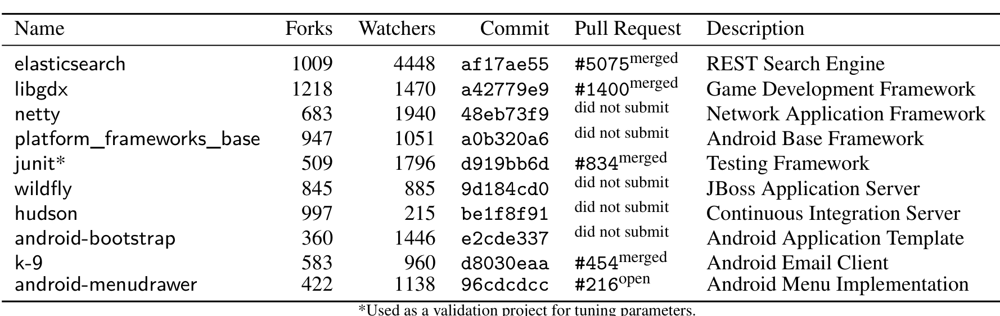
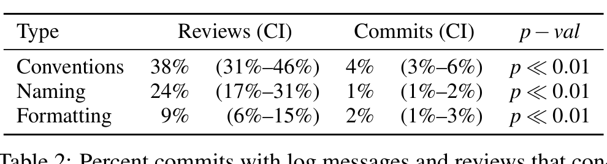

*Used as a validation project for tuning parameters.*

Table 1: Open-source Java projects used for evaluation. Ordered by popularity.

This reflects the usage scenario that we recommend in practice. We report the average performance over all test files. For an LM, we have used a 5-gram model, chosen via calibration on the validation project JUnit. We picked JUnit as the validation project because of its medium size.

## 4.1 The Importance of Coding Conventions

To assess whether obeying coding conventions, specifically following formatting and naming conventions, is important to software teams today, we conducted two empirical studies that we present in this section. But first, we posit that coding style is both an important and a contentious topic. The fact that many languages and projects have style guides is a testament to this assertion. For example, we found that the Ruby style guide has at least 167 un-merged forks and the Java GitHub Corpus [4] has 349 different .xml configurations for the Eclipse formatter.

### Commit Messages

We manually examined 1,000 commit messages drawn randomly from the commits of eight popular open source projects looking for mentions of renaming, changing formatting, and following other code conventions. We found that 2% of changes contained formatting improvements, 1% contained renamings, and 4% contained any changes to follow code conventions (which include formatting and renaming). We observed that not all commits that contain changes to adhere to conventions mention such conventions in the commit messages. Thus, our percentages likely represent lower bounds on the frequency of commits that change code to adhere to conventions.

### Code Review Discussions

We also examined discussions that occurred in reviews of source code changes. Code review is practiced heavily at Microsoft in an effort to ensure that changes are free of defects and adhere to team standards. Once an author has completed a change, he creates a code review and sends it to other developers for review. They then inspect the change, offer feedback, and either sign off or wait for the author to address their feedback in a subsequent change. As part of this process, the reviewers can highlight portions of the code and begin a discussion (thread) regarding parts of the change (for more details regarding the process and tools used, see Bacchelli et al. [10]).

We examined 169 code reviews selected randomly across Microsoft product groups during 2014. Our goal was to include enough reviews to examine at least 1,000 discussion threads. In total, these 169 reviews contained 1,093 threads. We examined each thread to determine if it contained feedback related to a) code conventions in general, b) identifier naming, and c) code formatting. 18% of the threads examined provided feedback regarding coding conventions of some kind. 9% suggested improvements in naming and 2% suggested changes related to code formatting (subsets of the 18%). In terms of the reviews that contained feedback of each kind, the proportions are 38%, 24%, and 9%.

Table 2: Percent commits with log messages and reviews that contained feedback regarding code conventions, identifier naming, and formatting with 95% confidence intervals in parentheses.

During February 2014, just over 126,000 reviews were completed at Microsoft. Thus, based on confidence intervals of these proportions, between 7,560 and 18,900 reviews received feedback regarding formatting changes that were needed prior to check-in and between 21,420 and 39,060 reviews resulted in name changes in just one month.

Table 2 summarizes our findings from examining commit messages and code reviews. We also present 95% confidence intervals based on the sampled results [25]. These results demonstrate that changes, to a nontrivial degree, violate coding conventions even after the authors consider them complete and also that team members expect that these violations be fixed. We posit that, like defects, many convention violations die off during the lifecycle of a change, so that few survive to review and fewer still escape into the repository. This is because, like defects, programmers notice and fix many violations themselves during development, prior to review, so reviewers must hunt for violations in a smaller set, and committed changes contain still fewer, although this number is nontrivial, as we show in Section 4.4. Corrections during development are unobservable. However, we can compare convention corrections in review to corrections after commit. We used a one-sided proportional test to evaluate if more coding conventions are corrected during review than after commit. The last column in Table 2 contains the p-values for our tests, indicating that the null hypothesis can be rejected with statistically significant support.

## 4.2 Suggestion

In this section we present an automatic evaluation of NATURALIZE’s suggestion accuracy. First we evaluate naming suggestions (Section 3.3). We focus on suggesting new names for (1) locals, (2) arguments, (3) fields, (4) method calls, and (5) types (class names, primitive types, and enums) — these are the five distinct types of identifiers the Eclipse compiler recognizes [26]. Recall from Section 3.3 that when NATURALIZE suggests a renaming, it renames all locations where that identifier is used at once. Furthermore, as described earlier, we always use leave-one-out cross validation, so we never train the language model on the files for which we are making suggestions. Therefore, NATURALIZE cannot pick up the correct name for an identifier from other occurrences in the same file; instead, it must generalize by learning conventions from other