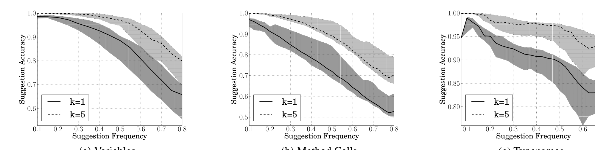

Suggestion Frequency  (a) Variables  (b) Method Calls  (c) Typenames

Figure 5: Evaluation of single point suggestions of NATURALIZE, when it is allowed to suggest k = 1 and k = 5 alternatives. The shaded area around each curve shows the interquartile range of the suggestion accuracy across the 10 evaluation projects.

files in the project.

### Single Point Suggestion
First we evaluate NATURALIZE on the single point suggestion task, that is, when the user has asked for naming suggestions for a single identifier. To do this, for each test file, for each unique identifier we collect all of the locations where the identifier occurs and names the same entity, and ask NATURALIZE to suggest a new name, renaming all occurrences at once. We measure accuracy, that is, the percentage of the time that NATURALIZE correctly suggests the original name. This is designed to reflect the typical usage scenario described in Section 2, in which a developer has made a good faith effort to follow a project's conventions, but may have made a few mistakes.

Figure 5 reports on the quality of the suggestions. Each point on these curves corresponds to a different value of the confidence threshold t. The x-axis shows the suggestion frequency, i.e., at what proportion of code locations where NATURALIZE is capable of making a suggestion does it choose to do so. The y-axis shows suggestion accuracy, that is, the frequency at which the true name is found in the top k suggestions, for k = 1 and k = 5. As t increases, NATURALIZE makes fewer suggestions of higher quality, so frequency decreases as accuracy increases. These plots are similar in spirit to precision-recall curves in that curves nearer the top right corner of the graph are better. Figure 5a, Figure 5b, and Figure 5c show that NATURALIZE performance varies with both project and the type of identifiers. Figure 5a combines locals, fields, and arguments because their performance is similar. NATURALIZE's performance varies across these three categories of identifiers because of the data hungriness of n-grams and because local context is an imperfect proxy for type constraints or function semantics. The results show that NATURALIZE effectively avoids the Clippy effect, because by allowing the system to decline to suggest in a relatively small proportion of cases, it is possible to obtain good suggestion accuracy. Indeed, NATURALIZE can achieve 94% suggestion accuracy across identifier types, even when forced to make suggestions at half of the possible opportunities.

### Multiple Point Selection
To evaluate NATURALIZE's accuracy at multiple point suggestion, e.g., in devstyle or styleprofile, we mimic code snippets in which one name violates the project's conventions. For each test snippet, we randomly choose one identifier and perturb it to a name that does not occur in the project, compute the style profile, and measure where the perturbed name appears in the list of suggestions. NATURALIZE's recall at rank k = 7, chosen because humans can take in 7 items at a glance [23, 48], is 64.2%. The mean reciprocal rank is 0.47: meaning that, on average, we return the bad name at position 2.

### Single Point Suggestion for Formatting
To evaluate NATURALIZE's performance at making formatting suggestions, we follow the same procedure as the single-point naming experiment to check if NATURALIZE correctly recovers the original formatting from the context. We train a 5-gram language model using the modified token stream (q = 20) discussed in Section 3.4. We allow the system to make only k = 1 suggestions to simplify the UI. We find that the system is extremely effective (Figure 9) at formatting suggestions, achieving 98% suggestion accuracy even when it is required to reformat half of the whitespace in the test file. This is remarkable for a system that is not provided with any hand-designed rules about what formatting is desired. Obviously if the goal is to reformat all the whitespace in an entire file, a rule-based formatter is called for. But this performance is more than high enough to support our use cases, such as providing single point formatting suggestions on demand, rejecting snippets with unnatural formatting and extracting high confidence rules for rule-based formatters.

### Binary Snippet Decisions
Finally, we evaluate the ability of stylish? to discriminate between code selections that follow conventions well from those that do not, by mimicking commits that contain unconventional names or formatting. Uniformly at random, we selected a set of methods from each project (500 in total), then uniformly (1/3), we either made no changes or perturb one identifier or whitespace token to a token in the n-gram's vocabulary V. This method for mimicking commits is probably a worst case for our method, because the perturbed methods will be very similar to existing methods, which are likely to be conventional.

We run stylish? and record whether the perturbed snippet is rejected because of its names or its formatting. stylish? is unaware of the perturbation (if any), identifier or whitespace, made to the snippet. Figure 6 reports NATURALIZE's rejection performance as ROC curves. In each curve, each point corresponds to a different choice of threshold T, and the x-axis shows FPR (estimated as in Equation 3.1), and the y-axis shows true positive rate, the proportion of the perturbed snippets that we correctly rejected. NATURALIZE achieves high precision, making it suitable for use as a filtering pre-commit script. When the FPR is at most 0.05, we are able to correctly reject 40% of the snippets. NATURALIZE is somewhat worse at rejecting snippets whose variable names have been perturbed; in part, this is because predicting identifier names is more difficult than predicting formatting. New advances in language models for code [46, 53] are likely to improve these results. Nonetheless, these results are promising: stylish? still rejects enough perturbed snippets that if deployed at 5% FPR, it would enhance convention adherence with minimal disruption to developers.

### 4.3 Robustness of Suggestions
We show that NATURALIZE avoids two potential pitfalls in its identifier suggestions: first, that it does not simply rename all tokens to common "junk" names that appear in many contexts, and second, that it retains unusual names that signify unusual functionality, adhering to the SUP.