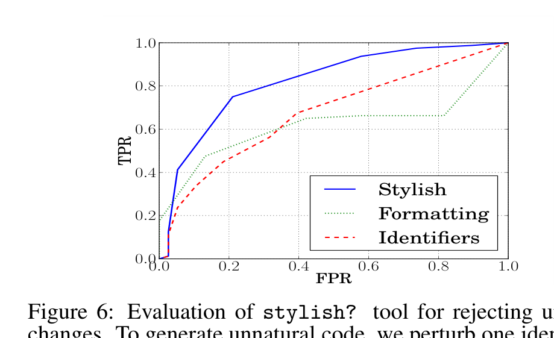
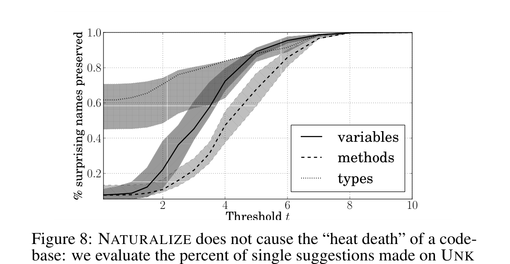
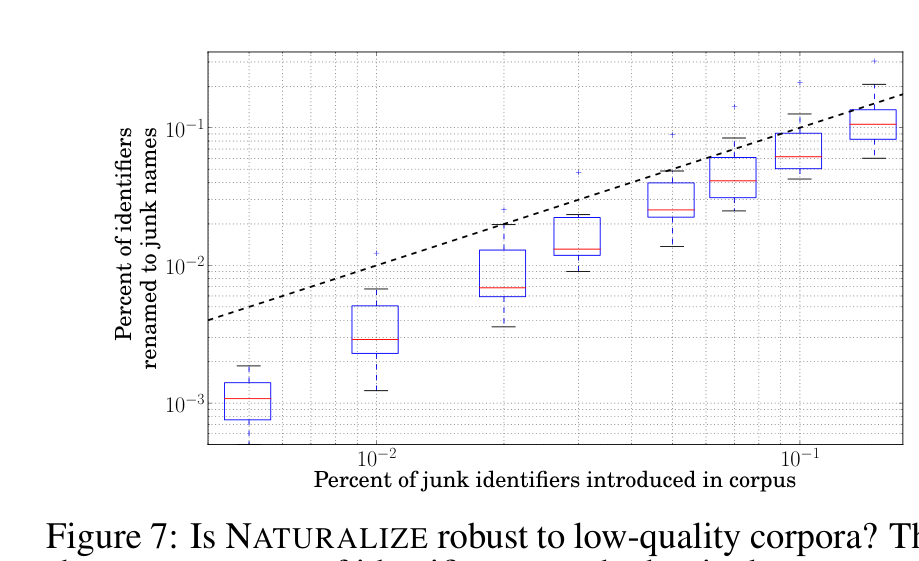
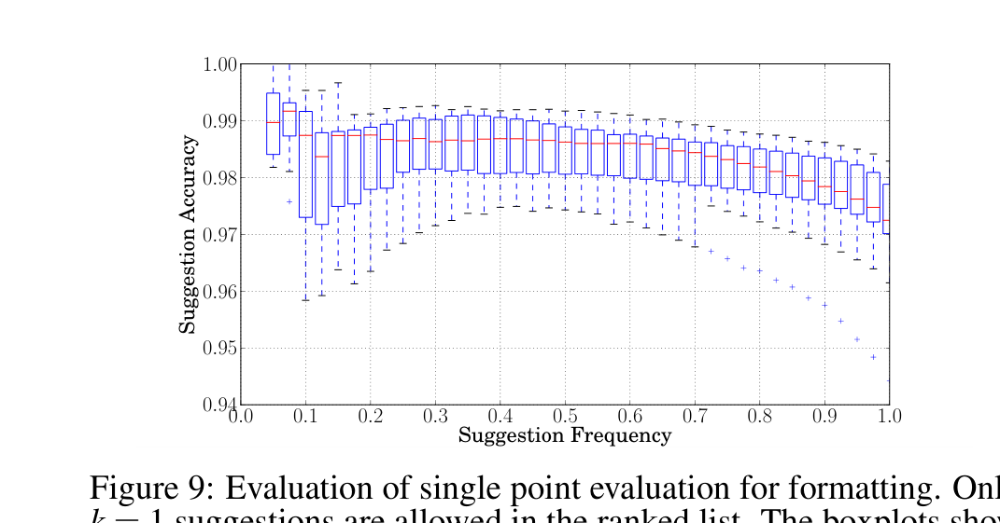

Figure 6: Evaluation of stylish? tool for rejecting unnatural changes. To generate unnatural code, we perturb one identifier or formatting point or make no changes, and evaluate whether NATURALIZE correctly rejects or accepts the snippet. The graph shows the receiver operating characteristic (ROC) of this process for stylish? when using only identifiers, only formatting, or both.

Figure 8: NATURALIZE does not cause the “heat death” of a codebase: we evaluate the percent of single suggestions made on UNK identifiers that preserve the surprising name. The threshold t on the x-axis controls the suggestion frequency of suggest; lower t gives suggest less freedom to decline, reducing low-quality suggestions.

Percent of junk identifiers introduced in corpus. Figure 7: Is NATURALIZE robust to low-quality corpora? The x-axis shows percentage of identifiers perturbed to junk names to simulate a low quality corpus. The y-axis is percentage of resulting low quality suggestions. Note log-log scale. The dotted line shows y = x. The boxplots are across the 10 evaluation projects.

Suggestion Frequency. Figure 9: Evaluation of single point evaluation for formatting. Only k = 1 suggestions are allowed in the ranked list. The boxplots show the variance in performance across the 10 evaluation projects.

### Junk Names

A junk name is a semantically uninformative name used in disparate contexts. It is difficult to formalize this concept: for instance, in almost all cases, foo and bar are junk names, while i and j, when used as loop counters, are semantically informative and therefore not junk. Despite this, most developers “know it when they see it.” One might at first be concerned that NATURALIZE would often suggest junk names, because junk names appear in many different n-grams in the training set. We argue, however, that in fact the opposite is the case: NATURALIZE actually resists suggesting junk names. This is because if a name appears in too many contexts, it will be impossible to predict a unsurprising follow-up, and so code containing junk names will have lower probability, and therefore worse score.

To evaluate this claim, we randomly rename variables to junk names in each project to simulate a low quality project. Notice that we are simulating a low quality training set, which should be the worst case for NATURALIZE. We measure how our suggestions are affected by the proportion of junk names in the training set. To generate junk variables we use a discrete Zipf’s law with slope s = 1.08, the slope empirically measured for all identifiers in our evaluation corpus. We verified the Zipfian assumption in previous work [4]. Figure 7 shows the effect on our suggestions as the evaluation projects are gradually infected with more junk names. The framework successfully avoids suggesting junk names, proposing them at a lower frequency than they exist in the perturbed codebase.

#### Sympathetic Uniqueness

Surprise can be good in identifiers, where it signifies unusual functionality. Here we show that NATURALIZE preserves this sort of surprise. We find all identifiers in the test file that are unknown to the LM, i.e. are represented by an UNK.

We then plot the percentage of those identifiers for which suggest does not propose an alternative name, as a function of the threshold t. As described in Equation 3.1, t is selected automatically, but it is useful to explore how adherence to the SUP varies as a function of t. Figure 8 shows that for reasonable threshold values, NATURALIZE suggests non-UNK identifiers for only a small proportion of the UNK identifiers (about 20%). This confirms that NATURALIZE does not cause the “heat death of a codebase” by renaming semantically rich, surprising names into frequent, low-content names.

## 4.4 Manual Examination of Suggestions

As a qualitative evaluation of NATURALIZE’s suggestions, three human evaluators (three of the authors) independently evaluated the quality of its suggestions. First, we selected two projects from our corpus, uniformly at random, then for each we ran styleprofile on 30 methods selected uniformly at random to produce suggestions for all the identifiers present in that method. We assigned 20 profiles to each evaluator such that each profile had two evaluators whose task was to independently determine whether any of the suggested renamings in a profile were reasonable. The evaluators attempted to take an evidence based approach, that is, not to simply choose names that they liked, but to choose names that were consistent with existing practice in the project. We provided access to the full source code of each project to the evaluators.

One special issue arose when suggesting changes to method names. Adapting linguistic terminology to our context, homonyms are two semantically equivalent functions with distinct names. We deem NATURALIZE’s suggested renaming of a method usage to be reasonable, if the suggestion list contains a partial, not necessarily perfect, homonym; i.e., if it draws the developer’s attention to another method that is used in similar contexts. Each evaluator had 15 minutes to consider each profile and 30 minutes to explore