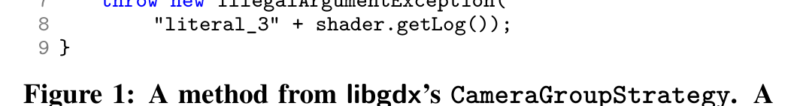
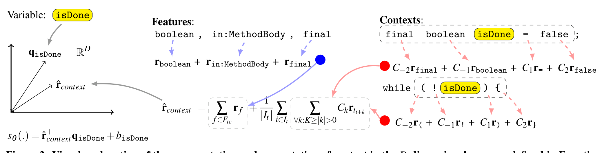
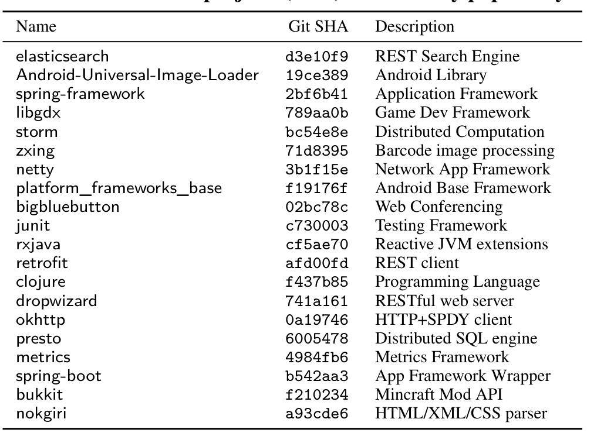
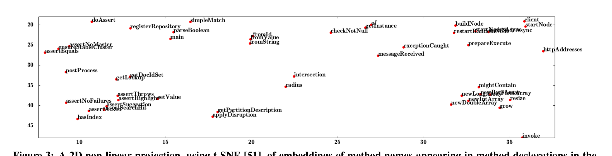
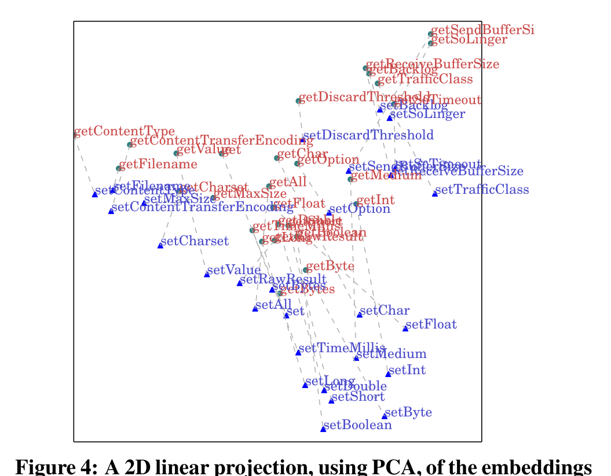
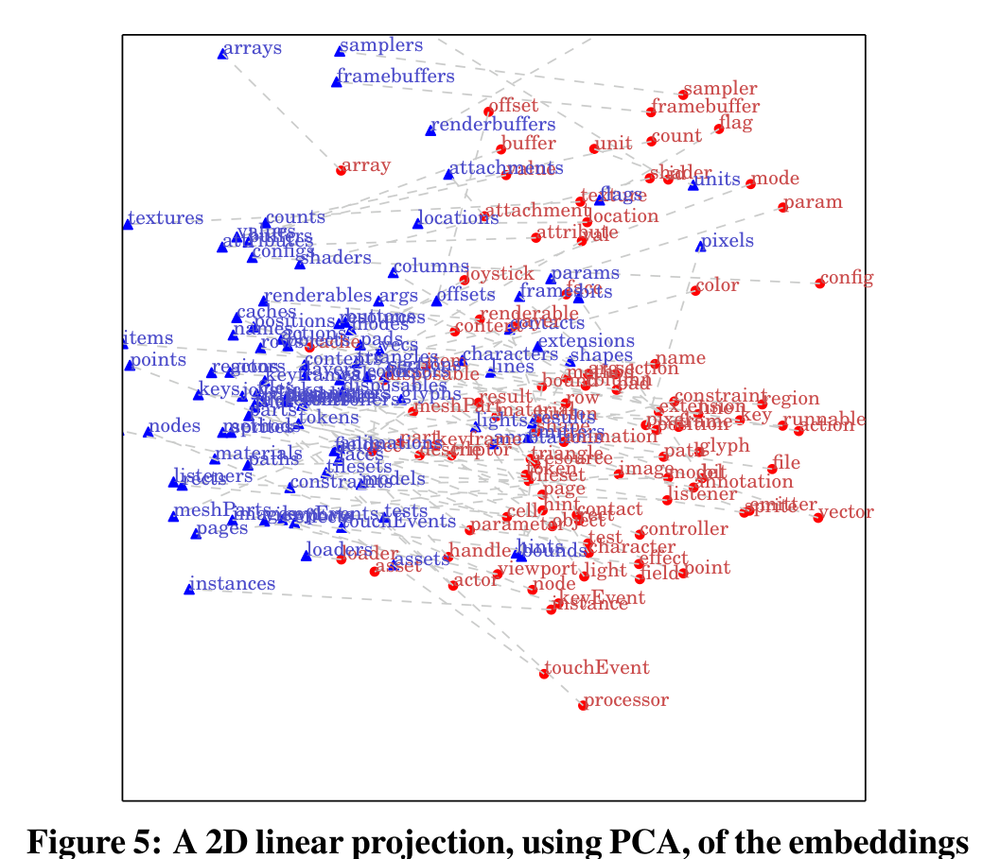
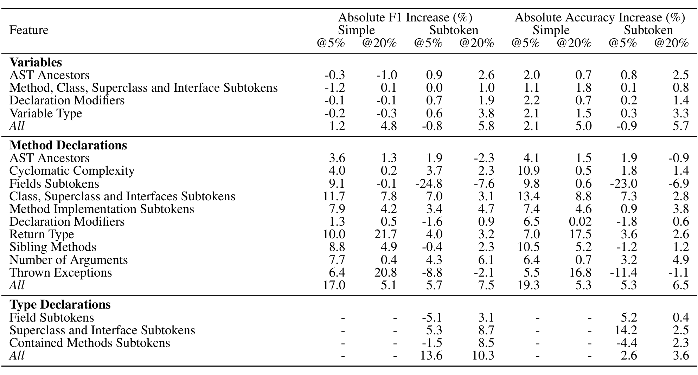
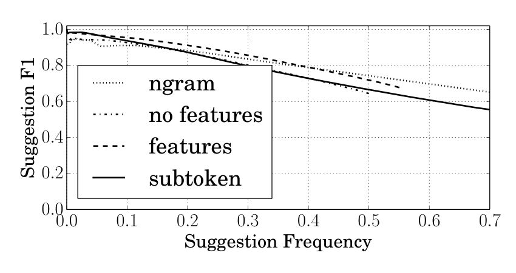
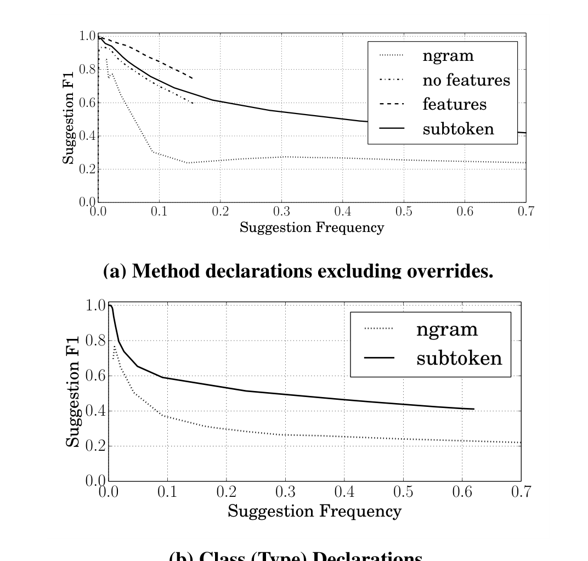

## Suggesting Accurate Method and Class Names

Miltiadis Allamanis†  Earl T. Barr‡  Christian Bird*  Charles Sutton†  
† School of Informatics, University of Edinburgh, Edinburgh, EH8 9AB, UK  
‡ Dept. of Computer Science, University College London, London, UK  
* Microsoft Research, Microsoft, Redmond, WA, USA  
{m.allamanis, csutton}@ed.ac.uk  e.barr@ucl.ac.uk  cbird@microsoft.com

## ABSTRACT

Descriptive names are a vital part of readable, and hence maintainable, code. Recent progress on automatically suggesting names for local variables tantalizes with the prospect of replicating that success with method and class names. However, suggesting names for methods and classes is much more difficult. This is because good method and class names need to be functionally descriptive, but suggesting such names requires that the model goes beyond local context. We introduce a neural probabilistic language model for source code that is specifically designed for the method naming problem. Our model learns which names are semantically similar by assigning them to locations, called embeddings, in a high-dimensional continuous space, in such a way that names with similar embeddings tend to be used in similar contexts. These embeddings seem to contain semantic information about tokens, even though they are learned only from statistical co-occurrences of tokens. Furthermore, we introduce a variant of our model that is, to our knowledge, the first that can propose neologisms, names that have not appeared in the training corpus. We obtain state-of-the-art results on the method, class, and even the simpler variable naming tasks. More broadly, the continuous embeddings that are learned by our model have the potential for wide application within software engineering.

Categories and Subject Descriptors: D.2.3 [Software Engineering]: Coding Tools and Techniques  
General Terms: Algorithms  
Keywords: Coding conventions, naturalness of software

> “You shall know a word by the company it keeps.” — J. R. Firth

## 1. INTRODUCTION

Language starts with names. While programming, developers must name variables, parameters, functions, classes, and files. They strive to choose names that are meaningful and conventional, i.e., consistent with other names used in related contexts in their code base. Indeed, leading industrial experts, including Beck [9], McConnell [34], and Martin [33], have stressed the importance of identifier naming in software. Finding good names for programming language constructs is difficult; poor names make code harder to understand and maintain [29, 50, 30, 7]. Empirical evidence

suggests that poor names also lead to software defects [13, 1]. Code maintenance exacerbates the difficulty of finding good names, because the appropriateness of a name changes over time: an excellent choice, at the time a construct is introduced, can degrade into a poor name, as when a variable is used in a new context or a function’s semantics changes.

Names of methods and classes are particularly important, and can be difficult to choose. Høst et al. eloquently captured their importance: “Methods are the smallest named units of aggregated behavior in most conventional programming languages and hence the cornerstone of abstraction” [26]. Semantically distinct method names are the basic tools for reasoning about program behaviour. Programmers directly think in terms of these names and their compositions, since a programmer chose them for the units into which the programmer decomposed a problem. Moreover, method names can be hard to change, especially when they are used in an API. When published in a popular library, method naming decisions are especially rigid and poor names can doom a project to irrelevance.

In this paper, we suggest that modern statistical tools allow us to automatically suggest descriptive, idiomatic method and class names to programmers. We tackle the method naming problem: the problem of inferring a method’s name from its body (or a class from its methods). As developers spend approximately half of their development time trying to understand and comprehend code during maintenance alone [17], any progress toward solving the method naming problem will improve the comprehensibility of code [49], leading to an increase in programmer productivity [24].

In previous work, we introduced the NATURALIZE framework [2], which learns the coding conventions used in a code base and tackles one naming problem programmers face — that of naming variables — by exploiting the “naturalness” or predictability of code [25]. However, the method naming problem is much more difficult than the variable naming problem, because the appropriateness of method and class names depends not solely on their uses but also on their internal structure — their body or their set of methods. An adequate name must describe not just what the method is, but what it does. Variable names, by contrast, can often be predicted solely from a few tokens of local context; for example, it is easy to predict the variable name that follows the tokens "for ( int". Because method and class names must be functionally descriptive, they often have rich internal structure: method names are often verb phrases and class names are often noun phrases. But this means that method and class names are often neologisms, that is, names not seen in the training corpus. Existing probabilistic models of source code, including the n-gram models used in NATURALIZE, cannot suggest neologisms. These aspects of the method naming problem severely exacerbate the data sparsity problem faced by all probabilistic language models, because addressing them by building models that consider more context necessarily means that any individual context will be observed less often. Therefore, the method naming problem requires models that

---

```java
private void createDefaultShader() {
  String vertexShader = "literal_1";
  String fragmentShader = "literal_2";
  shader = new ShaderProgram(vertexShader,
                             fragmentShader);
  if (shader.isCompiled() == false)
    throw new IllegalArgumentException(
      "literal_3" + shader.getLog());
}
```



> **Image description:** The image is a cropped Java method declaration 'private void createDefaultShader()' whose body assigns two string literals to vertexShader and fragmentShader, instantiates a ShaderProgram with those two strings, and then checks shader.isCompiled() == false to throw new IllegalArgumentException("literal_3" + shader.getLog()) on failure. The snippet therefore encapsulates the functional intent of creating shader objects from two source literals and reporting compilation errors by appending the shader log. The paper uses this example to illustrate the naming difficulty (a desirable name must reflect this behavior) and reports that their subtoken model infers the 'create' prefix and even proposes the neologism 'createShaders' as a plausible suggestion.

Figure 1: A method from libgdx’s CameraGroupStrategy. A programmer named it; automatically naming it requires inventing a neologism, a very hard inference problem. Our subtoken model understands that its name should start with create and suggests createShaders.

It can better exploit the structure of code, taking into account long-range dependencies and modeling the context surrounding their definitions more precisely than at the token-level, while minimizing the effects of data sparsity.

This paper tackles the method naming problem with a novel, neural log-bilinear context model for code, inspired by neural probabilistic language models for natural language, which have seen many recent successes [37, 28, 35, 31]. A particularly impressive success of these models has been that they assign words to continuous vectors that support analogical reasoning. For example, vector('king') - vector('man') + vector('woman') results in a vector close to vector('queen') [35, 36]. Although many of the basic ideas have a long history [10], this class of model is receiving increasing recent interest because of increased computational power from GPUs and because of more efficient learning algorithms such as noise contrastive estimation [21, 39].

Intuitively, our model assigns to every identifier name used in a project a continuous vector in a high dimensional space, in such a way that identifiers with similar vectors, or "embeddings", tend to appear in similar contexts. Then, to name a method (or a class), we select the name that is most similar in this embedding space to those in the function body. In this way, our model realizes Firth’s famous dictum, "You shall know a word by the company it keeps." This slogan encapsulates the distributional hypothesis, that semantically similar words tend to co-occur with the same other words. Two words are distributionally similar if they have similar distributions over surrounding words. For example, even if the words "hot" and "cold" never appear in the same sentence, they will be distributionally similar if they both often co-occur with words like "weather" and "tea". The distributional hypothesis is a cornerstone of much work in computational linguistics, but we are unaware of previous work that explores whether this hypothesis holds in source code. Earlier work on the naturalness of code [25] found that code tends to repeat constructs and exploited this repetition for prediction, but did not consider the semantics of tokens. In contrast, the distributional hypothesis states that you shall recognize semantically similar tokens because they tend also to be distributionally similar.

Indeed, we qualitatively show in Section 4 that our context model produces embeddings that demonstrate implicit semantic knowledge about the similarity of identifiers. For instance, it successfully distinguishes getters and setters, assigns function names with similar functionality (like grow and resize) to similar locations, and discovers matching components of names, which we call subtokens, like min and max, and height and width.

Furthermore, to allow us to suggest neologisms, we introduce a new subtoken context model that exploits the internal structure of identifier names. In this model, we predict names by breaking them into parts, which we call subtokens, such as get, create, and Height, and then predicting names one subtoken at a time. The subtoken model automatically infers conventions about the internal structure of variable names, such as "an interface starts with an I", or "an abstract class starts with Abstract". Our subtoken model also learns conventions like prefixing names of boolean methods with is or has. This model also allows us to propose neologisms, by proposing sequences of subtokens that have not been seen before. Consider Figure 1; our subtoken model builds and explores an embedding space that allows it to suggest createShaders, which is usefully close to the name a programmer actually chose.

Our contributions follow:
- We introduce a log-bilinear neural network to model code contexts that, unlike standard language models in NLP, integrates information from preceding, succeeding, and non-local tokens.
- We are the first to apply a neural context model to the method naming problem; and
- We demonstrate that our models can accurately suggest names: for the simpler variable naming problem, they improve on the state of the art, and for class and method naming, our best model achieves F1 scores of 60% on method names and 55% on class names, when required to predict names for 20% of method and class declarations. Additionally, our subtoken model, that can suggest previously unseen names, achieves an F1 of 50% when required to suggest names for 50% of the classes.

### Example Suggestions

To illustrate our model’s capabilities, we present a few examples of names suggested by the model (for quantitative results, see Section 5). When evaluated on libgdx, a graphics library for Android, and asked to suggest a name for the variable that programmers had named isLooping, although its confidence was low, our model has learned that the name should start with is. For multipart method names like getPersistentManifoldPool, it understood get was a likely prefix, suggesting it with 38% confidence and that Manifold was important, assigning its inclusion a probability of 28%, and even included getManifoldPool among its top five suggestions. On shorter agglutinations, like setPad, it performed better: all five top-ranked suggestions started with set, four of its suggestions included the root Pad, and it ranked setPad, the actual name, third. Its handling of class names was similar. It learned that the name of an exception class should end with Exception and inferred that the names of Action and Test subclasses should end in Action and Test. A particularly interesting suggestion our model made that caught our eye was AndroidAudio for the class AndroidMusic.

### Use Cases

Our suggestion model can be embedded within a variety of tools to support code development and code review. During development, suppose that the developer is adding a method or a class to an existing project. After writing the body, the developer may be unsure if the name she chose is descriptive and conventional within the project. Our model suggests alternative names from patterns it learned from other methods in the project. During code review, our model can highlight those names to which our model assigns a low score. In either case, the system has two phases: a training phase, which takes as input a training set of source files (e.g., the current revision of the project) and returns a neural network model that can suggest names; and a testing or deployment phase, in which the input is a trained neural network and the source code of a method or class, and the output is a ranked list of suggested names. Any suggestion system has the potential to suffer from what we have called the "Clippy effect" [2], in which too many low quality suggestions alienate the user. To prevent this, our suggestion model also returns a numeric score that reflects its degree of confidence in its suggestion; practical tools would only make a suggestion to the user if the confidence were sufficiently high.

## 2. NEURAL CONTEXT MODELS OF CODE

In this section, we introduce four language models of code, starting with the n-gram model to build intuition. Then we introduce

---

neural probabilistic language modelling and follow it with two novel models that, specifically designed for method naming, refine the underlying neural model: our log-bilinear context model, which adds context and features, and subtoken context model, which adds subtokens and can be used to generate neologisms.

Language models (LM) are probability distributions over strings of a language. These models assume that we are trying to predict a token t given a sequence of other tokens c = (c0, c1, ... cN) that we call the context. LMs are very general; for example, if the goal is to sequentially predict every token in a file, as an n-gram model does, then we can take t = ym and c = (ym−n+1, ym−n+2, ... ym−1). Alternately, for the method naming problem, we can take t to be the identifier token in the declaration that names the function, and c to be a sequence that contains all identifiers in the function body. Obviously, we cannot store a probability value for every possible context, so we must make simplifying assumptions to make the modeling tractable. Different LMs make different simplifying assumptions.

## 2.1 Background

To build intuition, we begin by reviewing the n-gram LM, which is a standard technique in NLP and speech processing, and which has become increasingly popular in software engineering [25, 41, 2]. The n-gram model assumes that all of the information required to predict the next token is contained within the previous n − 1 tokens i.e. P(y1 ... yM) = ∏_{m=1}^M P(ym | ym−1 ... ym−n+1). To specify this model we need (in principle) a table of V^n numbers, where V is the number of possible lexemes, that specifies the conditional probabilities for each possible n-gram. These are the parameters of the model that we learn from data.

There is a large literature on methods for training these models [16], which basically revolve around counting the proportion of times that token ym follows y m−1 ... y m−n+1. However, even when n = 4 or n = 5, we cannot expect to estimate the counts of all n-grams reliably, as the number of possible n-grams is exponential in n. Therefore, smoothing methods are employed, which generally modify the count of a rare n-gram y1 ... yn to make it more similar to the count of a shorter suffix y2 ... yn, whose frequency we can estimate more reliably. This procedure involves the implicit assumption that two contexts are most similar if they share a long suffix. But this assumption does not always hold. Many similar contexts, such as x + y versus x + z, might be treated very differently by an n-gram model, because the final token is different.

Log-bilinear models Neural LMs [10] address the challenge that the simple n-gram model has by making similar predictions for similar contexts. They predict the next token ym using a neural network that takes the previous tokens as input. This allows the network to flexibly learn which tokens, like int, provide much information about the immediately following token, and which tokens, like the semicolon ';', provide very little. Unlike an n-gram model, a neural LM makes it easy to add general long-distance features of the context into the prediction — we simply add them as additional inputs to the neural net. In our work, we focus on a simple type of neural LM that has been effective in practice, namely, the log-bilinear LM [37] (LBL). We start with a general treatment of loglinear models considering models of the form

P(t | c) = exp(s_θ(t, c)) / ∑_{t'} exp(s_θ(t', c)). (1)

Intuitively, s_θ is a function that indicates how much the model likes to see both t and c together, the exp function maps this to be always positive, and the denominator ensures that the result is a probability distribution. This choice is very general. For example, if s_θ is a linear function of the features in c, then the discriminative model is simply a logistic regression.

Log-bilinear models learn a map from every possible target t to a vector q_t ∈ R^D, and from each context c to a vector r̂_c ∈ R^D. We interpret these as locations of each context and each target lexeme in a D-dimensional space; these locations are called embeddings. The model predicts that the token t is more likely to appear in context c if the embedding q_t of the token is similar to that r̂_c of the context. To encode this in the model, we choose

s_θ(t, c) = r̂_c^T q_t + b_t, (2)

where b_t is a scalar bias which represents how commonly t occurs regardless of the context. To understand this equation intuitively, note that, if the vectors r̂_c and q_t have norm 1, then their dot product is simply the cosine of the angle between them. So s_θ, and hence p(t | c), is larger if either vector has a large norm, if b_t is large, or if r̂_c and q_t have a small angle between them, that is, if they are more similar according to the commonly used cosine similarity metric.

To complete this description, we define the maps t → q_t and c → r̂_c. For the targets t, the most common choice is to simply include the vector q_t for every t as a parameter of the model. That is, the training procedure has the freedom to learn an arbitrary map between t and q_t. For the contexts c, this choice is not possible, as there are too many possible contexts. Instead, a common choice [31, 39] is to represent the embedding r̂_c of a context as the sum of embeddings of the tokens within it, that is,

r̂_c = ∑_{t=1}^{|C|} C_t r_{c_t}, (3)

where r_{c_t} ∈ R^D is a vector for each lexeme that is included in the model parameters. The variable t indexes every token in the context c, so if the same lexeme occurs multiple times in c, then it appears multiple times in the sum. The matrix C_t is a diagonal matrix that serves as a scaling factor depending on the position of a lexeme within the context. This allows, for example, a lexeme's influence on c's position to depend on how close it is to the target. The D non-zero values in C_t for each t are also included in the model parameters. Each lexeme v has two embeddings: an embedding q_v for when it is used as a target and an embedding r_v for when it appears in the context.

To summarize, log-bilinear models make the assumption that every token and every context can be mapped in a D-dimensional space. There are two kinds of embedding vectors: those directly learned (i.e. the parameters of the model) and those computed from the parameters of the model. To indicate this distinction, we place a hat on r̂_c to indicate that it is computed from the model parameters, whereas we write q_t without a hat to indicate that it is a parameter vector that is learned directly by the training procedure. These models can also be viewed as a three-layer neural network, in which the input layer encodes all of the lexemes in c using a 1-of-V encoding, the hidden layer outputs the vectors r_{c_t} for each token in the context, and the output layer computes the score functions s_θ(t, c) and passes them to a softmax nonlinearity. For details on the neural network representation, see Bengio et al. [10].

To learn these parameters, it has recently been shown [39, 38] that an alternative to the maximum likelihood method called noise contrastive estimation (NCE) [21] is effective. NCE measures how well the model p(t | c) can distinguish the real data in the training set from “fantasy data” that is generated from a simple noise distribution. At a high level, this can be viewed as a black box alternative to maximum likelihood that measures how well the model fits the training data. We optimize the model parameters using stochastic gradient descent. We employ NCE for all models in this paper.

## 2.2 Logbilinear Context Models of Code

Now we present a new neural network, a novel LBL LM for code, which we call a log-bilinear context model. The key idea

---



> **Image description:** A schematic showing how the model builds a D-dimensional context vector r̂_context for predicting the identifier isDone and then scores candidate names. Left: geometric view with the context vector r̂_context and the target embedding q_isDone in R^D; the score s_θ is the dot product r̂_context · q_isDone plus a bias b_isDone. Center: the formula r̂_context = Σ_{f∈F_c} r_f + (1/|I_t|) Σ_{i∈I_t} Σ_{0<|k|≤K} C_k r_{t_{i+k}} is shown, indicating that feature embeddings (blue arrows for features like boolean, in:MethodBody, final) are summed with position-weighted token embeddings. Right: two concrete code contexts (final boolean isDone = false; and while (!isDone) { ) with dashed arrows mapping nearby tokens to position-dependent matrices C_{-2}, C_{-1}, C_1, C_2 and their embeddings; these contributions (red dots) are summed to form r̂_context used to score the candidate identifier. The figure illustrates how global binary features and weighted local token contexts combine to produce the continuous context representation used for naming. 

sθ(.) = r̂_context · q_isDone + b_isDone

Figure 2: Visual explanation of the representation and computation of context in the D-dimensional space as defined in Equation 4; the final paragraph of Section 2.2 explains the sum over the lt locations. Each source code token and feature maps to a learned D-dimensional vector in continuous space. The token-vectors are multiplied with the position-dependent context matrix C_i and summed, then added to the sum of all the feature-vectors. The resulting vector is the D-dimensional representation of the current source code identifier. Finally, the inner product of the context and the identifier vectors is added to a scalar bias b, producing a score for each identifier. This neural network is implemented by mapping its equations into code. 1

is that log-bilinear models make it especially easy to exploit long-distance information; e.g., when predicting the name of a method, it is useful to take into account all of the identifiers that appear in the method body. We model long-distance context via a set of feature functions, such as “Whether any variable in the current method is named addCount”, “Whether the return type of the current method is int,” and so on. The log-bilinear context model combines these features with the local context.

As before, suppose that we are trying to predict a code token t given a sequence of context tokens c = (c0, c1, ..., cN). We assume that c contains all of the other tokens in the file that are relevant for predicting t; e.g., tokens from the body of the method that t names. The tokens in c that are nearest to the target t are treated specially. Suppose that t occurs in position i of the file, that is, if the file is the token sequence t1, t2, ..., then t = ti. Then the local context is the set of tokens that occur within K positions of t, that is, the set {t_{i+k} for −K ≤ k ≤ K, k ≠ 0}. The local context includes tokens that occur both before and after t.

The overall form of the context model will follow the generic form in (1) and (2), except that the context representation r̂_c is defined differently. In the context model, we define r̂_c using two different types of context: local and global. First, the local context is handled in a very similar way to the log-bilinear LM. Each possible lexeme v is assigned to a vector r_v ∈ R^D, and, for each token t_k that occurs within K tokens of t in the file, we add its representation r_{t_k} into the context representation.

The global context is handled using a set of features. Each feature is a binary function based on the context tokens c, such as the examples described at the beginning of this section. Formally, each feature f maps a c value to either 0 or 1. Maddison and Tarlow [31] use a similar idea to represent features of a syntactic context, that is, a node in an AST. Here, we extend this idea to incorporate arbitrary features of long-distance context tokens c. The first column of Table 4 presents the full list of features that we use in this work.

To learn an embedding, we assign each feature function to a single vector in the continuous space, in the same way as we did for tokens. Mathematically, let F be the set of all features in the model, and let F_c, for a context c, be the set of all features f with f(c) = 1. Then for each feature f ∈ F, we learn an embedding r_f ∈ R^D, which is included as a parameter to the model in exactly the same way that r_t was for the language modeling case.

Now, we can formally define a context model of code as a probability distribution P(t | c) that follows the form (1) and (2), where r̂_c = r̂_context, where r̂_context is

r̂_context = Σ_{f ∈ F_c} r_f + Σ_{0 < |k| ≤ K} C_k r_{t_{i+k}}. (4)

matrix that is also learned during training. Intuitively, this equation sums the embeddings of each token t_k that occurs near t in the file, and sums the embeddings of each feature function f that returns true (i.e., 1) for the context c. Once we have this vector r̂_context, just as before, we can select a token t such that the probability P(t | c) is high, which happens exactly when r̂_context · q_t is high — in other words, when the embedding q_t of the proposed target t is close to the embedding r̂_context of the context.

Figure 2 gives a visual explanation of the probabilistic model. This figure depicts how the model assigns probability to the token isDone if the preceding two tokens are final boolean and the succeeding two are = false. Reading from right to left, the figure describes how the continuous embedding of the context is computed. Following the dashed (pink) arrows, the tokens in the local context are each assigned to D-dimensional vectors r_final, r_boolean, and so on, which are added together (after multiplication by the C_{-k} matrices that model the effect of distance), to obtain the effect of the local context on the embedding r̂_context. The solid (blue) arrows represent the global context, pointing from the names of the feature functions that return true to the continuous embeddings of those features. Adding the feature embeddings to the local context embeddings yields the final context embedding r̂_context. The similarity between this vector and the embedding of the target vector q_isDone is computed using a dot product, which yields the value of s_θ(isDone, c) which is necessary for computing the probability P(isDone | c) via (1).

### Multiple Target Tokens

Up to now, we have presented the model in the case where we are renaming a target token t that occurs at only one location, such as the name of a method. Other cases, such as when suggesting variable names, require taking all of the occurrences of a name into account [2]. When a token t appears at a set of locations I_t, we compute the context vectors r̂_context separately for each token t_i, for i ∈ I_t, then average them. When we do this, we carefully rename all occurrences of t to a special token called SELF to remove it from its own context.

## 2.3 Subtoken Context Models of Code

A limitation of all of the previous models is that they are unable to predict neologisms, that is, unseen identifier names that have not been used in the training set. The reason for this is that we allow the map from a lexeme v to its embedding q_v to be arbitrary (i.e., without learning a functional form for the relationship), so we have no basis to assign continuous vectors to identifier names that have not been observed. In this section, we sidestep this problem by exploiting the internal structure of identifier names, resulting in a new model which we call a subtoken context model.

1 Note that k can be positive or negative, so that in general C_{-2} ≠ C_2.

---

The subtoken context model exploits the fact that identifier names are often formed by concatenating words in a phrase, such as getLocation or setContentLengthHeader. We call each of the smaller words in an identifier a subtoken. We split identifier names into subtokens based on camel case and underscores, resulting in a set of subtokens that we use to compose new identifiers. To do this, we exploit the summation trick we used in r̂_context. Recall that we constructed this vector as a sum of embedding vectors for particular features in the context. Here, we define the embedding of a target vector to be the sum of the embeddings of its subtokens.

Let t be the token that we are trying to predict from a context c. As in the context model, c can contain tokens before and after t, and tokens from the global context. In the subtoken model, we additionally suppose that t is split up into a sequence of M subtokens, that is, t = s1 s2 ... sM, where sM is always a special END subtoken that signifies the end of the subtoken sequence. That is, the context model now needs to predict a sequence of subtokens in order to predict a full identifier. We begin by breaking up the prediction one subtoken at a time, using the chain rule of probability: P(s1 s2 ... sM | c) = ∏_{m=1}^M P(sm | s1 ... s_{m-1}, c). Then, we model the probability P(sm | s1 ... s_{m-1}, c) of the next subtoken sm given all of the previous ones and the context. Since preliminary experiments with an n-gram version of a subtoken model showed that n-grams did not yield good results, we employ a log-bilinear model

P(sm | s1 ... s_{m-1}, c) = exp{s_θ(sm, s1 ... s_{m-1}, c)} / Σ_{s'} exp{s_θ(s', s1 ... s_{m-1}, c)}. (5)

As before, s_θ(sm, s1 ... s_{m-1}, c) can be interpreted as a score, which can be positive or negative and indicates how much the model “likes” to see the subtoken sm, given the previous subtokens and the context. The exponential functions and the denominator are a mathematical device to convert the score into a probability distribution.

We choose a bilinear form for s_θ, with the difference being that in addition to tokens having embedding vectors, subtokens have embeddings as well. Mathematically, we define the score as

s_θ(sm, s1 ... s_{m-1}, c) = r̂_{SUBC} q_sm + b_sm, (6)

where q_sm ∈ R^D is an embedding for the subtoken sm, and r̂_{SUBC} is a continuous vector that represents the previous subtokens and the context. To define a continuous representation r̂_{SUBC} of the context, we break this down further into a sum of other embedding features as

r̂_{SUBC} = r̂_{context} + r̂_{SUBC-TOK}. (7)

In other words, the continuous representation of the context breaks down into a sum of two vectors: the first term r̂_{context} represents the effect of the surrounding tokens c — both local and global — and is defined exactly as in the context model via (4).

The new aspect is how we model the effect of the previous subtokens s1 ... s_{m-1} in the second term r̂_{SUBC-TOK}. We handle this by assigning each subtoken s a second embedding vector r_s ∈ R^D that represents its influence when used as a previous subtoken; we call this a history embedding. We weight these vectors by a diagonal matrix C_{SUBC}, to allow the model to learn that subtokens have decaying influence the farther that they are from the token that is being predicted. Putting this all together, we define

r̂_{SUBC-TOK} = Σ_{i=1}^M C_{SUBC}^{-i} r_{s_{m-i}}. (8)

This completes the definition of the subtoken context model. To sum up, the parameters of the subtoken context model are (a) the target embeddings q_s for each subtoken s that occurs in the data, (b) the history embeddings r_s for each subtoken s, (c) the diagonal weight matrices C_{SUBC}^{-m} for m = 1, 2, ..., M that represent the effect of distance on the subtoken history (we use M = 3, yielding a 4-gram-like model on subtokens) and the parameters that we carried over from the log-bilinear context model: (d) the local context embeddings r_t for each token t that appears in the context, (e) the local context weight matrices C_{-k} and C_k for −K ≤ k ≤ K, k ≠ 0, and (f) the feature embeddings r_f for each feature f(c) of the global context. We estimate all of these parameters from the training corpus.

Although this may seem a large number of parameters, this is typical for language models, e.g., consider the V^5 parameters, if V is the number of lexemes required by a 5-gram language model. How can we handle so many parameters? The reason is simple: in the era of vast, publicly available source code repositories like GitHub and Bitbucket, code scarcity is a thing of the past.

Generating Neologisms A final question is “Given the context c, how do we find the lexeme t that maximizes P(t | c)?”. Previous models could answer this question simply by looping over all possible lexemes in the model, but this is impossible for a subtoken model, because there are infinitely many possible neologisms. So we employ beam search (see Russell and Norvig [44] for details) to find the B tokens (i.e., subtoken sequences) with the highest probability.

## 2.4 Source Code Features for Context Models

In this section, we describe the features we use to capture global context. Identifying software measures and features that effectively capture semantic properties like comprehensibility or bug-proneness is a seminal software engineering problem that we do not tackle in this paper. Here, we have selected measures and features heavily used in the literature and industry. For instance, control flow is indisputably important; we selected Cyclomatic complexity, despite its correlation with code size, to measure it. The first column of Table 4 defines the features we used in this work. In the table, “VariableType” tracks whether the type is generic, its type after erasure, and, if the type is an array, its size. “ContainedMethods” and “SiblingMethods” exclude method overloads and recursion.

The features of a target token are its target features; we assign a r_f vector to each of them; this vector is added in the left summation of Equation 4 if a feature’s indicator function f returns 1 for a particular token. Although features are binary, we describe some — like the modifiers of a declaration, the node type of an AST, etc. — as categorical. All categorical features are converted into binary using a 1-of-K encoding. For methods, we include Cyclomatic complexity, clipping it to 10 and treating it as categorical. When features do not make sense for a particular token, like the Cyclomatic complexity of a variable, the feature’s function simply returns zero.

## 3. METHODOLOGY

The core challenge of solving the method naming problem from code is data sparsity. Our guiding intuition is that source code contains rich structure that can alleviate the sparsity problem. We therefore pose the following question: How can we better maximally exploit the structure inherent to source code? This question in turn leads us to the research questions:

- RQ1. Can we identify and extract long and short-range context features of identifiers for naming?
- RQ2. Do identifiers contain exploitable substructure?

Answering both of these questions in the affirmative, we turn our attention to exploiting the resulting naming information; here, we ask if this new information is sufficiently rich to allow us to accurately suggest names. More concretely:

- RQ3. Can we accurately suggest method declaration names, looking only at the context of the declared method?
- RQ4. Can we do the same for class (i.e. type) names?

---

Table 1: Evaluation projects (Java). Ordered by popularity.
Name Git SHA Description



> **Image description:** A three-column table listing the 20 Java projects used for evaluation, showing each project's name, a specific Git SHA, and a one-line description (e.g., elasticsearch — d3e10f9 — REST Search Engine; libgdx — 789aa0b — Game Dev Framework; junit — c730003 — Testing Framework; clojure — f437b85 — Programming Language). The table is ordered by popularity and corresponds to the corpus the paper describes (top active GitHub projects as of Jan 22, 2015, filtered for >50 collaborators and >500 commits). These projects were split into 70% training and 30% test sets for the experiments, and the included commit SHAs provide reproducible references to the exact code snapshots used.

### In reference to the first two research questions
In reference to the first two research questions we describe the features that we use and how we capture substructure in the next section. We then definitively answer these research questions by comparing our approach with previous techniques for suggesting variable names on a broad software corpus. There is little to no research that tackles the second two research questions to compare against. Nonetheless, we use an n-gram model as a point of comparison for naming methods and classes to demonstrate the performance of our approach as that model has performed the best for variable naming in the past and we hypothesize is reasonable for these new naming tasks. The rest of this section describes our experimental setup and methodology.

### Data
We picked the top active Java GitHub projects on January 22nd 2015. We obtained the most popular projects by taking the sum of the z-scores of the number of watchers and forks of each project, using the GitHub Archive. Starting from the top project, we selected the top 20 projects excluding projects that were in a domain that was previously selected. We also included only projects with more than 50 collaborators and more than 500 commits. The projects along with short descriptions are shown in Table 1. We used this procedure to select a mature, active, and diverse corpus with large development teams. Finally, we split the files uniformly into a training (70%) and a test (30%) set.

### Methodology
We train all models on the train sets formed over the files of each project. To evaluate the models, for each of the test files and for each variable (all identifiers that resolve to the same symbol), method declaration or class declaration, we compute the features and context of the location of the identifier and ask the model to predict the actual target token the developer used (which is unknown to the model), as in Allamanis et al. [2]. In the use cases we consider (see Section 1), models that are deployed with a “confidence filter”, that is, the model will only present a suggestion to the user when the probability of the top ranked name is above some threshold. This is to avoid annoying the user with low-quality suggestions. To reflect this in our evaluation, we measure the degree to which the quality of the results changes as a function of the threshold. Rather than reporting the threshold, which is not directly interpretable, we instead report the suggestion frequency, which is the percentage of names in the test set for which the model decides to make a prediction for a given threshold.

To measure the quality of a suggestion, we compute the F1 score and the accuracy for the retrieval over the subtokens of each correct token. Thus, all methods are given partial credit if the predicted name is not an exact match but shares subtokens with the correct name. F1 is the harmonic mean of precision and recall and is a standard measure [32] because it is conservative: as a harmonic mean, its value is influenced most by the lowest of precision and recall. We also compute the accuracy of each prediction: a prediction is correct when the model predicts exactly (exact match) the actual token. When computing the F1 score for suggestion rank k > 1, we pick the precision, recall, and F1 of the rank l ≤ k that results in the highest F1 score.

Because this evaluation focuses on popular projects, the results may not reflect performance on a low quality project in which many names are poor. For such projects, we recommend training on a different project that has high quality names, but leave evaluating this approach to future work. Alternatively, one could argue that, because we measure whether the model can reproduce existing names, the evaluation is too harsh: if a predicted name does not match the existing name, it could be equally good, or even an improvement. Nonetheless, matching existing names in high quality projects, as we do, still provides evidence of overall suggestion quality, and, compared to a user study, an automatic evaluation has the great advantage that it allows efficient comparison of a larger number of different methods.

Finally, during training, we substitute rare identifiers, subtokens and features (i.e. those seen less than two times in the training data) with a special UNK token. During testing, when any of the models suggests the UNK token, we do not make any suggestions; that is, the UNK token indicates that the model expects a neologism that it cannot predict. For the subtoken model, during testing, we may produce suggestions that contain UNK subtokens. In the unlikely case that a context token t_{i+k} = t_i (i.e. is the same token), we replace t_{i+k} with a special SELF token. This makes sure that the context of the model includes no information about the target token.

### Training Parameters
We used learning rate 0.07, D = 50, mini-batch size 100, dropout 20% [48], generated 10 distractors for each sample for each epoch and trained for a maximum of 25 epochs picking the parameters that achieved the maximum likelihood in a held out validation set (the 10% of the training data). The context size was set to K = 6 and subtoken context size was set to M = 3. Before the training started, parameters were initialized around 0 with uniform additive noise (scaled by 10^-4). The bias parameters b were initialized such that P(t|c) matches the empirical (unigram) distribution of the tokens (or subtokens for the subtoken model). All the hyperparameters except for D were tuned using Bayesian optimization on bigbluebutton for method declarations. The parameter D is special in that as we increase it, the performance of each model increases monotonically (assuming a good validation set), with diminishing returns. Also, an increase in D increases the computational complexity of training and testing each model. We picked D = 50 that resulted in a good trade-off of the computational complexity vs. performance.

## 4. IDENTIFIER REPRESENTATION
First we evaluate our model qualitatively, by visualizing its output. All of the models that we have described assign tokens, features, and subtokens to embeddings, which are locations in a D-dimensional continuous space. These locations have been selected by the training procedure to explain statistical properties of tokens, but it does not necessarily follow that the embeddings capture anything about the semantics of names. To explore this question, we examine qualitatively whether names that appear semantically similar to us are assigned to similar embeddings, by visualizing the continuous embeddings assigned to names from a few projects. This raises the immediate difficulty of how to visualize vectors in a D = 50 dimensional space. Fortunately, there is a rich literature in statistics and machine learning about dimensionality reduction methods that map high dimensional vectors to two-dimensional vectors while preserving important properties of the original space. There are various ideas behind such techniques, such as preserving distances or angles.

---



> **Image description:** A 2D t-SNE visualization of 50‑dimensional method-name embeddings (the q vectors) learned by the log‑bilinear context model on the elasticsearch project. Each red point is a method name label; semantically similar names form visible clusters — for example, assert-like names (assertEquals, assertNoMaster, doAssert) cluster at the left, array-construction and resizing methods (newIntArray, newDoubleArray, newLongArray, grow, resize) cluster at the right, and get/from patterns (getInstance, fromString) form another group. Because the model was trained without subtoken or textual similarity information, these groupings indicate that proximity in the plot corresponds to similar usage contexts (high q_tᵀ q_v similarity) that the model exploits when suggesting names.

Figure 3: A 2D non-linear projection, using t-SNE [51], of embeddings of method names appearing in method declarations in the elasticsearch project. Similar methods have been grouped together, even though the model has no notion of the textual similarity of the method names, for example, the assert-like methods on the left or the new array methods on the right.

between nearby points, or minimizing the distance between each point and its image in the 2D space. Classical techniques for dimensionality reduction include principal components analysis (PCA) and multidimensional scaling. We will also employ a more modern method called t-SNE [51].

Figure 3 displays the vectors assigned to a few method names from a typical project (elasticsearch). Each point represents the q vector of the indicated token. To interpret this, recall that the model uses the q_t vectors to predict whether token t will occur in a particular context. Therefore, tokens t and t' with similar vectors q_t and q_t' are tokens that the model expects to occur in similar contexts.

These embeddings were generated from the log-bilinear context model — that is, without using subtokens — so the model has no information about which tokens are textually similar. Rather, the only information that the model can exploit is the contexts in which the tokens are used. Despite this, we notice that many of the names which are grouped together seem to have similar functions. For example, there is a group of assertXXXX methods on the left-hand side. Especially striking is the clump of construction methods on the right-hand side: newDoubleArray, newIntArray, newLongArray, and so on. It is also telling that near this clump, the names grow and resize are also close together. Analysis reveals that these names do indeed seem to name methods of different classes that seem to have similar functionality. Our previous work [2] indicates that developers often prefer such entities to have consistent names.

Additionally we examine the nearest neighbors of tokens in the D-dimensional space. This type of analysis avoids the risk, inherent in any dimensionality reduction method, that important information is lost in the projection from D dimensions to 2D. Table 2 shows some identifiers on a different project, clojure, for each identifier giving a list of other identifiers that are nearest in the continuous space. The nearest neighbors of a token t are those tokens v such that the inner product of the embeddings, that is, q_t^T q_v, is maximized.

We choose this measure because it most closely matches the notion of similarity in the model. Again, we are using the log-bilinear context model without subtoken information. We again see that the nearest neighbors in the continuous space seem to have similar semantic function such as the triple fieldName, methodName, and className or the names returnType, typ, and type.

Table 3 takes this analysis a bit further for the subtoken model. This table shows the "nearest nearest neighbors": those pairs of tokens or subtokens that are closest in the embedding space out of all possible pairs of tokens. On the left column, we see pairs of close neighbors from the feature-based bilinear context model without subtokens. These contain many similar pairs, such as width and height. It is striking how many of these pairs contain similar subtokens even though this model does not contain subtokens. Moving to the subtoken model, the right column of Table 3 shows pairs of subtokens that are closest in the embedding space. The model learns that pairs like numerals, Min and Max, and Height and Width should be placed near to each other in the continuous space. This is further evidence that the model is learning semantic similarities given only statistical relationships between tokens.

We can also attempt to be a bit more specific in our analysis. In this we are inspired by Mikolov et al. [35], who noticed that adding together two of their embeddings of natural language words often yielded a compositional semantics — e.g. embedding("Paris") - embedding("France") + embedding("Vietnam") yielded a vector whose nearest neighbor was the embedding of "Hanoi". To attempt something similar for source code, we consider semantic relationships that pairs of identifiers have with each other.

For Figures 4 and 5, we project the D-dimensional embeddings to 2D using PCA rather than t-SNE. Although a technical point, this is important. Unlike t-SNE, PCA is a linear method, that is, the mapping between the D-dimensional points and the 2D points is linear. Therefore, if groups of points are separated by a plane in the 2D space, then we know that they are separated by a plane in the higher-dimensional space as well. Figure 4 shows the embeddings of all pairs of setter and getter methods for the project netty. The subtoken model did not generate these models, so the model cannot cluster these tokens based on textual similarity. Nevertheless, we find that getter and setter tokens are reasonably well separated in the continuous space, because they are used in similar contexts. In Figure 5, we match pairs of variable names in the libgdx project in which one name (the "plural name") equals another name (the "singular name") plus the character s. The Java convention that Collection objects are often named by plural variable names motivates this choice. Although this mapping is more noisy than the last, we still see that plural names tend to appear on the left side of the figure, and singular names on the right.

From this exploration we conclude that the continuous locations of each name seem to be capturing semantic regularities. Readers who wish to explore further can view the embeddings at http://groups.inf.ed.ac.uk/cup/naturalize/.

Even though the continuous embeddings are learned from context alone, these visualizations suggest that these embeddings also contain, to some extent, semantic information about which identifiers are similar. This suggests that local and global context do provide information that can be represented and exploited, that is, semantically similar names are used in similar contexts. This is evidence pointing towards an affirmative answer to RQ1. It is especially striking that we have consistently found that nearby tokens in the continuous space tend to share subtokens, even when the model does not include subtoken information. The right column of Table 3 reinforces this point since it shows that, when we do use the subtoken model, nearby pairs of subtokens in the continuous space seem to be meaningfully related. This provides some evidence for an affirmative answer to RQ2.

Finally, it can be objected that this type of analysis is necessarily subjective. When backed and validated by quantitative analysis,

---



> **Image description:** A 2D linear projection (PCA) of the learned D‑dimensional embeddings for matched getter and setter method names from the netty project. Labeled points cluster into two distinct regions: tokens whose names begin with "get" group together, while tokens beginning with "set" occupy a separate region; dotted lines connect each matched getter/setter pair. Because PCA is linear, the visible separation indicates that the model’s continuous embeddings (learned from usage context, without subtoken information) place getters and setters in different areas of the original high‑dimensional space.

Figure 4: A 2D linear projection, using PCA, of the embeddings of setters and getters for netty method declarations. Matched getter/setting pairs are connected with a dotted line. The embeddings seem to separate setters from the getters.

Table 2: Examples of nearest neighbors in the continuous space for variable names in clojure. Ordered by higher inner product q_t1 q_t2 where t1 is in the first column and t2 in the second.

| Identifier | Nearest Neighbors (ordered by distance) |
|---|---|
| fieldName | className, methodName, target, method, methods |
| returnType | sb, typ, type, methodName, t |
| keyvals | items, seq, form, rest, valOrNode |
| params | paramType, ctor, methodName, args, arg |



> **Image description:** 2D linear PCA projection of learned identifier embeddings from the libgdx project, showing plural variable names clustered on the left and corresponding singular names on the right. Blue triangle markers (e.g., “textures”, “arrays”, “items”, “points”, “nodes”, “listeners”) represent plural identifiers; red circular markers (e.g., “processor”, “config”, “color”, “file”, “param”, “vector”, “touchEvent”) represent their matched singular counterparts. Dashed gray lines connect matched singular–plural pairs, and the plot demonstrates that the model’s continuous embeddings tend to separate plurals (collection-like names) from their singular forms. This supports the paper’s claim that embeddings capture semantic relationships such as plurality/collection membership.

Figure 5: A 2D linear projection, using PCA, of the embeddings of singular and plural names in libgdx. Pairs are connected with a dotted line. The embeddings mostly separate singular and plural names. We expect most of the plural variables to refer to Collections of objects whose names appear in singular.

Table 3: Closely related (sub-)tokens for libgdx variables. The top 10 pairs that have the highest q_t1 q_t2 are shown. For the subtoken model some numeral pairs (e.g., 9–8) are omitted.

| Feature Model | Subtoken |
|---|---|
| camera–cam | 6–5 |
| padBottom–padLeft | Height–Width |
| dataOut–dataIn | swig–class |
| localAnchorA–localAnchorB | Min–Max |
| bodyA–bodyB | shape–collision |
| framebuffers–buffers | Left–Right |
| worldWidth–worldHeight | camera–cam |
| padRight–padLeft | TOUCH–KEY |
| jarg7–jarg6_ | end–start |
| spriteBatch–batch | loc–location |

However, this analysis provides visual insight, gained from looking at the embedding vectors. Thus, we complement this qualitative analysis with a more quantitative one, in the next section.

## 5. EVALUATION

In this section, we quantitatively evaluate the performance of the neural model on the data set (Table 1) answering all the RQs.

Variable Naming Renaming variables and method invocations has been previously shown [2] to achieve good performance using n-gram LMs. Figure 6 shows the performance of the baseline n-gram model along with the performance of the other neural models for variable names. For low frequency of suggestions (high-confidence decisions), the neural models overperform the n-gram-based suggestions. This is expected since such models perform better than plain n-gram models in NLP [39]. Additionally, the features give a substantial performance increase over the models that lack features.

The subtoken model performs worse compared to the token-level model for suggestion frequencies higher than 6%. This is to be expected, since the subtoken model has to make a sequence of increasingly uncertain decisions, predicting each subtoken sequentially, increasing the possibility of making a mistake at some point. For suggestion frequencies lower than 6% the performance of the subtoken model is slightly better compared to the token-level model, thanks to its ability to generate novel identifiers. Thus, we positively answer RQ1 and RQ2.

We computed Table 4 over only three classes because of the cost of retraining the model one feature at a time. Looking at Table 4 for variable names one may see how each feature affects the performance of the models over the baseline neural model with no features at rank k = 5^2. First, we observe that the features

2 We chose five because subitizing, the ability to count at a glance,

help mostly at high suggestion frequencies. This is due to the fact that for high-confidence (low suggestion frequency) decisions the models are already good at predicting those names. Additionally, combining all the features yields a performance increase, suggesting that for variable names, only the combination of the features gives sufficiently better information about variable naming.

### Method Declaration Naming Accuracy

We now attempt to use the neural model for suggesting method names, using only features available during the declaration of a method. Surprisingly, the neural model is exceptionally good at predicting method declaration names. Figure 7a shows the performance of the models on all method declarations excluding any method declarations that are method overrides. We exclude overrides so as to avoid giving the models credit for predicting easy names like toString. When we include overrides, the performance of all models improves. To exclude method overrides, we remove methods that contain the @Override annotation as well as those methods that we can statically determine as method overrides.

The graphs in Figures 7a show that the neural models are substantially better at suggesting method names, compared to the n-gram language model. Adding features increases the performance of the models, indicating that the model is able to use non-local context to make better predictions. Naturally, the performance degrades; the model handles 5 objects and, because short-term memory is usually 7 ± 2, this is the size of human short-term memory.

---

Table 4: Absolute increase in performance for each type of feature compared to the normal and subtoken models with no features at 5% suggestion frequency and at 20% suggestion frequency for rank k = 5. Averages from clojure, elasticsearch and libgdx, chosen uniformly at random from our corpus. If a model does not produce suggestions at a given frequency, it is not counted in the average. The “vocabulary” of an identifier (e.g. method name) are all the subtokens of that identifier.



> **Image description:** This table (Table 4) reports absolute percentage-point changes in suggestion F1 and exact-match accuracy when individual groups of context features are added to the neural naming models. Results are split by task (Variables, Method Declarations, Type Declarations), by model type (token-level “Simple” and subtoken models), and by two suggestion-frequency operating points (@5% and @20%). Major observations: for method naming, the largest single-feature improvements come from Return Type and Class/Superclass/Interface subtokens (e.g., Return Type adds +10.0% F1 and +7.0% accuracy for the Simple model at @5%; Class/Superclass subtokens add +11.7% F1 and +13.4% accuracy at @5%), and combining all features yields the biggest boost (Simple model: +17.0% F1 and +19.3% accuracy at @5%). For variable naming individual features give only small gains (All features: ≈+1.2% F1 and +2.1% accuracy at Simple @5%), whereas for type (class) naming the subtoken model gains substantially from combined features (All features: ≈+13.6% F1 at @5%). The table also shows that some features can harm the subtoken model (notably Fields Subtokens reduce subtoken F1 for methods by about −24.8% at @5%), indicating feature effects differ markedly between token- and subtoken-level models.



> **Image description:** Line chart (averaged across projects, rank k=1) showing suggestion F1 (y-axis, 0–1) as a function of suggestion frequency (x-axis, 0–0.7) for four models: n-gram (dotted), neural token model without features (dash-dot), neural token model with features (dashed), and the subtoken neural model (solid). All models achieve very high F1 at the lowest suggestion frequencies (near 0.98–0.99) and then steadily decline as the system makes more (lower-confidence) suggestions; the feature-enhanced neural model gives the largest advantage at low-to-moderate suggestion frequencies, while the subtoken model is close at very low frequencies but drops more rapidly and becomes weaker than the token-level models beyond a small suggestion-frequency range. The plot illustrates that neural context models (especially when augmented with project-specific features) outperform the baseline n-gram model for high-confidence variable-name suggestions, but all approaches lose accuracy as the system is required to propose names for a larger fraction of identifiers.

Figure 6: Evaluation of single point suggestions for variables at rank k = 1 averaged across all projects. The “features” and “no-features” models lack sufficient confidence to make suggestions at the higher suggestion frequencies.

The F1 score decreases slightly as the prediction confidence decreases. Interestingly, the token-level models are unable to make any suggestions beyond a suggestion frequency of 15%. For all other tokens, the token-level methods return the special UNK token, indicating that the models expect a neologism which they cannot predict. In contrast, the subtoken models sustain a good F1 score, even for large suggestion frequencies. This is due to the fact that the subtoken models learn naming conventions at the subtoken level, capturing linguistic patterns [5] such as that specific functions may contain various subtokens e.g. get, set, has, is.

Table 4 shows a full list of the effect that each feature has on the performance of the neural models at rank k = 5. As expected, the return type, the subtokens of the class where the method is declared in and the subtokens of the variables and method invocations inside that method provide the most substantial performance increases. Based on these results, we conclude that we are able to suggest accurate method names and that our suggestions are better than previous approaches. We therefore answer RQ3 in the affirmative.

### Class Definitions Accuracy

In the previous section, the performance of the neural model on suggesting names for method declarations was shown. In this section, we evaluate the neural model when making suggestions for class definitions. Figure 7b shows the performance of the n-gram language model and the neural models for class name definitions. In contrast to the previous models, the token-level models cannot make any suggestions, always suggesting the UNK token. However, the subtoken model is able to make suggestions even at high suggestion frequencies, maintaining an F1 score of more than 40% and outperforming the n-gram model.

Thanks to the ability of the subtoken model to suggest neologisms, the subtoken-level model is able to suggest class definition names that it has never seen before, with a good F1 score. Table 4 shows that the subtokens of the superclass and interfaces that a type is implementing are informative about the name of the class. Additionally, when combining all the available features, we get a significant increase in F1 score. Thus, we answer yes to RQ4 as well; we are able to suggest accurate type (class) names.

## 6. RELATED WORK

Naming In Software Engineering Naming in code has achieved a fair amount of research attention. There has been prior research into identifying poorly named artifacts. Høst and Østvold [26] developed a technique for automatically inferring naming rules for methods based on the return type, control flow, and parameters of methods. Using these rules they found and reported “naming bugs” by identifying methods whose names contained rule violations. Arnaoudova et al. presented a catalog of “linguistic anti-patterns” in code that lead to developers misunderstanding code and built a detector of such anti-patterns [5]. Binkley used part of speech tagging to find field names that violate accepted patterns, e.g. the field create_mp4 begins with a verb and implies an action which is a common pattern for a method rather than a field [11]. Our work is complementary, as we make suggestions for names when naming bugs are found, anti-patterns occur, or naming rules are violated. De Lucio et al. attempted to automatically name source code artifacts using LSI and LDA and found that this approach doesn’t work as well as simpler methods such as using words from class and

---



> **Image description:** Two stacked line plots showing how suggestion quality (F1 on the y-axis, 0–1) degrades as the models make suggestions more often (Suggestion Frequency on the x-axis, 0–0.7 i.e. 0–70%). Panel (a) compares four models for method declarations (excluding overrides): n-gram (dotted), token-level without features (dot-dash), token-level with features (dashed) and the subtoken model (solid). The features model attains the highest F1 at very low suggestion frequencies but its curve terminates earlier (it lacks confidence at higher frequencies), whereas the subtoken model maintains high F1 across the full range and consistently outperforms the n-gram baseline; overall F1 falls as suggestion frequency rises (the paper reports ~60% F1 for methods at 20% suggestion frequency). Panel (b) shows class/type naming: only the subtoken model (solid) sustains strong performance across frequencies and clearly outperforms the n-gram baseline (dotted); the authors report ~55% F1 for class names at 20% frequency and ~50% F1 for 50% frequency using the subtoken model.

(a) Method declarations excluding overrides.

(b) Class (Type) Declarations.

Figure 7: Evaluation of single point suggestions for declarations at k = 1. Overridden method declarations are easier to predict, so we exclude them. The “features” model achieves the best F1 scores for method declarations, but lacks confidence at higher suggestion frequencies (where the line stops). In contrast, the “subtoken” model achieves a good F1 score for all suggestion frequencies for method names and is the only model to accurately suggest class names.

### Language Models in Software Engineering

Probabilistic models of source code have been applied in software engineering. Hindle et al. and Nguyen et al. [25, 41] used n-gram models to improve code autocompletion. Allamanis and Sutton [3] present an application of code n-gram models at scale. Maddison and Tarlow [31] built a more sophisticated generative model of source code using log-bilinear models that reflects the syntactic structure of the code. Although the machine learning principles we use are similar, their model differs significantly from ours, because their purpose is to build models that generate source code rather than improve existing code. In other words, our model is discriminative rather than generative. Mou et al. [40] use a convolutional neural network to classify code from programming competition problems. Karaivanov et al. [27] combine LMs with static program analysis to suggest method calls and fill-in gaps. Other applications of probabilistic source code models are extracting code idioms [4] and code migration [27]. Closely related to this work is our previous work where we infer formatting and naming conventions [2] using n-gram LMs to suggest natural renamings. Raychev et al. [43] present a discriminative probabilistic model to predict types and names of variables in JavaScript. In contrast, our current work introduces a log-bilinear model that greatly improves on the n-gram LM, especially on method and class naming, proposing neologisms by taking into account subtokens and non-local context.

Other Applications of Neural Log-bilinear Models

Neural log-bilinear models have been used in NLP for LMs [37, 39] and describing images with NL [28]. Log-bilinear models have been shown in NLP to produce semantically consistent and interesting vector space representations (embeddings). Notable systems include word2vec [35, 36] and GloVe [42]. In contrast to these approaches, we use a rich notion of non-local context by incorporating features specific to source code while producing similar vector space models for method names, variables and types. Additionally, we present a novel subtoken model. Related to our subtoken model is the work of Botha and Blunsom [12] that integrate compositional morphological representations of words into a log-bilinear LM, but the morphological features are only used in the context of an LM.

method names [18]. Many studies of naming have also been conducted, giving us insight into its importance. Butler et al. found that “flawed” identifier names (those that violate naming conventions or do not follow coding practice guidelines) are related to certain types of defects [14]. Later they also examined the most frequent grammatical structures of method names using part of speech tagging [15]. Lawrie et al. [29] and Takang et al. [50] both conducted empirical studies and concluded that the quality of identifier names in code have a profound effect on program comprehension. Liblit et al. explored how names in code “combine together to form larger phrases that convey additional meaning about the code.” [30]. Arnaoudova et al. [6] studied identifier renamings, showing that naming is an important part of software construction. Additionally, in a survey of 94 developers, they found that about 68% of developers think that recommending identifiers would be useful. These studies highlight the importance of our work, by being able to suggest quality names or parts of names.

As method and class names are expected to indicate their semantics, they can be viewed as a special case of code summarization. Haiduc et al. showed that NL text summarization does not work well for code [23] and such techniques must be adapted to be effective. They later developed summaries that are used to improve comprehension [22]. Sridhara et al. used idioms and structure in the code of methods to generate high level abstract summaries. While they don't suggest method names, they discuss how their approach may be extended to provide them [47]. Sridhara also showed how to generate code summaries appropriate for comments within the code (e.g., as method headers) [46, 45]. For more work in this area, Eddy et al. provide a survey of code summarization methods [20]. We note that most studies and approaches in this area focus on names of variables, fields, and methods. Although some examine all identifiers in the code, we are unaware of any work that focuses on type (class) names as we do.

## 7. CONCLUSION

We introduced the method naming problem, that of automatically determining a functionally descriptive name of a method or class. Previous work on automatically assigning names [2, 43] focuses on local variables, and relies on relatively local context. Naming methods is more difficult because it requires integrating non-local information from the body of the method or class. We presented a first solution using a log-bilinear neural language model, which includes feature functions that capture long-distance context, and a subtoken model that can predict neologisms, names that did not appear in the training set. The model embeds each token into a high dimensional continuous space.

Continuous embeddings of identifiers have many other potential applications in software engineering, such as rejecting commits whose names violate project conventions; exploration of linguistic anti-patterns, such as a getter starting with set [5] and feature localization. Finally, a problem similar to method naming arises in NLP, namely the problem of generating a headline from the text of an article [8, 19]. It is possible that models similar to ours could shed light on that problem as well.

## 8. ACKNOWLEDGEMENTS

This work was supported by Microsoft Research through its PhD Scholarship Programme. Charles Sutton was supported by the Engineering and Physical Sciences Research Council [grant number EP/K024043/1].

---

## 9. REFERENCES

[1] S. L. Abebe, V. Arnaoudova, P. Tonella, G. Antoniol, and Y. Gueheneuc. Can lexicon bad smells improve fault prediction? In WCRE, 2012.

[2] M. Allamanis, E. T. Barr, C. Bird, and C. Sutton. Learning natural coding conventions. In FSE, 2014.

[3] M. Allamanis and C. Sutton. Mining source code repositories at massive scale using language modeling. In MSR. IEEE Press, 2013.

[4] M. Allamanis and C. Sutton. Mining Idioms from Source Code. In FSE, 2014.

[5] V. Arnaoudova, M. Di Penta, G. Antoniol, and Y.-G. Gueheneuc. A new family of software anti-patterns: Linguistic anti-patterns. In CSMR, 2013.

[6] V. Arnaoudova, L. M. Eshkevari, M. D. Penta, R. Oliveto, G. Antoniol, and Y. Guéhéneuc. REPENT: analyzing the nature of identifier renamings. IEEE TSE, 2014.

[7] V. Arnaoudova, M. D. Penta, and G. Antoniol. Linguistic antipatterns: What they are and how developers perceive them. EMSE, 2015.

[8] M. Banko, V. Mittal, and M. Witbrock. Headline generation based on statistical translation. In ACL, 2000.

[9] K. Beck. Implementation patterns. Pearson Education, 2007.

[10] Y. Bengio, R. Ducharme, P. Vincent, and C. Janvin. A neural probabilistic language model. The Journal of Machine Learning Research, 2003.

[11] D. Binkley, M. Hearn, and D. Lawrie. Improving identifier informativeness using part of speech information. In MSR, 2011.

[12] J. Botha and P. Blunsom. Compositional morphology for word representations and language modelling. In ICML, 2014.

[13] S. Butler, M. Wermelinger, Y. Yu, and H. Sharp. Relating identifier naming flaws and code quality: An empirical study. In WCRE, 2009.

[14] S. Butler, M. Wermelinger, Y. Yu, and H. Sharp. Exploring the influence of identifier names on code quality: An empirical study. In 14th European Conference on Software Maintenance and Reengineering (CSMR’2010), pages 156–165, 2010.

[15] S. Butler, M. Wermelinger, Y. Yu, and H. Sharp. Mining Java class naming conventions. In ICSM, 2011.

[16] S. Chen and J. Goodman. An empirical study of smoothing techniques for language modeling. In ACL, 1996.

[17] T. A. Corbi. Program understanding: Challenge for the 1990s. IBM Systems Journal, 28(2):294–306, 1989.

[18] A. De Lucia, M. Di Penta, R. Oliveto, A. Panichella, and S. Panichella. Using IR methods for labeling source code artifacts: Is it worthwhile? In ICPC, 2012.

[19] B. Dorr, D. Zajic, and R. Schwartz. Hedge trimmer: A parse-and-trim approach to headline generation. In HLT-NAACL-03, 2003.

[20] B. P. Eddy, J. A. Robinson, N. A. Kraft, and J. C. Carver. Evaluating source code summarization techniques: Replication and expansion. In ICPC, 2013.

[21] M. U. Gutmann and A. Hyvärinen. Noise-contrastive estimation of unnormalized statistical models, with applications to natural image statistics. The Journal of Machine Learning Research, 2012.

[22] S. Haiduc, J. Aponte, and A. Marcus. Supporting program comprehension with source code summarization. In ICSE, 2010.

[23] S. Haiduc, J. Aponte, L. Moreno, and A. Marcus. On the use of automated text summarization techniques for summarizing source code. In WCRE, 2010.

[24] D. Hendrix, J. Cross, S. Maghsoodloo, et al. The effectiveness of control structure diagrams in source code comprehension activities. IEEE TSE, 2002.

[25] A. Hindle, E. T. Barr, Z. Su, M. Gabel, and P. Devanbu. On the naturalness of software. In ICSE, 2012.

[26] E. W. Høst and B. M. Østvold. Debugging method names. In ECOOP, 2009.

[27] S. Karaivanov, V. Raychev, and M. T. Vechev. Phrase-based statistical translation of programming languages. In Onward!, 2014.

[28] R. Kiros, R. Zemel, and R. Salakhutdinov. Multimodal neural language models. In NIPS, 2013.

[29] D. Lawrie, C. Morrell, H. Feild, and D. Binkley. What’s in a name? A study of identifiers. In ICPC, 2006.

[30] B. Liblit, A. Begel, and E. Sweetser. Cognitive perspectives on the role of naming in computer programs. In Proceedings of the 18th Annual Psychology of Programming Workshop, 2006.

[31] C. J. Maddison and D. Tarlow. Structured generative models of natural source code. In ICML, 2014.

[32] C. D. Manning, P. Raghavan, and H. Schütze. Introduction to Information Retrieval. Cambridge University Press, 2008.

[33] R. C. Martin. Clean code: a handbook of agile software craftsmanship. Pearson Education, 2008.

[34] S. McConnell. Code Complete. Microsoft Press, 2004.

[35] T. Mikolov, K. Chen, G. Corrado, and J. Dean. Efficient estimation of word representations in vector space. In ICLR Workshop, 2013.

[36] T. Mikolov, W.-t. Yih, and G. Zweig. Linguistic regularities in continuous space word representations. In HLT-NAACL, 2013.

[37] A. Mnih and G. Hinton. Three new graphical models for statistical language modelling. In ICML, 2007.

[38] A. Mnih and K. Kavukcuoglu. Learning word embeddings efficiently with noise-contrastive estimation. In NIPS, 2013.

[39] A. Mnih and Y. W. Teh. A fast and simple algorithm for training neural probabilistic language models. In ICML, 2012.

[40] L. Mou, G. Li, Z. Jin, L. Zhang, and T. Wang. TBCNN: a tree-based convolutional neural network for programming language processing. arXiv preprint arXiv:1409.5718, 2014.

[41] T. T. Nguyen, A. T. Nguyen, H. A. Nguyen, and T. N. Nguyen. A statistical semantic language model for source code. In FSE, 2013.

[42] J. Pennington, R. Socher, and C. D. Manning. GloVe: Global vectors for word representation. EMNLP, 2014.

[43] V. Raychev, M. Vechev, and A. Krause. Predicting program properties from “big code”. In POPL, 2015.

[44] S. Russell and P. Norvig. Artificial Intelligence: A Modern Approach. Prentice Hall, 1995.

[45] G. Sridhara. Automatic generation of descriptive summary comments for methods in object-oriented programs. University of Delaware, 2012.

[46] G. Sridhara, E. Hill, D. Muppaneni, L. Pollock, and K. Vijay-Shanker. Towards automatically generating summary comments for Java methods. In ASE, 2010.

[47] G. Sridhara, L. Pollock, and K. Vijay-Shanker. Automatically detecting and describing high level actions within methods. In ICSE, 2011.

[48] N. Srivastava, G. Hinton, A. Krizhevsky, I. Sutskever, and R. Salakhutdinov. Dropout: A simple way to prevent neural networks from overfitting. Journal of Machine Learning Research, 2014.

[49] A. Takang, P. Grubb, and R. Macredie. The effects of comments and identifier names on program comprehensibility: an experiential study. Journal of Program Languages,

---

[50] A. A. Takang, P. A. Grubb, and R. D. Macredie. The effects of comments and identifier names on program comprehensibility: an experimental investigation. J. Prog. Lang., 4(3):143–167, 1996.

[51] L. van der Maaten and G. Hinton. Visualizing data using t-SNE. Journal of Machine Learning Research, 2008.