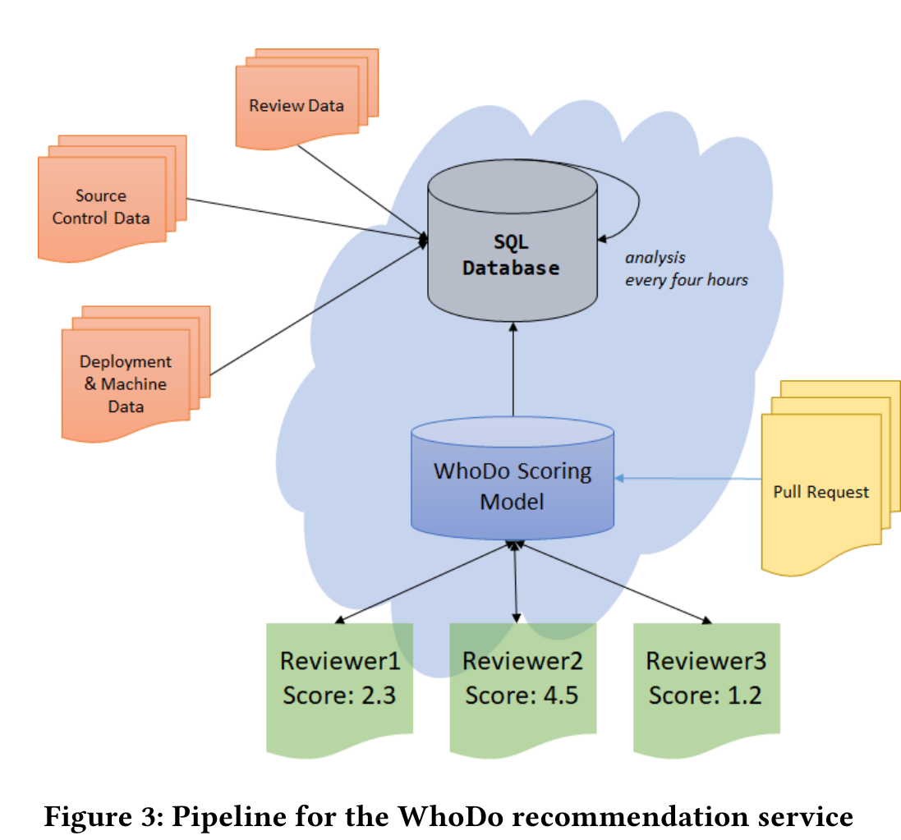
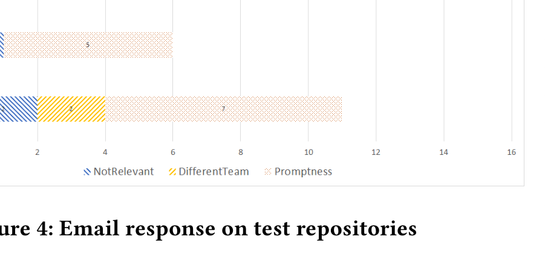

## WhoDo: Automating reviewer suggestions at scale

Sumit Asthana — Microsoft Research India — t-suasth@microsoft.com  
B. Ashok — Microsoft Research India — bash@microsoft.com  
Chetan Bansal — Microsoft Research India — chetanb@microsoft.com  
Ranjita Bhagwan — Microsoft Research India — bhagwan@microsoft.com  
Christian Bird — Microsoft Research Redmond — cbird@microsoft.com  
Rahul Kumar — Microsoft Research India — rahulku@microsoft.com  
Chandra Maddila — Microsoft Research India — chmaddil@microsoft.com  
Sonu Mehta — Microsoft Research India — someh@microsoft.com

### ABSTRACT

Today’s software development is distributed and involves continuous changes for new features and yet, their development cycle has to be fast and agile. An important component of enabling this agility is selecting the right reviewers for every code change — the smallest unit of the development cycle. Modern tool-based code review is proven to be an effective way to achieve appropriate code review of software changes. However, the selection of reviewers in these code review systems is at best manual. As software and teams scale, this poses the challenge of selecting the right reviewers, which in turn determines software quality over time. While previous work has suggested automatic approaches to code reviewer recommendations, it has been limited to retrospective analysis. We not only deploy a reviewer suggestions algorithm — WhoDo — and evaluate its effect but also incorporate load balancing as part of it to address one of its major shortcomings: recommending experienced developers very frequently. We evaluate the effect of this hybrid recommendation + load balancing system on five repositories within Microsoft. Our results are based around various aspects of a commit and how code review affects that. We attempt to quantitatively answer questions which are supposed to play a vital role in effective code review through our data and substantiate it through qualitative feedback of partner repositories.

> ACM Reference Format:  
> Sumit Asthana, B. Ashok, Chetan Bansal, Ranjita Bhagwan, Christian Bird, Rahul Kumar, Chandra Maddila, and Sonu Mehta. 2019. WhoDo: Automating reviewer suggestions at scale. In Proceedings of The 27th ACM Joint European Software Engineering Conference and Symposium on the Foundations of Software Engineering (ESEC/FSE 2019). ACM, New York, NY, USA, 9 pages. https://doi.org/10.1145/nnnnnnn.nnnnnnn

## 1 INTRODUCTION

Large software projects have continuously evolving code-bases and an ever-changing set of developers. Making the development process smooth and fast, while maintaining code quality is vital to any software development effort. As one approach for meeting this challenge, code review [1, 2] is widely accepted as an effective tool for subjecting code to scrutiny by peers and maintaining quality. Modern code review [3], characterized by lightweight tool-based reviews of source code changes, is in use broadly across both commercial and open source software projects [17]. This form of code review provides developers with an effective workflow to review code changes and improve code, and this process has been studied in depth in the research community [5, 6, 11, 13, 17–20, 23].

One topic that has received much attention over the past five years is the challenge of recommending the most appropriate reviewers for a software change. Bacchelli and Bird [3] found that when the reviewing developer had a deep understanding of the code being reviewed, the feedback was "more likely to find subtle defects ... more conceptual (better ideas, approaches) instead of superficial (naming, mechanical style, etc.)." Kononenko et al. [12] found that selecting the right reviewers impacts quality. Thus, many have proposed and evaluated approaches for identifying the best reviewer for a code review [4, 8, 14, 15, 22, 24, 26] (see section 2 for a more in-depth description of related work). At Microsoft, many development teams have voiced a desire for help in identifying those developers that have the understanding and expertise needed to review a given software change.

The large and growing size of the software repositories at many software companies (including Microsoft, the company involved in the evaluation of our approach) has created the need for an automated way to suggest reviewers [3]. One common approach that several projects have used is a manually defined set of groups that identify experts in an area of code collectively. These groups are used in conjunction with rules which trigger the addition of groups

CCS CONCEPTS

- Human-centered computing → Empirical studies in collaborative and social computing;
- Software and its engineering → Software configuration management and version control systems; Software maintenance tools; Programming teams.

KEYWORDS

software-engineering, recommendation, code-review

> Permission to make digital or hard copies of all or part of this work for personal or classroom use is granted without fee provided that copies are not made or distributed for profit or commercial advantage and that copies bear this notice and the full citation on the first page. Copyrights for components of this work owned by others than ACM must be honored. Abstracting with credit is permitted. To copy otherwise, or republish, to post on servers or to redistribute to lists, requires prior specific permission and/or a fee. Request permissions from permissions@acm.org.  
>  
> ESEC/FSE 2019, 26–30 August, 2019, Tallinn, Estonia  
> © 2019 Association for Computing Machinery.  
> ACM ISBN 978-x-xxxx-xxxx-x/YY/MM...$15.00  
> https://doi.org/10.1145/nnnnnnn.nnnnnnn

---

whenever files in a pre-defined part of the system change (e.g., add participants in the Network Protocol Review group whenever a file is changed in /src/networking/protocols/TCPIP/*/). This ensures that the appropriate group of experts are informed of the file change and can review it. However, such solutions are hard to scale, suffer from becoming stale quickly, and may miss the right reviewers even when rules and groups are manually kept up to date.

Motivated by the need for help in identifying the most appropriate reviewers and the difficulty of manually tracking expertise, we have developed and deployed an automatic code review system at Microsoft called WhoDo. In this paper, we report our experience and initial evaluation of this deployment on five software repositories. We leverage the success of previous works like Zanjani et al. [26] that demonstrated that considering past history of code in terms of authorship and reviewership with respect to the current change is an effective way to recommend peer reviewers for a code change. Based on the positive metrics of our evaluation and favorable user-feedback, we have proceeded to deploy WhoDo onto many additional repositories across Microsoft. Currently, it runs on 123 repositories and this number continues to grow rapidly.

As discussed in Section 2, reviewer recommendation has been the subject of much research. However, it is not clear which of these systems have been deployed in practice and the evaluation of such recommendation systems has consisted primarily of historical comparison, determining how well the recommendations match what actually happened and who participated in the review. While such an offline evaluation [9] is useful, it may not provide an accurate picture of the impact of the recommendation system when used in practice. For example, there is an (often implicit) assumption that those who participated in the review were in fact the best people to review the change and those who were not invited were not appropriate reviewers. To address this concern, in this paper we report on the deployment of our reviewer recommender to a set of software projects at Microsoft, a large and diverse software company. Our evaluation measures impacts quantitatively, examining user involvement and time to completion of reviews, as well as qualitatively through a user study of the developers that used our system.

In addition, we find that the proposed reviewer recommendation systems in literature do not take into account reviewer load, the distribution of reviews across available reviewers. In practice, we found that reviewer recommendation systems will often assign a large proportion of reviews to a small set of experienced developers (e.g., 20% of the developers in a project are assigned 80% of the reviews). To address this, we present the first (to our knowledge) approach that incorporates load balancing into live reviewer recommendations along with an evaluation of the positive impact of load balancing.

We describe our efforts from building this model to deploying it to scaling it to repositories across Microsoft. In this paper, we:
- Provide a description of a straightforward, interpretable automatic code reviewer recommendation system that works in practice.
- Describe the problem of load balancing and present an approach to address the issue of unbalanced recommendations.
- Provide an evaluation of the recommendation system in live production.
- Present the results of a user study of software developers that used the recommendation system.

## 2 RELATED WORK

Tool based code review is the adopted standard in both OSS and proprietary software systems [17] and many tools exist that enable developers to look at software changes effectively and review them. Reviewboard1, Gerrit2 and Phabricator3, the popular open source code review tools and Microsoft’s internal code review interface share some common characteristics:

- Each code change has a review associated with it and almost all code changes (depending on team policies) have to go through the review process.
- Each review shows the associated changes in a standard diff format.
- Each review can be reviewed by any number of developers. Currently, reviewers are added by the author of the change or through manually defined rules.
- Each reviewer can leave comments on the change at any particular location of the diff pinpointing errors or asking for clarifications.
- The code author addresses these comments in subsequent iterations/revisions and this continues until all comments are resolved or one of the reviewers signs-off.

One potential bottleneck of the above workflow is addition of code reviewers by authors. This is a manual activity and several social factors [7] such as developer relations, code knowledge play a role in it. This system, while, effective is also biased towards interpersonal relations which can lead to incorrect assignment in cases of large repositories where groups of teams are changing different code areas. A change affecting an unknown area might be signed-off by a teammate without appropriate expertise in the related area. To mitigate this effect, the code review interface has provisions for defining manual rules on files that if changed, would trigger addition of certain group aliases who own that file. One of the principal motivations of our system is to extend this kind of ownership definition beyond manual rules and track it automatically over time.

We are certainly not the first to attack the challenge of building a system to automatically recommend developers for code-review. Balachandran [4] was the first to introduce a system for recommending reviewers. His tool, ReviewBot, recommends reviewers for a review based by determining which source code lines were changed and identifying those who had reviewed the previous changes that modified or added those same lines in the past. RevFinder [21, 22], subsequently proposed by Thongtanunam et al. is based on the idea that those who have reviewed a file in the past are qualified to review that file in the future. The intuition behind RevFinder is that files that have similar paths are similar and should be managed and reviewed by similar experienced code-reviewers.

1 https://www.reviewboard.org/
2 https://www.gerritcodereview.com/
3 https://secure.phabricator.com/

---

Tie, an approach introduced by Xia et al. [24] builds on RevFinder by using file path similarity metrics and incorporating a text mining component that examines the code review request and compares it to the text in previously completed code review requests.

cHRev, developed by Zanjani et al. [26], uses historical information including how frequently and recently a developer provided code review comments about a file, in addition to the total number of review comments made for a file, to rank the best developers to review a change to that file in the future. Our model is based on participation in past reviews for a file, but also incorporates the history of developers that made changes to the file, as we found that in some cases, the primary author of a file never actually provided code review comments about it. In these cases, the primary author should still be recommended to review changes.

Jeong et al. [10] developed a method for recommending reviewers for source code changes based on a variety of features including size of the change (both in lines of code and files affected), the identity of the author of the change, the names of the files changed, source code features such as counts of various keywords and braces, and even bug report information such as bug severity and priority if the change was intended to correct a related bug.

Ouni et al. [14] even incorporated socio-technical collaboration graphs of developers into reviewer recommendation based on the notion that “the socio-technical factor related to the relationship between reviewer contributors is a crucial aspect that affects the review quality”. Their work was inspired by Yang et al.’s findings that developers’ communication social networks is a strong predictor of their activity and collaboration with regard to code review (which they term “peer review”) [25].

Rahman et al. [15, 16] actually determined developers’ expertise by looking across multiple projects. Their approach attempts to determine if developers had used particular libraries or technologies in other projects that would make them appropriate reviewers for a change in a particular project. They gathered data from GitHub to determine the history of changes that developers had made and what technologies/libraries they had used in the past.

Our report differs from this body of work in three primary ways. First, as our goal is to recommend reviewers quickly for repositories that may be very large, we use a simplified approach that uses only one data source, the history of PRs in a project. We do not rely on bug databases, an ecosystem of software projects, a history of developer communication, or features of source code that would require some level of code analysis. These add complexity, require additional data sources (that may or may not exist), and take additional time. Second, while the existing systems mentioned used a retrospective, historical approach to evaluate the performance of their approaches, we deploy our reviewer recommendation system and evaluate it based on the results of it being used in practice. Third, our experience is that reviewer recommendation systems often suggest a small set of developers to participate in most reviews, leading to a very skewed assignment of reviews. As a result, we are the first to both identify the problem and address it by incorporating reviewer load balancing into our reviewer recommendation system.

http://www.github.com

## 3 SYSTEM DESIGN

In this section, we first describe the WhoDo reviewer recommendation algorithm in detail with specific emphasis on the scoring function used to prioritize reviewers. Next, we describe how we augment the algorithm to balance load across all reviewers.

### 3.1 Scoring Function

WhoDo’s scoring function creates a ranked order of developers as potential reviewers for a pull-request using commit and review histories. Developers who have in the past either committed changes to the files in the pull-request, or have reviewed files in the pull-request, are more likely to be added as reviewers. We say that a developer has reviewed a pull-request if and only if they have either signed off on the pull-request, or left at least one comment.

Given a pull-request, the score for each reviewer r is:

Score(r) = C1 * sum_{f in F} ( n_change(r, f) * (1 / t_change(r, f)) )
         + C2 * sum_{d in D} ( n_change(r, d) * (1 / t_change(r, d)) )
         + C3 * sum_{f in F} ( n_review(r, f) * (1 / t_review(r, f)) )
         + C4 * sum_{d in D} ( n_review(r, d) * (1 / t_review(r, d)) )

where r is the reviewer, F is the set of all files in the pull-request, and D is the set of all last-level parent directories that are changed in the pull-request. n_change(r, f) is the number of times reviewer r has committed changes to file f in the past. n_review(r, f) is the number of times reviewer r has reviewed file f. Similarly, n_change(r, d) is the number of times reviewer r has committed changes within directory d and n_review(r, d) is the number of times reviewer r has reviewed files in directory d. Hence, the larger the number of times a reviewer has interacted with the file (or last-level directory in which the file sits), the higher the reviewer’s score.

t_change(r, f) is the number of days since reviewer r changed file f, and t_review(r, f) is the number of days since the reviewer reviewed file f. Similarly, t_change(r, d) is the number of days since reviewer r changed directory d, and t_review(r, d) is the number of days since the reviewer reviewed files in directory d. These terms are in the denominator. Hence, reviewers with more recent interactions with the files and directories of the pull-request will have lower values for these, and WhoDo will rank them higher.

C1, C2, C3 and C4 are constant coefficients. An administrator deploying WhoDo can manipulate these four coefficients to weigh authorship over reviewership, or vice-versa. Giving more weight to code authorship loops in more junior developers in the recommendation system, since junior developers tend to write code more than review code. In our deployments of WhoDo, we wanted to give equal weightage to both authorship and reviewership and therefore set all coefficients to 1.0.

Finally, WhoDo picks the reviewers with the top k scores and adds them as reviewers to the pull-request.

---

## 3.2 Load Balancing

The function we described in Section 3.1 does not attempt to balance load across developers. Consequently, WhoDo may assign a disproportionately high load to a few active and knowledgeable developers, who have reviewed and committed to multiple parts of the code-base regularly. In this section, we show how WhoDo addresses this issue.

We modify the score based on the load of the reviewer to mitigate the affect of such unbalanced recommendations. We term this as ScoreLoadBalanced.

ScoreLoadBalanced(r) = Score(r) / Load(r)

Load(r) = e^{θ · TotalOpenReviews}

TotalOpenReviews is the total number of incomplete pull-requests to which the developer has been added as a reviewer. By using this metric, we aim to capture the current review workload of the user. θ is a parameter between 0 and 1 to control the amount of load balancing: the higher the value of θ, the more aggressive is the load balancing. We use the exponential function to smoothen our assignments. Figure 1 shows the value of Load(reviewer) for different values of θ. Choosing θ of 0.5 will decrease our original reviewer score by a load value of 7.3 if the reviewer has more than 4 active reviews, while choosing θ of 0.2 will cause a penalty of 3.32 only. This gives the deployers of WhoDo an intuition on how to choose the appropriate value of θ for their repositories.


Figure 1: The load as a function of different values of the parameter θ

To evaluate this load balancing strategy, we simulated WhoDo, both with and without load balancing on one of our organization’s repositories, LargeRepo5. We ran this experiment for a period of two months. We set θ in the load balancing algorithm to be 0.5. This is because we wanted to start levying penalty when the average load crosses a limit of 5 open reviews. Figure 2 shows a comparison of WhoDo with and without load balancing. We plot a metric that we call suggestion frequency for each reviewer, which is the number of times WhoDo suggested the reviewer in the evaluation period.

5 More details of LargeRepo are given in Section 6.2

The graph shows the suggestion frequencies for all reviewers. The x-axis shows reviewers sorted in decreasing order of suggestion frequency for WhoDo without load balancing.

The graph suggests that, with load balancing, WhoDo performs a better distribution of reviews across all reviewers. The average suggestion frequency without load-balancing is 10.10, and the standard deviation is 10.17. With load balancing, the average suggestion frequency is 9.34 and the standard deviation is reduced to 5.67. In Section 6.4, we show additional results on how WhoDo improves reviewer assignments after deploying the load balancing algorithm on LargeRepo. It is to be noted, however, that load balancing comes at the expense of reduced expertise on code-reviews since the algorithm is not choosing the most optimal set of reviewers but the most optimal reviewers with minimum load.


Figure 2: Effect of aggressive load balancing. X-axis shows developers, leftmost are more senior. Y-axis depicts the number of times the developer was suggested by the algorithm.

## 4 DISCUSSION

We identify that evaluation of the reviewer recommendations problem is hard because we know the people who did the review but we don’t know of people who did not do the review but were eligible to do so. For this reason, we did not start off with a machine learning approach as it requires ground truth in the form of positive and negative labels. It would be wrong to treat all the people who did not do the review as negative samples.

Developers are more comfortable with reviewers within their immediate organization. So they decide to add reviewers who are in their own organization, even if they are not the right reviewers. That said, there is some value in adding "close" reviewers because closer reviewers may be more familiar with the change. This follows from the fact that feature development often happens in groups of small teams and corresponding team member are often familiar with the change. This factor is difficult to adopt in our evaluation.

Besides, the scoring function defined by us is highly interpretable because of its simple summation of contributions. For an initial deployment scenario when the system is deployed, a very important task that we saw recurring was the request for the interpretation of suggestions by developers which also helped us identify various.

---

shortcomings of the system and understand the problem at a deeper level.

## 5 DEPLOYMENT



Figure 3: Pipeline for the WhoDo recommendation service

Figure 3 provides an overview of the deployment of the WhoDo reviewer recommendation service. The first stage is aggregating the past history of developers that the scoring model defined above can use. We maintain a comprehensive set of repository data like files changed, review information, changes, etc., which is updated incrementally every four hours. As part of this data, we also record the number of changes and reviews by each developer to every file path they work on in the repository and the last time of such activity. Recording such information makes it very easy for the scoring model to query this information directly and aggregate it across all candidate reviewers.

The standard tool for code review inside Microsoft is Azure DevOps which provides an interface similar to open source tools like Gerrit, GitHub with a page for each pull-request. The page contains all the information that code reviewers might need for the pull-request and functionality for adding comments, adding/removing reviewers, etc. Our service is hooked to the Azure DevOps service and gets triggered to show a reviewer recommendation whenever a new pull-request is created or an existing one modified.

### 5.1 Showing recommendations

We had three choices on how to show the recommendations to the developers:
- Suggest reviewers as a comment on the pull request.
- Add optional reviewers to the pull request.
- Add required reviewers to the pull request.

The first case, of commenting, is non-invasive, where it's the pull request author's choice to add a suggested developer as a reviewer. In the last two cases, suggested developers get a notification of addition to the pull request. Optional reviewers are not required to sign-off on the pull request for it to be deemed complete, whereas required reviewers need to sign-off on the pull request for it to be considered complete. We did not consider the first option, as it requires vigilance on the part of code authors to actively act on our suggestions, whereas the last option would have meant an incorrect reviewer needing to sign-off on the pull request. Therefore, we considered adding our suggestions as optional reviewers as a healthy trade-off between passive and active addition.

## 6 EVALUATION

We have deployed WhoDo on 123 repositories within Microsoft. Our evaluation focuses on five of these repositories. We now provide a summary of the different experiments we used to evaluate WhoDo.

In Section 6.2, we provide statistics that characterize these repositories. Next, we describe WhoDo's performance on these repositories in Section 6.3, without load-balancing. Eventually, we deployed the WhoDo load-balancing algorithm on the LargeRepo repository. We describe WhoDo's load-balancing performance in Section 6.4.

To understand how to improve WhoDo, we performed a user-study, the results of which we summarize in Section 6.5. Finally, to see if our results compared well with previous work, we performed a retrospective analysis of WhoDo on the same five repositories, asking questions of how WhoDo's reviewer suggestions, if it had been deployed earlier, would have compared to the current manual process of adding reviewers. We describe this in Section 6.6.

We first describe the metrics used for both parts of our evaluation. Next we describe the results.

### 6.1 Metrics

As noted earlier, the ultimate goals of WhoDo are to improve code quality and increase deployment agility. Hence, we use the following metrics to evaluate it.

- Hit rate: WhoDo's goal is to choose the right set of reviewers so that the pull-request owner does not have to add any reviewers manually. The WhoDo hit-rate is the fraction of PRs in a repository for which at least one of the reviewers suggested by WhoDo reviewed the PR. In other words, WhoDo is successful in choosing the right reviewer(s) who review and complete the PR. A better hit-rate signifies the service was able to successfully identify a reviewer, and therefore offload that task from the author.

- Average number of reviews per PR: We evaluate if, post-deployment, WhoDo achieves a larger number of completed reviews per PR on average than before it was deployed. Having this larger number through an automated service will hopefully improve the code quality as more expert reviewers are examining the code.

- Average PR completion time: We evaluate if, post-deployment, WhoDo reduced the average PR completion time for a repository. A reduced PR completion time also reduces the time to deploy a code-change into production, thereby improving deployment agility. WhoDo achieves this by choosing the right set of reviewers as soon as the PR owner creates the PR, rather than waiting for the owner to manually determine the right set of reviewers.

---

- Average per-reviewer active load: This metric helps evaluate the efficacy of the WhoDo load-balancing algorithm. We define per-reviewer active load as the average number of open reviews that a reviewer has on any given day. We then average this across all reviewers to get the average per-reviewer active load.

## 6.2 Repository Characteristics

Table 1 characterizes the five repositories which we use to evaluate WhoDo. The LargeRepo repository is the largest, with roughly 120 active developers and more than 8 PRs per day on average. MediumRepo has a similar number of active developers, but fewer PRs per day. The other 3 repositories are smaller in size, with roughly 10–20 active developers and about 2 PRs per day. The table also shows the date of deployment of service, and the service remains active to-date on all repositories. Developer coverage for each repository reflects the percentage of total number of files in the repository that a developer has touched on an average. Note that the developer coverage seems higher for the smaller repositories. Cut-off date refers to the date up to which we take the pull-requests for all our analyses.

## 6.3 WhoDo Performance

We now state our findings, using the metrics described in Section 6.1, from WhoDo’s five deployments. Table 2 summarizes our results.

### 6.3.1 PR Completion Time

We find that, for the smaller repositories SmallRepo1, MediumRepo, SmallRepo2, and SmallRepo3, the PR completion time improves significantly, between 13.03% and 21.39%. For the larger LargeRepo repository, without load-balancing, it increases by about 14%.

We had received complaints of overloaded reviewers from the larger repo, so further investigation revealed that a fundamental difference exists between reviewer expertise in smaller versus larger repositories. In smaller repositories, developers have expertise in a larger fraction of the code-base. The developer coverage metric in Table 1 shows this. As a result, the fraction of suitable reviewers for a pull-request is larger for a small repository than it is for a large repository. Contrarily, in larger repositories, most reviewers are experts on only a small set of code-paths within the code-base. However, there do exist some senior, experienced reviewers whose expertise extends to a larger set of code-paths in larger repositories too. This is evident from the coverage numbers in Table 1. Therefore, when we deployed WhoDo without load-balancing on the large repository, these senior reviewers were assigned a disproportionately large set of reviews, causing a backlog and hence affecting overall PR completion time. We addressed this issue by deploying load-balancing into the LargeRepo repository, after which PR completion time showed further improvement. The results are in Section 6.4.

### 6.3.2 Average Number of Reviews

All repositories saw a significant increase in average number of reviews per PR. For LargeRepo though, the increase is significantly more, i.e. 45.66%. We found that though WhoDo was automatically adding suitable reviewers, developers were manually adding additional reviewers who they worked closely with. Consequently, each pull-request was being examined by a larger set of expert reviewers than before. Based on this finding, a future goal of WhoDo is to capture author–reviewer affinity into the model.

### 6.3.3 Hit Rate

Finally, we evaluated the hit rate that WhoDo provided. We explain the hit rate and its implication using MediumRepo as an example. Note, from Table 2, that MediumRepo had the lowest hit rate of 58.16%. This means that, for 41.84% of all 589 PRs, i.e. 246 PRs, none of the reviewers suggested by WhoDo interacted with the PR, and that the owner manually added at least one other reviewer that WhoDo did not suggest. PR owners adding reviewers manually has the effect of reducing the hit-rate on all 5 repositories. To understand why owners add reviewers manually, we performed the user study described in Section 6.5.

## 6.4 Load Balancing

We implemented load-balancing into WhoDo and deployed it on the LargeRepo repository on 20th December, 2018. We have collected data on WhoDo’s performance with load-balancing for 45 days. We have data on WhoDo’s performance without load-balancing for 56 days. Table 3 summarizes the results of this experiment.

Note that after we deployed load-balancing, the PR completion time reduced significantly, from 70.46 hours to 57.92 hours. While WhoDo without load-balancing on the LargeRepo repository did not have a significant effect on PR completion times (shown in Table 2), WhoDo with load-balancing decreased it by 17.79%. The average reviews per PR also increased from 3.86 to 4.05. In addition, we see that the active load on reviewers goes down significantly from 0.663 to 0.359, a decrease by 45.85%. This analysis shows that larger repositories such as LargeRepo benefit significantly from using the load-balancing algorithm. Table 4 shows the upper and lower quantiles, median, mean of pull-request completion times for the LargeRepo repository. We note that the majority of our drop in pull-request completion times arises from the higher end, i.e. pull-requests which take longer. We argue that this is mostly because a majority of pull-requests which comprise of changes to one or two files wouldn’t get affected by the increase in number of reviews. It's only the pull-requests which are major changes and require a thorough review, which will benefit from the more available reviewers.

## 6.5 User Study

As shown in Table 2, WhoDo achieves good hit rates. However, there are still cases in which, in spite of WhoDo’s automatic reviewer additions, several PR owners manually added other reviewers. The objective of this user study was to understand why this was happening.

We conducted a user-study by sending email to 75 PR owners spread across all 5 repos. We sent only one email per developer, to avoid spamming them and selected only those PRs for investigation, where none of our 3 recommendations proved useful. In the email, we asked them their reason for adding the reviewers. We provided them the following options:

1. Were the reviewers WhoDo added not relevant?
2. Were the reviewers WhoDo added from a different team?
3. While WhoDo’s suggestions were valid, did you add reviewers because they were available to review promptly?

---

| Repository | Active developers | Average PRs per day | Developer Coverage | Total Files | Total pull-requests | Deployed WhoDo | Cut-off date |
|---|---:|---:|---:|---:|---:|---|---|
| SmallRepo1 | 20 | 2.1 | 11.49% | 2218 | 252 | 10/10/2018 | 5/2/2019 |
| MediumRepo | 113 | 2.68 | 1.27% | 6440 | 526 | 11/12/2018 | 5/2/2019 |
| SmallRepo2 | 12 | 2.43 | 18.09% | 383 | 196 | 10/10/2018 | 5/2/2019 |
| SmallRepo3 | 13 | 1.31 | 22.81% | 482 | 220 | 10/10/2018 | 5/2/2019 |
| LargeRepo | 116 | 8.4 | 2.49% | 7750 | 793 | 24/10/2018 | 5/2/2019 |

Table 1: WhoDo has been deployed on 5 repositories of varying sizes. This table summarizes the characteristics of these repositories, and for how long WhoDo has been active on them.

| Repository | No. PRs Processed (before) | No. PRs Processed (after) | PR Completion (hours) before | PR Completion (hours) after | PR Completion % improvement | Average Number of Reviews before | Average Number of Reviews after | Avg reviews % improvement | WhoDo Hit Rate% |
|---|---:|---:|---:|---:|---:|---:|---:|---:|---:|
| SmallRepo1 | 168 | 258 | 56.06 | 44.07 | 21.39 | 1.478 | 1.66 | 12.11 | 68.35% |
| MediumRepo | 3268 | 589 | 74.88 | 61.59 | 17.75 | 1.74 | 1.65 | 5.17 | 58.16% |
| SmallRepo2 | 370 | 245 | 19.73 | 16.55 | 16.12 | 1.25 | 1.45 | 16.00 | 78.18% |
| SmallRepo3 | 487 | 222 | 21.27 | 18.50 | 13.02 | 1.25 | 1.47 | 17.60 | 80.18% |
| LargeRepo | 1787 | 474 | 74.26 | 63.71 | 14.20 | 2.65 | 3.86 | 45.66 | 72.54% |

Table 2: Aggregate PR statistics before and after the deployment of WhoDo service on select repositories

| Measure | Before Load Balancing | After Load Balancing | % Improvement | % Improvement over baseline |
|---|---:|---:|---:|---:|
| No. of days of deployment | 56 | 54 | - | - |
| No. of PRs | 474 | 415 | - | - |
| PR Completion time (hours) | 70.46 | 57.92 | 12.54 | 17.79 |
| Average Reviewers per PR | 3.86 | 4.05 | 4.92 | 52.83 |
| Average per-reviewer active load | 0.663 | 0.359 | 45.85 | - |

Table 3: Evaluation of load balancing on LargeRepo repository

| Q/4 | Median | 3Q/4 | Mean |
|---:|---:|---:|---:|
| Before Load Balancing | 2.80 | 22.71 | 90.65 | 70.46 |
| After Load Balancing | 2.63 | 20.60 | 72.82 | 57.92 |

Table 4: Statistics of PR completion times on the LargeRepo repository. All values in hours

(4) Do you know the recommended reviewers or have worked with them before?
(5) Was there any other reason for adding reviewers?

We received a total of 28 responses. The results are summarized in Figure 4. In most cases, the developers chose the third option, i.e. while WhoDo’s suggestions were valid, they knew of someone who could review their PR almost immediately. Evidently enough, the response statistics were split into 2 categories.

As is clear from Figure 4, there is a clear difference in statistics in response of smaller vs larger repos. A large portion of responses in SmallRepo1 state that the recommendations were valid but someone else did the review because they were available at the time. This feedback suggests that WhoDo is making many more valid reviewer suggestions than the hit rate suggests, but also that WhoDo’s scoring function needs to capture current availability of reviewers as well. We leave this for future work.



Figure 4: Email response on test repositories

Developers for LargeRepo had different feedback to give. Rather than adding reviewers from their own team, WhoDo added reviewers from other teams. Here are two example responses:

---

- Reviewers, while not irrelevant, were not really required to review the specific changes - touching a config file which is used by a lot of components led our model to suggest people who touched that file most often, even though they were from a different team.
- WhoDo keeps adding people from different teams and they didn’t help review at all - This is a drawback of our scoring system and of all the solutions before this since they are inherently similar. We intend to incorporate team information to fix this problem in our next iteration.

From this user-study, we learn that to improve WhoDo’s hit-rate we have to include two factors. First, the model should include the affinity between authors and reviewers, such as team information, so that we can suggest reviewers who are already familiar with the author. Second, we should include information on the availability of the reviewer, for instance, by observing their schedule or calendar.

### 6.6 Retrospective Analysis

We also performed a retrospective analysis of WhoDo on all five repositories. The goal of this analysis is to see how well WhoDo’s suggestions match reviewers who the developers chose manually. This analysis is akin to that performed in previous work [26], which is similar to our work in that they measure prior activity of developers. Their approach differs in that they look solely at comments and they count them whereas we look also at sign-offs, as we noted that, especially for small changes, sometimes a reviewer signs-off on a change without making any comments.

We note that this retrospective analysis is an important part of our study because before deploying the scoring model or any changes to it thereof, it helps establish a baseline level of accuracy for the system and acts as a sanity check.

Table 5 describes this results of this analysis. Similar to the previous work [26], we use the following metrics in this analysis, so that we place it well for comparison against past work:

```
precision@m = |RR(p) ∩ AR(p)| / |RR(p)|

recall@m = |RR(p) ∩ AR(p)| / |AR(p)|

F-score@m = 2 * precision@m * recall@m / (precision@m + recall@m)
```

where RR(p) and AR(p) are the recommended reviewers and the actual reviewers who contributed in the review process of the code change p respectively. m is the size of the recommendation list. In our case, we recommend 3 developer on pull-requests so we only report @3 numbers for comparison with previous work.

Additionally we define PR Hits (P@n), as the fraction of all pull-requests where we were able to make at least one positive suggestion as an indication of the usefulness of the recommendation. WhoDo obtains very high values for PR Hits for all repositories, the lowest value being 68.85% and the highest being 96.57%. This means that in 96.57% of all PRs in the SmallRepo3 repository, one of the reviewers that WhoDo suggested did in fact complete the review.

Overall, while the precision and recall numbers do not seem high, they are comparable to previous systems. For instance, cHRev [26] reported numbers for four repositories with average precision 0.39, average recall of 0.69, and average F1-score of 0.5. WhoDo obtains an average precision of 0.44, an average recall of 0.47, for an average F1-score of 0.44. These numbers provide a ballpark for their performance, but aren’t an exact comparison because they were evaluated on different software projects with different characteristics (e.g., different numbers and distributions of developers and their activity). The reason why these numbers are not higher could be explained by our user-study as well. Our user-study found that often there are multiple reviewers who are qualified to review the PR, but the owner of the change chose the developer who was most readily available. We are investigating ways to infer developer availability and use it to augment the recommended reviewer ranking.

## 7 CONCLUSION

In this paper we reported our experiences and results from implementing and deploying a code review recommendation system. Our system, which identifies potential code reviewers based on their prior experience working with the files and directories involved in a code review, has been deployed in five software projects at Microsoft and performs well in helping the right developers to review the right changes. Of note, we discovered that reviewer recommendation systems may suffer from reviewer load imbalance and we have mitigated this issue through a load balancing mechanism. Use of load balancing leads to a less skewed review assignment and a decrease in review latency. As far as we know, this is the first study to report on a deployed code reviewer recommendation system at scale. We also presented a comprehensive evaluation that included a set of goal driven metrics, a user study of developers that used the system, and finally retrospective analysis similar through that used in other reviewer recommendation studies. We have also identified the additional factors of author-developer affinity and reviewer availability when recommending reviewers and we plan to investigate this in the future. We believe that others implementing reviewer recommendation in their own software organizations can benefit from the ideas and findings in this paper.

## REFERENCES

[1] A. Frank Ackerman, Lynne S. Buchwald, and Frank H. Lewski. 1989. Software Inspections: An Effective Verification Process. IEEE Softw. 6, 3 (May 1989), 31–36. https://doi.org/10.1109/52.28121

[2] A. Frank Ackerman, Priscilla J. Fowler, and Robert G. Ebenau. 1984. Software Inspections and the Industrial Production of Software. In Proc. Of a Symposium on Software Validation: Inspection-testing-verification-alternatives. Elsevier North-Holland, Inc., New York, NY, USA, 13–40. http://dl.acm.org/citation.cfm?id=3541.3543

[3] Alberto Bacchelli and Christian Bird. 2013. Expectations, outcomes, and challenges of modern code review. In 35th International Conference on Software Engineering, ICSE ’13, San Francisco, CA, USA, May 18-26, 2013, David Notkin, Betty H. C. Cheng, and Klaus Pohl (Eds.). IEEE Computer Society, 712–721. https://doi.org/10.1109/ICSE.2013.6606617

[4] Vipin Balachandran. 2013. Reducing human effort and improving quality in peer code reviews using automatic static analysis and reviewer recommendation. In Proceedings of the 2013 International Conference on Software Engineering. IEEE Press, 931–940.

[5] Olga Baysal, Oleksii Kononenko, Reid Holmes, and Michael W. Godfrey. 2012. The Secret Life of Patches: A Firefox Case Study. In 19th Working Conference on Reverse Engineering, WCRE 2012, Kingston, ON, Canada, October 15-18, 2012. IEEE Computer Society, 447–455. https://doi.org/10.1109/WCRE.2012.54

---


Table 5: Results of the retrospective evaluation of the algorithm on select repositories

[6] Olga Baysal, Oleksii Kononenko, Reid Holmes, and Michael W. Godfrey. 2013. The influence of non-technical factors on code review. In 20th Working Conference on Reverse Engineering, WCRE 2013, Koblenz, Germany, October 14–17, 2013, Ralf Lämmel, Rocco Oliveto, and Romain Robbes (Eds.). IEEE Computer Society, 122–131. https://doi.org/10.1109/WCRE.2013.6671287

[7] Amiangshu Bosu, Jeffrey C. Carver, Christian Bird, Jonathan D. Orbeck, and Christopher Chockley. 2017. Process Aspects and Social Dynamics of Contemporary Code Review: Insights from Open Source Development and Industrial Practice at Microsoft. IEEE Trans. Software Eng. 43, 1 (2017), 56–75. https://doi.org/10.1109/TSE.2016.2576451

[8] Christoph Hannebauer, Michael Patalas, Sebastian Stünkel, and Volker Gruhn. 2016. Automatically recommending code reviewers based on their expertise: An empirical comparison. In Proceedings of the 31st IEEE/ACM International Conference on Automated Software Engineering. ACM, 99–110.

[9] Jonathan L. Herlocker, Joseph A. Konstan, Loren G. Terveen, and John T. Riedl. 2004. Evaluating collaborative filtering recommender systems. ACM Transactions on Information Systems (TOIS) 22, 1 (2004), 5–53.

[10] Gaeul Jeong, Sunghun Kim, Thomas Zimmermann, and Kwangkeun Yi. 2009. Improving code review by predicting reviewers and acceptance of patches. Research on software analysis for error-free computing center Tech-Memo (ROSAEC MEMO 2009-006) (2009), 1–18.

[11] Yujuan Jiang, Bram Adams, and Daniel M. Germán. 2013. Will my patch make it? and how fast?: a case study on the Linux kernel. In Proceedings of the 10th Working Conference on Mining Software Repositories, MSR ’13, San Francisco, CA, USA, May 18–19, 2013, Thomas Zimmermann, Massimiliano Di Penta, and Sunghun Kim (Eds.). IEEE Computer Society, 101–110. https://doi.org/10.1109/MSR.2013.6624016

[12] Oleksii Kononenko, Olga Baysal, Latifa Guerrouj, Yaxin Cao, and Michael W. Godfrey. 2015. Investigating code review quality: Do people and participation matter?. In 2015 IEEE International Conference on Software Maintenance and Evolution (ICSME). IEEE, 111–120.

[13] Shane McIntosh, Yasutaka Kamei, Bram Adams, and Ahmed E. Hassan. 2014. The impact of code review coverage and code review participation on software quality: a case study of the qt, VTK, and ITK projects. In 11th Working Conference on Mining Software Repositories, MSR 2014, Proceedings, May 31 – June 1, 2014, Hyderabad, India, Premkumar T. Devanbu, Sung Kim, and Martin Pinzger (Eds.). ACM, 192–201. https://doi.org/10.1145/2597073.2597076

[14] Ali Ouni, Raula Gaikovina Kula, and Katsuro Inoue. 2016. Search-based peer reviewers recommendation in modern code review. In 2016 IEEE International Conference on Software Maintenance and Evolution (ICSME). IEEE, 367–377.

[15] Mohammad Masudur Rahman, Chanchal K. Roy, and Jason A. Collins. 2016. Correct: code reviewer recommendation in github based on cross-project and technology experience. In 2016 IEEE/ACM 38th International Conference on Software Engineering Companion (ICSE-C). IEEE, 222–231.

[16] M. M. Rahman, C. K. Roy, J. Redl, and J. Collins. 2016. CORRECT: Code Reviewer Recommendation at GitHub for Vendasta Technologies. In Proc. ASE. 792–797.

[17] Peter C. Rigby and Christian Bird. 2013. Convergent contemporary software peer review practices. In Joint Meeting of the European Software Engineering Conference and the ACM SIGSOFT Symposium on the Foundations of Software Engineering, ESEC/FSE ’13, Saint Petersburg, Russian Federation, August 18–26, 2013, Bertrand Meyer, Luciano Baresi, and Mira Mezini (Eds.). ACM, 202–212. https://doi.org/10.1145/2491411.2491444

[18] Peter C. Rigby, Brendan Cleary, Frédéric Painchaud, Margaret-Anne D. Storey, and Daniel M. Germán. 2012. Contemporary Peer Review in Action: Lessons from Open Source Development. IEEE Software 29, 6 (2012), 56–61. https://doi.org/10.1109/MS.2012.24

[19] Peter C. Rigby, Daniel M. Germán, and Margaret-Anne D. Storey. 2008. Open source software peer review practices: a case study of the apache server. In 30th International Conference on Software Engineering (ICSE 2008), Leipzig, Germany, May 10–18, 2008, Wilhelm Schäfer, Matthew B. Dwyer, and Volker Gruhn (Eds.). ACM, 541–550. https://doi.org/10.1145/1368088.1368162

[20] Peter C. Rigby and Margaret-Anne D. Storey. 2011. Understanding broadcast based peer review on open source software projects. In Proceedings of the 33rd International Conference on Software Engineering, ICSE 2011, Waikiki, Honolulu, HI, USA, May 21–28, 2011, Richard N. Taylor, Harald C. Gall, and Nenad Medvidovic (Eds.). ACM, 541–550. https://doi.org/10.1145/1985793.1985867

[21] Patanamon Thongtanunam, Raula Gaikovina Kula, Ana Erika Camargo Cruz, Norihiro Yoshida, and Hajimu Iida. 2014. Improving code review effectiveness through reviewer recommendations. In Proceedings of the 7th International Workshop on Cooperative and Human Aspects of Software Engineering. ACM, 119–122.

[22] Patanamon Thongtanunam, Chakkrit Tantithamthavorn, Raula Gaikovina Kula, Norihiro Yoshida, Hajimu Iida, and Ken-ichi Matsumoto. 2015. Who should review my code? A file location-based code-reviewer recommendation approach for modern code review. In 2015 IEEE 22nd International Conference on Software Analysis, Evolution, and Reengineering (SANER). IEEE, 141–150.

[23] Peter Weißgerber, Daniel Neu, and Stephan Diehl. 2008. Small patches get in!. In Proceedings of the 2008 International Working Conference on Mining Software Repositories, MSR 2008 (Co-located with ICSE), Leipzig, Germany, May 10–11, 2008, Proceedings, Ahmed E. Hassan, Michele Lanza, and Michael W. Godfrey (Eds.). ACM, 67–76. https://doi.org/10.1145/1370750.1370767

[24] Xin Xia, David Lo, Xinyu Wang, and Xiaohu Yang. 2015. Who should review this change?: Putting text and file location analyses together for more accurate recommendations. In 2015 IEEE International Conference on Software Maintenance and Evolution (ICSME). IEEE, 261–270.

[25] Xin Yang, Norihiro Yoshida, Raula Gaikovina Kula, and Hajimu Iida. 2016. Peer review social network (PeRSoN) in open source projects. IEICE TRANSACTIONS on Information and Systems 99, 3 (2016), 661–670.

[26] Motahareh Bahrami Zanjani, Huzefa H. Kagdi, and Christian Bird. 2016. Automatically Recommending Peer Reviewers in Modern Code Review. IEEE Trans. Software Eng. 42, 6 (2016), 530–543. https://doi.org/10.1109/TSE.2015.2500238