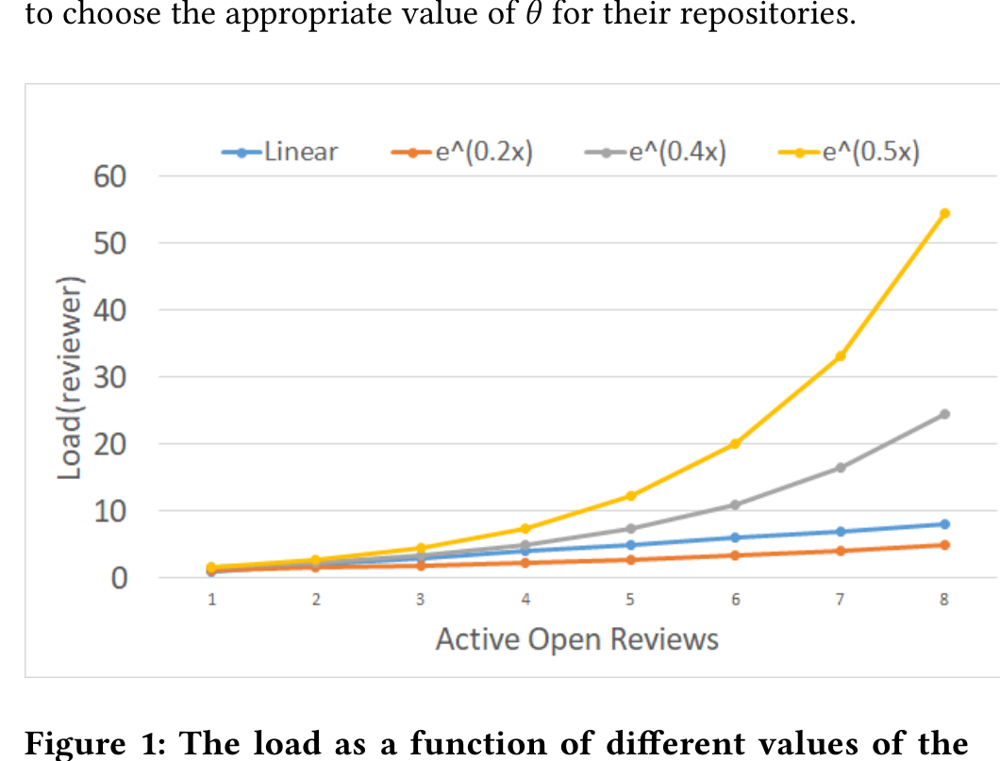
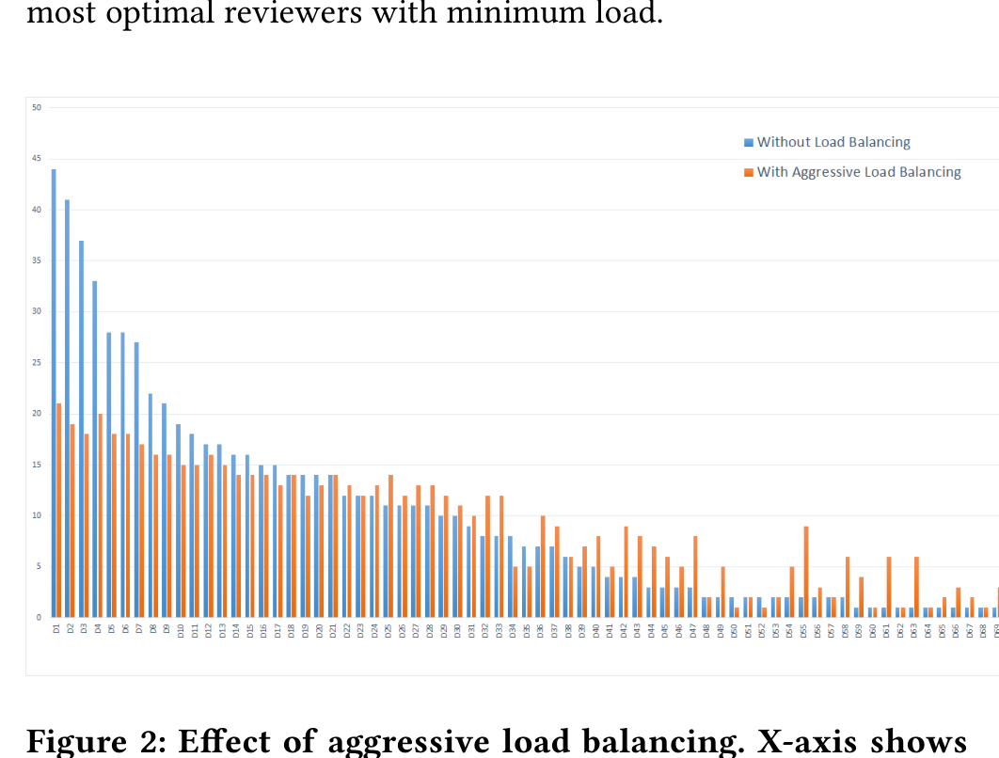

## 3.2 Load Balancing

The function we described in Section 3.1 does not attempt to balance load across developers. Consequently, WhoDo may assign a disproportionately high load to a few active and knowledgeable developers, who have reviewed and committed to multiple parts of the code-base regularly. In this section, we show how WhoDo addresses this issue.

We modify the score based on the load of the reviewer to mitigate the affect of such unbalanced recommendations. We term this as ScoreLoadBalanced.

ScoreLoadBalanced(r) = Score(r) / Load(r)

Load(r) = e^{θ · TotalOpenReviews}

TotalOpenReviews is the total number of incomplete pull-requests to which the developer has been added as a reviewer. By using this metric, we aim to capture the current review workload of the user. θ is a parameter between 0 and 1 to control the amount of load balancing: the higher the value of θ, the more aggressive is the load balancing. We use the exponential function to smoothen our assignments. Figure 1 shows the value of Load(reviewer) for different values of θ. Choosing θ of 0.5 will decrease our original reviewer score by a load value of 7.3 if the reviewer has more than 4 active reviews, while choosing θ of 0.2 will cause a penalty of 3.32 only. This gives the deployers of WhoDo an intuition on how to choose the appropriate value of θ for their repositories.

Figure 1: The load as a function of different values of the parameter θ

To evaluate this load balancing strategy, we simulated WhoDo, both with and without load balancing on one of our organization’s repositories, LargeRepo5. We ran this experiment for a period of two months. We set θ in the load balancing algorithm to be 0.5. This is because we wanted to start levying penalty when the average load crosses a limit of 5 open reviews. Figure 2 shows a comparison of WhoDo with and without load balancing. We plot a metric that we call suggestion frequency for each reviewer, which is the number of times WhoDo suggested the reviewer in the evaluation period.

5 More details of LargeRepo are given in Section 6.2

The graph shows the suggestion frequencies for all reviewers. The x-axis shows reviewers sorted in decreasing order of suggestion frequency for WhoDo without load balancing.

The graph suggests that, with load balancing, WhoDo performs a better distribution of reviews across all reviewers. The average suggestion frequency without load-balancing is 10.10, and the standard deviation is 10.17. With load balancing, the average suggestion frequency is 9.34 and the standard deviation is reduced to 5.67. In Section 6.4, we show additional results on how WhoDo improves reviewer assignments after deploying the load balancing algorithm on LargeRepo. It is to be noted, however, that load balancing comes at the expense of reduced expertise on code-reviews since the algorithm is not choosing the most optimal set of reviewers but the most optimal reviewers with minimum load.

Figure 2: Effect of aggressive load balancing. X-axis shows developers, leftmost are more senior. Y-axis depicts the number of times the developer was suggested by the algorithm.

## 4 DISCUSSION

We identify that evaluation of the reviewer recommendations problem is hard because we know the people who did the review but we don’t know of people who did not do the review but were eligible to do so. For this reason, we did not start off with a machine learning approach as it requires ground truth in the form of positive and negative labels. It would be wrong to treat all the people who did not do the review as negative samples.

Developers are more comfortable with reviewers within their immediate organization. So they decide to add reviewers who are in their own organization, even if they are not the right reviewers. That said, there is some value in adding "close" reviewers because closer reviewers may be more familiar with the change. This follows from the fact that feature development often happens in groups of small teams and corresponding team member are often familiar with the change. This factor is difficult to adopt in our evaluation.

Besides, the scoring function defined by us is highly interpretable because of its simple summation of contributions. For an initial deployment scenario when the system is deployed, a very important task that we saw recurring was the request for the interpretation of suggestions by developers which also helped us identify various.