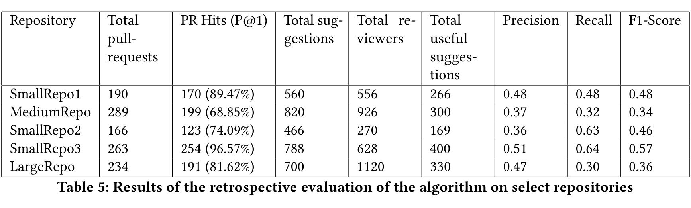

Table 5: Results of the retrospective evaluation of the algorithm on select repositories

[6] Olga Baysal, Oleksii Kononenko, Reid Holmes, and Michael W. Godfrey. 2013. The influence of non-technical factors on code review. In 20th Working Conference on Reverse Engineering, WCRE 2013, Koblenz, Germany, October 14–17, 2013, Ralf Lämmel, Rocco Oliveto, and Romain Robbes (Eds.). IEEE Computer Society, 122–131. https://doi.org/10.1109/WCRE.2013.6671287

[7] Amiangshu Bosu, Jeffrey C. Carver, Christian Bird, Jonathan D. Orbeck, and Christopher Chockley. 2017. Process Aspects and Social Dynamics of Contemporary Code Review: Insights from Open Source Development and Industrial Practice at Microsoft. IEEE Trans. Software Eng. 43, 1 (2017), 56–75. https://doi.org/10.1109/TSE.2016.2576451

[8] Christoph Hannebauer, Michael Patalas, Sebastian Stünkel, and Volker Gruhn. 2016. Automatically recommending code reviewers based on their expertise: An empirical comparison. In Proceedings of the 31st IEEE/ACM International Conference on Automated Software Engineering. ACM, 99–110.

[9] Jonathan L. Herlocker, Joseph A. Konstan, Loren G. Terveen, and John T. Riedl. 2004. Evaluating collaborative filtering recommender systems. ACM Transactions on Information Systems (TOIS) 22, 1 (2004), 5–53.

[10] Gaeul Jeong, Sunghun Kim, Thomas Zimmermann, and Kwangkeun Yi. 2009. Improving code review by predicting reviewers and acceptance of patches. Research on software analysis for error-free computing center Tech-Memo (ROSAEC MEMO 2009-006) (2009), 1–18.

[11] Yujuan Jiang, Bram Adams, and Daniel M. Germán. 2013. Will my patch make it? and how fast?: a case study on the Linux kernel. In Proceedings of the 10th Working Conference on Mining Software Repositories, MSR ’13, San Francisco, CA, USA, May 18–19, 2013, Thomas Zimmermann, Massimiliano Di Penta, and Sunghun Kim (Eds.). IEEE Computer Society, 101–110. https://doi.org/10.1109/MSR.2013.6624016

[12] Oleksii Kononenko, Olga Baysal, Latifa Guerrouj, Yaxin Cao, and Michael W. Godfrey. 2015. Investigating code review quality: Do people and participation matter?. In 2015 IEEE International Conference on Software Maintenance and Evolution (ICSME). IEEE, 111–120.

[13] Shane McIntosh, Yasutaka Kamei, Bram Adams, and Ahmed E. Hassan. 2014. The impact of code review coverage and code review participation on software quality: a case study of the qt, VTK, and ITK projects. In 11th Working Conference on Mining Software Repositories, MSR 2014, Proceedings, May 31 – June 1, 2014, Hyderabad, India, Premkumar T. Devanbu, Sung Kim, and Martin Pinzger (Eds.). ACM, 192–201. https://doi.org/10.1145/2597073.2597076

[14] Ali Ouni, Raula Gaikovina Kula, and Katsuro Inoue. 2016. Search-based peer reviewers recommendation in modern code review. In 2016 IEEE International Conference on Software Maintenance and Evolution (ICSME). IEEE, 367–377.

[15] Mohammad Masudur Rahman, Chanchal K. Roy, and Jason A. Collins. 2016. Correct: code reviewer recommendation in github based on cross-project and technology experience. In 2016 IEEE/ACM 38th International Conference on Software Engineering Companion (ICSE-C). IEEE, 222–231.

[16] M. M. Rahman, C. K. Roy, J. Redl, and J. Collins. 2016. CORRECT: Code Reviewer Recommendation at GitHub for Vendasta Technologies. In Proc. ASE. 792–797.

[17] Peter C. Rigby and Christian Bird. 2013. Convergent contemporary software peer review practices. In Joint Meeting of the European Software Engineering Conference and the ACM SIGSOFT Symposium on the Foundations of Software Engineering, ESEC/FSE ’13, Saint Petersburg, Russian Federation, August 18–26, 2013, Bertrand Meyer, Luciano Baresi, and Mira Mezini (Eds.). ACM, 202–212. https://doi.org/10.1145/2491411.2491444

[18] Peter C. Rigby, Brendan Cleary, Frédéric Painchaud, Margaret-Anne D. Storey, and Daniel M. Germán. 2012. Contemporary Peer Review in Action: Lessons from Open Source Development. IEEE Software 29, 6 (2012), 56–61. https://doi.org/10.1109/MS.2012.24

[19] Peter C. Rigby, Daniel M. Germán, and Margaret-Anne D. Storey. 2008. Open source software peer review practices: a case study of the apache server. In 30th International Conference on Software Engineering (ICSE 2008), Leipzig, Germany, May 10–18, 2008, Wilhelm Schäfer, Matthew B. Dwyer, and Volker Gruhn (Eds.). ACM, 541–550. https://doi.org/10.1145/1368088.1368162

[20] Peter C. Rigby and Margaret-Anne D. Storey. 2011. Understanding broadcast based peer review on open source software projects. In Proceedings of the 33rd International Conference on Software Engineering, ICSE 2011, Waikiki, Honolulu, HI, USA, May 21–28, 2011, Richard N. Taylor, Harald C. Gall, and Nenad Medvidovic (Eds.). ACM, 541–550. https://doi.org/10.1145/1985793.1985867

[21] Patanamon Thongtanunam, Raula Gaikovina Kula, Ana Erika Camargo Cruz, Norihiro Yoshida, and Hajimu Iida. 2014. Improving code review effectiveness through reviewer recommendations. In Proceedings of the 7th International Workshop on Cooperative and Human Aspects of Software Engineering. ACM, 119–122.

[22] Patanamon Thongtanunam, Chakkrit Tantithamthavorn, Raula Gaikovina Kula, Norihiro Yoshida, Hajimu Iida, and Ken-ichi Matsumoto. 2015. Who should review my code? A file location-based code-reviewer recommendation approach for modern code review. In 2015 IEEE 22nd International Conference on Software Analysis, Evolution, and Reengineering (SANER). IEEE, 141–150.

[23] Peter Weißgerber, Daniel Neu, and Stephan Diehl. 2008. Small patches get in!. In Proceedings of the 2008 International Working Conference on Mining Software Repositories, MSR 2008 (Co-located with ICSE), Leipzig, Germany, May 10–11, 2008, Proceedings, Ahmed E. Hassan, Michele Lanza, and Michael W. Godfrey (Eds.). ACM, 67–76. https://doi.org/10.1145/1370750.1370767

[24] Xin Xia, David Lo, Xinyu Wang, and Xiaohu Yang. 2015. Who should review this change?: Putting text and file location analyses together for more accurate recommendations. In 2015 IEEE International Conference on Software Maintenance and Evolution (ICSME). IEEE, 261–270.

[25] Xin Yang, Norihiro Yoshida, Raula Gaikovina Kula, and Hajimu Iida. 2016. Peer review social network (PeRSoN) in open source projects. IEICE TRANSACTIONS on Information and Systems 99, 3 (2016), 661–670.

[26] Motahareh Bahrami Zanjani, Huzefa H. Kagdi, and Christian Bird. 2016. Automatically Recommending Peer Reviewers in Modern Code Review. IEEE Trans. Software Eng. 42, 6 (2016), 530–543. https://doi.org/10.1109/TSE.2015.2500238