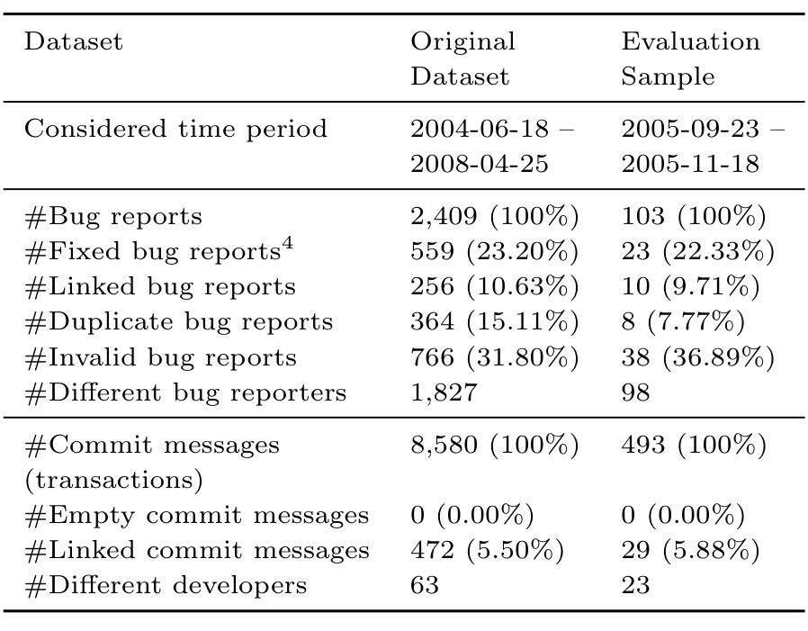

quality of defect reports and tried to predict whether the defect report will be closed within a given amount of time. Chen et al. [12] studied the change logs of three Open Source projects and analyzed the quality of these log files. In [4] we surveyed five Open Source and one Closed Source project in order to provide a deeper insight into the quality and characteristics of these often-used process data. Specifically, we defined quality and characteristics measures, computed them and discussed the issues arose from these observation. We showed that there are vast differences between the projects, particularly with respect to the quality of the link rate between bugs and commits.

Aranda and Venolia [1] provided a field study of coordination activities around bug fixing, based on a survey of software professionals at Microsoft. Specifically, they studied 10 bugs in detail and showed that (i) electronic repositories often hold incomplete or incorrect data, and (ii) the histories of even simple bugs are strongly dependent on social, organizational, and technical knowledge that cannot be solely extracted through the automated analysis of software repositories. They report that software repositories show an incomplete picture of the social processes in a project. While they studied 10 bugs in detail, we focus on commit history: we employed an expert, supported by a specially-designed tool to fully annotate a sample of 493 commits. This data helped us uncover a) some of the weaknesses of software repositories as well as b) anecdotal evidence of systematic bias in bug-fix reporting.

### 2.3 Studying Bias

Papers in empirical software engineering rarely tackle data quality issues directly (see discussion earlier in this section); our earlier work is an exception. In [2] and [10] we investigated historical data from several software projects, and found strong evidence of systematic bias. We then investigated potential effects of “unfair, imbalanced” datasets on the performance of prediction techniques.

Ideally, all bug-fixing commits are linked to bug reports; then empirical research would consider all type of fixed bug reports. However only some of the fixed bugs have links to the bug-fixing commits. This raises the possibility of two types of bias: bug feature bias, where only certain types of bugs are linked, or commit feature bias, whereby only certain types bug-fixing repairs are linked. Either type of bias is highly undesirable. With access to all the fixed bugs, and the linked bugs, we could check for bug feature bias. Our study [10] suggested that bug feature bias does exist, and also that it affects the performance of the award-winning BugCache defect prediction algorithm [19]. In this work, we have a fully annotated list of commits for the first time, thus achieving “ground truth” for a subset of the Apache dataset, and thus we can analyze the data for commit feature bias.

In summary: a few studies explicitly consider the quality of systematic bias in the data. This study, in contrast, explores the implications of this behavior by attempting to unearth the ground truth by enlisting a core developer to annotate all commits, and thus seek out quality and bias issues.

## 3. CASE STUDY: APACHE

The Apache HTTP web server is an Open Source software system developed under the auspices of the Apache Software Foundation. Apache is the most popular web server on the Internet, serving over 55% of all websites [26]. Apache is also one of the most popular Open Source projects among researchers. It is widely used in current empirical software engineering research (e.g., [25, 28, 20, 8, 18]), and thus a good subject for an in-depth examination of data quality.

### 3.1 Project Tools

Like many other Open Source projects, Apache uses the BugZilla1 bug tracker and the SVN2 version control system. In addition, the Apache Software Foundation provides officially maintained git3 mirrors for all projects. The Apache project allows free access to the contents of all these tools. Apache also maintains a public mailing list for developers and Apache users to discuss issues of concern.

### 3.2 Data Gathering and Integration

We retrieved, processed and linked the Apache HTTP web server process data as presented in [3]. Basically, we downloaded all BugZilla bug reports and SVN version control log files. Then, we scanned each commit log message for indications of fixing a bug using a set of heuristics; typically we look for bug report numbers in log messages. This leads to a set of automatically extracted links between program code commits and bug reports. This set of links is validated using another set of heuristics (op cit).

### 3.3 Apache Dataset

With our own (rather modest) resources, we could only completely evaluate and manually verify a subset of the original Apache dataset. Therefore, we had to sample the original dataset. There were two choices: random sampling or temporal sampling.

Random sampling requires some rationale for selecting a sample—e.g., prior knowledge of the distribution of the relevant co-variates to the study, so that a sample representative of the population could be chosen. It is difficult to decide a priori what such co-variates might be, let alone their distribution. So, we chose to perform temporal sampling.

Table 1: Apache Datasets: Details
aset Original Evaluati

1 See http://www.bugzilla.org/
2 See http://subversion.tigris.org/
3 See http://git-scm.com/
4 We define “fixed” bug reports as bug reports that have at least one associated fixing activity (which means a status change to “fixed”) within the considered time period.