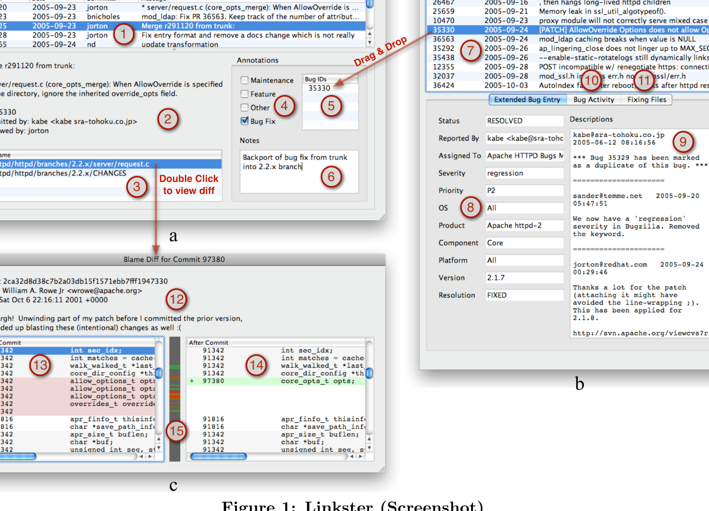

> 1
> Drag & Drop
> 7
> 10 11
> 4 5
> 2
> 9
> Double Click 6
> 3
> to view diff
> 8
> a
> 12
> 13 14
> b
> 15
> c
> Figure 1: Linkster (Screenshot)

Figure 1: Linkster (Screenshot)

## 4. LINKSTER

With this approach, we chose to verify all the commits in a given period. With complete results for that period, we can then revisit our earlier results and judge the quality against this limited but complete and accurate temporal sample. To find a “typical” period for our evaluation dataset we analyzed the whole original Apache dataset based on week-long epochs. Then, we chose a period of 6 consecutive weeks that was as representative as possible to the overall original Apache dataset in terms of its descriptive process statistics (e.g., similar proportions of bugs and commits). Table 1 lists some basic software process statistics for both—the original and the evaluation—Apache datasets including the finally defined time-frames.

The use of Linkster simplified our domain expert’s task, greatly accelerating an otherwise tedious, repetitive and inconvenient sequence of invocations of multiple tools.

Figure 1 shows a screenshot of Linkster, showing windows containing three kinds of information: commit transactions including all the changed files (a), bug reports (b), and diff & blame information for all of the lines in a file before and after a particular commit (c).

Linkster requires access to a version control system for file content and a database (local or remote), containing the raw mined repository and bug tracking information. We use git as our backend repository format, given its increasing popularity [11], and ready availability of tools supporting conversion from competitors such as CVS, SVN, etc. However, for convenience, Linkster displays the revision IDs from the original repository. All notes, links, and annotations (explained below) made by the user are also recorded in the database to facilitate use and analysis thereof after annotation.

Linkster efficiently displays, integrates, and allows inspection and annotation of information from all data sources. Linkster is written in Python, using the PyQt widget toolset and has been written with portability in mind. We have successfully run it on Linux, OS X, and Windows.

To our knowledge, no other tool provides integrated project information in combination with functionality to annotate / link commits. Hipikat [32], which was developed at UBC, is similar in that it creates links between different types of software artifacts. However, these links are based purely on heuristics and Hipikat functions as a recommender system rather than a browsing and annotation system.

Other tools such as EvoLens, SoftChange, or Shrimp provide only part of the functionality, but all existing tools have goals other than expert commit annotation.

SoftChange [15] is a tool to aid software engineering research by visualizing data. Similar to Linkster, SoftChange integrates data from multiple sources such as version control systems, releases, and bug databases. However, SoftChange uses visualizations (usually plots) to answer questions (e.g., how many bugs are closed in each time period?) and does not allow annotation of data as Linkster does.

EvoLens [29] helps developers to understand the evolution of a piece of software by visualizing the software as well as metrics of the software over time. The visual nature across time facilitates identifying design erosion and hot spots of activity. Linkster does not leverage advanced visualization techniques and integrates multiple types of data rather than just source code information.

Shrimp [24] integrates and visualizes source code, docu-