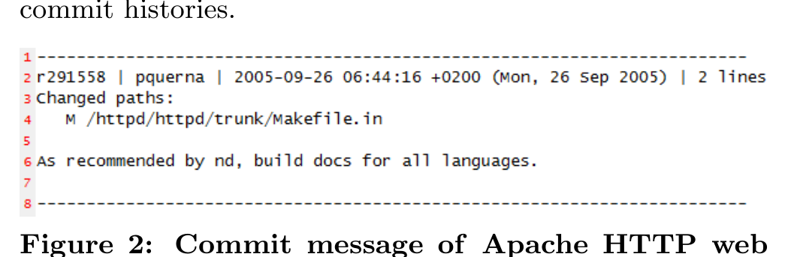

there is a rigorous review, verification and voting process before the backport is accepted and committed. Therefore, the time difference between the backport commit and the status change (to fixed) on the bug report may rise to several days, which again, makes it difficult to link the bug with the commit. As a result, automated linking algorithms will largely ignore backport fixes. Arguably, these fixes are very important: often they are involved in post-release failures. They should not be ignored by researchers engaged in hypothesis testing or defect prediction work. Alas, finding them may require extensive, high-expertise combing through commit histories.

Figure 2: Commit message of Apache HTTP web server revision #291558

### 6.3 Impact-of-Defect vs. Cause-of-Defect

This is a thorny issue: a defect in one project's code base might actually manifest as a failure in a different project. Thus, some of the reported bugs in Apache HTTP web server have their root-cause outside of the Apache program code. Apache uses external libraries, as well as Apache Commons modules. Therefore, failures in the Apache HTTP web server, even if duly reported in the Apache bug tracking database, may actually have to be fixed elsewhere. The reverse is also possible.

The mod-python[8] sub-project maintains its own version control system repository and an Apache project's main bug tracker independent Jira issue tracker[9]. Mod-python issue 83[10], for instance, was reported in the Jira issue tracker but fixed in the Apache program code.

> Finding 3. Developers sometimes fix bugs that are only reported in some other projects' bug tracker, rather than in their own; and vice-versa.

Ideally, we have a complete, integrated source of all the bugs in the bug repository, and all the fixes in the version control system. Our findings, and indeed the widespread prevalence of cross-project module reuse, indicate that this type of separation between causes and effects of defects is quite common. Given this, it would be helpful if a report of a bug impacting one system would be transferred to the bug repository of the causing system, and linked to a fix in the version control of that system. However, given the poor linking behaviour when the cause and effect are in the same system, we might expect that this type of cross-system linking is pretty unlikely to occur.

### 6.4 Commits Incognito

In earlier work [4], we encountered the problem of unexplained commits, e.g., due to empty commit log messages. Sadly, even an experienced developer would find it difficult to retrospectively reconstruct the explanation of an unexplained commit.

8 http://www.modpython.org/

> Finding 4. Even if we annotate all commits, the cause of a commit still remains unspecified in some cases.

Table 2 and 3 show the annotation, sub-classification and process-oriented classification of all the commits in our evaluation dataset. Based on the values in Table 3, for 110 commits (22.3%) we have a process-specific annotation of "other". The reason for these commits, therefore, is not justified by one of the Apache software engineering core tasks.

In addition, most of the commits are not justified by a bug fix or feature request; rather, they are for documentation (32%), voting (5.3%) or releases (8.9%). Only 37.1% of all commits have a functional impact on the software product (feature requests and bug fixes including all backport), which leads us to the conclusion that not all commits are commits that actually change the software.

For additional information to the quality and characteristics of the version control data, we refer to our previous work presented in [4].

### 6.5 Performance of the Linking Algorithm

In earlier work [3, 4, 10, 5], we reported a linking algorithm whose performance was found to be best-in-class. The fully annotated data provided the first known oracle to evaluate linking algorithms, and so we evaluated ours.

> Finding 5. The algorithm (op cit) finds most of the commit log messages that the developers linked to bugs reported in the bug tracker, subject to the time constraints used by our algorithm.

In the chosen temporal sample, our linking algorithm found 29 links between the commit messages and the bug tracking database. Justin also identified all these links; we thus found no false-positive links in our evaluation dataset. In addition to these, Justin found 10 additional links. Seven did not satisfy our heuristic for valid links (time constraint of ±7 days between commit and status change on the bug report), and so our algorithm rejected them as invalid links. Hence, we found three false-negative links in our evaluation dataset. The seven invalid links resulted from backport commits (as explained earlier, Sub-Section 6.2). These backports corresponded to bug-fix links in the original trunk which, in fact, were successfully discovered by our algorithm.

Unfortunately, as we elaborated before, even with a high linking rate between the commit messages and the bug tracker, only a subset of the fixed bugs are considered. Hence, bugs discussed on the mail discussion system are often left out by automated linking approaches.

### 6.6 Performance of LINKSTER

Linkster performed mostly as expected and Justin was able to annotate all the commits (493) of our evaluation sample dataset in one working day. In the discussions with Justin, we found some minor issues, which were promptly remedied. In addition, we found that the most important bugs are discussed in the mailing list system only. Therefore, Linkster has been extended to support browsing of messages from development mailing lists and also enables linking them to both bug reports and repository commits.