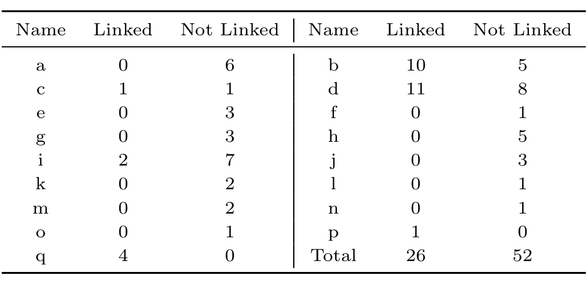

### 6.7 Threats to Validity

This sub-section discusses external and internal threats to validity that can affect the results reported in this section.

Threats to external validity. Can we generalize from the results based on the Apache HTTP web server dataset to other datasets? Software engineering tools and processes vary in different projects and, therefore, our findings based on Apache may not generalize. However, our findings indicate that developers may use software process support tools for various goals not envisioned by its original developers (such as version control systems for voting or mailing list systems for bug reporting). It seems prudent to assume that the Apache project is not a complete exception and that, therefore, the data used in studies of other projects may also lack important information. Another threat is the use of a single annotator (Justin). Getting the same data annotated by other developers, and checking agreement, would have been better; we hope to do this in future work.

Threats to internal validity. Did we choose our evaluation dataset well, and properly analyze it? We chose our time-frame carefully; however, it may not properly represent the original Apache dataset. The annotation and classification were performed carefully by a very experienced Apache core developer. Still, there may be errors. Nonetheless, according to Justin, the interesting practices of the Apache developers are by no means exceptional to this time period.

Most importantly, we hope to convince the reader that such studies are important and need to be repeated and conducted at larger scales.

## 7. COMMIT-FEATURE BIAS, REVISITED

The manual annotation effort indicates that many bug fixes are not identified in the commit logs, and thus are completely invisible to the automated linking tools used to extract bug-fix data. Thus the linked bug-fix commits are a sample of the entire group of commits. However, samples thus extracted have been central to many research efforts. The natural question is: is this sample representative, or biased? We seek to test for the two kinds of bias: bug feature bias, whereby only fixes to certain kinds of bugs are linked, and commit feature bias whereby only certain types of commits are linked [10]. Earlier, with access to the entire set of fixed bugs, and the subset of linked bugs, we could check for (and did find) bug feature bias; lacking access to a fully annotated set of commits that tells us which commits are bug fixes, we were previously unable to check for commit feature bias.

Now, with a fully annotated temporal sample of commits, we can indeed check for commit feature bias. Commit features are properties of the file and its revision history, such as size, complexity, authorship, etc. These are critical properties that have been studied in dozens of papers that test theories of bug introductions; they are also the features used for bug prediction. So it is important to test for commit feature bias, and evaluate its impact. In this section, we describe some findings related to commit feature bias, and its effect on a well-known bug-prediction algorithm (BugCache).

We remind the reader that our sample size (despite the time and effort required to gather even that much) is not big enough to realistically expect to find statistically significant support for answers to the questions discussed in this section. However, there are some takeaways: we do find statistical support for the answer to one question, and we do find some anecdotal answers for the other questions. Furthermore, actual bias along any of the lines discussed here would have a highly deleterious effect on the external validity of theories tested using only the linked data.

### 7.1 Sources and Extent of Commit Feature Bias

The first question arises naturally from the fact that there are different individual developers, who may have different attitudes towards linking. The simplest and most obvious question is as follows:

Do different developers show significantly different linking behaviour? The anonymized table of developers' linking behavior indicates that this is the case (p = 0.002).

We now hypothesize several different specific possible motivational theories of linking behavior. In several cases, there was a visually apparent signal, in boxplots, albeit none that were statistically significant. The results are shown in Figure 3. We list them below, but we caution the reader to interpret all these findings as at best anecdotal. However, it is important to bear in mind that actual bias influenced by any of the processes hypothesized below would be very damaging to the external validity of theories tested solely on the linked data.

Does the experience of the author(s) whose code is being fixed influence linking behaviour? We hypothesized that the quest for greater reputation might incentivize people to link fixes when the code under repair belonged to an experienced (and thus more reputable) person. We measured the fixed code's "author reputation" as the geometric mean of the prior commit experience of everyone who contributed to the fixed code. The leftmost boxplot in Figure 3 is weakly suggestive that fixes made to code with more experienced authorship are more likely to be linked.

Does the number of files involved in the bug fix matter? If more files are repaired in a bug fix, perhaps the fix is more "impactful"; this might motivate the fixer to more carefully document the change. In fact, the boxplot (second from left in Figure 3) is suggestive that this might be the case, with all the unlinked fixes being single-file fixes.

Are more experienced bug fixers more likely to link? We might expect that more experienced developers behave more responsibly. We measure experience as the number of prior commits. The boxplot (second from right) suggests support for this theory, with a noticeably higher median for the linked case.

Are developers who "own" a file more likely to link bug-fixes in that file? One might expect that people fixing bugs in their own files are more likely to behave responsibly and link; on the other hand, there is an anti-social reputation-preserving instinct that suggests that they may be less likely to link. We measure ownership as the proportion of lines in the file authored by the bug fixer. Indeed, the boxplot visually supports the "anti-social" theory.

We created plots to evaluate two other theories: Are bug