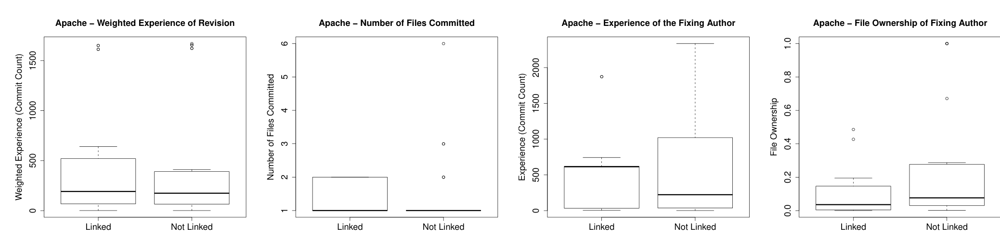

Figure 3: Commit feature bias (reading left to right) weighted experience of the original authors of the fix-inducing code; number of files changed in the bug fix; experience of the author committing the bug fix; proportion of fixed file owned by bug fix author at the time of the bug fix.

Are fixes to bigger files more likely to be linked? Does the prior experience of the file owner influence linking behaviour? We found no informal visual evidence supportive of these theories.

### 7.2 Practical Effects: BugCache Revisited

The above analysis shows that the extent of bias in the data is significant and that the effort of finding the ground truth (e.g., through manual annotation with Linkster) leads to important insights. But do those insights translate to practical impact? In this sub-section we investigate the impact of approaching ground truth in terms of changes in the accuracy of the award-winning BugCache algorithm [19]. To that end, we repeated our experiment showing the impact of bias using Apache data [10]. Specifically, we departed from two different datasets: The first dataset (called A below) contained all 1576 bugs introduced in the Apache 2.0 branch. The second one contained the additional 65 bugs found by Justin (called J). Table 4 shows the resulting accuracies for training and predicting on each combination of these two datasets.

Consider training on the extracted data A and predicting on the same data. This provides a baseline accuracy of 0.875. If the prediction is, however, performed on the dataset representing ground truth for the period of manual annotation A ∪ J then the accuracy falls to 0.870. We accede that due to the limited manually annotated period the difference—like all the differences in the table—is not significant. But as the following shows we can recognize a tendency. Alternatively, consider adding the manually annotated bugs to the training set (i.e., training on A ∪ J). In each possible prediction target (i.e., A, J, and A ∪ J) we find that the availability of the additional information actually leads to an improvement in prediction accuracy. This is especially impressive where the prediction target is A as it shows that the manually annotated bugs actually contain information relevant to the automatically extracted ones helping BugCache to find four additional bugs.

Table 4: BugCache Prediction Quality

| Learning Set | Test Set | Accuracy | 95% Confidence Interval |
|---|---|---:|---|
| A | A | 0.875 | 0.858, 0.890 |
| A | A ∪ J | 0.870 | 0.852, 0.885 |
| A | J | 0.738 | 0.620, 0.830 |
| A ∪ J | A | 0.878 | 0.860, 0.893 |
| A ∪ J | A ∪ J | 0.874 | 0.857, 0.889 |
| A ∪ J | J | 0.785 | 0.670, 0.867 |

## 8. DISCUSSION AND CONCLUSIONS

In this paper, we analyzed three main research questions and tried to find "ground truth" in the commit annotations of a very popular software engineering dataset. We used temporal sampling to define an evaluation subset of the original Apache dataset and manually annotated all commits, with the assistance of an Apache core developer and the use of Linkster.

As presented in our previous work, bias in empirical software engineering datasets may affect results of applications which rely on such data [10]. Unfortunately, based on our data verification, we found that things are even worse: our findings cast doubt on some of the core assumptions made in empirical research. Specifically:

1. Bugs often go incognito as they are not always reported as a bug in the bug tracker but, e.g., in mailing lists, and
2. commits not always clearly change the functionality of the program.

Specifically, we showed that not all fixed bugs are reported in the bug tracking database and most of the commits (62.9%) are not related to a bug fix or feature request (which would introduce a program change) rather than for documentation (32%), voting (5.3%), or releases (8.9%). In addition, we presented the curious case of backport commits and the challenging impact-of-defect vs. cause-of-defect problem. Both issues have an impact on software engineering datasets. Consequently, even though automated linkage tools are able to connect a remarkable number of commits to bug reports, many bugs—sometimes the most critical ones—never show up in the bug tracker and are, therefore, not linked. This raises new issues concerning the validity of studies that rely on version control and bug report data only—beyond what we reported earlier [10]. We presented a detailed examination of the bias in automatically linked set, when compared to the manually linked set. Especially notable is the significant variation in linking behavior among developers, and the anecdotal evidence suggesting that bug-fixing experience and code ownership play a role in linking behaviour. We also showed that BugCache has a strong tendency to miss predictions if it is not trained on ground truth.

Another implication of the work presented here is that empirical software engineering studies will need to take the whole software development social eco-system (revision control system, bug tracking database, mailing list systems, email discussions, discussion boards, chats, etc. as well as these data from other, related projects) into account in order