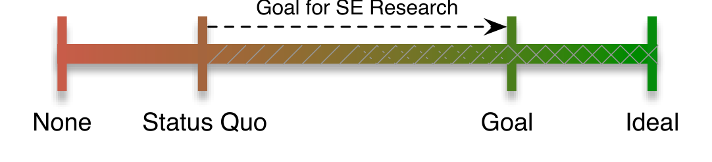

## On the Shoulders of Giants

Earl Barr†  Christian Bird†  Eric Hyatt‡  Tim Menzies§  Gregorio Robles◦  
† Dept. of Computer Science, University of California, Davis {etbarr, cabird}@ucdavis.edu  
‡ Hyatt Howell, Ltd., Berkeley, CA hyatt@ncal.net  
§ Lane Dept. of CS & EE, West Virginia University tim@menzies.us  
◦ GSyC/LibreSoft, Universidad Rey Juan Carlos grex@gsyc.urjc.es

### ABSTRACT
Science rests on peer review and the wide-spread dissemination of knowledge. Software engineering research will advance further and faster if the sharing of data and tools were easier and more wide-spread. Pragmatic concerns hinder the realization of this ideal: the time and effort required and the risk of being scooped. We examine the costs and benefits of facilitating sharing in our field in an effort to help the community understand what problems exist and find a solution. We examine how other fields, such as medicine and physics, handle sharing, describe the value of sharing for replication and innovation, and address practical concerns such as standards and warehousing. To launch what we hope will become an ongoing discussion of solutions in our community, we present some ways forward that mitigate the risk of sharing — partial sharing, registry, escrow, and market.

### Categories and Subject Descriptors
I.0 [Computing Methodologies]: General; K.7 [The Computing Profession]: General

#### General Terms
Experimentation, Standardization

#### Keywords
Replication, Data Sharing

### 1. INTRODUCTION
Sharing is fundamental to science; in-between paradigm shifts, science builds on the work of others. Bernard Chartres, a twelfth-century scholar, wrote “We are like dwarfs standing upon the shoulders of giants, and so able to see more and see farther than the ancients.” Inspiring our title, this quote captures the benefits of sharing, which include tool/data reuse, replication, and the improved quality that accompanies the possibility of increased scrutiny.

Norms in the software engineering community already require a high-level description of tools, methodology and processed (summary) data1. From these requirements, differentiated replication and clean-room tool re-implementation are already possible. Thus, the question is not whether or not to share, since we already share. The question we address is whether, and to what extent, to facilitate sharing, as shown in Figure 1. The problem with the status quo is that it hinders progress by necessitating redundant work.

**Goal for SE Research**

None Status Quo Goal Ideal

Figure 1: Data Sharing Continuum

One of us, Gregorio Robles, recently quantified the extent of this redundant, and, in some cases, potentially unreproducible work [18]; he attempted to replicate research published in the working conference on Mining Software Repositories (MSR) over its lifetime and found that only 2 of the 154 experimental studies published provided the data and the tools required for replication and further research. Robles proposed the adoption of a new convention, the inclusion of a “Barriers to Replication” section, which contains links to raw and processed data and tools, including source, and is analogous to the now ubiquitous “Threats to Validity”.

Robles’s proposal met some resistance, following his presentation at MSR 2010. A number of concerns were voiced in the ensuing discussion — the low-yield work to clean and package data, the distraction of tool support, and the danger of providing another research team with data or tools that they can use in the race to the next publication. These concerns boil down to cost and risk aversion. In the face of a deadline, inessential work is often left undone; it costs time and money to clean up data or hammer tools into shape. However, we are all better off if this price is paid. The PROMISE [5] and SIRS [9] artifact and data repositories are existence proofs that it is possible to pay the price and attest its benefits. The danger of racing another team to the next publication is a harder problem.

Considerable time and effort is spent building tools and collecting data. Researchers need to recoup that investment: For every year of data collection and cleaning or tool design and fashioning, we believe that a researcher needs roughly two publications. Although the risk of being scooped may be small, some researchers are not willing to take it. Weighed against these objections, facilitating sharing carries a number of benefits. The first is increased confidence in our results. Exact replications give us confidence in results while differentiated

1 We focus on data and tools unencumbered by intellectual property constraints until Section 5.