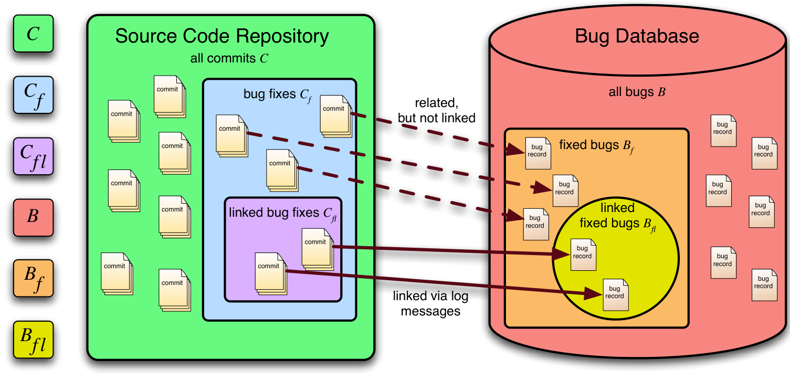
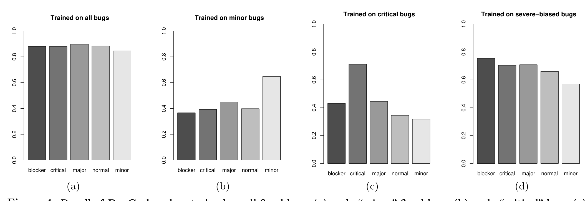

# Fair and Balanced? Bias in Bug-Fix Datasets

Christian Bird¹, Adrian Bachmann², Eirik Aune¹, John Duffy¹, Abraham Bernstein², Vladimir Filkov¹, Premkumar Devanbu¹

1 University of California, Davis, USA  
2 University of Zurich, Switzerland

{cabird, emaune, jtduffy, vfilkov, ptdevanbu}@ucdavis.edu  
{bachmann, bernstein}@ifi.uzh.ch

## ABSTRACT

Software engineering researchers have long been interested in where and why bugs occur in code, and in predicting where they might turn up next. Historical bug-occurrence data has been key to this research. Bug tracking systems and code version histories record when, how, and by whom bugs were fixed; from these sources, datasets that relate file changes to bug fixes can be extracted. These historical datasets can be used to test hypotheses concerning processes of bug introduction, and also to build statistical bug-prediction models. Unfortunately, processes and humans are imperfect, and only a fraction of bug fixes are actually labelled in source code version histories, and thus become available for study in the extracted datasets. The question naturally arises: are the bug fixes recorded in these historical datasets a fair representation of the full population of bug fixes? In this paper, we investigate historical data from several software projects, and find strong evidence of systematic bias. We then investigate the potential effects of “unfair, imbalanced” datasets on the performance of prediction techniques. We draw the lesson that bias is a critical problem that threatens both the effectiveness of processes that rely on biased datasets to build prediction models and the generalizability of hypotheses tested on biased data.1

### Categories and Subject Descriptors

D.2.8 [Software Engineering]: Metrics — Product Metrics, Process Metrics

### General Terms

Experimentation, Measurement

1 Bird, Filkov, Aune, Duffy and Devanbu gratefully acknowledge support from NSF SoD-TEAM 0613949. Bachmann acknowledges support from Zürcher Kantonalbank. Partial support provided by Swiss National Science Foundation award number 200021-112330.

## 1. INTRODUCTION

The heavy economic toll taken by poor software quality has sparked much research into two critical areas (among others): first, understanding the causes of poor quality, and second, on building effective bug-prediction systems. Researchers taking the first approach formulate hypotheses of defect introduction (more complex code is more error-prone code, pair-programming reduces defects, etc.) and then use field data concerning defect occurrence to statistically test these theories. Researchers in bug-prediction systems have used historical bug-fixing field data from software projects to build prediction models (based on, e.g., machine learning).

Both areas are of enormous practical importance: the first can lead to better practices, and the second can lead to more effectively targeted inspection and testing efforts. Both approaches, however, strongly depend on good data sets to find the precise location of bug introduction. This data is obtained from records kept by developers.

Typically, developers are expected to record how, when, where, and by whom bugs are fixed in code version histories (e.g., CVS) and bug tracking databases (e.g., Bugzilla). A commit log message might indicate that a specific bug had been fixed in that commit. However, there is no standard or enforced practice to link a particular source code change to the corresponding entry in the bug database. Linkages, sadly, are irregular and inconsistent.

Many bug prediction efforts rely on corpora such as Sliwerski and Zimmermann’s, which link Bugzilla bugs with source code commits in Eclipse [46, 49]. This corpus is created by inferring links between commits in a source code repository and a bug database by scanning commit logs for references to bugs. Given inconsistent linking, this corpus accounts for only some of the bugs in the bug database. Therefore, we have a sample of bug fixes, rather than the population of all actual bug fixes. Still, this corpus contains valuable information concerning the location of bug fixes (and thus bug occurrences). Consequently, this type of data is at the core of much work on bug prediction [36, 43, 25, 37].

However, predictions made from samples can be wrong, if the samples are not representative of the population. The effects of bias in survey data, for instance, are well known [18]. If there is some systematic relationship between the choice or ability of a surveyed individual to respond and the characteristic or process being studied, then the results of the survey may not be accurate. A classic example of this is the predictions made from political surveys conducted via telephone in the 1948 United States presidential election [30]. At that time, telephones were mostly owned by individu-

---

als who were wealthy, which had a direct relationship with their political affiliation. Thus, the (incorrectly) predicted outcome of the election was based on data in which certain political parties were over-represented. Although telephone recipients were chosen at random for the sample, the fact that a respondent needed to own a telephone to participate introduced sampling bias into the data.

Sampling bias is a form of nonresponse bias because data is missing from the full population [45], making a truly random sample impossible. Likewise, bug-fix data sets, for example, might over-represent bug-fixes performed by more experienced or core developers, perhaps because they are more careful about reporting. Hypothesis-testing on this dataset might lead to the incorrect conclusion that more experienced developers make more mistakes; in addition, prediction models might tend to incorrectly signal greater likelihood of error in code written by experienced developers, and neglect defects elsewhere. We study these issues, and make the following contributions.

1. We characterize the bias problem in defect datasets from two different perspectives (as defined in Section 3), bug feature bias and commit feature bias. We also discuss the consequences of each type of bias.
2. We quantitatively evaluate several different datasets, finding strong statistical evidence of bug feature bias (Section 5).
3. We evaluate the performance of BugCache, an award-winning bug-prediction system, on decidedly biased data (which we obtain by feature-restricted sub-sampling of the original data set) to illustrate the potential adverse effect of bias. (Section 6)

## 2. RELATED WORK

We discuss related work on prediction models, hypothesis testing, work on data quality issues in software engineering, and considerations of bias in other areas of science.

### 2.1 Prediction Models in SE

Prediction Models are an active area of research. A recent survey by Catal & Diri [11] lists almost 100 citations. This topic is also the focus of the PROMISE conference, now in its 4th year [41]. PROMISE promotes publicly available data sets, including OSS data [42]. Some sample PROMISE studies include community member behavior [24], and the effect of module size on defect prediction [28].

Eaddy et al. [16] show that naive methods of automatic linking can be problematic (e.g. bug numbers can be indicative of feature enhancements) and discuss in depth their methodology of linking bugs.

To our knowledge, work on prediction models has not formalized the notion of bias, in terms of bug feature bias and commit feature bias, and attempted to quantify it. However, some studies do recognize the existence of data quality problems, which we discuss further below.

### 2.2 Hypothesis Testing in SE

There is a very large body of work on empirical hypothesis testing in software, for example Basili's work [5, 6, 7] with his colleagues on the Goal Question Metric (GQM) approach to software modeling and measurement. GQM emphasizes a purposeful approach to software process improvement, based on goals, hypotheses, and measurement. This empirical approach has been widely used (see, for instance [22] and [38]). Shull et al. [44] illustrate how important empirical studies have become to software engineering research and provide a wealth of quantitative studies and methods. Perry et al. [40] echo the sentiment and outline concrete steps that can be taken to overcome the biggest challenge facing empirical researchers: defining and executing studies that change how software development is done. Space considerations inhibit a further, more comprehensive survey.

In general terms, hypothesis testing, at its root, consists of gathering data relative to a proposed hypothesis and using statistical methods to confirm or refute the hypothesis with a given degree of confidence. The ability to correctly confirm the hypothesis (that is, confirm when it is in fact true, and vice versa) depends largely on the quality of the data used; clearly bias is a consideration. Again, in this case, while studies often recognize the threats posed by bias, to our knowledge, our project is the first to systematically define the notions of commit feature and bug feature bias, and evaluate the effects of bug feature bias.

### 2.3 Data Quality in SE

Empirical software engineering researchers have paid attention to data quality issues. Again, space considerations inhibit a full survey; we present a few representative papers. Koru and Tian [29] describe a survey of OSS project defect handling practices. They surveyed members of 52 different medium to large size OSS projects. They found that defect-handling processes varied among projects. Some projects are disciplined and require recording all bugs found; others are more lax. Some projects explicitly mark whether a bug is pre-release or post-release. Some record defects only in source code; others also record defects in documents. This variation in bug datasets requires a cautious approach to their use in empirical work. Liebchen et al. [32] examined noise, a distinct, equally important issue.

Liebchen and Shepperd [31] surveyed hundreds of empirical software engineering papers to assess how studies manage data quality issues. They found only 23 that explicitly referenced data quality. Four of the 23 suggested that data quality might impact analysis, but made no suggestion of how to deal with it. They conclude that there is very little work to assess the quality of data sets and point to the extreme challenge of knowing the “true” values and populations. They suggest that simulation-based approaches might help.

Mockus [35] provides a useful survey of models and methods to handle missing data; our approach to defining bias is based on conditional probability distributions, and is similar to the techniques he discusses, as well as to [48, 33].

In [4] we surveyed five open source and one closed source project in order to provide a deeper insight into the quality and characteristics of these often-used process data. Specifically, we defined quality and characteristics measures, computed them, and discussed the issues that arose from these observations. We showed that there are vast differences between the projects, particularly with respect to the quality in the link rate between bugs and commits.

### 2.4 Bias in Other Fields

Bias in data has been considered in other disciplines. Various forms of bias show up in sociological and psychological studies of popular and scientific culture.

---

Figure 1: Sources of bug data and commit data and their relationships

Confirmation bias, where evidence and ideas are used only if they confirm an argument, is common in the marketplace of ideas, where informal statements compete for attention [39]. Sensationalist bias describes the increased likelihood that news is reported if it meets a threshold of “sensationalism” [21].

Several types of bias are well-known: publication bias, where the non-publication of negative results strengthens incorrectly the conclusions of clinical meta-studies [17]; the omnipresent sample selection bias, where chosen samples preferentially include or exclude certain results [23, 9]; and ascertainment bias, where the random sample is not representative of the population mainly due to an incomplete understanding of the problem under study or technology used, and affects large-scale data in biology [47].

The bias we study in this paper is closest to sample selection bias. Heckmann’s Nobel-prize winning work introduced a correction procedure for sample selection bias [23], which uses the difference between the sample distribution and the true distribution to offset the bias. Of particular interest to our work, and Computer Science in general, is the effect of biased data on automatic classifiers. Zadrozny [48] studies classifier performance under sample selection bias, and shows that proper correction is possible only when the bias function is known. Naturally, better understanding of the technologies and methods that produce the data yield better bias corrections when dealing with large data sets, e.g. in genomics [2]. We hope to apply such methods, including those described by Mockus [35], in future work.

Next, we carefully define the kinds of bias of concern in bug-fix datasets, and seek evidence of this type of bias.

## 3. BACKGROUND AND THEORY

Figure 1 depicts a snapshot of the various sources of data that have been used for both hypothesis testing and bug prediction in the past [19]. Many projects use a bug database, with information about reported bugs (right of figure). We denote the entire set of bugs in the bug database as B. Some of these bugs have been fixed by making changes to the source code, and been marked fixed; we denote these as B_f. On the left we show the source code repository, containing every revision of every file. This records (for every revision) who made the commit, the time, the content of the change, and the log message. We denote the full set of commits as C. The subset of C which represents commits to fix bugs reported in the bug database is C_f. Unfortunately, there is not always a link between the fixed bugs in the bug database and the repository commits that contain those fixes: it’s up to developers to informally note this link using the log message. In general, therefore, C_f is only partially known. One can use commit meta-data (log message, committer id) to infer the relationship between the commits C_f and the fixed bugs B_f [46]. However, these techniques depend on developers recording identifiers, such as bug numbers in commit log messages. Typically, only some of the bug fixes in the source code repository are “linked” in this way to bug entries in the database. Likewise, only a portion of the fixed bugs in the database can be tied to their corresponding source code changes. We denote this set of “linked” bug-fix commits as C_fl and the set of linked bugs in the bug repository as B_fl.

Unfortunately, |B_fl| is usually quite a bit smaller than |B_f|. Consequently, there are many bug fixes in C_f that are not in C_fl. Therefore we conclude also that |C_fl| < |C_f|. The critical issue is this: programmers fix bugs, but they only sometimes explicitly indicate (in the commit logs) which commits fix which bugs. While we can thus identify C_fl by pattern-matching, identifying C_f requires extensive post-mortem manual effort, and is usually infeasible.

> Observation 3.1. Linked bug fixes C_fl can sometimes be found, amongst the commits C in a code repository by pattern-matching, but all the bug-fixing commits C_f cannot be identified without extensive, costly, post-hoc effort.

Features Both experimental hypothesis testing, and bug prediction systems, make use of measurable features. Prediction models are usually cast as a classification problem; given a fresh commit c ∈ C, classify it as “Good” or “Bad”. Often, predictors use a set of commit features (such as size, complexity, churn, etc.) f_1 ... f_m, each with values drawn from domains D_1^c ... D_m^c, and perform the classification operation using a prediction function F_p:

F_p : D_1^c × ... × D_m^c → {Good, Bad}

---

Meanwhile, bugs in the bug database also have their own set of features, which we call bug features, which capture the properties of the bug, and its history. Properties include severity of the bug, the number of people working on it, how long it remains open, the experience of the person finally closing the bug, and so on. By analogy with commit features, we define bug features f^b_1 ... f^b_n, with values drawn from domains D^b_1 ... D^b_n. We note here that both commit features and bug features can be measured for the entire set of bugs and the entire set of commits. However, B_fl represents only a portion of the fixed bugs, B_f. Similarly we can only examine C_fl, since the full set of bug-fixing commits, C_f, is unknown. The question that we pose is, are the sets B_fl and C_fl representative of B_f and C_f respectively, or is there some sort of bias. Next, we more formally define this notion, first for bug features, and then for commit features.

### Bug Feature Bias

Consider the set B_fl, representing bugs whose repair is linked to source files. Ideally, all types of fixed bugs would be equally well represented in this set. If this were the case, predictive models, and hypotheses of defect causation, would be use data concerning every type of bug. If not, it is possible that certain types of bugs might be systematically omitted from B_fl, and thus any specific phenomena pertaining to these bugs would not be considered in the predictive models and/or hypothesis testing. Informally, we would like to believe that the properties of the bugs in B_fl look just like the properties of all fixed bugs. Stated in terms of conditional probability, the distributions of the bug features over the linked bugs and all fixed bugs would be equal:

p(f^b_1 ... f^b_n | B_fl) = p(f^b_1 ... f^b_n | B_f) (1)

If Eqn (1) above isn’t true, then bugs with certain properties could be over- or under-represented among the linked bugs; and this might lead to poor bug prediction, and/or threaten the external validity of hypothesis testing. We call this bug feature bias.

> Observation 3.2. Using datasets that have bug feature bias can lead to prediction models that don’t work equally well for all kinds of bugs; it can also lead to mistaken validation of hypotheses that hold only for certain types of bugs.

### Commit Feature Bias

Commit features can be used in a predictive mode, or for hypothesis testing. Given a commit c that changes or deletes code, we can use version history to identify the prior commits that introduced the code that c affected. The affected code might have been introduced in more than one commit. Most version control systems include a “blame” command, which, given a commit c, returns a set of commits that originally introduced the code modified by c:

blame : C → 2^C

Without ambiguity, we can promote blame to work with sets of commits as well: thus, given the set of linked commits C_fl, we can meaningfully refer to blame(C_fl) the set of commits that introduced code that were later repaired by linked commits, as well as blame(C_f), the set of all commits that contained code that were later subject to defect repair. Ideally, there is nothing special about the linked, blame set blame(C_fl), as far as commit features are concerned:

p(f^c_1 ... f^c_m | blame(C_fl)) = p(f^c_1 ... f^c_m | blame(C_f)) (2)

If Eqn (2) does not hold, that suggests that certain types of commit features are being systematically over-represented (or under-represented) among the linked bugs. We call this commit feature bias. This would bode ill both for the accuracy of prediction models, and for the external validity of hypothesis testing, that made use of the features of the linked blame set blame(C_fl).

The empirical distribution of the commit features properties on the linked blame set, blame(C_fl), can certainly be determined. The real problem, again, here, is that we have no (automated) way of identifying the exact set of bug fixes, C_f. Therefore, in general, we come to the following rather disappointing conclusion:

> Observation 3.3. Given a set of linked commits C_fl, there is no way to know if commit feature bias exists, lacking access to the full set of bug fix commits C_f.

However, bug feature bias per se can be observed, and can be a concern, as we argue below.

## 4. DATA GATHERING

### Pre-existing Data

We used the Eclipse and AspectJ bug dataset from the University of Saarland [49, 14]. The Eclipse dataset2 is well-documented and has been widely used in research [13, 49, 36] as well as in the MSR Conferences’ mining challenges in the years 2007 and 2008. We also used the iBugs dataset3 for linked bug-fix information in AspectJ; the full set of bug fixes is actually in the Eclipse bugzilla repository, since AspectJ is part of the Eclipse effort. We also attempted to use other datasets, specifically the PROMISE dataset [42]. However, for our study, we also needed a full record of closed bugs, the set B_f. These datasets included only files that were found to include bug fixes, and in many cases, do not identify the bugs that were fixed, and thus it is impossible to tell if they are a biased sample of the entire set of bugs.

### Data Retrieval and Preprocessing

Additionally, we gathered data for five projects: Eclipse, Netbeans, the Apache Webserver, OpenOffice, and Gnome. They are clearly quite different sorts of systems. In addition, while they are all open-source, they are developed under varied regimes. Eclipse is under the auspices of IBM, while OpenOffice and Netbeans are influenced substantially by Sun Microsystems. Gnome and Apache, by contrast, do not experience such centralized influence, and are developed by diffuse, sizeable, motley teams of volunteers. We were concerned with two data sources: source code management systems (SCM), and the bug tracker databases (primarily Bugzilla and IssueZilla); also critical was the link between bug fixes and the bug-fixing commits in the SCM. Our procedures were consistent with currently adopted methods, and we describe them below.

We extracted change histories from the SCM commit logs using well-known prior techniques [19, 50]: information included commit date, committer identity, lines changed, and log message. In addition to this information, we also need information on rework: when a new commit c_n changes code introduced by an earlier commit c_o, c_n is said to rework

2 Please see http://www.st.cs.uni-saarland.de/softevo/bug-data/eclipse (release 1.1)
3 See http://www.st.cs.uni-saarland.de/ibugs (release 1.3)

---

## Linking the Data Sources

This requires origin analysis, that is, finding which commit introduced a specific line of code: this is supported by repository utilities such as CVS annotate and SVN blame. However, these utilities do not handle complications such as code movement and white space changes very well. The Git SCM has a better origin analysis, and we found that it handles code movement (even between files) and whitespace changes with far greater accuracy. So, we converted the CVS and SVN repository into Git, to leverage greater accuracy of origin analysis. We used the origin analysis to identify reworking commits.

We also mined the bug databases. Bug databases such as Bugzilla or Issuezilla record the complete history of each reported bug. The record includes events: opening, closing, reopening, and assignment of bugs; severity assignments and changes; and all comments. The time, and initiator of every event is also recorded.

It is critical for our work to identify the linked subset of bugs B_fl and the corresponding commits C_fl. We base our approach on the current technique of finding the links between a commit and a bug report by searching the commit log messages for valid bug report references. This technique has been widely adopted and is described in Fischer et al. [19]. It has been used by other researchers [13, 49, 36, 46]. Our technique is based on this approach, but makes several changes to decrease the number of false negative links (i.e., links that are valid references in the commit log but not recognized by the current approach). Specifically, we relaxed the pattern-matching to find more potential mentions of bug reports in commit log messages and then verified these references more carefully in three steps (Steps 2–4) (see [3]).

1. Scan through the commit messages for numbers in a given format (e.g. “PR: 112233”), or numbers in combination with a given set of keywords (e.g. “fixed”, “bug”, etc.).
2. Exclude all false-positive numbers (e.g., release numbers, year dates, etc.), which have a defined format.
3. Check if the potential reference number exists in the bug database.
4. Check if the referenced bug report has a fixing activity 7 days before or 7 days past the commit date.

In words, the process tries to match numbers used in commit messages with bug numbers. For all positive matches it then establishes if the corresponding bug was fixed in the period of 7 days before or 7 days after the relevant commit — a time period that we found optimal for the projects investigated. With this improved process, we achieved higher recall than in other data sets.

For our work, it was critical to obtain as faithful an extraction of all the linked commit messages as possible. As additional verification, we manually inspected the results of our scan, looking for both false positives and false negatives. To scan for false negatives, we manually examined 1,500 randomly sampled commit log messages that were marked as unlinked, and we found 6 true positive links, giving us a confidence interval of 0.14% to 0.78% for our false negative rate. To scan for false positives, we looked at 30,000 commit log messages that were marked as linked, and we found 6 that were incorrect. This puts a confidence interval upper bound on false positives of .05%. We concluded therefore that the extremely low levels of observed error in our manual examination did not pose a threat, and so we assumed for the purposes of our analysis that we are finding virtually all the commit log messages which the programmers flagged as fixing specific bugs4.

Since we have two data sets for Eclipse, we refer to the publicly available data set from Zimmermann et al. [49] as Eclipse_Z and the data we mined [3] to reduce false negative links as Eclipse_B. The first two rows in Table 1 show the total number of fixed bugs per project and the number of those bugs that are linked to specific commits. The total fixed bugs for Eclipse_Z is less than Eclipse_B because Eclipse_Z includes only bugs that occurred in the 6 months prior to and after releases 2.0, 2.1, and 3.1. It appears from the overall totals that Eclipse_Z has higher recall; this is not so. Under the same constraints, the technique we used identified 3,000 more linked bugs than Eclipse_Z; thus, for the periods and versions that Eclipse_Z considers, Eclipse_B does actually have a higher recall.

## 5. ANALYSIS OF BUG-FEATURE BIAS

We begin our results section by reminding the reader (c.f. Observation 3.3) that commit feature bias is impossible to determine without extensive post-hoc manual effort; so our analysis is confined to bug feature bias.

We examine several possible types of bug feature bias in B_fl. We consider features relating to three general categories: the bug type, properties of the bug fixer, and properties of the fixing process. The combined results of all our tests are shown in Table 1. We note here that all p-values have been corrected for multiple hypothesis testing, using the Benjamini-Hochberg correction [8]; the correction also accounted for the hypotheses that were not supported. In addition to p-values, we also report summary statistics (rows 4/5 and 7/8) indicating the magnitude of the difference between observed feature values in linked and unlinked samples. With large sample sizes, even small-magnitude, unimportant differences can lead to very low p-values. We therefore also report summary statistics, so that the reader can judge the significance of the differences.

### Bug Type Feature: Severity

In the Eclipse, Apache, and GNOME bug databases, bugs are given a severity level. This ranges from blocker — defined as “Prevents function from being used, no work around, blocking progress on multiple fronts” — to trivial — “A problem not affecting the actual function, a typo would be an example” [10]. Certainly bug severity is important as developers are probably more concerned with more severe bugs which inhibit functionality and use. Given the importance of more severe bugs, one might reasonably assume that the more severe bugs are handled with greater care, and therefore are more likely to be linked. We therefore initially believed that bugs in the more severe categories would be overrepresented in B_fl, and that we would observe bug feature bias based on the severity of the bug.

Hypothesis 5.1. There is a difference in the distribution of severity levels between B_fl and B_f.

4 The relevant p-values in Table 1, supporting our hypothesis, are comfortably low enough to justify this assumption.

---

| Metric | Eclipse_Z | Eclipse_B | Apache | Netbeans | OpenOffice | Gnome | AspectJ |
|---|---:|---:|---:|---:|---:|---:|---:|
| 1 Total fixed bugs | 24119 | 113877 | 1383 | 68299 | 33924 | 117021 | 1121 |
| 2 Linked fixed bugs | 10017 | 34914 | 686 | 37498 | 2754 | 45527 | 343 |
| 3 Severity χ^2 | p < .01 | p < .01 | p < .01 | N/A | N/A | p < .01 | p = .99† |
| 4 median Exp.* for all | 279 | 188 | 26 | 227 | 149 | 179 | 114 |
| 5 median Exp. for linked | 314 | 457 | 31 | 277 | 219 | 218 | 89 |
| 6 Experience KS | p < .01 | p < .01 | p = .08 | p < .01 | p < .01 | p < .01 | p = .98 |
| 7 Verified π̂ for all | .336 | .317 | .006 | .631 | .650 | .016 | .012 |
| 8 Verified π̂ for linked | .470 | .492 | .006 | .694 | .881 | .013 | .006 |
| 9 Verified χ^2 | p < .01 | p < .01 | p = .99 | p < .01 | p < .01 | p = .99 | p = .99† |

Table 1: Data and results for each of the projects. P-values have been adjusted for lower significance (thus higher p-values), using Benjamini-Hochberg adjustment for multiple hypothesis testing, including the hypotheses that weren’t supported. †A Fisher’s exact test was used for AspectJ due to small sample size. *Experience is measured as number of previously fixed bugs. Also note that Eclipse_B actually has higher recall than Eclipse_Z for a comparable period (details at end of § 4).

Proportion of fixed bugs that are linked

Figure 2 shows the proportion of fixed bugs that can be linked to specific commits broken down by severity level. In the Apache project, 63% of the fixed minor bugs are linked, but only 15% of the fixed blocker bugs are linked. If one were to do hypothesis testing or train a prediction model on the linked fixed bugs, the minor and trivial bugs would be overrepresented. We seek to test if:

p(severity | B_fl) = p(severity | B_f) (3)

Note that severity is a categorical (and in some ways ordinal) value. It is clear in this case that there is a difference in the proportion of linked bugs by category. For a statistical test of the above equation, we use Pearson’s χ^2 test [15], to quantitatively evaluate if the distribution of severity levels in B_fl is representative of B_f. With 5 severity levels, we observed data yields a χ^2 statistic value of 94 for Apache (with 5 degrees of freedom), and vanishingly low p-values, in the case of Apache, Eclipse_Z, Gnome, and Eclipse_B (row 3 in Table 1). This indicates that it is extremely unlikely that we would observe this distribution of severity levels, if the bugs in B_f and B_fl were drawn from the same distribution.

We were unable to perform this study on the OpenOffice and Netbeans data sets because their bug tracking systems do not include a severity field on all bugs. For AspectJ, we used a Fisher’s exact test (rather than a Pearson χ^2 test) since the expected number for some of the severities in the linked bugs is small [15]. Surprisingly, in each of the cases except for AspectJ, and Eclipse_Z, we observed a similar trend: the proportion of fixed bugs that were linked decreased as the severity increased. Interestingly, the trend is prevalent in every dataset for which the more accurate method, which we believe captures virtually all the intended links, has been used.

Hence, Hypothesis 5.1 is supported for all projects for which we have severity data except for AspectJ.

Our data also indicates that B_fl is biased towards less severe bug categories. A defect prediction technique that uses B_f as an oracle will actually be trained with a higher weight on less severe bugs. If there is a relationship between the features used in the model and the severity in the bug (e.g., if most bugs in the GUI are considered minor), then the prediction model will be biased with respect to B_f and will not perform as well on more severe bugs. This is likely the exact opposite of what users of the model would like. Likewise, testing hypotheses concerning mechanisms of bug introduction, on this open-source data, might lead to conclusions more applicable to the less important bugs.

Figure 2: Proportion of fixed bugs that are linked, by severity level. In all the projects where the manually verified data was used (all except AspectJ and Eclipse_Z) linkage trends upward with decreasing severity.

> linkage trends upward with decreasing severity.  
> Bug Fixer Feature: Experience We theorize that more experienced project members are more likely to explicitly link bug fixes to their corresponding commits. The intuition behind this hypothesis is that project members gain process discipline with experience, and that those who do not, over time, are replaced by those who do!
> 
> ### Hypothesis 5.2.
> Bugs in B_fl are fixed by more experienced people than those who fix bugs in B_f.
> 
> Here, we use the experience of the person who marked the bug record as fixed. We define experience of a person at time t as the number of bug records that person has marked as fixed prior to t. Using this measure we record the experience of the person marking the bug as fixed at the fixing time. In this case we will test if:
> 
> p(experience | B_fl) = p(experience | B_f) (4)
> 
> Experience in this context is a continuous variable. We use here a Kolmogorov-Smirnov test [12], a non-parametric, two-sample test indicating if the samples are drawn from the same continuous distribution. Since our hypothesis is

---

tested on the other data sets). This lack of bias continues even when we compare the proportion of linked bugs per developer by severity. Clearly these developers fixed most of the bugs, and linked without any apparent bias.

The conclusion from this in-depth analysis is that there is no bias in the iBugs AspectJ data set with regard to the bug features examined. This is an encouraging result, in that it gives us a concrete data set that lacks bias (along the dimensions we tested).

## 6. EFFECT OF BUG FEATURE BIAS

We now turn to the critical question, Does bug-feature bias matter? Bias, in a sample, matters only insofar as it affects the hypothesis that one is testing with the sample, or the performance of the prediction model trained on the sample. We now describe an evaluation of the impact of bug feature bias on a defect prediction model, specifically, BugCache, an award-winning method by Kim et al. [27].

If we train a predictor on a biased training set, which is biased with respect to some bug features, how will that predictor perform on the unbiased full population?

In our case, the problem immediately rears up: the available universe, for training and evaluation, is just the set of linked commits Cfl. What we'd like to do is train on a biased sample, and evaluate on an unbiased sample. Given that all we have is a biased dataset Cfl to begin with, how are we to evaluate the effect of the bias?

Our approach is based on sub-sampling. Since all we have is a biased set of linked samples, we test on all the linked samples, but we train on a linked sub-sample that has systematically enhanced bias with respect to the bug features. We consider both severity and experience. We do this in two different ways.

1. First we choose the training set from just one category: e.g., train on only the critical linked bugs, and evaluate the resulting “super-biased” predictor on all linked bugs. We can then judge if the predictions provided by the super-biased predictor reflects the enhanced bias in the training set. We repeat this experiment, with the training set drawn exclusively from each severity category. We also conduct this experiment, choosing biased training sets based on experience.

2. Second, rather than training on bugs of only one severity level, we train on bugs of all severities, but chosen in a way to preserve, but exaggerate the observed bias in the data. In our case, we choose a training sample in proportions that accentuates the slope of the graph in Figure 2 (rather than focusing exclusively on one severity category).

Finally, we train on all the available linked bugs, and evaluate the performance.

For our evaluation, we implemented BugCache as described in the Kim et al. [27] along with methods used to gather data [46] used by BugCache. First, blame data is gathered for all the known bug-fixing commits, i.e., blame(Cfl). These are considered bug-introducing commits, and the goal of BugCache is to predict these just as soon as they occur, roughly on a real-time basis. BugCache essentially works by continuously maintaining a cache of the most likely bug locations. We scan through recorded history of commits, updating the cache according to a fixed set of rules described by Kim et al., omitted here for brevity. A hit is recorded when a bug-introducing commit is encountered in the history, and is also discovered in the cache, and a miss if it’s not in the cache. We implemented this approach faithfully as described in [27]. We use a technique similar to Kim et al. [26] to identify the fix-inducing changes, but use git blame to extract rework data, rather than cvs annotate. git tracks code copying and movements, which CVS and SVN do not, and thus provides more accurate blame data. For each of the types of bias, we evaluated the effect of the bias on BugCache by systematically choosing a superbiased training set Bt ⊂ Bfl and examining the effects on the predictions made by BugCache. We run BugCache, and record hits and misses for all bugs in Bfl. We use the recall measure, essentially the proportion of hits overall.

We report findings when evaluating BugCache on both Eclipse linking data sets. As a baseline, we start by training and evaluating BugCache with respect to bug severity on the entire set Bfl for EclipseZ. Figure 4a shows the proportion of bugs in Bfl that are hits in BugCache. The recall is around 90% for all severity categories.

Next, we select a superbiased training set Bt and evaluate BugCache on Bfl. We do this by recording hits and misses for all bugs in Bfl, but only updating the cache when bugs in Bt are missed. If Bt and Bfl share locality, then performance will be better. For each of the severity levels, we set Bt to only the bugs that were assigned that severity level and evaluated the effect on BugCache. Figure 4b shows the recall of BugCache when Bt included only the minor bugs in Bfl from EclipseZ and Figure 4c shows the recall when Bt included only critical bugs. It can be seen that the recall performance also shows a corresponding bias, with better performance for the minor bugs. We found that BugCache responds similarly when trained with superbiased training sets drawn exclusively from each severity class, except for the normal class: we suspect this may be because normal bugs are more frequently co-located with bugs of other severity levels, whereas e.g., critical bugs tend to co-occur with other critical bugs. We also evaluated BugCache with less extreme levels of bias. For instance, when Bt was composed of 80% of the blocker bugs, 60% of the critical, etc. The recall for this scenario is depicted in Figure 4d. The bias towards higher severity in bug hits still existed, but was less pronounced than in Figure 4c. We obtained similar results when using EclipseB.

From this trial, it is likely that the Bug Type: Severity bug feature bias in Bfl is affecting the performance of BugCache. Hence, given the pronounced disproportion of linked bugs shown in Figure 2 for our (more accurate) datasets, we expect that BugCache is getting more hits on less severe bugs than on more severe bugs. We also evaluated the effect of bias in a bug process feature, i.e., experience, on BugCache. We divided the bugs in Bfl into those fixed by experienced project members and inexperienced project members by splitting about the median experience of the closer for all bugs in Bfl. When BugCache was trained only on bugs closed by experienced closers, it did poorly at predicting bugs closed by inexperienced closers and vice versa in both EclipseB and EclipseZ. This suggests that experience-related feature bias also can affect the performance of BugCache. In general BugCache predicts best when trained on a set with bug feature bias similar to the test set.

---

(a) (b) (c) (d)  
Figure 4: Recall of BugCache when trained on all fixed bugs (a), only “minor” fixed bugs (b), only “critical” bugs (c), and a dataset biased towards more severe bugs (d) in EclipseZ. Similar results were observed in other severity levels and in EclipseB.

Does bug feature bias affect the performance of prediction systems? The above study examines this using a specific model, BugCache, with respect to two types of bug-feature bias. We made two observations: 1) if you train a prediction model on a specific kind of bug, it performs well for that kind of bug, and less well for other kinds. 2) If you train a model on a sample including all kinds of bugs, but which accentuates the observed bias even further, then the performance of the model reflects this accentuation. These observations cast doubt on the effectiveness of bug prediction models trained on biased models.

### Potential Threat
Sadly, we do not have an unbiased oracle to truly evaluate BugCache performance. Thus, BugCache might be overcoming bias, but we are unable to detect it, since all we have is a biased linked sample to use as our oracle. First, we note that BugCache is predicated on the locality and recency effects of bug occurrence. Second, the data indicates that there is strong locality of bugs, when broken down by the severity and experience bug features. For BugCache to overcome bug-feature bias, bugs with features that are over-represented in the linked sample would have to co-occur (in the same locality) with unlinked bugs with features that are under-represented. It seems unlikely that this odd coincidence holds for both EclipseZ and EclipseB.

## 7. CONCLUDING DISCUSSION
In this paper we defined the notions of bug-feature bias and commit feature bias in defect datasets. Our study found evidence of bug-feature bias in several open source data sets; our experiments also suggest that bug-feature bias affects the performance of the award-winning BugCache defect prediction algorithm. Our work suggests that this type of bias is a serious problem. Looking forward, we ask, what can be done about bias?

One possibility is the advent of systems like Jazz that force developers to link commits to bugs and/or feature requests; however, experience in other domains suggests that enforcement provides little assurance of ample data quality [51].

So the question remains: can we test hypotheses reliably, and/or build useful predictive models even when stuck with biased data? As we pointed out in section 2.4 some approaches for building models in the presence of bias do exist.

We are pursuing two approaches. First, we have engaged several undergraduates to manually create links for a sample of unlinked bugs in Apache. It is our hope that with this hard-won data set, we can develop a better understanding of the determinants of non-linking, and thus build statistical models that jointly describe both bug occurrence and linking; we hope such models can lead to more accurate hypothesis-testing and bug-prediction. Second, we hope to use commercial datasets that have nearly 100% linking to conduct Monte-Carlo simulations of statistical models of biased non-linking behaviour, and then develop and evaluate, also in simulation, robust methods of overcoming them (e.g., using partial training sets as described above).

We acknowledge possible threats to validity. The biases we observed may be specific to the processes adopted in the projects we considered; however, we did choose projects with varying governance structures, so the results seem robust. As noted earlier, our study of bias-effects may be threatened by highly specific (but rather unlikely) coincidences in bug-occurrence and linking. It is possible that our data gathering had flaws, although as we noted, our data has been carefully checked. Replications of this work, by ourselves and (we hope) others will provide greater clarity on these issues.

## 8. REFERENCES
[1] A. Agresti and B. Coull. Approximate Is Better Than “Exact” for Interval Estimation of Binomial Proportions. The American Statistician, 52(2), 1998.  
[2] C. Ambroise and G. McLachlan. Selection bias in gene extraction on the basis of microarray gene-expression data. Proceedings of the National Academy of Sciences, 99(10):6562–6566, 2002.  
[3] A. Bachmann and A. Bernstein. Data retrieval, processing and linking for software process data analysis. Technical report, University of Zurich, 2009. Published May, 2009. http://www.ifi.uzh.ch/ddis/people/adrian-bachmann/pdq/.  
[4] A. Bachmann and A. Bernstein. Software process data quality and characteristics - a historical view on open and closed source projects. IWPSE-EVOL 2009, 2009.  
[5] V. Basili, G. Caldiera, and H. Rombach. The Goal Question Metric Approach. Encyclopedia of Software Engineering, 1:528–532, 1994.  
[6] V. Basili and R. Selby Jr. Data collection and analysis in software research and management. Proc. of the American Statistical Association and Biomeasure Society Joint Statistical Meetings, 1984.

---

[7] V. Basili and D. Weiss. A methodology for collecting valid software engineering data. IEEE Transactions on Software Engineering, 10(6):728–738, 1984.

[8] Y. Benjamini and Y. Hochberg. Controlling the False Discovery Rate: A Practical and Powerful Approach to Multiple Testing. Journal of the Royal Statistical Society. Series B (Methodological), 57(1), 1995.

[9] R. Berk. An introduction to sample selection bias in sociological data. American Sociological Review, 48(3):386–398, 1983.

[10] Bugzilla Fields, http://www.eclipse.org/tptp/home/documents/process/development/bugzilla.html.

[11] C. Catal and B. Diri. A systematic review of software fault prediction studies. Expert Systems With Applications, 2008.

[12] W. J. Conover. Practical Nonparametric Statistics. John Wiley & Sons, 1971.

[13] D. Cubranic, G. Murphy, J. Singer, and K. Booth. Hipikat: a project memory for software development. Software Engineering, IEEE Transactions on, 31(6):446–465, 2005.

[14] V. Dallmeier and T. Zimmermann. Extraction of bug localization benchmarks from history. In Proceedings of the twenty-second IEEE/ACM international conference on Automated software engineering, 2007.

[15] S. Dowdy, S. Wearden, and D. Chilko. Statistics for research. John Wiley & Sons, third edition, 2004.

[16] M. Eaddy, T. Zimmermann, K. Sherwood, V. Garg, G. Murphy, N. Nagappan, and A. Aho. Do Crosscutting Concerns Cause Defects? IEEE Transactions on Software Engineering, 34(4):497–515, 2008.

[17] P. Easterbrook, J. Berlin, R. Gopalan, and D. Matthews. Publication bias in clinical research. Lancet, 337(8746):867–872, 1991.

[18] S. Easterbrook, J. Singer, M. Storey, and D. Damian. Selecting Empirical Methods for Software Engineering Research. Guide to Advanced Empirical Software Engineering, 2007.

[19] M. Fischer, M. Pinzger, and H. Gall. Populating a release history database from version control and bug tracking systems. In ICSM '03: Proceedings of the International Conference on Software Maintenance, page 23, 2003.

[20] L. Gasser and G. Ripoche. Distributed collective practices and free/open-source software problem management: perspectives and methods. Proceedings of the Conference on Coopération, Innovations et Technologies, 2003.

[21] M. Grabe, S. Zhou, and B. Barnett. Explicating sensationalism in television news: Content and the bells and whistles of form. Journal of Broadcasting & Electronic Media, 45:635, 2001.

[22] R. Grady and D. Caswell. Software metrics: establishing a company-wide program. Prentice-Hall, Inc. Upper Saddle River, NJ, USA, 1987.

[23] J. Heckman. Sample Selection Bias as a Specification Error. Econometrica, 47(1):153–161, 1979.

[24] I. Herraiz, G. Robles, and J. Gonzalez-Barahona. Towards predictor models for large libre software projects. ACM SIGSOFT Software Engineering Notes, 30(4):1–6, 2005.

[25] S. Kim, K. Pan, and E. Whitehead Jr. Memories of bug fixes. Proceedings of the ACM SIGSOFT international symposium on Foundations of software engineering, 2006.

[26] S. Kim, T. Zimmermann, and K. Pan. Automatic Identification of Bug-Introducing Changes. Proceedings of the 21st IEEE International Conference on Automated Software Engineering, 2006.

[27] S. Kim, T. Zimmermann, E. Whitehead Jr., and A. Zeller. Predicting Faults from Cached History. Proceedings of the International Conference on Software Engineering, 2007.

[28] A. Koru and H. Liu. An investigation of the effect of module size on defect prediction using static measures. ACM SIGSOFT Software Engineering Notes (Special Promise Issue), 30(4):1–5, 2005.

[29] A. G. Koru and J. Tian. Defect handling in medium and large open source projects. IEEE Software, 21(4):54–61, July/August 2004.

[30] M. R. Levy. The Methodology and Performance of Election Day Polls. Public Opinion Quarterly, 47(1):54–67, 1983.

[31] G. A. Liebchen and M. Shepperd. Data sets and data quality in software engineering. In PROMISE ’08: Proceedings of the 4th international workshop on Predictor models in software engineering, 2008.

[32] G. A. Liebchen, B. Twala, M. J. Shepperd, M. Cartwright, and M. Stephens. Filtering, robust filtering, polishing: Techniques for addressing quality in software data. In ESEM, pages 99–106, 2007.

[33] R. Little and D. Rubin. Statistical analysis with missing data. Technometrics, 45(4):364–365, 2003.

[34] T. M. Mitchell. Machine Learning. McGraw-Hill, 1997.

[35] A. Mockus. Missing Data in Software Engineering. Empirical Methods in Software Engineering. The MIT Press, 2000.

[36] R. Moser, W. Pedrycz, and G. Succi. A comparative analysis of the efficiency of change metrics and static code attributes for defect prediction. In Proceedings of the international conference on Software engineering, 2008.

[37] S. Neuhaus, T. Zimmermann, C. Holler, and A. Zeller. Predicting vulnerable software components. In Proc. of the ACM conference on Computer and communications security, 2007.

[38] M. Nick and C. Tautz. Practical evaluation of an organizational memory using the goal-question-metric technique. Lecture Notes in Computer Science, pages 138–147, 1999.

[39] R. Nickerson. Confirmation bias: A ubiquitous phenomenon in many guises. Review of General Psychology, 2:175–220, 1998.

[40] D. Perry, A. Porter, and L. Votta. Empirical studies of software engineering: a roadmap. In Proc. of the conference on The future of Software engineering, 2000.

[41] Promise ’08: Proceedings of the 4th international workshop on predictor models in software engineering, 2008. Eds. B. Boetticher and T. Ostrand.

[42] Promise Dataset, http://promisedata.org.

[43] A. Schroter, T. Zimmermann, and A. Zeller. Predicting component failures at design time. In Proceedings of the International Symposium on Empirical Software Engineering, 2006.

[44] F. Shull, J. Singer, and D. Sjøberg. Guide to Advanced Empirical Software Engineering. Springer Verlag, 2007.

[45] R. A. Singleton, Jr. and B. C. Straits. Approaches to Social Research. Oxford University Press, 2005.

[46] J. Sliwerski, T. Zimmermann, and A. Zeller. When do changes induce fixes? In Proceedings of the international workshop on Mining software repositories, 2005.

[47] K. Weiss. Confounding, ascertainment bias, and the blind quest for a genetic ‘fountain of youth’. Annals of Medicine, 35:532–544, 2003.

[48] B. Zadrozny. Learning and evaluating classifiers under sample selection bias. In Proc. of the twenty-first international conference on Machine learning, 2004.

[49] T. Zimmermann, R. Premraj, and A. Zeller. Predicting defects for Eclipse. In Proc. of the International Workshop on Predictor Models in Software Engineering, 2007.

[50] T. Zimmermann and P. Weißgerber. Preprocessing CVS data for fine-grained analysis. In Proceedings of the International Workshop on Mining Software Repositories, 2004.

[51] S. Zuboff. In the Age of the Smart Machine: The Future of Work and Power. Basic Books, 1988.