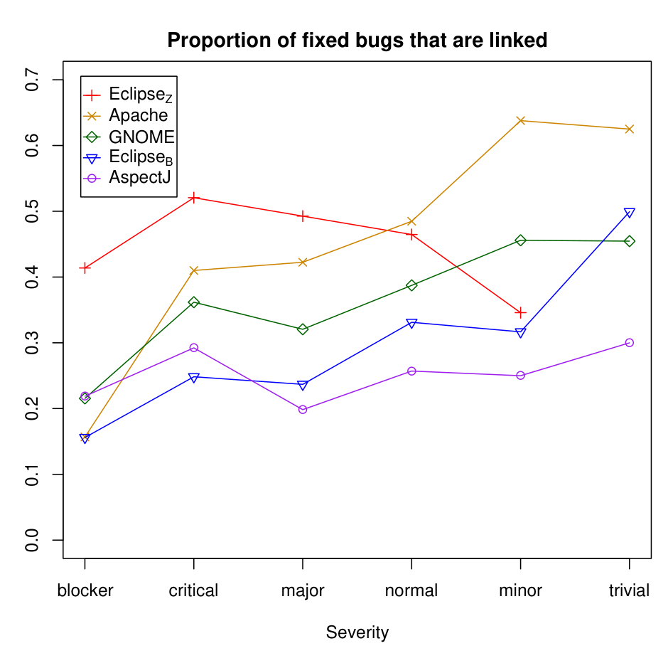

| Metric | Eclipse_Z | Eclipse_B | Apache | Netbeans | OpenOffice | Gnome | AspectJ |
|---|---:|---:|---:|---:|---:|---:|---:|
| 1 Total fixed bugs | 24119 | 113877 | 1383 | 68299 | 33924 | 117021 | 1121 |
| 2 Linked fixed bugs | 10017 | 34914 | 686 | 37498 | 2754 | 45527 | 343 |
| 3 Severity χ^2 | p < .01 | p < .01 | p < .01 | N/A | N/A | p < .01 | p = .99† |
| 4 median Exp.* for all | 279 | 188 | 26 | 227 | 149 | 179 | 114 |
| 5 median Exp. for linked | 314 | 457 | 31 | 277 | 219 | 218 | 89 |
| 6 Experience KS | p < .01 | p < .01 | p = .08 | p < .01 | p < .01 | p < .01 | p = .98 |
| 7 Verified π̂ for all | .336 | .317 | .006 | .631 | .650 | .016 | .012 |
| 8 Verified π̂ for linked | .470 | .492 | .006 | .694 | .881 | .013 | .006 |
| 9 Verified χ^2 | p < .01 | p < .01 | p = .99 | p < .01 | p < .01 | p = .99 | p = .99† |

Table 1: Data and results for each of the projects. P-values have been adjusted for lower significance (thus higher p-values), using Benjamini-Hochberg adjustment for multiple hypothesis testing, including the hypotheses that weren’t supported. †A Fisher’s exact test was used for AspectJ due to small sample size. *Experience is measured as number of previously fixed bugs. Also note that Eclipse_B actually has higher recall than Eclipse_Z for a comparable period (details at end of § 4).

Proportion of fixed bugs that are linked

Figure 2 shows the proportion of fixed bugs that can be linked to specific commits broken down by severity level. In the Apache project, 63% of the fixed minor bugs are linked, but only 15% of the fixed blocker bugs are linked. If one were to do hypothesis testing or train a prediction model on the linked fixed bugs, the minor and trivial bugs would be overrepresented. We seek to test if:

p(severity | B_fl) = p(severity | B_f) (3)

Note that severity is a categorical (and in some ways ordinal) value. It is clear in this case that there is a difference in the proportion of linked bugs by category. For a statistical test of the above equation, we use Pearson’s χ^2 test [15], to quantitatively evaluate if the distribution of severity levels in B_fl is representative of B_f. With 5 severity levels, we observed data yields a χ^2 statistic value of 94 for Apache (with 5 degrees of freedom), and vanishingly low p-values, in the case of Apache, Eclipse_Z, Gnome, and Eclipse_B (row 3 in Table 1). This indicates that it is extremely unlikely that we would observe this distribution of severity levels, if the bugs in B_f and B_fl were drawn from the same distribution.

We were unable to perform this study on the OpenOffice and Netbeans data sets because their bug tracking systems do not include a severity field on all bugs. For AspectJ, we used a Fisher’s exact test (rather than a Pearson χ^2 test) since the expected number for some of the severities in the linked bugs is small [15]. Surprisingly, in each of the cases except for AspectJ, and Eclipse_Z, we observed a similar trend: the proportion of fixed bugs that were linked decreased as the severity increased. Interestingly, the trend is prevalent in every dataset for which the more accurate method, which we believe captures virtually all the intended links, has been used.

Hence, Hypothesis 5.1 is supported for all projects for which we have severity data except for AspectJ.

Our data also indicates that B_fl is biased towards less severe bug categories. A defect prediction technique that uses B_f as an oracle will actually be trained with a higher weight on less severe bugs. If there is a relationship between the features used in the model and the severity in the bug (e.g., if most bugs in the GUI are considered minor), then the prediction model will be biased with respect to B_f and will not perform as well on more severe bugs. This is likely the exact opposite of what users of the model would like. Likewise, testing hypotheses concerning mechanisms of bug introduction, on this open-source data, might lead to conclusions more applicable to the less important bugs.

Figure 2: Proportion of fixed bugs that are linked, by severity level. In all the projects where the manually verified data was used (all except AspectJ and Eclipse_Z) linkage trends upward with decreasing severity.

> linkage trends upward with decreasing severity.  
> Bug Fixer Feature: Experience We theorize that more experienced project members are more likely to explicitly link bug fixes to their corresponding commits. The intuition behind this hypothesis is that project members gain process discipline with experience, and that those who do not, over time, are replaced by those who do!
> 
> ### Hypothesis 5.2.
> Bugs in B_fl are fixed by more experienced people than those who fix bugs in B_f.
> 
> Here, we use the experience of the person who marked the bug record as fixed. We define experience of a person at time t as the number of bug records that person has marked as fixed prior to t. Using this measure we record the experience of the person marking the bug as fixed at the fixing time. In this case we will test if:
> 
> p(experience | B_fl) = p(experience | B_f) (4)
> 
> Experience in this context is a continuous variable. We use here a Kolmogorov-Smirnov test [12], a non-parametric, two-sample test indicating if the samples are drawn from the same continuous distribution. Since our hypothesis is