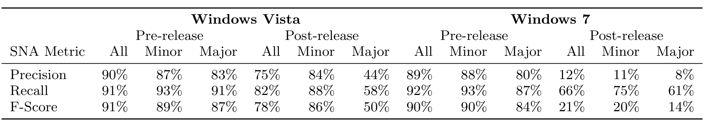

Table 4: Performance of network based failure predictors for pre- and post-release failures for Vista and Windows 7

failures for Windows 7. Part of this may be attributable to a moderate relationship between the Minor and Ownership, but although Ownership was significant in all models, when removing Minor, the effect was smaller. Nonetheless, in all cases, higher values for Ownership were associated with lower numbers of failures. We therefore conclude that hypothesis 2 is supported in the case of Windows Vista and in pre-release data for Windows 7.

The results of empirical software engineering studies do not always generalize to settings where a different process is used. The process that is used may dictate the effect of other factors on software quality as well. Therefore, when determining the applicability of a research result to a software project, the context of the study must be taken into account. Microsoft employs strong ownership practices and our results are much more likely to hold in other industrial settings where similar policies are in place. Examining the effect of ownership in contexts where ownership is not stressed as highly, such as in many open source software (OSS) projects, is an area of continued study as we attempt to understand the interaction between ownership, quality, and varying software processes.

For contexts in which strong ownership is practiced or where empirical studies are consistent with our own findings, we make the following recommendations regarding the development process based on our findings:

1. Changes made by minor contributors should be reviewed with more scrutiny. Changes made by minor contributors should be exposed to greater scrutiny than changes made by developers who are experienced with the source for a particular binary. When possible, major contributors should perform these code inspections. If a major contributor cannot perform all inspections, he or she should focus on inspecting changes by minor contributors.

2. Potential minor contributors should communicate desired changes to developers experienced with the respective binary. Often minor contributors to one binary are major contributors to a depending binary. Rather than making a desired change directly, these developers should contact a major contributor and communicate the desired change so that it can be made by someone who has higher levels of expertise.

3. Components with low ownership should be given priority by QA resources. Metrics such as Minor and Ownership should be used in conjunction with source code based metrics to identify those binaries with a high potential for having many post-release failures. When faced with limited resources for quality-control efforts, these binaries should have priority.

It may not always be possible to follow these recommendations (for instance, in cases where too many potential contributors need changes to a component for one developer to handle); however, they should be followed as much as possible within reason. These recommendations are currently being evaluated at Microsoft. We plan to investigate the relationship of the ownership measures used in this paper with software quality in other projects at Microsoft that differ in size and process domain (e.g., projects utilizing agile). Further, we plan to observe the results of projects that follow these recommendations.

## 9. CONCLUSION

We have examined the relationship between ownership and software quality in two large software development projects. We found that high levels of ownership, specifically operationalized as high values of Ownership and Major, and low values of Minor, are associated with fewer defects.

An investigation into the effects of minor and major contributions on network based defect prediction found that removing minor contribution edges severely impaired predictive power. We also found that when a component has a minor contributor, the same developer is a major contributor to a dependent component approximately half of the time, uncovering at least one significant reason for high levels of minor contributions. Changes to policies regarding tasks that would lead to this behavior, such as defect resolution and feature implementation, should be implemented and evaluated.

For organizations where ownership has a strong relationship with defects, we have presented recommendations which are currently being evaluated at Microsoft. As our measures of ownership are cheap and lightweight, we encourage other researchers and practitioners to perform and report their findings of similar analyses so that we can build a body of knowledge regarding ownership and quality in various domains and contexts.

## 10. REFERENCES

[1] R. Banker, G. Davis, and S. Slaughter. Software development practices, software complexity, and software maintenance performance: A field study. Management Science, 44(4):433–450, 1998.

[2] V. Basili and G. Caldiera. Improve Software Quality by Reusing Knowledge and Experience. Sloan Management Review, 37:55–55, 1995.

[3] V. Basili, G. Caldiera, and H. Rombach. The Goal Question Metric Approach. Encyclopedia of Software Engineering, 1:528–532, 1994.

[4] K. Beck and C. Andres. Extreme Programming