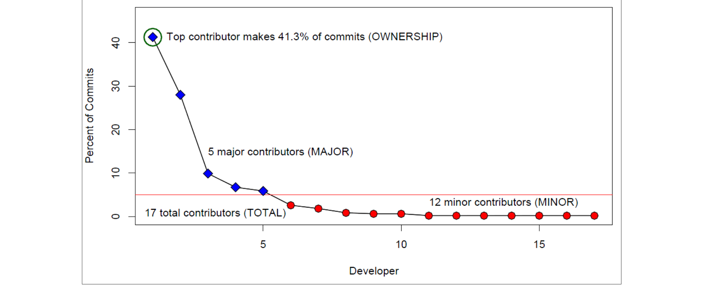

Figure 1: Graph of the proportion of commits to abocomp.dll by developers during the Vista development cycle, showing the four measures of ownership used in this paper.

Ownership is determined by how many low-expertise developers are working on a component. If many developers are all making few changes to a component, then there are many non-experts working on the component and we label the component as having low ownership.

> We expect that having one clear “owner” for a component will lead to fewer failures and that when many non-experts are making changes, indicating that ownership is spread across many contributors, the component will have more failures.

### 3. TERMINOLOGY AND METRICS

We adopt Basili’s goal question metric approach [3] to frame our study of ownership. Our goal is to understand the relationship between ownership and software quality. We also hope to gain an understanding of how this relationship varies with the development process in use. Achievement of this goal can lead to more informed development decisions or possibly process policy changes resulting in software with fewer defects.

In order to reach this goal, we ask a number of specific questions:
1. Are higher levels of ownership associated with fewer defects?
2. Is there a negative effect when a software entity is developed by many people with low ownership?
3. Are these effects related to the development process used?

In order to answer these questions, we propose a number of ownership metrics and use them to evaluate our hypotheses of ownership. We begin by defining some important terms and metrics used throughout the rest of this paper:

- Software Component – This is a unit of development that has some core functionality. Defects can be traced back to a specific component and software changes from developers can also be traced to a component. In Windows, a component is a compiled binary.

- Contributor – A contributor to a software component is someone who has made commits/software changes to the component.

- Proportion of Ownership – The proportion of ownership (or simply ownership) of a contributor for a particular component is the ratio of number of commits that the contributor has made relative to the total number of commits for that component. Thus, if Cindy has made 20 commits to ie9.dll and there are a total of 100 commits to ie9.dll then Cindy has an ownership of 20%.

- Minor Contributor – A developer who has made changes to a component, but whose ownership is below 5% is considered a minor contributor to that component. This threshold was chosen based on examination of distributions of ownership. We refer to a commit from a minor contributor as a minor contribution.

- Major Contributor – A developer who has made changes to a component and whose ownership is at or above 5% is a major contributor to the component and a commit from such a developer is a major contribution.

Note that we examine the number of changes to a component made by a developer rather than the actual number of lines modified. Within Windows, each change corresponds to one fix or enhancement and individual changes are quite small, usually on the order of tens of lines. We use number of changes because each change represents an “exposure” of the developer to the code and because the previous measure

1 A sensitivity analysis with threshold values ranging from 2% to 10% yielded similar results.