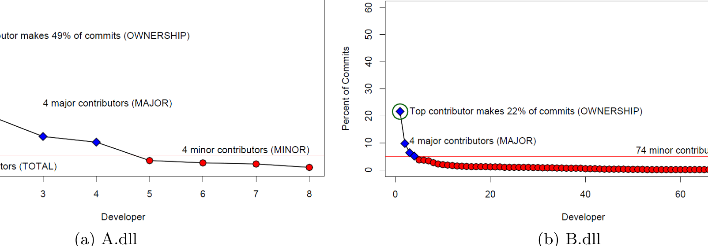

Ownership of A.dll by Developers

Ownership of B.dll by Developers

(a) A.dll

(b) B.dll

Figure 2: Ownership graphs for two binaries in Windows

of experience used by Mockus and Weiss also used the number of changes. However, prior literature [14] has shown high correlation (above 0.9) between number of changes and number of lines contributed and we have found similar results in Windows, indicating that our results would not change significantly. With these terms defined, we now introduce our metrics.

- Minor – number of minor contributors
- Major – number of major contributors
- Total – total number of contributors
- Ownership – proportion of ownership for the contributor with the highest proportion of ownership

Figure 1 shows the proportion of commits for each of the developers that contributed to abocomp.dll in Windows, in decreasing order. This library had a total of 918 commits made during the development cycle. The top contributing engineer made 379 commits, roughly 41%. Five engineers made at least 5% of the commits (at least 46 commits). Twelve engineers made less than 5% of the commits (less than 46 commits). Finally, there were a total of seventeen engineers that made commits to the binary. Thus, our metrics for abocomp.dll are:

| Metric | Value |
|---|---:|
| Minor | 12 |
| Major | 5 |
| Total | 17 |
| Ownership | 0.41 |

## 4. HYPOTHESES

We begin with the observation that a developer with lower expertise is more likely to introduce bugs into the code. A developer who has made a small proportion of the commits to a binary likely has less expertise and is more likely to make an error. We expect that as the number of developers working on a component increases, the component may become “fragmented” and the difficulty of vetting and coordinating all these minor contributions becomes an obstacle to good quality. Thus if Minor is high, quality suffers.

### Hypothesis 1 - Software components with many minor contributors will have more failures than software components that have fewer.

We also look at the proportion of ownership for the highest contributing developer for each component (Ownership). If Ownership is high, that indicates that there is one developer who “owns” the component and has a high level of expertise. This person can also act as a single point of contact for others who need to use the component, need changes to it, or just have questions about it. We theorize that when such a person exists, the software quality is higher resulting in fewer failures.

### Hypothesis 2 - Software components with a high level of ownership will have fewer failures than components with lower top ownership levels.

If the number of minor contributors negatively affects software quality, the next question to ask is, “Why do some binaries have so many minor contributors?” We have observed both at Microsoft and also within OSS projects such as Python and Postgres, that during the process of maintenance, feature addition, or bug fixing, owners of one component often need to modify other components that the first relies on or is relied upon by. As a simple example, a developer tasked with fixing media playback in Internet Explorer may need to make changes to the media playback interface library even though the developer is not the designated owner and has limited experience with this component. This leads to our hypothesis.

### Hypothesis 3 - Minor contributors to components will be Major contributors to other components that are related through dependency relationships

Finally, if low-expertise contributions do have a large impact on software quality, then we expect that defect prediction techniques will be affected by their inclusion or removal. We therefore replicate prior defect prediction techniques and compare results when using all data, data derived only from changes by minor contributors, and data derived only from changes to major contributors. We expect that when data from minor contributors is removed, the quality of the defect prediction will suffer.