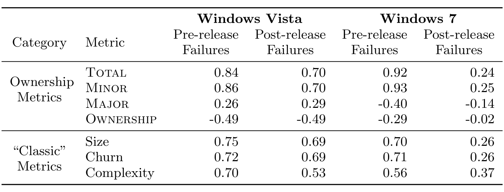

Table 1: Bivariate Spearman correlation of ownership and code metrics with pre- and post-release failures in Windows Vista and Windows 7. All correlations are statistically significant except for that of ownership and post-release failures in Windows 7.

> Hypothesis 4 - Removal of minor contribution information from defect prediction techniques will decrease performance dramatically.

## 5. DATA COLLECTION AND ANALYSIS

This data presents an opportunity to investigate hypotheses regarding code ownership. In this study, we examine Windows Vista and Windows 7.

Windows Vista and Windows 7 were developed entirely by Microsoft, who have processes and policies that favor strong code ownership. They were developed by 2,000+ software developers and are composed of thousands of individual executable files (.exe), shared libraries (.dll), and drivers (.sys), which we collectively refer to as binaries. We track the development history from the release of Windows Server 2003 to the release of Windows 7 and include pre-release defects as well as post-release failures in Vista and 7 as software quality indicators.

We require several types of data. The most important data are the commit histories and software failures. Software repositories record the contents of every change made to a piece of software, along with the change author, the time of change, and an associated log message that may be indicative of the type of change (e.g., introducing a feature, or fixing a bug). We collected the number of changes made by each developer to each source file and used a mapping of source files to binaries in order to determine the number of changes made by each developer to each binary. Although the source code management system uses branches heavily, we only recorded changes from developers that were edits to the source code. Branching operations (e.g., branching and merging) were not counted as changes.

We also gathered both pre-release and post-release software failures for all three projects. We gathered the failures recorded prior to release and in the first six months after release. Because of the information contained in the failures, we can automatically trace them back to the binaries that caused them, but cannot reliably trace them to the source files that caused the failures. We only count failures that the development team deemed important enough to fix.

Finally, we gathered source code metrics including various size, complexity, and churn metrics. This information is gathered from both the source code repositories and the build process.

### 5.1 Analysis Techniques

We use a number of methods to examine the relationship between ownership and software quality.

We began with a correlation analysis of both pre- and post-release failures with each of the ownership metrics as well as a number of other metrics such as test coverage, complexity, size, dependencies, and churn (shown in Table 1). The results indicated that pre- and post-release defects had strong relationships with Minor, Total, and Ownership. In fact, Minor had a higher correlation with both pre- and post-release defects in Vista and pre-release defects in Windows 7 than any other metric that Microsoft collects.

Post-release failures for Windows 7 present a difficulty for analysis as at the time of this analysis many binaries had no post-release failures reported. Thus the correlation values between metrics and post-release failures are noticeably lower than the other failure categories (although all except the correlation with Ownership are still statistically significant).

However, we also observed some relationship between code attributes and ownership metrics. For example, Figure 2 shows data for two anonymized binaries in Windows with vastly different ownership profiles. Unsurprisingly, the binary depicted in Figure 2-b (B.dll) has more failures than the binary in Figure 2-a (A.dll), eight times as many pre-release failures and twice as many post-release failures. However, B.dll is also a larger binary and experienced far more churn during the development cycle. Thus it is not clear whether the increase in failures is attributable to more minor contributors or other measures such as size, complexity, and churn, which are known to be related to defects [25, 28] and are likely related to the number of minor contributors. Prior research has shown that when characteristics such as size are not considered, they may affect the validity of other software metrics [13].

To overcome this problem, we used multiple linear regression. Linear regression is primarily used in two different ways. First, it can be used to make predictions about an outcome based on prior data (for instance predicting how many failures a software component may have based on characteristics of the components). We stress that while our regression analysis does use failures as the dependent variable in our models, the purpose of this paper is not to predict failures.

Second, linear regression enables us to examine the effect