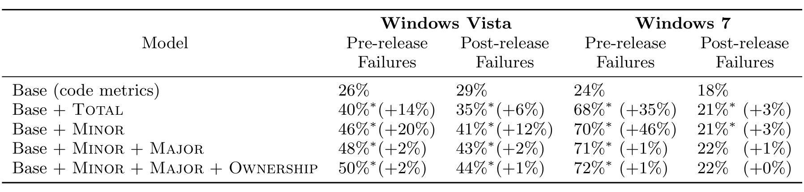

Table 2: Variance in failures for the base model which includes standard metrics of complexity, size, and churn, as well as the models with Minor and Ownership added. An asterisk * denotes that a model showed statistically significant improvement when the additional variable was added.

of one or more variables on an outcome when controlling for other variables. We use it for this purpose in an effort to examine the relationship of our ownership measures when controlling for source code characteristics such as size, complexity, and churn.

A linear regression model for failures indicates which variables have an effect on failures, how large the effect is, in what direction (i.e., if failures go up when a metric goes up or when it goes down), and how much of the variance in the number of failures is explained by the metrics. We compare the amount of variance in failures explained by a model that includes the ownership metrics to a model that does not include them. There are many measures of churn, complexity, and size. However, to avoid multi-collinearity and over-fitting, we include only one of each measure in the model. We choose the measure which results in the best base model. This gives an indication of how much ownership actually affects software failures. We examined the improvement in amount of variance in failures explained by the metrics (commonly referred to as the adjusted R2) and examine improved goodness of fit using F-tests to determine if the addition of an ownership metric improves the model by a statistically significant degree [12].

Linear regression models can be reliably interpreted if certain assumptions hold. Two key assumptions are that the residuals are normally distributed, and not correlated with any of the independent variables. In our analysis, we found that the distribution of failures was almost always heavily right skewed, which led to a similar skew in the residuals. When we transformed the dependent variable to be the log of the number of failures, the skew diminished, and the residuals fit the normality assumption. This data transformation was applied to all dependent variables except for post-release failures in Vista, where linear regression assumptions were met by the raw data.

## 6. RESULTS

We now present the results of our analysis of Windows Vista and Windows 7. Table 2 illustrates the results of our analysis. We denote with an asterisk *, cases where a goodness-of-fit F-test indicated that the addition of a variable improved the model by a statistically significant degree. The value in parentheses indicates the percent increase in variance explained over the model without the added variable. For example, in Table 2 the Base+Minor+Major model in Vista explains 48% of the variance in pre-release failures, which is 2% more than the Base+Minor model which explains 46%.

Adding an independent variable to a model can never decrease the variance explained, so we use the adjusted R2 measure which penalizes models that have additional variables.

We built five statistical models of failures for pre- and post-release defects in Windows Vista and Windows 7 (summarized in Table 2). The first model contains only the classical source code metrics: size, complexity, and churn. We refer to this as the base model. This model showed that churn, size, and complexity all have a statistically significant effect on both pre- and post-release failures. In addition, these metrics are able to explain 26% of the variance in pre-release failures and 29% of the variance in post-release failures in Vista and 24% and 28% in Windows 7.

In the second model, we added Total to the classic variables. This examines the effect of team size on defects and does not include any measures of the proportion of contributions made by individual members. All models exhibited a statistically significant improvement in variance explained.

Next, we added Minor to the set of predictor variables in the base model. This was done to determine if the total number of developers has a different effect on quality than the number of minor contributors. The statistics showed that Minor is positively related to both pre- and post-release failures to a statistically significant degree. The addition of Minor increased the proportion of variance in pre-release failures to 46% and post-release failures to 41%. The gains shown by Minor were stronger than those shown by Total for both types of failures to a statistically significant degree, in all cases except for post-release failures in Windows 7, indicating that Minor has a larger effect on failures.

The addition of Major and Ownership showed smaller gains, but were often still statistically significant. We found similar results regardless of the order that these variables were added to the models. Ownership was found to have a negative relationship with failures to a statistically significant degree and Major had a positive relationship, but was much smaller than Minor. Minor still showed more of an effect than Ownership and Major even when it was added last (not shown). The final models account for up to 72% of variance in failures. In all cases, ownership had a stronger relationship with pre-release failures than post-release failures and the models in general were less explanatory. This may indicate that there are already measures being taken (e.g., increased testing, more stringent quality controls, etc.).