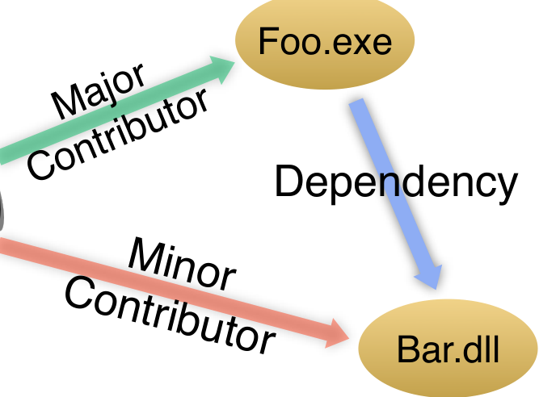

between implementation completion and release to counteract the effects of poor ownership.

For all metrics that measure ownership levels there is a clear trend of having a statistically significant relationship to failures in Windows. In all cases, Major and Ownership show less of an effect than Minor or Total, indicating that the number of higher-expertise contributors has marginal effect on quality, although the results are still statistically significant.

The results of our analysis of ownership in both releases of Windows can be interpreted as follows:

1. The number of minor contributors has a strong positive relationship with both pre- and post-release failures even when controlling for metrics such as size, churn, and complexity.
2. Higher levels of ownership for the top contributor to a component results in fewer failures when controlling Add graph rewiring slide around for the same metrics, but the effect is smaller than the number of minor contributors.
3. Ownership has a stronger relationship with pre-release failures than post-release failures.
4. Measures of ownership and standard code measures show a much smaller relationship to post-release failures in Windows 7.

## 7. EFFECTS OF MINOR CONTRIBUTORS

One of the key findings in our analysis was that the number of minor contributors has a strong relationship with failures in both releases of Windows. Since Microsoft has the capability to make changes to practices based on these findings, we were eager to gain a deeper understanding of this phenomenon. To this end, we performed two more detailed analyses in order to examine the minor contributors further.

First, we observed that almost all developers were major contributors to some binaries and minor contributors to others; very few developers never played a major contributor role. This led us to investigate the obvious question: Given a particular developer, is there a relationship between a component to which she is a major contributor, and one to which she is a minor contributor?

Second, we adapted a fault prediction study carried out by Pinzger et al. [29] and examined the effect of modifying the study in ways related to ownership.

### 7.1 Dependency Analysis

The majority of developers that contributed to Windows acted as major contributors to some binaries and minor contributors to others. There were very few developers who are only minor contributors. This fact is an indication of strong code ownership, as it shows that nearly everyone has a main responsibility for at least one binary.

Discussions with engineers at Microsoft indicated that often an engineer who was the owner of one binary would make changes to another binary whose services he or she used, often in the process of addressing reported bugs. In our context this would show up as one engineer who was a major contributor to some binary, A, and a minor contributor to some binary, B, with a dependency relationship between A and B. We call this a Major-Minor-Dependency relationship, which is illustrated in Figure 3.

### Major-Minor-Dependency Relationship

Figure 3: Illustration of the major-minor-dependency relationship commonly observed in Vista
on top..

Cataldo et al. found that making changes to a depending component without coordinating with the other stakeholders (in our case, the owner) of the component increases the likelihood of faults [9]. We have no record of the communication between developers of Windows. However, the fact that a minor contributor has, by definition, made few if any prior contributions to a component suggests that their participation in the component’s implicit team is likely minimal, increasing the risk of introducing a bug.

But does this actually happen? Is a developer D, working on binary Foo.exe, statistically more likely to be a minor contributor to a binary Bar.dll, just because Foo.exe depends on Bar.dll? If so, how many of the minor contributors to components can this phenomenon account for? If the majority of minor contributors are a result of component owners making changes to depending or dependent components to accomplish their own tasks such as resolving failures, then deliberate steps could be taken to avoid this type of risky behavior.

To investigate this further, we employed a static analysis tool, MaX [33], to detect dependency relationships between binaries. MaX uses debugging information files that are generated during compilation to identify these relationships, which include method calls, reads and writes to the registry, IPC, COM calls, and use of types. We were unable to obtain the required debugging information files for Windows 7 and thus limit our analysis here to Vista. Using this tool, we constructed a dependency graph that includes all of the binaries in Windows Vista.

The next step is to determine whether the major-minor-dependency phenomenon occurs statistically more often than would be expected by chance. But what exactly does “by chance” mean? We model “chance” by generating a large, plausible, random sample of contributions; we can then compare the observed frequency of major-minor-dependency with the frequency in the generated sample. Our plausible random model is that each developer chooses their contributions at random, while preserving their rate of minor and major contributions. In other words, a developer is just as hardworking, but her choice of where to contribute is not influenced by dependencies in the code. Using this model, we generate a large sample of simulated contribution graphs.