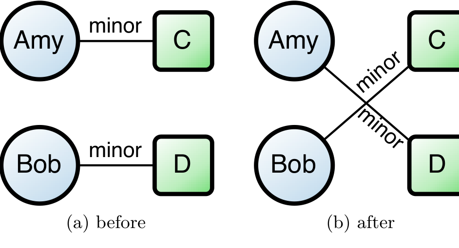

Figure 4: An illustration of graph rewiring. Rewiring preserves the number of minor and major edges per developer and per binary, but randomizes the organization of the contribution network.

This gives us a basis for comparison to evaluate observed, real-world contribution behavior is influenced by dependencies between modules.

This “bootstrapping” approach comes from the statistical theory of random graphs [20, 24, 27]. A phenomenon is judged statistically significant if the actual, observed phenomenon occurs rarely in the generated sample graphs. Following previous techniques [24, 27], we use a graph-rewiring method to bootstrap our random ensemble, based on the observed frequency of commits from individuals. In each generated random sample, each developer makes the same number of major and minor contributions as in the observed real sample, but the contributions are chosen at random from the given set of components. We check to see how often a “majorly contributed component” for a developer has an actual dependency on a “minorly contributed component” for the same developer in these generated random samples. If the frequency of major-minor-dependency relationships that occur in the ensemble of simulated samples differs significantly from that of the observed real sample, then we can conclude that the phenomenon most likely represents some real, intended behavior, and not simply a chance occurrence.

Graph rewiring is performed as follows in our context. For the sake of convenience we refer to an edge connecting a binary to one of its major contributors as a major edge and an edge connecting a binary to one of its minor contributors as a minor edge. Two edges that are either both major edges or both minor edges are selected at random and endpoints of both are switched as shown in Figure 4. Thus, after the switch, the number of major and minor contributions for each developer node and each component node remains the same.

After performing E^2 rewirings where E is the number of contribution edges in the graph, a sufficiently random graph is obtained. We created 10,000 such random contribution graphs and compared the frequency of major-minor-dependency relationships to the frequency in the observed, actual contribution graph. We found that in the observed Vista contribution graph, 52% of the binaries had minor contributors who were major contributors to other binaries that the original had a dependency with. In contrast, this relationship only existed for an average of 24% of the binaries in the random networks with the same minor and major contribution degree distributions. The maximum value for the normally distributed frequency of this phenomenon out of all 10,000 graphs was 32% of the time, indicating that 52% is definitely a statistically significant difference, and the phenomenon that we are observing does not occur by chance.

In Vista, one common reason that a developer is a minor contributor to a binary is that he/she is a major contributor to a depending binary. This allows for processes to be put into place to recognize and either minimize or aid minor contributions.

## 7.2 Effects on Network Metrics

In 2007, Pinzger et al. reported a method to find fault prone binaries in Windows Vista based on contribution networks [29]. A contribution network is composed of binaries and the developers that contributed to those binaries. Thus, a node representing a developer is connected to all binaries the developer has contributed to and a node representing a binary is connected to all developers that contributed to it. Figure 5 shows an example of a contribution network with boxes representing binaries and circles representing developers. Major contribution edges are solid and minor contribution edges are dashed.

The field of social network analysis has developed a number of metrics that measure various attributes of nodes in a network. For instance, the degree of a node is the number of direct connections that it has and can be indicative of how important the node is within the local network. Other metrics measure how much information can flow through a node, the average distance from a node to all other nodes, how much “power” a node exerts over its neighbors, etc. An in-depth discussion of these metrics can be found in Wasserman and Faust [34]. Pinzger et al. found that these measures had a strong relationship with post-release failures in Windows Vista and in a prior study [6] we found that these measures were able to predict failures in Eclipse accurately as well.

Specifically, Pinzger et al. built a predictor for fault prone binaries using this method; it identified 90% of the fault prone binaries in Vista (recall) and 85% of the binaries that it classified as fault prone actually were (precision). This was a dramatic increase over the predictive power of prior methods that used source code metrics.

We adapted that study, and examined the effect of removing minor and major contributor edges. In Figure 5, such minor edges are indicated by the dashed lines. The topological effect of removing minor edges, as shown in Figure 5, is that many pairs of binaries that had short connecting paths through minor contributors are disconnected. Our findings focused on two key aspects of the results. First, we examined the correlation between social network measures and post-release failures in the complete network and the network with minor edges removed. Second, we measured the change in the ability of a predictor to identify fault prone binaries when removing major or minor contribution edges.

Table 3 shows the strength of relationship of six network measures with pre- and post-release failures. These particular metrics are chosen because they had the highest correlation with failures among those collected. Columns labelled with Minor shows the correlations of SNA metrics calculated on networks that contain only minor contribution edges and those labelled with Major shows correlations from networks of major contribution edges. For all metrics except for node