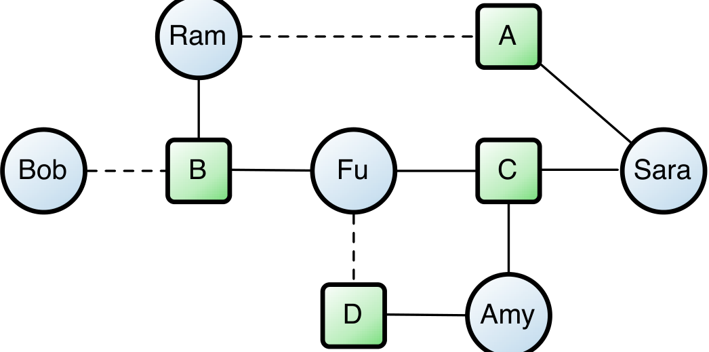

| SNA Metric | Vista Pre-release Minor | Vista Pre-release Major | Vista Post-release Minor | Vista Post-release Major | Windows 7 Pre-release Minor | Windows 7 Pre-release Major | Windows 7 Post-release Minor | Windows 7 Post-release Major |
|---|---:|---:|---:|---:|---:|---:|---:|---:|
| Degree Centrality | 0.861 | 0.909 | 0.668 | 0.599 | 0.931 | 0.797 | 0.269 | 0.319 |
| Closeness Centrality | 0.624 | -0.098 | 0.602 | 0.107 | 0.737 | 0.167 | 0.130 | 0.013 |
| Reachability | 0.647 | -0.091 | 0.618 | 0.119 | 0.747 | 0.176 | 0.135 | 0.018 |
| Betweenness Centrality | 0.703 | 0.146 | 0.601 | 0.132 | 0.748 | 0.285 | 0.289 | 0.154 |
| Hierarchy | 0.420 | -0.273 | 0.176 | -0.244 | 0.298 | -0.302 | 0.136 | -0.055 |
| Effective Size | 0.775 | 0.311 | 0.649 | 0.286 | 0.884 | 0.391 | 0.223 | 0.196 |

Table 3: Correlation of Social Network Analysis metrics on the contribution network with pre- and post-release failures. Columns labeled “Minor” are correlations of failures with metrics computed on networks composed only of minor contribution edges. Columns labeled “Major” are from networks made up of major contribution edges. For the majority of metrics, removing the minor edges drops the correlations considerably. For some metrics, the direction of correlation actually changes for “Major”.

Figure 5: An example contribution network. Boxes represent binaries and circles represent developers who contributed to them. A dashed line between a binary and developer indicates a minor contributor relationship.

degree, the networks that consider major contributions have dramatically lower correlations. In fact, for the case of Hierarchy, the sign of the correlation is negative, indicating that higher value of hierarchy in the major contribution networks were associated with fewer failures. These findings clearly indicate that the edges from minor contributors embody much of the important structure of the contributions graph. So much so that their removal results in a decrease in the discriminatory power of these metrics.

We also built a predictor from these measures for identifying fault prone binaries in Windows Vista and Windows 7 using the same approach as Pinzger et al. [29]. They trained a logistic regression model on a randomly chosen two thirds of the binaries in the contribution network and then evaluated the model based on its results when classifying the remaining third.

This process was repeated fifty times, each with a different random split of the data and the measures of performance, precision, recall, and F-score — standard measures of information retrieval [17] — were averaged across all runs.

Their original model based on the complete network identified 90% of the fault prone binaries and 85% of its fault prone predictions were correct (their evaluation was based on a prior Windows release). When the predictor was trained using the same methods on the network with minor contributors removed, it identified only 58% of the fault prone binaries and around 44% of its fault prone predictions were correct. In Pinzger’s formulation of the prediction approach, random guessing would result in 50% for both measures. Thus a predictor based on network measures for a network containing major contributor only does marginally better than one that chose binaries purely at random. Table 4 shows the performance when a predictor is trained on the complete network as well as the networks with minor contributions removed and major contributions removed.

We also show results for pre-release failures in Vista as well as pre- and post-release failures for Windows 7. In all cases, models built on minor contributions performed better than those based on major contributions to a statistically significant degree. In the case of Vista post-release failures, minor contribution prediction models perform better than models based on the entire network, and models based on the entire network were never statistically better than those based on minor contributions.

We therefore conclude the minor contribution edges provide the “signal” used by defect predictors that are based on the contribution network. Without them, the ability to predict failure prone components is greatly diminished, further supporting our hypothesis that they are strongly related to software quality.

8. DISCUSSION

Our findings are valuable in a number of ways. We have shown that for both versions of Windows, ownership does indeed have a relationship with code quality. This observation is an actionable result, as this is an aspect of software development that can be controlled and monitored to some degree by management decisions on development process and policies. In all projects, the addition of Minor improved the regression models for both pre- and post-release failures to a statistically significant degree. After controlling for known software quality factors, binaries with more minor contributors had more pre- and post-release failures in both versions of Windows. Thus hypothesis 1 is empirically supported in both projects.

The analysis of Ownership is a little bit different. In this case, we saw a small, but still statistically significant effect in pre- and post-release failures for Vista and pre-release