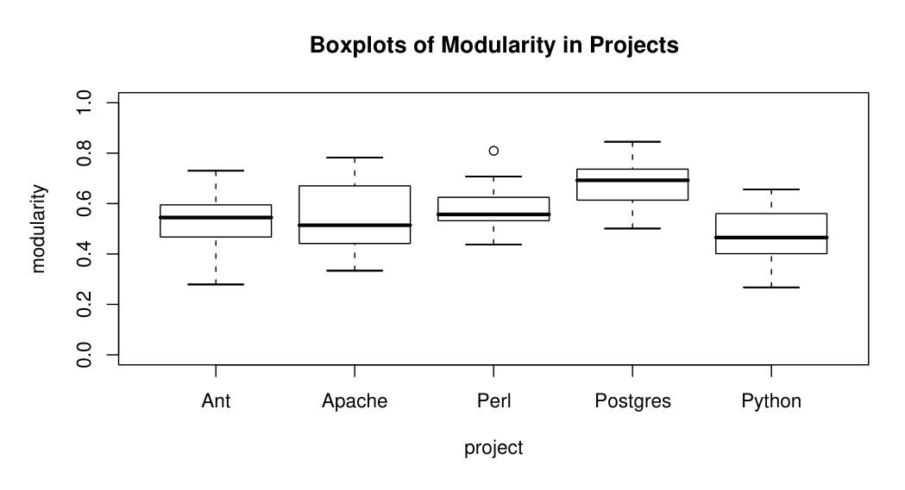
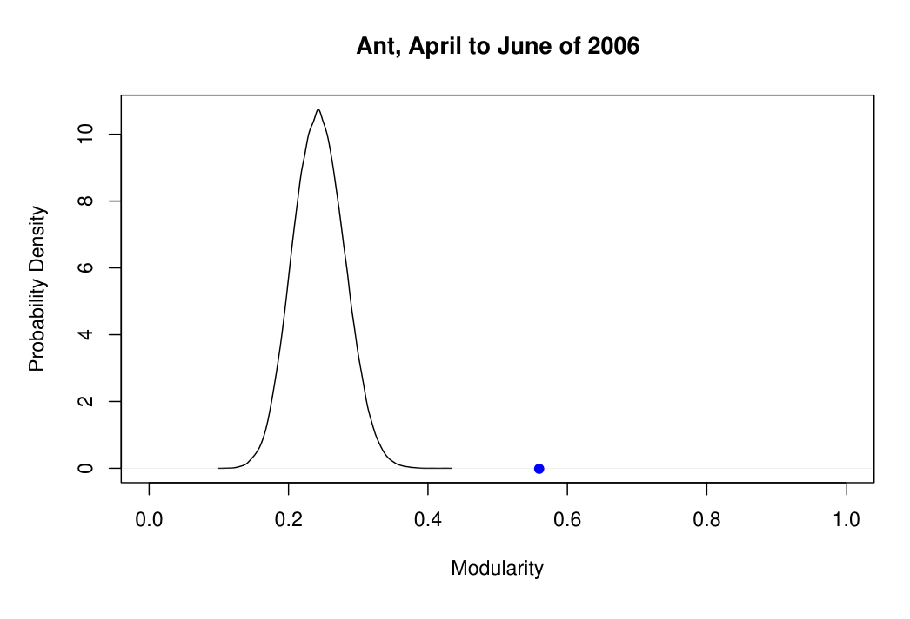
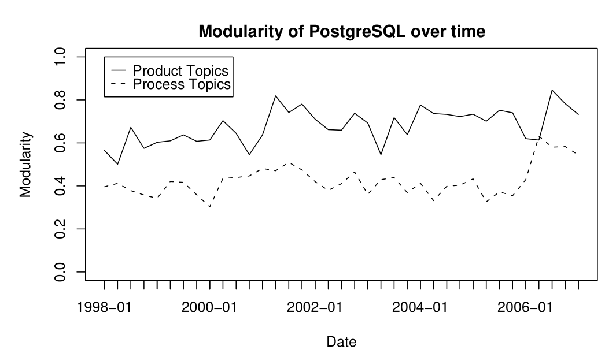
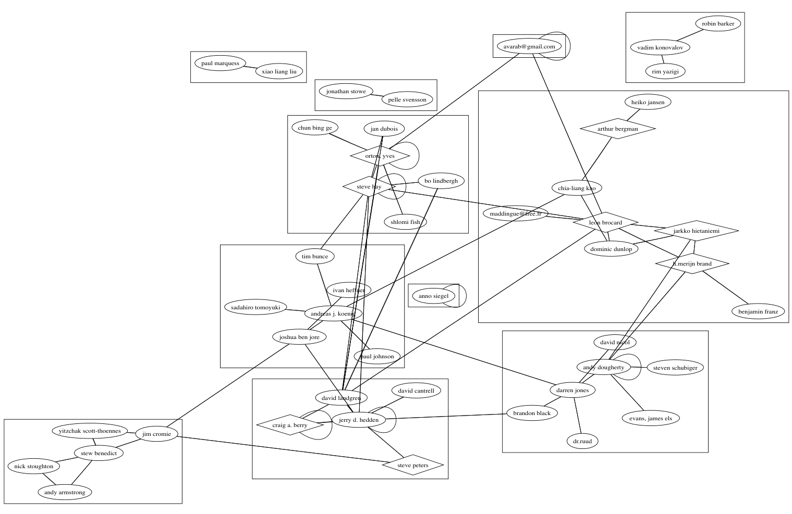
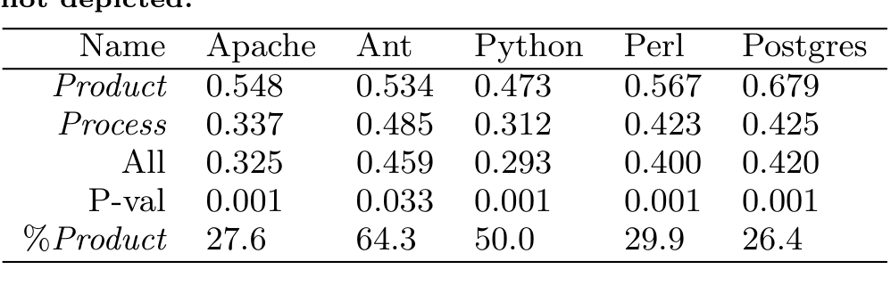
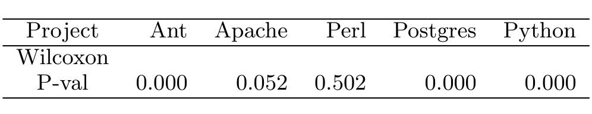

# Latent Social Structure in Open Source Projects

Christian Bird, David Pattison, Raissa D’Souza,  
Vladimir Filkov and Premkumar Devanbu  
Dept. of Computer Science, Kemper Hall,  
University of California, Davis, CA, USA  
cabird,dspattison,rmdsouza,vfilkov,ptdevanbu@ucdavis.edu

## ABSTRACT

Commercial software project managers design project organizational structure carefully, mindful of available skills, division of labour, geographical boundaries, etc. These organizational “cathedrals” are to be contrasted with the “bazaar-like” nature of Open Source Software (OSS) Projects, which have no pre-designed organizational structure. Any structure that exists is dynamic, self-organizing, latent, and usually not explicitly stated. Still, in large, complex, successful, OSS projects, we do expect that subcommunities will form spontaneously within the developer teams. Studying these subcommunities, and their behavior can shed light on how successful OSS projects self-organize. This phenomenon could well hold important lessons for how commercial software teams might be organized. Building on known well-established techniques for detecting community structure in complex networks, we extract and study latent subcommunities from the email social network of several projects: Apache HTTPD, Python, PostgreSQL, Perl, and Apache ANT. We then validate them with software development activity history. Our results show that subcommunities do indeed spontaneously arise within these projects as the projects evolve. These subcommunities manifest most strongly in technical discussions, and are significantly connected with collaboration behaviour.

## 1. INTRODUCTION

Brooks, in his seminal work The Mythical Man-Month [12], noted the scaling issues that arise in large software teams: the number of potential interactions grows quadratically with team size, thus quadrupling when the team size is doubled. Clearly, without organization of some kind, both within the software and the community that develops it, there is a limit to how much projects can be scaled.

In traditional, commercial software projects, the response to the Brooksian critique of large teams is to divide and conquer, by fiat. The system is deliberately divided into smaller components, and the developer pool grouped into manageable teams which are then assigned to those components. With well-defined interfaces, the teams’ efforts are confined to smaller groups, and the coordination needs are moderated. Software design principles such as separation of concerns [53] play a part in this, as does “Conway’s Law” [16], which connects artifact structure with organizational structure.

By contrast, Open Source Software (OSS) projects are not formally organized, and have no pre-assigned command and control structure. No one is forced to work on a particular portion of the project. Team members contribute as they wish in any number of ways: by submitting bug reports, lending technical knowledge, writing documentation, improving the source code in various areas of the code base, etc. It has been observed by Sosa et al. [56] that the fixed organizational structure found in commercial settings may lead to misalignment with evolving complex products. Henderson and Clark point out that it may actually hinder innovation [32]. Thus the lack of a rigid organizational structure may in fact be a boon to OSS projects. However, the absence of any structure at all may be just as harmful. Henderson and Clark [32] found that “architectural knowledge tends to become embedded in the structure and information-processing procedures of established organizations”. Modularizing artifacts and mapping artifact tasks onto organizational units is a well known solution to the problem of complex product development in organizational management literature [56]. The question then arises, is the social structure of OSS projects free of such constraints and actually unorganized and free-for-all? Do they stand in contrast to the structured, hierarchical style of traditional commercial software efforts? Or, do OSS projects have some latent1 structure of their own? Are there dynamic, self-organizing subgroups that spontaneously form and evolve?

### Categories and Subject Descriptors

D.2.9 [Software Engineering]: Management—programming teams; D.2.8 [Software Engineering]: Metrics—process metrics

### General Terms

Human Factors, Measurement, Management

### Keywords

Open Source Software, social networks, collaboration

This work was supported by a grant from the National Science Foundation Grant no. NSF-SoD-0613949 and software donations from SciTools and GrammaTech Corporations.

Permission to make digital or hard copies of all or part of this work for personal or classroom use is granted without fee provided that copies are not made or distributed for profit or commercial advantage and that copies bear this notice and the full citation on the first page. To copy otherwise, to republish, to post on servers or to redistribute to lists, requires prior specific permission and/or a fee. SIGSOFT 2008/FSE 16, November 9–15, Atlanta, Georgia, USA Copyright 2008 ACM 978-1-59593-995-1 ...$5.00.

1 By latent, we mean not explicitly stated, but observable.

---

Figure 1: A network with strong community structure. Modularity, the measure of strength of community structure, which ranges from 0 to 1, has a value of 0.493 for the given division of nodes in this graph.

In this paper, we perform an empirical study of the latent social structure of open-source projects, and discuss just these issues. In the next section, we discuss the background, and present our hypotheses.

## 2. BACKGROUND

Despite the perceived lack of mandated organization, there are OSS projects with large developer pools that produce software of complexity and quality that rivals their commercial counterparts [54, 41]. How do these projects cope with the organizational hurdles that hinder all large engineering efforts?

We have empirically studied the social organization of the community of participants on the developer mailing lists for the Apache Webserver (hereafter referred to as Apache), Apache Ant (referred to as Ant), Python, Perl, and PostgreSQL projects. Each of these projects is mature and stable, has a large and complex code base comprised of multiple subsystems, and has a recorded history of many years. They all also have sizeable teams, ranging in size from 25 developers to nearly 10^2. There are of course much larger numbers of participants on the developer mailing lists [23], sometimes numbering in the thousands. The developer mailing lists are highly task focused; by community norms, all substantive discussions related to the system and development tasks occur on these lists. All correspondence is archived. The source code authorship history is also available from versioned source code repositories. The size and extensively archived history of these projects makes them good candidates for the study of emergent social structure and its relationship to technical activities.

We expect that any latent organizational structure will be mirrored in the communication patterns of participants in these OSS projects. The email discussions span a range of topics. Topics include, certainly the source code (and specific entities such as functions and methods that occur in source code), the build system, documentation, and high-level architecture. But, even in OSS, few, if any developers work on the entire system; most specialize. Consequently, just as development teams are split up and modularized in a software company, we believe that within the entire cohort of developer mailing list participants, there are self-organizing subcommunities that form as people organically tend to focus towards specific topics, subsystems, or tasks.

2 By developer, we refer to contributors that have write access to the source code repository.

We can use archives of the developer mailing lists to determine which individuals were in communication with each other and construct a social network of the participants. But how can organizational structure be discovered in this social network?

In 2002, Newman and Girvan introduced a quantitative notion of the community structure of a network, as “the division of network nodes into groups within which the network connections are dense, but between which they are sparser” [26]. Fig 1 is an example of a network with strong community structure. They quantify the “strength” of the subcommunities in a network with a formal measure that they call modularity, a value which ranges from 0 to 1. Note that while the terms community structure and modularity have been used in prior literature to mean many things, in the context of this paper, their use refers distinctly to these definitions. While the precise mathematical definition of modularity is presented in section 4.3, intuitively it can be thought of as measuring how well a network can be divided into clearly delineated “modules” of nodes. Community structure has been studied in various settings [3, 40, 28, 4, 58] due to advances in methods of identifying these structures [64, 65, 51, 14, 50]. We hypothesize that this kind of structure exists within the development communities of these large OSS projects. Mailing list participants spontaneously form subcommunities, and communicate more intensively with people within subgroups than outside them. This leads us to our first testable hypothesis:

Hypothesis 1 (H1) – Subcommunities of participants will form in the email social networks of large open source projects and the levels of modularity will be statistically significant.

By "statistically significant", we mean that the observed modularity in open-source software is an emergent consequence of the deliberate choice of associates made by participants. In other words, if they had been just as social, but chosen associates at random, it is unlikely that such modularity would have emerged.

While we believe that subcommunities of participants do organically form, such groupings are not meaningful unless the grouping specifically relates somehow to community goals. The discussions on the development mailing lists generally have one of two goals. The common purpose appears to be discussion of actual development activity (function interfaces, APIs, bug fixes, feature implementation, etc.). Other topics include policy decisions, high-level architectural changes, release plans, licensing issues, and admission of newcomers. Broadly (if not entirely accurately) we call the former product topics, and the rest process topics. While the process topics are clearly vital to the success and continued life of the projects, they are less directly related to coding activities than product topics; as such, the division of knowledge issues that arise with large, intricate software systems is not as critical in process topic discussions; barriers to entry are lower. In fact, since everyone is affected by process issues, all should participate. Therefore, the social networks of participants in process discussions should not be fragmented or modularized. This leads to the assertion that the social network fragmentation into subcommunities will be more strongly evident in product-related discussions.

Hypothesis 2 (H2) – Social networks constructed from product-related discussions will be more modular than those relating to non-product related discussions or all discussions.

---

We posit that if there is strong community structure within the projects, the subcommunities should be related to the software engineering activities in a meaningful way. We examine this using two methods.

First, we claim that a portion of the communication that goes on in the mailing lists is actually coordination between developers as they work together on the software directly. We believe that developers within the same subcommunities are more likely to collaborate directly, i.e., work in the same areas of the code. Thus, our third hypothesis is:

Hypothesis 3 (H3) – Pairs of developers within the same subcommunity will have more files in common than pairs of developers from different subcommunities.

Second, we ask whether the subcommunities are somehow allied with coherent tasks. If they form in order to tackle specific hurdles or accomplish common goals, then we expect their discussion and development to be focused in some way. For example, the cumulative engineering effort of the people within a subcommunity may be confined to one part of the system. Our final hypothesis is:

Hypothesis 4 (H4) – The average directory distance between files committed to by developers in the same subcommunity will be less than similar sized groups of developers drawn from different subcommunities.

We present our methods and processes for answering these questions, give the results of our analysis, and discuss these results in this paper. The rest of the paper is organized as follows. In section 3 we discuss other research that has examined the organization of OSS communities and include the differences and similarities to our work. Our data mining and analysis methods are presented in section 4 and include a discussion of the results in section 5. We examine the strengths and weaknesses of our approach in section 6. A synopsis and further areas of study appear in section 7.

### Relevance to software engineers

The questions above do relate to organizational science issues concerning the nature of open-source social structures. But they are also of deep concern to software engineers, for several reasons. First, all the projects we studied are both complex and highly successful. Strong evidence of subcommunity formation in these projects is arguably prescriptive for any new and growing project; open source project leaders might do well to encourage subcommunity formation. Second, strong evidence of subcommunities forming around product-related activities (H2) suggests that newcomers aspiring to gain developer privileges [22, 9] may be aided by finding and connecting with the right community; likewise, H2 may also suggest that the broadest possible participation is good for process-related issues. Finally, H3 and H4 might help inspire recommender systems [55] that find technically relevant people that one should connect with, in a large team. It should be noted that all these also have implications for the organizational and social structure of commercial software projects. Consequently, many software engineering researchers have studied related socio-technical issues [45, 34, 48, 63]. In fact, a recent invited talk at ICSE describes the importance of issues facing socio-technical coordination in a global environment (a key facet of OSS) [33].

## 3. RELATED WORK

Prior work related to this study can be divided into three categories: first, on social networks; second, on the effect of organizational structure on effectiveness; and finally, on discovering community structure in networks. We survey these areas in this section.

### Social Networking

Social networking among developers has been well studied. Xu et al. [62] consider two developers socially related if they participate in the same project, and argue that the resulting network has small-world properties. They don’t consider modularity or non-developer participants. Wagstrom, Herbsleb and Carley [60] gathered empirical social network data from several sources, including blogs, email lists and networking web sites, and built models of their social behavior; these models were then used to simulate how users joined and left projects. They report that simulations closely mirror actual observations. Crowston and Howison [17] use co-occurrence of developers on bug reports as indicators of a social link. They present evidence that the social networks of smaller projects are more central than those of larger projects. Presumably larger projects decentralize, to simplify communication and coordination activities. This observation is one of the key motivators behind this work as we hypothesize that subcommunities form naturally in larger, more complex and longer-lived projects.

Commit behavior in versioned repositories has been used as an indicator of social linkage. Lopez-Fernandez et al. [43] consider two developers to be linked if they collaborate, viz., they commit to the same module. The resulting social networks are similar in structure to ours, and are argued to be small-world networks. The work of De Souza et al. [15] is similar, except that they study files instead of modules. Developers become more “central” in the social network over time. They found that code ownership in some parts of the system was more stable than in others. Finally, we note that these papers study collaboration networks, whereas our focus is more on communication networks. The question naturally arises, How does commit behavior relate to direct (email) social interaction? The relationship between the two is a subject of our current research.

In previous work [7, 8] we examined social networks created from mailing list archives and looked at the differences between developers and non-developers from a social network metrics standpoint. We also examined the correlation between development activity and social network status of developers. In this work our goal is to extract the subcommunity structure from the same social networks and examine how it changes over time.

### Organizational Structure and Effectiveness

Communication and Co-ordination behaviour in distributed teams has been studied. Ehrlich et al. [24] used social network analysis to study how individuals in global software development teams locate and acquire expertise. They found that members of the teams were more likely to seek specific technical information and help from people outside their own team. Members used others on their team to exploit preexisting knowledge, but went to people they knew uniquely outside the team for innovative ideas. Layman et al. [42] studied how a globally distributed team overcomes communication challenges to become agile. They identified four key factors for communication in globally-distributed XP teams. Examples of these factors included assigning a manager to act as a “bridgehead” between distributed teams and using short asynchronous communication loops as a surrogate for synchronous communication.

---

Hossain et al. [38] used the enron email corpus to create social networks and examined degree, closeness, and betweenness centrality scores on a per actor basis. They also used text mining techniques to code email messages into categories such as resource allocation, constraints, and producer relationships. They found that high centrality values correlated well with the ability of an actor to coordinate the actions of others in a project or group.

Hinds and McGrath [36] used questionnaires and follow up interviews to construct social networks in 33 research and development teams that were both collocated and geographically distributed. They measured "coordination ease" based on answers to questions dealing with coordination challenges in the developers' teams. They found that dense networks are no better for distributed than they are for colocated work. In collocated teams, high interdependence eased coordination while the opposite was true for distributed teams. Interestingly, dense communication between members actually may interfere with coordination. In some ways, this corroborates with the communication overhead alluded to in Brooks' law and motivates our search for specialized teams of developers in OSS projects.

An important issue is the relationship of social connections or communities and technical connections or communities. There is a great deal of current interest in socio-technical congruence (STC). The idea is that great alignment between communication patterns and task dependencies (either goal-precondition relationships of tasks, or data/control dependencies between artifacts) leads to better outcomes. Cataldo [13] studies the connection between task dependencies and coordination efforts by engineers. Valetto et al. [59] suggest a formal, general, graph-based technique to measure congruence. We wish to study if subcommunities form within OSS projects, and whether STC appears to be a factor in their formation.

### Identifying Community Structure

A number of researchers have used recently developed methods to find community structure in existing networks. Guimera et al. [30] mined email logs from a company to create a social network and identified the community structure contained in it. They discussed the results as the informal networks behind the formal chart of an organization and its benefit as a management tool.

González-Barahona, López and Robles have examined the community structure of modules within the Apache project [29]. In their analysis, they created a network with the vertices representing modules. Edges between vertices represented work on both modules by a common author and were weighted based on the number of commits the common authors had contributed. They examined the community structure of these networks over time and were able to see how the modules evolved with respect to each other.

Modularity, especially as it results from evolution and bestows benefits to an organism, is very important to the study of biological networks. In the areas of systems biology and bioinformatics authors have used Newman and Girvan’s [37] as well as related [64] and other [65] algorithms to resolve modules in biological networks of different types. Using such algorithms, recent studies [37, 40] have shown that despite having evolved through random processes, biological networks exhibit design patterns, most notably high modularity. And although modular designs are not the most efficient when it comes to performing the day-to-day business in the cell [3], modularity apparently endows the networks, and hence the organisms, with systemic properties like robustness and evolvability [37, 40], which are essential for their long-term survival and fitness optimization [37].

## 4. METHODS AND ANALYSIS

Our experiment involved several steps. We first identified the projects of interest and mined the developer mailing list archives and source code repositories of each of the projects. Next, we filtered the mailing list messages and created a social network of the participants over 3-month intervals. We then calculated the community structure of each social network. Following that, the relevance of the divisions of participants was evaluated quantitatively using mined source code development data and qualitatively by manual methods. The following subsections contain the pertinent details of each phase.

### 4.1 Project Selection

Our study includes the Apache webserver, Ant, Python, Perl, and PostgreSQL. These are all well known and stable projects. Each has undergone a number of major release cycles and is still under active development. Each has a developer mailing list with thousands of participants. All have large and complex codebases with several subsystems, making it difficult for any one person to be an expert on all parts of the system. This leads to a need for "division of labour", which we believe instigates the formation of subcommunities within these projects. In addition, email and source code revision archives, dating back several years, are publicly available. Table 1 shows the date ranges for the data gathered from each project as well as the numbers of messages sent, participants on the mailing list, files in the repository, developers with repository access, and source code repository commits.

We have selected projects that vary in their governance structure. Some of these projects have been described by Berkus [6] as archetypes of very different governance styles. Both Apache projects (the webserver and Ant) are foundations with well-organized, hierarchical governance structure and formalized policies. PostgreSQL is a community, which is more informal and has a consensual group decision making process. Python and Perl are both monarchist with a project leader (Guido Van Rossum in the case of Python and Larry Wall for Perl) at the helm making important informed decisions. With this variety, we hope to ameliorate some of the threats to external validity.

### 4.2 Mining the Raw Data

The public email archives were downloaded and parsed into relational tables. For email, we extracted the date, the body, the name and email address of the sender, the message-id header, and the in-reply-to header. The last two are used to reconstruct threads of conversation. If the message-id of message A appears in the in-reply-to header of message B, then B was sent in response to A which indicates that the sender of B found message A "interesting". This "interest" may be a suggestion, rant, praise, disagreement, etc.; regardless, it is indicative of communication between the two parties. We thus create a link between the sender of A and the sender of B in the social network. Unfortunately, the accuracy of this network is compromised by the practice of email aliasing, whereby one mailing list participant uses several email addresses. To resolve the aliases, and identify and group email aliases, we use a range of techniques, including

---

Table 1: Information on the data gathered for the projects studied.

fuzzy string similarity, domain name matching, clustering, heuristics, and manual post-processing [7].

Once email aliasing is handled we analyze a time-series of the social networks, at 3 month intervals. For further processing, we use an adjacency-matrix representation of the social network at each time interval.

In addition, we also extracted code information: the author, time of commit, the filename, and the contents of each file from the project source code repositories. The email addresses that corresponded to each repository author were also heuristically determined and hand verified in order to match the development activity and communication behavior of project developers. By using this commit information, we can see which developers were collaborating and on which files. Further details of the email and repository mining processes can be found in our prior work [7].

### 4.3 Finding Community Structure

To find and quantify the latent community structure that exists in the OSS networks, we have created a variant of the Newman algorithm [50].

3 We gratefully acknowledge Mark Newman’s help in giving us a source code implementation of his algorithm as a starting point.

The goal is to partition the network into groups of nodes, so the connections within groups are dense and the connections between the groups are sparse. Newman and Girvan defined a measure of modularity, which quantifies community structure strength, using the denseness and sparsity of the groups’ intra- and interconnections [51]. Consider a partition of a network into k communities. Let us define a k × k symmetric matrix e whose element e_ij is the fraction of all edges in the network that link vertices in group i to vertices in group j. Let us also define the row sums a_i = Σ_j e_ij. The modularity measure is then defined by

Q = Σ_i (e_ii − a_i^2) (1)

Essentially, this measures the fraction of the edges in the network that connect vertices within the same group minus the expected value of the same quantity in a network with the same community divisions, but random connections between the vertices (that is, the same division on a random network with the same degree distribution). Values for Q range from 0 (with networks of essentially random structure) to 1 (networks with cliques that are disconnected from each other). Some naturally occurring networks are known to be strongly modular; in such modular networks, Newman’s modularity measure takes on values ranging from 0.3 to 0.7 [51]. The algorithm also has been shown to correctly find modules known a priori. In our case, partitioning the social networks, we want to find the partition that yields the highest modularity for the network. Finding the partition that maximizes the modularity for a given network is an NP-complete problem [?]. Newman & Girvan’s method is approximate, but empirically effective. See [31] and [11] for examples.

Girvan and Newman’s original algorithm works well for binary networks, but doesn’t handle networks with weighted edges. Our social networks contain weighted edges, representing the number of emails exchanged between two participants in each time period. A high number of messages between a pair of participants should increase their likelihood of being in the same group. Following a method for adapting binary network algorithms to work on weighted networks [49], we modified our social networks by introducing one edge between each pair of nodes per email sent between them (i.e., creating a multi-edge network) and modified Newman’s algorithm above to handle multi-edge networks.

### 4.4 Validating Community Structure

We need to determine if the levels of community structure in the social networks of the studied projects are significantly higher than what we would expect to see in a bazaar-like scenario. To do this, we borrow methods from random graph theory [47, 52]. A standard method of determining the significance of measures of observed graphs is by comparing them with measures on random graphs with the same degree distribution as the observed graph. We want to see if people associate into subcommunities in a statistically significant way. Therefore we randomize networks by assuming that people in the network remain equally active, i.e., send just as many messages, but send them to a randomly chosen group of people, rather than deliberatively choosing correspondents. This models a scenario where people talk to others based on random encounters, rather than on work-related needs.

We generated a large number4 of random graphs with the same degree distribution as the observed networks using a rewiring approach [21, 44, 27]. This technique works by starting with the observed graph. Pairs of edges are selected randomly and their endpoints are switched or “rewired” so that a pair of edges (a, b) and (c, d) is replaced with (a, d) and (c, b). It is plain to see that at each step, the degree of each node is preserved. This method has been used to study topological characteristics of various large complex networks to determine if they are significant [?]. For reasons explained in section 4.5.1, as with the observed networks, we removed the three highest betweenness nodes to make the comparisons fair. The modularity of these graphs with the same degree distribution is compared with that of the observed graph to produce a statistical significance level.

4 roughly 30,000 per observed network

---

## 4.5 Filtering Messages

As we applied the community structure identification techniques described above to the OSS projects, we manually examined the activities of the various subcommunity members to see if the identified partitions were meaningful. Two key observations arose from these manual inspections which led us to refine our process.

### 4.5.1 Removing the Managers

First, although it is very hard to have an intimate knowledge of all parts of a complex system, there do appear to be a very small number of people in each project that actually do have at least a working knowledge of nearly all of its parts. These people are usually project leaders, founders, or early members. They are noteworthy for the quantity, quality, and broad spectrum of commits to the repositories, and extensive, wide-ranging discussions on the mailing lists. Examples of these people include Tim Peters and Guido Van Rossum in Python, Bruce Momjian and Tom Lane in Postgres, and William Rowe and Jeff Trawick in Apache. Most of these contributors have been members of the project for a very long time, have high social status within the project, are within the “inner circle” of elite developers, and often comment in nearly every mailing list thread.

Such people act as “boundary spanners” and “gatekeepers” for information flow and expertise within the community: essentially they bridge different groups and promote information flow between otherwise relatively isolated groups. Interestingly, similar roles are fulfilled by key people in traditional software development contexts as well. Their importance in various organizational settings has been previously noted [18, 2]. Those who fill these roles are important to the success of research and development teams [57]. Just as managers tend to serve as a focal point for inter-group coordination and communication, these OSS leaders coordinate the activities of the OSS developers. Since these people fulfill the role of “linking” and mediating teams, we therefore remove them in order to expose the organizational substructures that they would otherwise bridge, and thus obscure.

In previous work, ourselves and others have found that betweenness centrality [61] is indicative of high levels of social status, power, and managerial roles in both open source [7] and commercial [1, 39] contexts.

We use this form of link analysis to determining these people with high social status and source code contribution and manually examining their activities. From a hand examination of the activities of participants, we found that on average about two to three people appear to fulfill these roles. We never remove more than three of these participants per project.

### 4.5.2 Product and Process Messages

We automatically classify each message as either product and process based on a simple static analysis of the source code for the project. We mine the source code repository for names of files, packages, classes, functions using the static analysis tool, Understand, from Scitools. We then remove names that are dictionary words (such as console, string, or connect) and common project terms (such as http or ant) from this set. Messages that include these source code names are classified as product and the rest are classified as process. This is not a perfect automatic classification method; some messages could be classified as falling into both categories, some neither, and different people may even differ in their classification of messages. Manual random sampling of the classification of messages showed an accuracy of above 90%.

We examine the modularity of the social networks constructed from product messages, process messages, and all messages to confirm or refute hypothesis 2. Since we expect the product based networks to have stronger community structure, we use a one-tail paired Wilcoxon test (a nonparametric test also known as a Mann-Whitney test) with matched pairs of process and product networks for each month to assess the difference in modularity.

## 4.6 Communication and Collaboration

Hypothesis 3 proposes that the developers from the same email subcommunity will be more likely to collaborate than developers from different subcommunities. We answer this question by examining the average level of collaboration between developers within and between subcommunities in the following quantitative manner.

Let D represent the set of developers that are active in a given time period for a project. Let s(x) represent the subcommunity of developer x and let f(x) represent the set of files modified by developer x for the same time period. Now define two populations P_same and P_diff in the following way.

For every pair of developers, x, y ∈ D, if s(x) = s(y), add |f(x) ∩ f(y)| to P_same, and if s(x) ≠ s(y) add |f(x) ∩ f(y)| to P_diff. P_same represents collaboration between developers in the same subcommunity and P_diff represents collaboration between different subcommunities. Since the majority of pairs of developers don’t work on any files together, neither of these populations are normally distributed, making a t-test inappropriate [10, 19]. We therefore use a two-sample Wilcoxon test to test the difference in means between the populations. If developers in the same subcommunity are more likely to collaborate on files together, the mean of P_same will be higher than P_diff to a statistically significant degree, validating hypothesis 3.

## 4.7 Task focus in Subcommunities

Hypothesis 4 proposes that developers within the same subcommunity will be more likely to work within specific areas or subsystems within the code base. In order to quantify this “scope of activity”, we examine the average directory tree distance between all pairs of files that are committed to by developers within each subcommunity (weighted by the number of commits). Smaller distances between pairs of files for a given group of developers indicates smaller scope and more focus. This methodology is based on the common (albeit not universal) practice of basing the directory structure on the architecture of the system. An examination of the layout of files in each of the projects indicates that this is true. The null hypothesis is that the weighted average distance between all pairs of files committed to by developers in the same group will be no different than for randomly drawn sets of developers that are the same size as the group. We expect that the directory tree distance between committed files will be smaller for developers from the same subcommunity. We compare the observed average distances between all pairs of files committed to by developers in one subcommunity to a large number of randomly chosen same-sized sets of developers.

We also manually inspected the communication and development activities of subcommunities of participants in order to assess if there were cohesive or focused tasks being addressed.

---

## 5. RESULTS

We now present our findings after performing the above data gathering and analysis in order to confirm or refute our hypotheses regarding the social structure of these open source projects.

### 5.1 Community Structure Exists

We found strong levels of community structure in all of the projects studied. The value of the modularity measure Q, as defined in 4.3, ranges from 0.4 to 0.8. The range of values for different projects, over the studied period, is shown in Figure 2. To concretize this scalar value, we show in Figure 3 an example of a network with a community structure value of 0.76 that is taken from the Perl project for the months of April to June of 2007. This example was chosen because of its relatively small size in relation to the other time periods and projects studied. In Figure 3, an edge represents one or more messages between participants; edge weights, albeit used by the algorithm, are not depicted graphically. Several distinct subcommunities can be seen; typically the edges within subcommunities represent frequent communications. Newman has found that in naturally occurring networks, modularity values of 0.3 and above indicate strong community structure [51]. As can be seen in Figure 5 we found values in this range both before and after filtering messages.

Figure 2: Boxplots of the strength of community structure for the various projects studied.

> Significance of Observed Modularity: The question arises, are these values of modularity statistically significant? Do the empirically observed modularity values reflect something special and real about how people associate and communicate on the observed email social networks, or are they just values that would arise in any random network where the same people were equally active, but had different associations? If the latter is true, that would suggest that who people talk to doesn’t matter, only how much they talk. Our claim, however, is that subcommunities form because people deliberately choose who they communicate with.
>
> A comparison of modularity values of the random networks with the same degree distributions with those from the actual networks can reject the null hypothesis at far below the .001 level. An example of a modularity distribution for Ant from April to June of 2006 is shown in Figure 4. The point on the right indicates the observed network.
>
> 5Graphs of the networks for each time period of each project can be viewed at http://janus.cs.ucdavis.edu/~cabird/cs-graphs.

Figure 4: The distribution of modularity values for 100,000 random graphs with the same degree distribution as the observed network. The point represents the actual observed value.

Figure 5: The difference in strength of community structure in the PostgreSQL project over time when filtering on messages that include product-related terms.

and the curve shown is the distribution of modularity values obtained from random networks with the same degree distribution. Therefore we reject the null hypothesis that the observed modularity values would occur in a bazaar-like social network where individuals were just as socially active as in the observed network. Therefore we conclude that Hypothesis 1 is confirmed.

### 5.2 Effect of Product and Process Topics

While we identified strong community structure in the social networks prior to the filtering steps, more clearly delineated subcommunities emerge when constraining the communication that we use in our analysis to messages directly mentioning product topics, viz., emails that specifically name actual code artifacts.

As an example, figure 5 shows the modularity found in the PostgreSQL project over time when using the process messages on the developer mailing list and when using the product messages (i.e., those that mention source code artifacts directly).

Table 2 shows the average increase in modularity when we include only the product topic emails. We examined the

---

Figure 3: The community structure of Perl from April to June 2007. Diamonds indicate actual developers. Edge weights are not depicted.

Table 2: Means of the modularity when examining only product emails, only process emails, or all emails. P-val represents the statistical significance of a paired Wilcoxon test of product and process populations per project. The bottom row is the proportion of messages (as a %) that relate to product topics.

differences between the filtered and unfiltered values using one-tailed paired Wilcoxon tests.

To assess the statistical significance of the results, since we are testing multiple hypotheses (5 in this case), the individual p-values during testing were adjusted using Benjamini-Hochberg adjustment for multiple hypotheses [5]. This procedure maintains an overall false positive rate of below 0.05 (this is known as the False Discovery Rate). The results were statistically significant with p-values below .05 in all cases.

Note that an increase in modularity when filtering the edges in a network is not a foregone conclusion. Rather, we did not see an increase in modularity when examining only the process emails relative to all emails. A comparison of the modularity based on process and product topic emails in addition to the entire network (labelled “All”) is shown in Table 2. This indicates that the groupings into subcommunities is much stronger when discussions directly related to the source code arise. Thus Hypothesis 2 is confirmed. This affirmative answer to H2 suggests that successful projects tend to focus into subcommunities for product-related work, but discuss process-related issues more broadly. As we do not have examples of unsuccessful projects, it is unclear if this phenomenon is a differentiating characteristic of success.

## 5.3 Collaboration Within Subcommunities

We now turn to an examination of the levels of collaboration between developers within and between subcommunities. Specifically we measure the average number of files that developers have in common (i.e. have both committed to in the examined time period).

We found that in four of the five projects (see Table 3) developers worked together on the same file with people in their own subcommunity much more often than people in others on average. We show the p-values for a Wilcoxon test which were adjusted for multiple hypotheses testing. The results are generally statistically quite significant (same subcommunity distribution was significantly higher than the different subcommunity distribution).

Table 3: Probability values for non-parametric tests of difference in means and difference in distributions of co-commits of developers between subcommunities and within subcommunities corrected for multiple hypothesis testing.

Note that in this case, we use the community structure obtained from the product-related networks, since these are product-related work activities.

Unfortunately, in the case of Perl, while we were able to access repository logs, we were unable to obtain the actual repository files and therefore could not run our static analysis tools on them to get names of functions or classes. The key terms for Perl were limited only to the filenames in the repository. Consequently, the division of participants into subcommunities based on product messages may not be as accurate as in the other projects. Therefore, the experiment on Perl was incomplete, and our results are inconclusive.

We conclude that for the Ant, Apache, Postgres and Python projects, since developers have higher collaboration levels with other developers in their own subcommunities.

---

community than with developers outside of their subcommunity, the community structure of the social networks does hold relevance to the actual development effort. Thus Hypothesis 3 is confirmed. This suggests that in successful projects, co-commit behaviour is strongly linked with social interaction.

## 5.4 Activity Focus Within Subcommunities

After performing the directory distance analysis described in section 4.7, we were unable to reject the null hypothesis (no difference in directory distance) for any of the projects. Hypothesis 4 is therefore not quantitatively confirmed.

Although there were cases where the average distance for files from a subcommunity of developers was far smaller than the average for all tests of random sets of developers, the trend was not consistent throughout. There are two possible reasons for this inconclusive result; either the hypothesis is incorrect and the groups did not have a specific task focus, or our directory tree distance measure for “task focus” lacks construct validity and does not adequately capture what we’re trying to measure. In order to shed light on the matter, we mounted a case study to try to understand the topics of discussion and the commit behaviour of developers in subcommunities.

### Case Studies

We carefully studied the emails on developer lists and commits to files in source code repositories. This information represents the actual work that goes on in the projects on a daily basis. We therefore examine this data for the groups of participants identified by the community structure algorithms. Our goal was to determine if there were common tasks, topics, or particular subsystems in the activities of participants in subcommunities. We have identified time periods and subcommunities where these indicators have emerged and discuss examples of these here. We found that the subcommunities can be categorized into three types, which we characterize with examples in the case studies below.

We also examined the development and communication activities of people in the groups identified to see if they were in fact working together on common tasks. Due to the sheer number of groups identified over the life of all five projects, a comprehensive manual inspection was not possible. We therefore studied a few cases where the work of groups seemed strongly focused on one part of the directory structure, and cases where it seemed strongly unfocused. These cases were quite instructive.

#### A subcommunity in Apache

The first category of community is that in which the discussion and development is focused on one area of the codebase. In the Apache webserver project, from May to July of 2003, one subcommunity consisted of Rowe and Thorpe (developers) as well as Deaves, Adkins, and Chandran. They discussed some bug fixes to mod_ssl, the Apache interface to the Secure Sockets Layer (SSL). Topics included issues with incorrect input/output code, module loading, unloading and initialization, and integration of mod_ssl with the server. Nearly all the discussion is about the SSL code, and virtually all of the files modified by people in this group during this time period are in the modules/ssl directory. Clearly, this is a subcommunity within the Apache project that is focused on a particular task. In other cases, groups of participants were not focused on one single topic or task. Often this would occur when one or two developers worked on two or more disparate areas of the code base, thus drawing two communities together. There were also a smaller number of cases where no clear topics were distinguishable from the changes to files or the email messages. Many of these occurred relatively close to release dates.

#### A subcommunity in Python

The second type of subcommunity had a clear focus in both discussion and content of development behaviour, but the locations of the modified files cross-cut the directory structure. From April to June of 2003, the Python developer mailing lists provide an instructive illustration of this phenomenon. The key participants in one identified group of the Python community are Hylton, Cannon, and Fulton. During this time Hylton was diagnosing memory leaks in Zope, an object-oriented web application server written in Python. Using unit tests, Hylton tracked down problems in the garbage collection code. There are several related messages on the mailing list. Fulton, Paul Prescod, and Hylton discuss the use, semantics, and expected behavior of the garbage collection APIs on both the C and Python parts of the code base, with example code of their use posted. The discussion results in several changes in the files relating to garbage collection. Extensive changes are made to /Modules/gcmodule.c and in other areas of the Python interpreter such as function objects in /Objects/funcobject and handling of pickled objects in /Modules/cPickle.c. The tracing and inspection modules of the Python interpreter are also modified to enhance future debugging of the GC code. In addition, while testing this code, a few of the unit tests fail and discussions ensue between Hylton and Cannon, resulting in diagnosis and remediation of bugs in the unit test code per se. Changes were made to urllib2.py, httplib.py and strptime.py, inter alia. Figure 6 is a snapshot of this group of contributors along with the directories that they committed to. Diamonds indicate developers, ovals are participants, and rectangles are directories. Clearly, this group is operating as a team to accomplish a common goal: improving the quality of the garbage collector. However, the issue dealt with has parts scattered across the code base. The garbage collection code is a concern that cuts across the module and directory structure, i.e. it is an aspect. This leads to the interesting observation that even if a feature is cross-cutting, affects a broad swath of files, the discussion surrounding it may be cohesive, and involves a well-defined subcommunity of developers. This suggests, in fact, an alternative approach to aspect-mining, based on finding apparently unrelated files that consistently are worked on by groups of developers with strong social ties.

### Sub-communities in other projects

We studied several subcommunities in each of the projects studied, and generally found good evidence for task focus.

For example, from 11/2002 to 12/2002 in postgres, one subcommunity works solely on embedded SQL in C, and another focuses on updating the SGML documentation source. In the following time period, a group emerges whose activity and discussion concerns the development and testing of the postgres JDBC driver (with source code and test code spanning the code base within the JDBC subtree) and another much smaller group works on Unicode support.

6 For details, see http://www.python.org/~jeremy/weblog/0304.html

---

Figure 6: One subcommunity of participants in the python community from April to June 2003. Diamonds are developers, ovals are participants, and rectangles are directories committed to (in lieu of the large number of files committed to).

There are other subcommunities whose focus is not as localized within the system. During 10/2001 to 12/2001, we find two subcommunities whose tasks broadly span the Ant codebase. One large group, with 29 participants (including 5 developers) focuses on tracing and debugging. Although their code modifies files in many different places, their changes broadly add logging calls, debugging output, and assertions. Another group of 9 participants and 3 developers is working on ant build tasks, many specific to other non-ANT and commercial software, including EJB, VisualAge, Perforce, JUnit, and Sitraka products. The affected files are scattered across different packages. In addition, many test cases, in an entirely different part of the system's directory structure are also updated.

In the third type of subcommunity there was more than one particular topic or task under discussion or development. Often this would occur when one or two developers worked on two or more disparate areas of the code base, thus drawing two communities together. We also noted a few cases where no clear topics were distinguishable from the changes to files or the email messages (a number of these cases occurred relatively close to release dates).

In conclusion, Hypothesis 4, concerning the focus of subcommunities around cohesive tasks, is a complex matter. Sub-communities sometimes relate to closely connected files in the same module, and sometimes not. Our case study suggests a possible explanation—perhaps, sometimes, the focal task relates to cross-cutting concerns. We are currently exploring this issue, especially as it relates to the possibility of automatically mining socially and conceptually coherent, cross-cutting concerns; this might suggest either refactoring, or introducing the use of Aspect-oriented programming.

## 6. THREATS TO VALIDITY

We detect social links between developers using just the developer mailing list. While this is the prescribed venue for engineering discussions (due to its broadcast nature) [7, 22, 35, 46], we miss other potential developer interactions, such as private emails, IRC channels, or discussions in bug reports. While there appears to be a relationship between development activity and community structure, it is important to note that no causal link has been established. Further work is required to determine if the social links drive collaboration or vice versa, (or if they are both results of an unobserved phenomenon).

The biggest threat is to external validity. As with most studies of open source software, the projects for study were chosen based on certain criteria as mentioned in section 4.1. This necessary bias in selection means that we are not randomly sampling from the population of OSS projects. Therefore, while these results may be similar to what occurs in projects that don't fit these criteria, we have no evidence to support that assertion. In addition, as an examination of just five projects, these results may not generalize even to other projects that fit the same criteria. We believe that they would, but some have argued otherwise [6].

## 7. CONCLUSION

We have mined the communication and development data for five large open source projects and tailored an algorithm to search their email social networks for evidence of subgroups, whose activities are directly related to the software artifact. We found that in all cases, evidence of strong community structure existed within the communication patterns of the participants, and that the structure was more modular when discussion focused directly on source code artifacts. In addition, in all cases where our data was complete, the division of the project into subcommunities was also representative of the collaboration behavior of the developers. A quantitative analysis of the task focus for the various subcommunities was inconclusive, but some case studies indicated that task focus of subgroups does exist in many cases, though it may be subtle and varied in nature. The case study suggests some directions for future work, both in socio-technical congruence, and in aspect-mining. The dynamics of these subcommunities such as turnover rate and migration are topics that we plan to investigate as well.

## 8. ACKNOWLEDGEMENTS

We would like to thank SciTools7 for graciously allowing us the use of their excellent static analysis tools for Java, C, and C++. We also gratefully acknowledge support from the National Science Foundation Science of Design program, NSF-SoD-0613949. We are appreciative of the constructive feedback from many anonymous reviewers on initial drafts of this paper.

7 http://www.scitools.com

---

## 9. REFERENCES

[1] Ahuja, Manju K., Galletta, Dennis F., and Carley, Kathleen M. Individual centrality and performance in virtual R&D groups: An empirical study. Management Science, 49(1):21–38, Jan 2003.

[2] T. Allen et al. Managing the flow of technology. Cambridge: The MIT Pr., 1979.

[3] U. Alon. Biological Networks: The Tinkerer as an Engineer. Science, 301(5641):1866–1867, 2003.

[4] L. Backstrom, D. Huttenlocher, J. Kleinberg, and X. Lan. Group formation in large social networks: membership, growth, and evolution. Proceedings of the 12th ACM SIGKDD international conference on Knowledge discovery and data mining, pages 44–54, 2006.

[5] Y. Benjamini and Y. Hochberg. Controlling the False Discovery Rate: A Practical and Powerful Approach to Multiple Testing. Journal of the Royal Statistical Society. Series B (Methodological), 57(1):289–300, 1995.

[6] J. Berkus. The 5 types of open source projects. March 20, 2007. http://www.powerpostgresql.com/5_types.

[7] C. Bird, A. Gourley, P. Devanbu, M. Gertz, and A. Swaminathan. Mining email social networks. In Proceedings of the 3rd International Workshop on Mining Software Repositories, 2006.

[8] C. Bird, A. Gourley, P. Devanbu, M. Gertz, and A. Swaminathan. Mining email social networks in postgres. In Proceedings of the 3rd International Workshop on Mining Software Repositories, 2006.

[9] C. Bird, A. Gourley, P. Devanbu, A. Swaminathan, and G. Hsu. Open borders? Immigration in open source projects. In MSR ’07: Proceedings of the Fourth International Workshop on Mining Software Repositories, page 6, Washington, DC, USA, 2007. IEEE Computer Society.

[10] G. Box, W. Hunter, and J. Hunter. Statistics for experimenters: an introductory to design, data analysis, and model building. Wiley Series in Probability and Mathematical Statistics, 1978.

[11] P. Boykin and V. Roychowdhury. Personal Email Networks: An Effective Anti-Spam Tool. arXiv preprint cond-mat/0402143, 2004.

[12] F. Brooks. The Mythical Man-Month. Addison-Wesley, 1995.

[13] M. Cataldo, P. Wagstrom, J. Herbsleb, and K. Carley. Identification of coordination requirements: implications for the design of collaboration and awareness tools. Proceedings of the 2006 20th anniversary conference on Computer supported cooperative work, pages 353–362, 2006.

[14] A. Clauset, M. E. J. Newman, and C. Moore. Finding community structure in very large networks. Physical Review E, 70(6):66111, 2004.

[15] J. F. P. D. Cleidson de Souza. Seeking the source: Software source code as a social and technical artifact, 2005. http://opensource.mit.edu/papers/desouza.pdf.

[16] M. Conway. How do committees invent. Datamation, 14(4):28–31, 1968.

[17] K. Crowston and J. Howison. The social structure of free and open source software development. First Monday, 10(2), 2005.

[18] B. Curtis, H. Krasner, and N. Iscoe. A field study of the software design process for large systems. Commun. ACM, 31(11):1268–1287, 1988.

[19] P. Dalgaard. Introductory Statistics With R. Springer, 2002.

[20] L. Danon, A. Diaz-Guilera, J. Duch, and A. Arenas. Comparing community structure identification. Journal of Statistical Mechanics: Theory and Experiment, 9:P09008, 2005.

[21] S. N. Dorogovtsev and J. F. F. Mendes. Evolution of Networks: From Biological Nets to the Internet and WWW. Oxford University Press, 2003.

[22] N. Ducheneaut. Socialization in an Open Source Software Community: A Socio-Technical Analysis. Computer Supported Cooperative Work (CSCW), 14(4):323–368, 2005.

[23] N. Ducheneaut and L. Watts. In search of coherence: a review of e-mail research. Human-Computer Interaction, 20(1-2):11–48, 2005.

[24] K. Ehrlich, K. Chang, I. Res, and M. Cambridge. Leveraging expertise in global software teams: Going outside boundaries. Global Software Engineering, 2006. ICGSE’06. International Conference on, pages 149–158, 2006.

[25] M. Garey and D. Johnson. Computers and Intractability: A Guide to the Theory of NP-Completeness. WH Freeman & Co. New York, NY, USA, 1979.

[26] M. Girvan and M. E. J. Newman. Community structure in social and biological networks. Proc. Natl. Acad. Sci. USA, 99:7821, 2002.

[27] C. Gkantsidis, M. Mihail, and E. Zegura. The markov chain simulation method for generating connected power law random graphs. In Proceedings of ALENEX ‘03, pages 16–25, 2003.

[28] P. Gleiser and L. Danon. Community structure in jazz. Advances in Complex Systems, 6:565, 2003.

[29] J. González-Barahona, L. López, and G. Robles. Community structure of modules in the apache project. In MSR ’05: Proceedings of the 2005 international workshop on Mining software repositories, 2005.

[30] R. Guimera, L. Danon, A. Diaz-Guilera, F. Giralt, and A. Arenas. Self-similar community structure in organisations. Physical Review E, 68:065103, 2003.

[31] R. Guimera, S. Mossa, A. Turtschi, and L. Amaral. From the Cover: The worldwide air transportation network: Anomalous centrality, community structure, and cities’ global roles. Proc Natl Acad Sci USA, 102(22):7794–7799, 2005.

[32] R. M. Henderson and K. B. Clark. Architectural innovation: The reconfiguration of existing product technologies and the failure of established firms. Administrative Science Quarterly, 35(1):9–30, 1990.

[33] J. Herbsleb. Global Software Engineering: The Future of Socio-technical Coordination. International Conference on Software Engineering, pages 188–198, 2007.

[34] J. D. Herbsleb and A. Mockus. Formulation and preliminary test of an empirical theory of coordination in software engineering. In ESEC / SIGSOFT FSE, pages 138–137, 2003.

---

[35] G. Hertel, S. Niedner, and S. Herrmann. Motivation of software developers in Open Source projects: an Internet-based survey of contributors to the Linux kernel. Research Policy, 32(7):1159–1177, 2003.

[36] P. Hinds and C. McGrath. Structures that work: social structure, work structure and coordination ease in geographically distributed teams. In CSCW ’06: Proceedings of the 20th conference on Computer supported cooperative work, pages 343–352, New York, NY, USA, 2006. ACM.

[37] A. Hintze and C. Adami. Evolution of complex modular biological networks. PLoS Computational Biology, e23, 2008.

[38] L. Hossain, A. Wu, and K. K. S. Chung. Actor centrality correlates to project based coordination. In Proceedings of the 20th conference on Computer supported cooperative work, pages 363–372, 2006.

[39] H. Ibarra. Network centrality, power, and innovation involvement: Determinants of technical and administrative roles. The Academy of Management Journal, 36(3):471–501, Jun 1993.

[40] N. Kashtan and U. Alon. Spontaneous evolution of modularity and network motifs. Proceedings of the National Academy of Sciences, 102(39):13773–13778, 2005.

[41] K. Kuwabara. Linux: A bazaar at the edge of chaos. First Monday, 5(3), March 2000.

[42] L. Layman, L. Williams, D. Damian, and H. Bures. Essential communication practices for Extreme Programming in a global software development team. Information and Software Technology, 48(9):781–794, 2006.

[43] L. Lopez, J. M. Gonzalez-Barahona, and G. Robles. Applying social network analysis to the information in CVS repositories. In Proceedings of the International Workshop on Mining Software Repositories, 2004.

[44] R. Milo, N. Kashtan, S. Itzkovitz, M. E. J. Newman, and U. Alon. On the uniform generation of random graphs with prescribed degree sequences. ArXiv preprint cond-mat/0312028, 2003.

[45] A. Mockus, R. Fielding, and J. Herbsleb. A case study of open source software development: The Apache server. In Proceedings of the 22nd International Conference on Software Engineering (ICSE 2000), pages 263–272, Limerick, Ireland, 2000.

[46] A. Mockus, R. T. Fielding, and J. D. Herbsleb. Two case studies of Open Source software development: Apache and Mozilla. ACM Transactions on Software Engineering and Methodology, 11(3):309–346, 2002.

[47] M. Molloy and B. Reed. A critical point for random graphs with a given degree sequence. Random Struct. Algorithms, 6(2-3):161–179, 1995.

[48] K. Nakakoji, Y. Yamamoto, Y. Nishinaka, K. Kishida, and Y. Ye. Evolution patterns of open-source software systems and communities. Proceedings of the International Workshop on Principles of Software Evolution, pages 76–85, 2002.

[49] M. E. J. Newman. Analysis of weighted networks. Physical Review E, 70:056131, 2004.

[50] M. E. J. Newman. Finding community structure in networks using the eigenvectors of matrices. Physical Review E, 74(3):36104, 2006.

[51] M. E. J. Newman and M. Girvan. Finding and evaluating community structure in networks. Phys. Rev. E, 69(2):026113, Feb 2004.

[52] M. E. J. Newman, S. H. Strogatz, and D. J. Watts. Random graphs with arbitrary degree distributions and their applications. Phys. Rev. E, 64(2), Jul 2001.

[53] D. Parnas. The criteria to be used in decomposing systems into modules. Communications of the ACM, 14(1):221–227, 1972.

[54] E. S. Raymond. The Cathedral and the Bazaar: Musings on Linux and Open Source by an Accidental Revolutionary. O’Reilly and Associates, Sebastopol, California, 1999.

[55] M. P. Robillard. Bellairs workshop on recommender systems, 3 2008.

[56] M. Sosa, S. Eppinger, and C. Rowles. The misalignment of product architecture and organizational structure in complex product development. Management Science, 50(12):1674–1689, 2004.

[57] M. L. Tushman and R. Katz. External communication and project performance: An investigation into the role of gatekeepers. Management Science, 26(11):1071–1085, 1980.

[58] J. Tyler, D. Wilkinson, and B. Huberman. E-Mail as Spectroscopy: Automated Discovery of Community Structure within Organizations. The Information Society, 21(2):143–153, 2005.

[59] G. Valetto, M. Helander, K. Ehrlich, S. Chulani, M. Wegman, and C. Williams. Using Software Repositories to Investigate Socio-technical Congruence in Development Projects. Proceedings of the Fourth International Workshop on Mining Software Repositories, 2007.

[60] P. Wagstrom, J. Herbsleb, and K. Carley. A Social Network Approach To Free/Open Source Software Simulation. Proceedings of the 1st International Conference on Open Source Systems, Genova, 11th–15th July, 2005.

[61] S. Wasserman and K. Faust. Social network analysis: Methods and applications. Cambridge University Press, 1994.

[62] J. Xu, Y. Gao, S. Christley, and G. Madey. A topological analysis of the open source software development community. In HICSS ’05: Proceedings of the 38th Annual Hawaii International Conference on System Sciences, 2005.

[63] Y. Ye, Y. Yamamoto, and K. Nakakoji. A socio-technical framework for supporting programmers. Proceedings of the 6th joint meeting of the European software engineering conference and the 14th ACM SIGSOFT symposium on Foundations of software engineering, pages 351–360, 2007.

[64] J. Yoon, A. Blumer, and K. Lee. An algorithm for modularity analysis of directed and weighted biological networks based on edge-betweenness centrality. Bioinformatics, 22(24):3106, 2006.

[65] E. Ziv, M. Middendorf, and C. Wiggins. Information-theoretic approach to network modularity. Physical Review E, 71(4):46117, 2005.