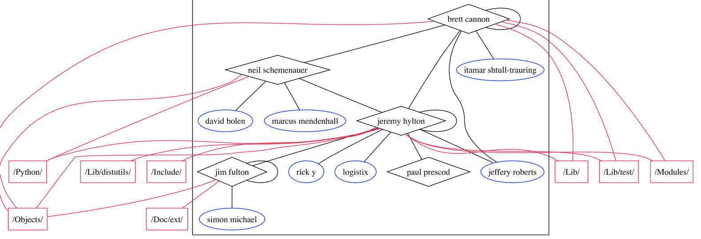

Figure 6: One subcommunity of participants in the python community from April to June 2003. Diamonds are developers, ovals are participants, and rectangles are directories committed to (in lieu of the large number of files committed to).

There are other subcommunities whose focus is not as localized within the system. During 10/2001 to 12/2001, we find two subcommunities whose tasks broadly span the Ant codebase. One large group, with 29 participants (including 5 developers) focuses on tracing and debugging. Although their code modifies files in many different places, their changes broadly add logging calls, debugging output, and assertions. Another group of 9 participants and 3 developers is working on ant build tasks, many specific to other non-ANT and commercial software, including EJB, VisualAge, Perforce, JUnit, and Sitraka products. The affected files are scattered across different packages. In addition, many test cases, in an entirely different part of the system's directory structure are also updated.

In the third type of subcommunity there was more than one particular topic or task under discussion or development. Often this would occur when one or two developers worked on two or more disparate areas of the code base, thus drawing two communities together. We also noted a few cases where no clear topics were distinguishable from the changes to files or the email messages (a number of these cases occurred relatively close to release dates).

In conclusion, Hypothesis 4, concerning the focus of subcommunities around cohesive tasks, is a complex matter. Sub-communities sometimes relate to closely connected files in the same module, and sometimes not. Our case study suggests a possible explanation—perhaps, sometimes, the focal task relates to cross-cutting concerns. We are currently exploring this issue, especially as it relates to the possibility of automatically mining socially and conceptually coherent, cross-cutting concerns; this might suggest either refactoring, or introducing the use of Aspect-oriented programming.

## 6. THREATS TO VALIDITY

We detect social links between developers using just the developer mailing list. While this is the prescribed venue for engineering discussions (due to its broadcast nature) [7, 22, 35, 46], we miss other potential developer interactions, such as private emails, IRC channels, or discussions in bug reports. While there appears to be a relationship between development activity and community structure, it is important to note that no causal link has been established. Further work is required to determine if the social links drive collaboration or vice versa, (or if they are both results of an unobserved phenomenon).

The biggest threat is to external validity. As with most studies of open source software, the projects for study were chosen based on certain criteria as mentioned in section 4.1. This necessary bias in selection means that we are not randomly sampling from the population of OSS projects. Therefore, while these results may be similar to what occurs in projects that don't fit these criteria, we have no evidence to support that assertion. In addition, as an examination of just five projects, these results may not generalize even to other projects that fit the same criteria. We believe that they would, but some have argued otherwise [6].

## 7. CONCLUSION

We have mined the communication and development data for five large open source projects and tailored an algorithm to search their email social networks for evidence of subgroups, whose activities are directly related to the software artifact. We found that in all cases, evidence of strong community structure existed within the communication patterns of the participants, and that the structure was more modular when discussion focused directly on source code artifacts. In addition, in all cases where our data was complete, the division of the project into subcommunities was also representative of the collaboration behavior of the developers. A quantitative analysis of the task focus for the various subcommunities was inconclusive, but some case studies indicated that task focus of subgroups does exist in many cases, though it may be subtle and varied in nature. The case study suggests some directions for future work, both in socio-technical congruence, and in aspect-mining. The dynamics of these subcommunities such as turnover rate and migration are topics that we plan to investigate as well.

## 8. ACKNOWLEDGEMENTS

We would like to thank SciTools7 for graciously allowing us the use of their excellent static analysis tools for Java, C, and C++. We also gratefully acknowledge support from the National Science Foundation Science of Design program, NSF-SoD-0613949. We are appreciative of the constructive feedback from many anonymous reviewers on initial drafts of this paper.

7 http://www.scitools.com