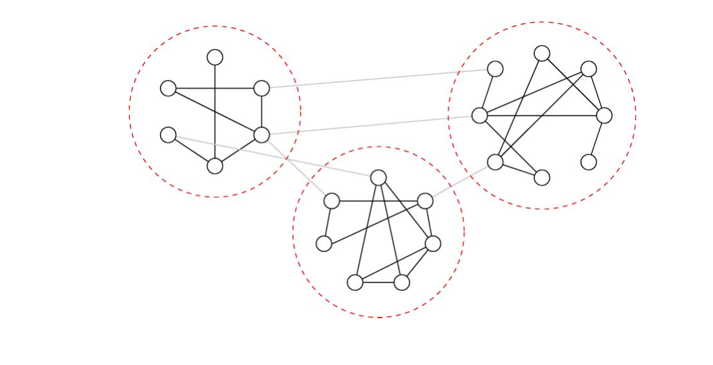

Figure 1: A network with strong community structure. Modularity, the measure of strength of community structure, which ranges from 0 to 1, has a value of 0.493 for the given division of nodes in this graph.

In this paper, we perform an empirical study of the latent social structure of open-source projects, and discuss just these issues. In the next section, we discuss the background, and present our hypotheses.

## 2. BACKGROUND

Despite the perceived lack of mandated organization, there are OSS projects with large developer pools that produce software of complexity and quality that rivals their commercial counterparts [54, 41]. How do these projects cope with the organizational hurdles that hinder all large engineering efforts?

We have empirically studied the social organization of the community of participants on the developer mailing lists for the Apache Webserver (hereafter referred to as Apache), Apache Ant (referred to as Ant), Python, Perl, and PostgreSQL projects. Each of these projects is mature and stable, has a large and complex code base comprised of multiple subsystems, and has a recorded history of many years. They all also have sizeable teams, ranging in size from 25 developers to nearly 10^2. There are of course much larger numbers of participants on the developer mailing lists [23], sometimes numbering in the thousands. The developer mailing lists are highly task focused; by community norms, all substantive discussions related to the system and development tasks occur on these lists. All correspondence is archived. The source code authorship history is also available from versioned source code repositories. The size and extensively archived history of these projects makes them good candidates for the study of emergent social structure and its relationship to technical activities.

We expect that any latent organizational structure will be mirrored in the communication patterns of participants in these OSS projects. The email discussions span a range of topics. Topics include, certainly the source code (and specific entities such as functions and methods that occur in source code), the build system, documentation, and high-level architecture. But, even in OSS, few, if any developers work on the entire system; most specialize. Consequently, just as development teams are split up and modularized in a software company, we believe that within the entire cohort of developer mailing list participants, there are self-organizing subcommunities that form as people organically tend to focus towards specific topics, subsystems, or tasks.

2 By developer, we refer to contributors that have write access to the source code repository.

We can use archives of the developer mailing lists to determine which individuals were in communication with each other and construct a social network of the participants. But how can organizational structure be discovered in this social network?

In 2002, Newman and Girvan introduced a quantitative notion of the community structure of a network, as “the division of network nodes into groups within which the network connections are dense, but between which they are sparser” [26]. Fig 1 is an example of a network with strong community structure. They quantify the “strength” of the subcommunities in a network with a formal measure that they call modularity, a value which ranges from 0 to 1. Note that while the terms community structure and modularity have been used in prior literature to mean many things, in the context of this paper, their use refers distinctly to these definitions. While the precise mathematical definition of modularity is presented in section 4.3, intuitively it can be thought of as measuring how well a network can be divided into clearly delineated “modules” of nodes. Community structure has been studied in various settings [3, 40, 28, 4, 58] due to advances in methods of identifying these structures [64, 65, 51, 14, 50]. We hypothesize that this kind of structure exists within the development communities of these large OSS projects. Mailing list participants spontaneously form subcommunities, and communicate more intensively with people within subgroups than outside them. This leads us to our first testable hypothesis:

Hypothesis 1 (H1) – Subcommunities of participants will form in the email social networks of large open source projects and the levels of modularity will be statistically significant.

By "statistically significant", we mean that the observed modularity in open-source software is an emergent consequence of the deliberate choice of associates made by participants. In other words, if they had been just as social, but chosen associates at random, it is unlikely that such modularity would have emerged.

While we believe that subcommunities of participants do organically form, such groupings are not meaningful unless the grouping specifically relates somehow to community goals. The discussions on the development mailing lists generally have one of two goals. The common purpose appears to be discussion of actual development activity (function interfaces, APIs, bug fixes, feature implementation, etc.). Other topics include policy decisions, high-level architectural changes, release plans, licensing issues, and admission of newcomers. Broadly (if not entirely accurately) we call the former product topics, and the rest process topics. While the process topics are clearly vital to the success and continued life of the projects, they are less directly related to coding activities than product topics; as such, the division of knowledge issues that arise with large, intricate software systems is not as critical in process topic discussions; barriers to entry are lower. In fact, since everyone is affected by process issues, all should participate. Therefore, the social networks of participants in process discussions should not be fragmented or modularized. This leads to the assertion that the social network fragmentation into subcommunities will be more strongly evident in product-related discussions.

Hypothesis 2 (H2) – Social networks constructed from product-related discussions will be more modular than those relating to non-product related discussions or all discussions.