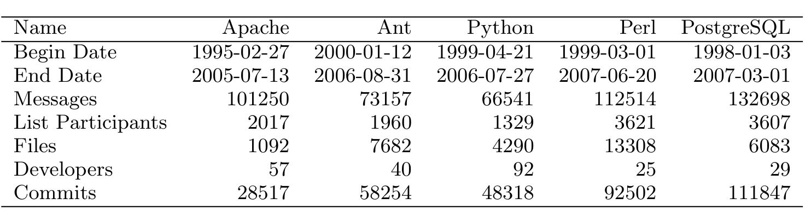

Table 1: Information on the data gathered for the projects studied.

fuzzy string similarity, domain name matching, clustering, heuristics, and manual post-processing [7].

Once email aliasing is handled we analyze a time-series of the social networks, at 3 month intervals. For further processing, we use an adjacency-matrix representation of the social network at each time interval.

In addition, we also extracted code information: the author, time of commit, the filename, and the contents of each file from the project source code repositories. The email addresses that corresponded to each repository author were also heuristically determined and hand verified in order to match the development activity and communication behavior of project developers. By using this commit information, we can see which developers were collaborating and on which files. Further details of the email and repository mining processes can be found in our prior work [7].

### 4.3 Finding Community Structure

To find and quantify the latent community structure that exists in the OSS networks, we have created a variant of the Newman algorithm [50].

3 We gratefully acknowledge Mark Newman’s help in giving us a source code implementation of his algorithm as a starting point.

The goal is to partition the network into groups of nodes, so the connections within groups are dense and the connections between the groups are sparse. Newman and Girvan defined a measure of modularity, which quantifies community structure strength, using the denseness and sparsity of the groups’ intra- and interconnections [51]. Consider a partition of a network into k communities. Let us define a k × k symmetric matrix e whose element e_ij is the fraction of all edges in the network that link vertices in group i to vertices in group j. Let us also define the row sums a_i = Σ_j e_ij. The modularity measure is then defined by

Q = Σ_i (e_ii − a_i^2) (1)

Essentially, this measures the fraction of the edges in the network that connect vertices within the same group minus the expected value of the same quantity in a network with the same community divisions, but random connections between the vertices (that is, the same division on a random network with the same degree distribution). Values for Q range from 0 (with networks of essentially random structure) to 1 (networks with cliques that are disconnected from each other). Some naturally occurring networks are known to be strongly modular; in such modular networks, Newman’s modularity measure takes on values ranging from 0.3 to 0.7 [51]. The algorithm also has been shown to correctly find modules known a priori. In our case, partitioning the social networks, we want to find the partition that yields the highest modularity for the network. Finding the partition that maximizes the modularity for a given network is an NP-complete problem [?]. Newman & Girvan’s method is approximate, but empirically effective. See [31] and [11] for examples.

Girvan and Newman’s original algorithm works well for binary networks, but doesn’t handle networks with weighted edges. Our social networks contain weighted edges, representing the number of emails exchanged between two participants in each time period. A high number of messages between a pair of participants should increase their likelihood of being in the same group. Following a method for adapting binary network algorithms to work on weighted networks [49], we modified our social networks by introducing one edge between each pair of nodes per email sent between them (i.e., creating a multi-edge network) and modified Newman’s algorithm above to handle multi-edge networks.

### 4.4 Validating Community Structure

We need to determine if the levels of community structure in the social networks of the studied projects are significantly higher than what we would expect to see in a bazaar-like scenario. To do this, we borrow methods from random graph theory [47, 52]. A standard method of determining the significance of measures of observed graphs is by comparing them with measures on random graphs with the same degree distribution as the observed graph. We want to see if people associate into subcommunities in a statistically significant way. Therefore we randomize networks by assuming that people in the network remain equally active, i.e., send just as many messages, but send them to a randomly chosen group of people, rather than deliberatively choosing correspondents. This models a scenario where people talk to others based on random encounters, rather than on work-related needs.

We generated a large number4 of random graphs with the same degree distribution as the observed networks using a rewiring approach [21, 44, 27]. This technique works by starting with the observed graph. Pairs of edges are selected randomly and their endpoints are switched or “rewired” so that a pair of edges (a, b) and (c, d) is replaced with (a, d) and (c, b). It is plain to see that at each step, the degree of each node is preserved. This method has been used to study topological characteristics of various large complex networks to determine if they are significant [?]. For reasons explained in section 4.5.1, as with the observed networks, we removed the three highest betweenness nodes to make the comparisons fair. The modularity of these graphs with the same degree distribution is compared with that of the observed graph to produce a statistical significance level.

4 roughly 30,000 per observed network