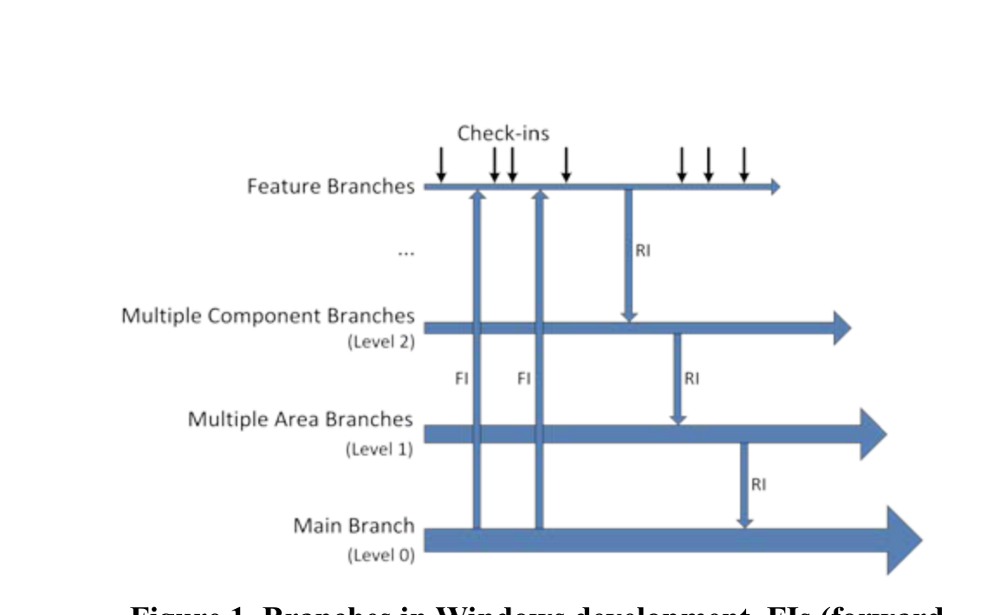
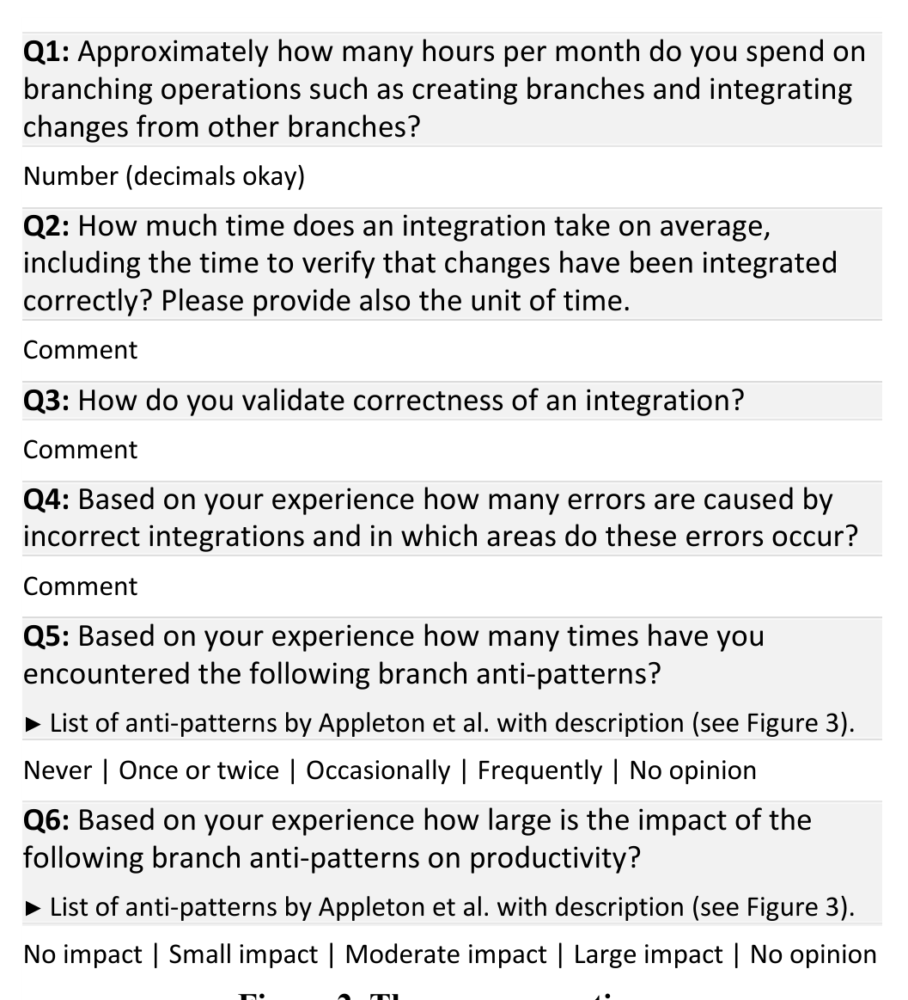

Figure 1. Branches in Windows development. FIs (forward integrations) move changes from parent to child branches. RIs (reverse integrations) move changes in the opposite direction.

(reverse integrations) move changes in the opposite direction.

high-benefit-low-cost branches), from those that slow development without providing high levels of isolation (low-benefit-high-cost). This analysis can aid developers by alerting them to parts of the branch structure that are “unhealthy” and hindering development or indicating which branches should be considered for removal.

Throughout this paper we demonstrate and evaluate the utility of our technique by illustrating its use on Windows. For example, we found that removing high-cost-low-benefit branches based on our analysis, changes would each have saved 8.9 days of delay and only introduced 0.04 additional conflicts on average. Over the past year, we also applied this analysis to Windows Mobile and Bing with similar results.

We make the following contributions in this paper:
- Results of a survey conducted with Microsoft developers on branching practices and issues encountered with branch use (Section 3).
- Technique for measuring the isolation and liveness of branches via what-if analysis (Section 4 and 5).
- Decision scenarios supported by this technique and demonstration of these scenarios in the context of Windows development (Section 6).

## 2. BRANCHES AT MICROSOFT

Let us first illustrate how the Windows development process works. As shown in Figure 1, the Windows software development takes place in various branches of the version control system with tightly integrated schedules for code integration and comprehensive builds. There are several parts of Windows, each of which are developed in individual branches. (An example feature could be “Sound” in the component “DirectX” in the area “Multimedia”.) Each of these individual branches can work as though the rest of the code base were frozen, except for their own evolving features.

Engineers check in their code to the feature branches. To ensure that the newly developed code in the feature branch maintains compatibility with the other changes committed to the main branches, the feature branches continually synchronize with the main branch (also called forward integration, or simply FI). After passing quality gates (for example, code coverage or static analysis) the code moves to the parent branch in the tree (reverse integration, RI). Once the code reaches the main branch (level 0) it is automatically integrated (FI'ed) with the rest of the code base to ensure that other code being developed is compatible with these changes. This process ensures stability in the main Windows

Small impact | Moderate impact | Large impact

Figure 2. The survey questions.

branch, with a working version of Windows always available for system test and other purposes—however, this isolation also comes at a cost: transit time is increased as changes are only visible to other teams after several integrations. An example could be Multimedia branches, where changes have first to be integrated to the main branch before they are visible in the Networking branches.

The branch structure in Windows (and other products at Microsoft) is typically chosen at the beginning of a release and remains mostly unchanged during the development of the release. Thus, there is not a strong notion of short-lived vs. long-lived branches. With this paper, we introduce an approach to quantitatively assess cost and benefit of branches to inform branch decisions.

## 3. SURVEY ON BRANCH USAGE

Many best practices exist in software configuration management such as the work by Berczuk [4] and Aiello [5], which also discuss how branches should be handled. As an example, a white paper from Perforce Software presents five best practices related to branches based on the authors’ experience in deploying SCM systems [6]: branch only when necessary; don’t copy when you mean to branch; branch on incompatible policy; branch late; branch instead of freeze. Appleton et al. present 32 patterns (best practices) for managing branching in parallel development projects [3]. They further present 12 common traps and pitfalls in branching that they call anti-patterns (see Figure 3). Examples of such anti-patterns are: creating too many branches (Branchmania), deferring branch merging and then attempting to merge all branches simultaneously (Big Bang Merge), or stopping all development activities while branching and merging, permitting only activities focused on shipping the impending release (Development Freeze).

In order to characterize branch usage, we sent an online survey to 370 Microsoft engineers in January 2011. For the design of the