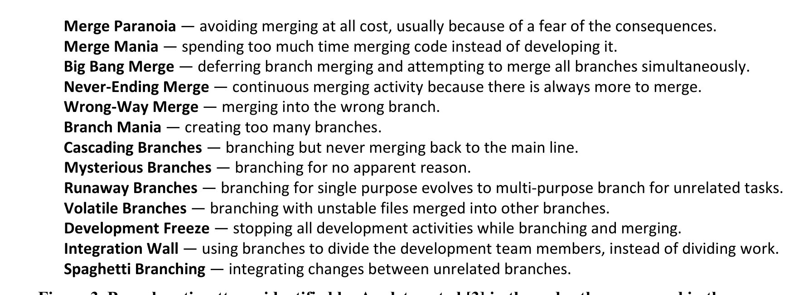

Spaghetti Branching — integrating changes between unrelated branches.  
Figure 3. Branch anti-patterns identified by Appleton et al [3] in the order they appeared in the survey.

survey, we followed Kitchenham and Pfleeger’s guidelines for personal opinion surveys [7]. Our survey consisted of 12 questions (all optional) of which 5 were related to branching and are shown in Figure 2. The survey was anonymous as this increases response rates [8] and leads to more candid responses.

Since we wanted to solicit the opinions of people well-versed in working with the SCM system and dealing with branches, we chose our survey participants as the top 10% of people who had either created most branches, integrated most changes, or submitted most edits within the 12 months before the survey date. Participants were invited with a personalized email and could enter their names into a raffle of two US $50 gift certificates. We received 124 responses (a 33.6% response rate) without sending any reminders; other online surveys in software engineering have reported response rates ranging from 14% to 20% [9]. For the write-in questions the completion rate was between 93% and 98%. Almost all respondents were developers and most were fairly experienced, with a median of 11 years of work experience in the software industry and 7.25 years at Microsoft.

### 3.1 Integrations

On average the survey respondents spent 5.45 hours per month creating branches or integrating changes from other branches; the median was 3 hours (Q1). These numbers may appear low, but often teams select a single person to be in charge of integrations and maintain a branch; this observation is supported by the 95th percentile of 15.45 hours and several of the free form comments in the survey. The time spent on branching operations depends also largely on the work area: build engineers spend significantly more time than developers.

For the time that integrations take on average (Q2), we solicited responses in the form of comments rather than numbers because we wanted to know more about the specific context of the integrations. The time varied widely across responses, ranging from minutes for simple integrations to days for more complicated integrations. Most of the time is spent on resolving conflicts and verifying correctness. The total time spent depends largely on the presence of conflicts but also on “the size of the payload, how well the branches are partitioned in terms of work going on inside them, and how far back is the baseline”. Several people and teams had developed custom tools and scripts to help them speed up the integration and its validation.

To validate the correctness of integrations (Q3), respondents used a wide spectrum of techniques: manual inspection using diff tools, historic change information, custom tools and scripts, builds, program executions, test runs, and also code review. Several people stressed the importance of social communication, especially when there are merge conflicts and the resolution is not clear. Survey respondents pointed out that the validation often depends on the type of branch (private, one-man branches vs. public, team based and aggregation branches) and the complexity of the changes to be integrated. In Windows and other systems, feature branches typically have quality gates that must be met before a change can move to a different branch [3,10].

We also asked about how many errors are caused by incorrect integrations (Q4); again we solicited responses in the form of comments rather than numbers. The consensus among respondents was that errors “happen from time to time” but relatively rarely because changes are validated extensively (e.g., through quality gates). However, errors “tend to be subtle because [if they happen] they often aren't noticed for a while when totally bizarre behavior occurs and it takes a long time to track down what happened.” Frequent causes for integration errors are merge conflicts that were not resolved correctly or partial integrations missing a file. Errors often occurred in files that were not source code, such as XML files or build manifests, and are difficult to compare.

### 3.2 Anti-patterns

Figure 3 contains the descriptions of the anti-patterns that were presented to the surveyed developers. With respect to anti-patterns we focused on two aspects:

- Frequency (Q5). In the survey, we asked how many times each anti-pattern had been encountered by a person. For the question, we used an ordinal scale with four levels Never, Once or Twice, Occasionally, and Frequently. To avoid any guesswork by participants we provided an explicit option for No opinion.

  For the analysis of the responses, we followed the advice by Kitchenham and Pfleeger [7] and dichotomized the ordinal scale to avoid any scale violations. More specifically, for each anti-pattern k we computed the percentage P(k) of the response “Frequently” among all responses (excluding responses that had no opinion).

- Severity (Q6). In addition, we asked which anti-patterns had the highest impact on productivity. We used an ordinal scale with four levels No Impact, Small Impact, Moderate Impact, and Large Impact; again we offered an explicit option of No opinion.

  We computed for each anti-pattern k the percentage P(k) of the response “Large Impact” among all responses (excluding responses that had no opinion).