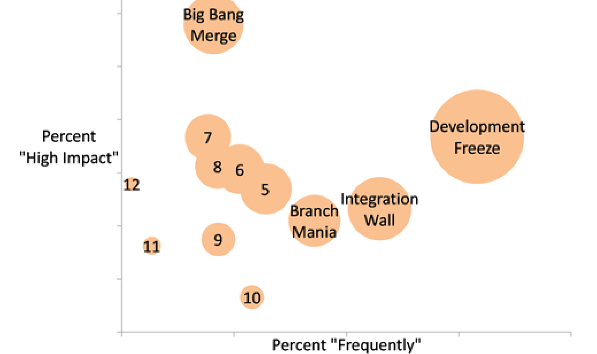

To identify anti-patterns with both a high frequency and a high severity, we additionally computed for each anti-pattern the product P_FS(k) of the percentages P_F(k) and P_S(k):

P_FS(k) = P_F(k) × P_S(k)

In Figure 4 we show a bubble chart of the frequency and severity of the branch anti-patterns. Each anti-pattern k is represented as a bubble; the position on the x-axis corresponds to the percentage P_F(k) of responses that selected “Frequently” in Q5 and the position on the y-axis corresponds to the percentage P_S(k) of responses that select “High Impact” on productivity in Q6. The bubble size corresponds to the combined percentage P_FS(k). (Intuitively the product P_FS(k) is the area of the rectangle spanned by the zero point and the point representing the anti-pattern.) To increase readability, we show full names only for the four anti-patterns with the highest P_FS-values; the other patterns are identified with numbers. The Mysterious Branches anti-pattern is not shown because no developers indicated that it had high severity and therefore the area is 0. The four highest ranked anti-patterns in Figure 4 are Development Freeze, Big Bang Merge, Integration Wall, and Branchmania.

- Development Freezes allow only activities that are focused on shipping the next release; work on subsequent releases is blocked until the software is released. Appleton et al. [3] discuss several solutions for this problem such as having parallel release and development lines.
- The anti-pattern Integration Wall means that branches are used to divide the development team members rather than the work itself. In a prior work related to this anti-pattern, we presented a preliminary study of how branches are used to organize goals and teams [11].
- For this paper, however, we focus on the anti-patterns Big Bang Merge and Branchmania, which are related: too many branches often lead to large integrations. Branchmania may also lead to long delays.

To recover from and prevent Branchmania, project members need awareness of how different branches are affecting their work. If developers can identify what branches are posing problems or are not actually needed, they can make decisions, such as where to integrate changes more frequently or which branches to remove, proactively. In this paper we provide a methodology to empirically assess branches and show how our approach can be used in a number of branch decision scenarios by illustrating them on Windows.

## 4. LIVENESS AND ISOLATION

It is important to understand how developers and other project members view branches within a project and what qualities are important to them.

At Microsoft project members care deeply about making fast and continuous progress. One aspect of this progress is how quickly changes made on branches are being seen by the rest of the project. We term this general property of how fast changes are being integrated into the rest of the project as liveness. One specific measure of liveness is the amount of time that it takes for a change on a branch to reach the root. This is important because even if a developer has completed a feature or a bug-fix, the task is not considered complete until the change has reached the root without error. Furthermore, some defects do not manifest until changes from different branches reach each other and their interaction leads to problems; a high liveness helps to reveal these problems faster.

> Figure 4. The frequency and impact of branch anti-patterns.  
> To increase readability we used numbers to label some of the anti-patterns. 5: Merge Paranoia, 6: Never-Ending Merge, 7: Volatile Branches, 8: Merge Mania, 9: Spaghetti Branching, 10: Runaway Branches, 11: Cascading Branches, 12: Wrong-Way Merge, 13: Mysterious Branches

The interval between the checkin of a change and the time that it reaches the root branch is the transit time of the change. Low transit times result in high liveness.

Many teams at Microsoft are interested in tracking the transit time of edits in their project. While transit time for individual edits is fairly straightforward to compute from SCM metadata, accounting for which branches contribute the most to long transit times on the path to the root branch is more complex. Branches that increase transit times may represent a bottleneck and pose a severe barrier to project agility.

Developers are aided by branches because of the isolation that they afford. By making changes on a branch, developers are unaffected by others and need not worry about unduly impeding teams on other branches. Developers working in different branches can change the same file without immediate negative impact. Such activity means that the changes will eventually need to reach each other and their interactions will need to be resolved, but developers can wait until their changes are complete and stable beforehand. If a file is changed on two branches, A and B, then when the change from one is integrated into the other, or the two changes meet on another branch (perhaps the parent of A and B), there is a file-level conflict, which needs to be resolved.1 We can measure how many conflicts occur when branches integrate with other branches, but many edits to the same file in two different branches may only result in one conflict if there is only one integration; consequently this measure does not accurately reflect isolation.

1 Note that there are different levels of conflicts. Line-level conflicts are when two changes change the same lines in a file and require manual merging by developers. For this paper, we focus on file-level conflicts, which is when the same file has been changed on different branches. While some of these can be merged automatically, even these merges have caused enough problems that the integration still has to be validated by developers (for example via compilation and testing as indicated in our survey) to avoid errors based on bad merges [25].