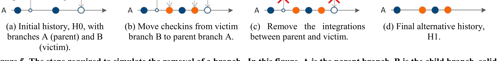
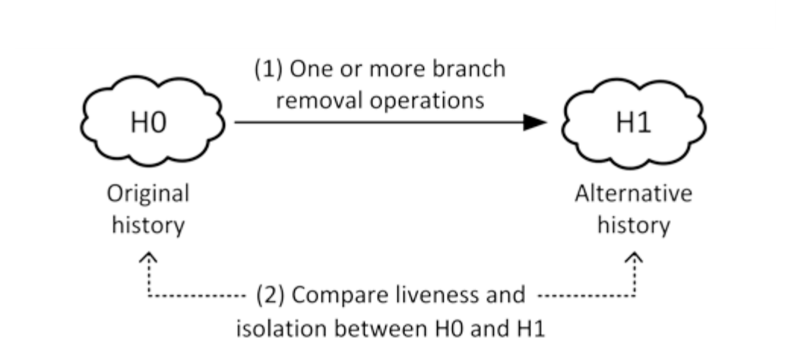
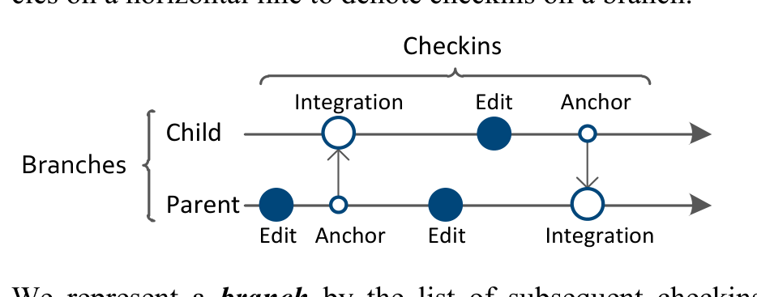

Figure 5. The steps required to simulate the removal of a branch. In this figure, A is the parent branch, B is the child branch; solid circles represent checkins, hollow circles represent integration checkins between branches. Checkins are colored according to the branch that they were made on in the original history.

Accurately quantifying liveness and isolation via what-if analysis and using such data to aid project members’ decision making is one of the main contributions of this paper.

## 5. METHODOLOGY

Isolation and the liveness of a branch can provide valuable information to project members that can be used in a number of scenarios, from monitoring “branch health” to identifying branches that should be removed from the system. However, measuring isolation and liveness is not straightforward: How can we determine how many conflicts were avoided? How much code movement was slowed due to the use of a branch? To address such questions we introduce a what-if analysis as illustrated in Figure 6. We take an original development history H0 and apply several branch removal operations (Sections 5.2 and 5.3) to obtain an alternative history H1. We then compare how liveness and isolation change between H0 and H1 (Section 5.4). We demonstrate based on Windows 7 branches how such data can support several decision scenarios (Section 6).

### 5.1 Terminology

We first introduce basic definitions needed to describe our what-if analysis. Where possible, we adhere to accepted terms from SCM parlance and only describe key terms and concepts that would otherwise be confusing or ambiguous. For a more detailed and formal description of our methodology, we refer the reader to the online appendix [12].

To model file histories we use branches, edits, and integrations as shown in the diagram below. Time flows left to right. Edits and integrations are referred to as checkins. In this paper, we use circles on a horizontal line to denote checkins on a branch. Checkins

Figure 6. What-if analysis applies one or more branch removal operations to create an alternative history and then compare liveness and isolation.

An integration merges the contents of a file at a specific point in time on one branch (source) into another branch (target). In most cases, but not always, integrations occur between parent and child branches. Integrations are a type of checkin and we denote integrations with a large hollow circle. To model the state of the file at the “specific point in time” on the source branch, we introduce anchors, which are temporal placeholders on the source branch and contain no actual change to the file. Anchors are denoted with a small hollow circle. Note that the anchor and the corresponding integration have the same time:

### 5.2 Simulated Removal of a Single Branch

The core part of our what-if analysis is removing a single branch. This allows us to explore a variety of alternative branch structures because scenarios where more than one branch is removed can be reduced to a series of single-branch-removal steps.

To simulate what would have happened if a branch was removed, we use the past development history and examine and modify the checkins and branch operations that involve the removed branch, the parent, and the children. Throughout this paper we refer to the branch being removed as the victim branch.

We first describe our simulation. Figure 5 shows the changes to the history that are involved when simulating the removal of the victim. Figure 5.a shows the original history for a subset of development history as it actually happened in the SCM. In this figure, A and B are horizontal lines representing branches. B is the victim and A is the victim’s parent. As before, solid circles represent edits and hollow circles represent integrations from one branch to another. In this diagram, the color of the circle indicates which branch the checkin occurred on in the original history (Figure 5.a). We use the following steps to simulate an alternative history with the victim removed.

First we identify all edits that occur on the victim. Since we are simulating what would have happened if the victim had not existed, the edits would have been made on the parent branch. Thus we move these edits to the parent branch, while preserving chrono-

Edit Anchor Edit Integration

We represent a branch by the list of subsequent checkins that have been made to the file on the branch. Branches form a hierarchy in which the main branch is called the root branch. Likewise there are parent and child branches. Checkins are integrated between branches and propagated towards the root branch. The depth of a branch in the hierarchy is also referred to as the level, with level 0 being the root branch.

An edit includes a direct modification of a file by a developer such as editing its content as well as adding or removing a file from the SCM. Edits are a type of checkin and we denote edits with a solid circle.