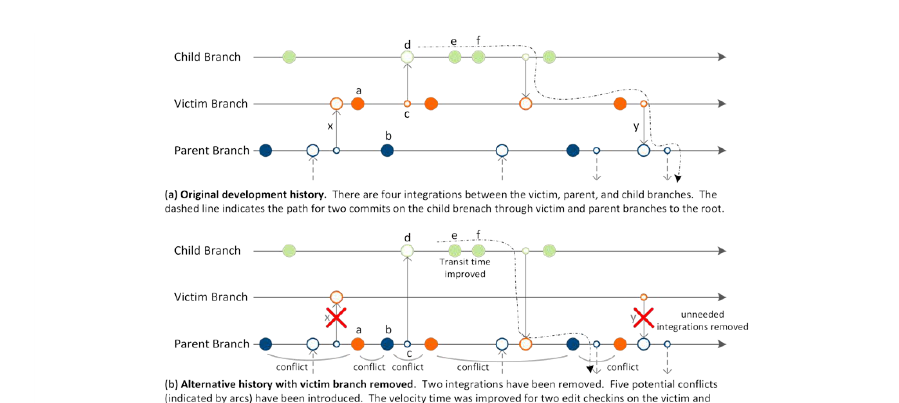

Figure 7. Simulating branch removal.

logical order. Figure 5.b illustrates this step by moving the checkins from B to A.

Second, we remove integrations between the parent and the victim. Since all edits now reside on the parent branch, the integrations to and from the victim branch are no longer needed. This is illustrated in Figure 5.c where the integrations and anchors between parent and victim are removed.

Third, all integrations from the victim to its children or any other branches are modified so that they now have the parent branch rather than the victim as the source. Likewise, all integrations that have the victim as the target branch are modified so that they have the parent branch as the target. This step is not shown in Figure 5 as these integrations do not occur in the simple history shown.

The final alternative history is shown in Figure 5.d. Note that although all checkins occur on the parent branch, A, we can still determine which branch each checkin was made on in the original history. This is required for our branch metrics.

A more complex example is shown in Figure 7 (original history in 7.a; alternative history with victim removed in 7.b). The edits on the victim are moved to the parent branch in the alternative history. Integration and corresponding anchor checkins have either been removed (x and y) or rerouted (e.g., c→d). While more complex, this illustrates the effect of simulated branch removal:

- The path (shown as a dashed line in both histories) from the two edit checkins e and f is different in the original and alternative histories. In the alternative history, the edits reach the parent branch and leave towards the root earlier. The difference in transit time to the root branch is the delay caused by the victim.
- On the other hand, some edits that originally occurred on different branches are now subsequent, conflicting edits on the parent branch, as indicated by the arcs between edit checkins in Figure 7.b (for example, a in conflict with b). These conflicts characterize the isolation provided by the victim branch in the original history (where a and b were isolated on different branches).

## 5.3 Alternative Branch Structure Scenarios

Based on the single-branch-removal step described above, we perform what-if analysis for a wide spectrum of alternative branch structures to address different scenarios. Examples include:

- What if a single branch is removed? – Is there a particular branch that is causing problems and should receive attention? This scenario simply applies the step described in the previous section. In Figure 7.b we illustrate the history produced when this step is applied to the history shown in Figure 7.a.

- What if an entire branch subtree is removed? – Are there sections of the branch structure that aren’t actually needed? This scenario selects a victim branch and removes the entire subtree rooted at the victim. For each branch removed from the subtree, we follow the process described in Section 5.2.

- What if we only had branches up to level N? – Several teams asked how liveness and isolation would change if the depth of the branch hierarchy is restricted. This would limit the maximum number of hops for changes to reach the root branch and thus may maintain progress within a project. To assess this scenario, we remove all branches on levels greater than N with the process described in Section 5.2.

If a scenario requires removing multiple branches, the actual order of the branch removals does not affect the results. We record two branches for each checkin: the branch that the checkin occurred on in the original history (which is never changed throughout the entire analysis) and the branch that it was made on in the alternative history (which is initialized to the original branch but subsequently changed via branch-removal operations). This allows us to apply multiple branch removals in an arbitrary order because our analysis only needs the original branch and the final target branch for each checkin. Regardless of the order of branch removals, the final target branch for a checkin on a victim branch is always well-defined; checkins are moved to the first non-victim parent branch of their original branch. Thus, branch removal is associative and commutative.