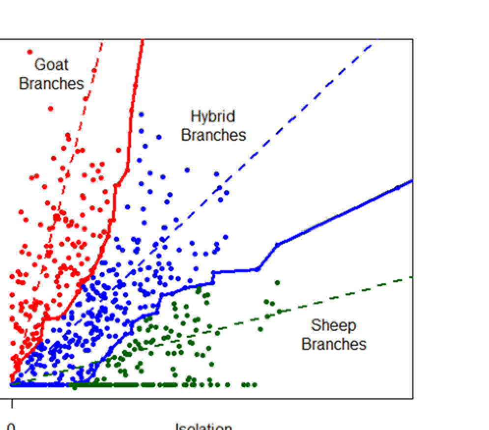
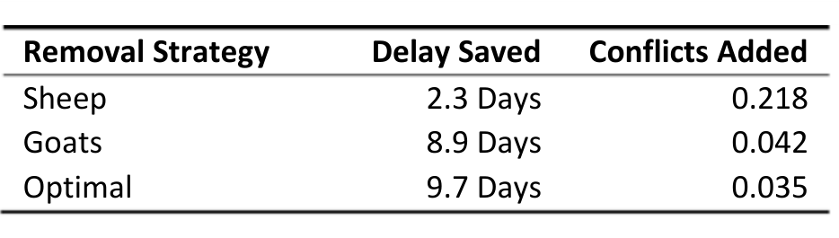

is shown along the x-axis (farther right is better as it means more conflicts are prevented by a branch) and delay is shown on the y-axis (lower is better). We consider isolation to be the benefit that a branch provides at the cost of delay.

High-benefit–low-cost branches (sheep) are colored green and on the bottom and right. Low-benefit–high-cost branches (goats) are colored red and are on the top and left. Medium-benefit–medium-cost branches (hybrids) provide isolation but also incur delays and are near the x–y line. Our categorization is based on ranking each branch in terms of the isolation that it provides and the delay that it incurs. We give each branch two ranks, one for delay (from least delay to most) and one for isolation (from most isolation to least). Then branches are sorted by the sum of their two ranks. The first 25% of branches are labeled sheep in graph in Figure 8; the last 25% have highest delay and lowest isolation and are labeled goats; the middle 50% are hybrid branches. This method of ranking is simply one way to combine isolation and delay and is not intended to be definitive; for example other rankings could weight one measure more than the other. We include our two-dimensional thresholds in the graph for ease of reading.

The graph shows a number of extreme branches. Approximately 7% of the branches don’t avoid any conflicts at all (points on the y axis). These branches do not provide any benefit. In contrast, 27% of the branches provide isolation while incurring only little or no delay (branches that lie near the x axis). These branches are the ideal as they provide benefit at almost no cost.

Such identification of sheep and goat branches is most useful if it can inform decisions about future branch structures and if it can be used at any point in the development cycle. To assess whether what-if analysis can inform decisions during development, we evaluated the effect of making decisions based on what-if analysis prior to the end of a product development cycle. Like many industrial projects, Windows development occurs in iterations around milestones. We performed our what-if analysis to evaluate branches based on development of Windows 7 that occurred prior to the end of the first milestone (M1). That is, we labeled each branch as a sheep, a goat, or a hybrid based on the delay and isolation for that branch in the first milestone. We then evaluated the effect of removing goat branches (those that provided the least isolation while causing the most delay) for the remaining milestones after M1 to determine if taking action based on these metrics would be effective.

Table 1 shows the results. By removing branches labeled goats in M1, each edit saved, on average, 8.9 days of delay from M1 to the end of development and experienced 0.04 additional conflicts each. In contrast, removing sheep branches at M1 would only save 2.3 days of delay per edit while incurring 0.22 additional conflicts (more conflicts and less saved time than goats). To put these values in perspective, we compared this to the optimal choice of branches to remove if we had perfect foresight and removed the branches that actually performed worst post-M1. In that case, 9.7 days of delay per edit would be saved at the cost of 0.035 conflicts each. Thus, making decisions on which branches are the most costly in M1 achieves 92% of the maximum possible cost savings while incurring only 17% more conflicts than the least possible.

We also examined the correlation between branch categorization based on M1 development and branch categorization after M1. We found that the category remained the same for 85.3% of the branches and a Kendall’s τ correlation of branch category before and after M1 was 0.86 (p << 0.01). Sheep branches tend to remain sheep, goat branches remain goats, etc.

> Figure 8. Usefulness of Branches in terms of provided isolation and delay based on recursive branch removal. Top and left shows goat branches (low benefit, high cost) and bottom and right show sheep branches (high benefit, low cost) while those in the center are hybrid branches that exhibit a tradeoff between delay and isolation.

> Optimal 9.7 Days 0.035  
> Table 1. The number of days saved and conflicts added per edit if sheep or goats, classified from data in the first milestone, are removed for later milestones.

Both of these results indicate that what-if analysis based on development data mid-cycle is reliable. Put more pragmatically, decisions about branch practices such as which to remove or which to focus resources on can be made during development with high confidence based on measurement earlier in the development cycle.

### 6.3 Quantifying the liveness–isolation tradeoff

Our choice of division of branches into sheep, goats, and hybrids based on a 25%-50%-25% split may seem arbitrary, and indeed it is to some degree. The divisions into the interquartile range and the resulting visualization were inspired by standard boxplot analysis [14]. The divisions simply represent the tradeoff between providing isolation and reducing delay. To quantify this tradeoff, we computed regression lines (shown in Figure 8) for each group. For confidentiality reasons, we are unable to disclose the actual absolute measurements. However, since a regression line defines proportions, we normalize to one conflict and use the generic term delay "unit". We found that the average tradeoff was 1 prevented conflict per edit at the cost of 3 delay units for sheep, 11 delay units for hybrid, and 46 delay units for goats.

Thus, if one is willing to deal with one conflict per edit in order to save 46 units of delay per edit (these are actually ratios, so this is the same as one conflict every two edits to save 23 delay units), then goat branches should be eliminated. In contrast, removing a sheep branch will only save 3 delay units per additional conflict.