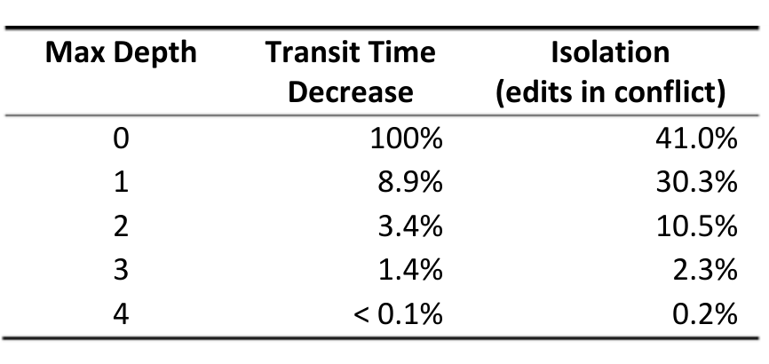

In practice, development teams can define the tradeoffs that they are willing to accept and make decisions accordingly. Thresholds are, in fact, not required in order to use what-if analysis results. For example, branches may be ranked according to some combination of isolation and delay and those with the lowest ranks could be removed.

## 6.4 Depth Analysis

Managers have considered limiting the maximum depth of the branch structure due to a belief that liveness would be improved if there are fewer branch levels. Until now, this belief has not been empirically confirmed or refuted.

We used what-if analysis to investigate branch depth by looking at the total isolation and total delay when restricting the branch structure to different maximum depth levels. A depth level of n means that there are at most n levels of branches below the root (which has level 0). Branches closer to the root are called shallow branches, while branches further away from the root are called deep branches. In this scenario we are not comparing branches to each other, but rather taking a global view on the branch structure as a whole. Therefore we use total delay and total isolation and show the percentage decrease in transit time and the percent of edits that cause conflicts.

Our findings are shown in Table 2 and are two-fold. First, the branches at very deep levels don’t actually incur very much delay. In fact, limiting the depth to four levels of branching saves less than 0.1% of the total transit time. Most of the delay can be attributed to the branches closer to the root. A policy of maximum branch depth would have to make the branch structure quite shallow for a non-trivial effect on delay; however, this would come at a rather high cost of severely reduced isolation.

- For an 8.9% speedup, Windows would have had to deal with 30.3% of the edits creating conflicts (maximum depth of 1).
- If the branch structure had only a single branch, that is the root (maximum depth of 0), the transit time would reduce by 100% to 0 for all edits, but then 40.4% of edits would incur conflicts. Having only a single branch is not reasonable for other reasons than just conflicts: build breaks would stall the entire project, preventing thousands of people from being able to work.

These findings suggest that deep branches actually do not impede liveness. They may not be needed, as they also do not provide much isolation, but removing them would have only a trivial effect, as they integrate their changes to parent branches on a frequent basis. In contrast to conventional wisdom that the holdup is a deep branch structure, our results show that in the case of Windows, the key to increasing liveness may actually lie in finding ways to move changes through shallow branches more quickly.

Table 2. The decrease in transit time and percent of edits in conflict if the branch structure is limited to a maximum depth. Depth of 1 represents 1 level of branching below the root, etc.

## 7. DISCUSSION

In this section we discuss future areas of research in the area of SCM branches. We also present assumptions in our methodology, potential threats to result validity as well as our mitigation steps, and common misconceptions.

### 7.1 Branch Refactoring and Optimization

In this paper, we have introduced a technique to empirically characterize delay and isolation for individual branches. This supports data-driven decision making on branches, for example to identify candidates for deletion.

We believe that this is just the first step towards a new discipline, branch refactoring, which is the process of improving and refining branch structures as a software project evolves. For this paper we focused on the refactoring “Remove useless branch”. However, as projects evolve there will be other opportunities for refactoring such as “Create new branch”, “Split branch”, “Merge related branches”, and “Bypass branch”. A related area is branch optimization, which is concerned with distributing files and people across branches based on empirical evidence.

Both branch refactoring and branch optimization offer opportunities for new research and tool development:
- Assemble a branch refactoring catalogue with empirically validated guidelines of when to apply a refactoring.
- Develop techniques to distribute files, people, and teams across branches.
- Build a recommender system to identify branch refactoring opportunities.
- Train prediction models to predict which branches will turn from sheep to goats.
- Empirical studies on relationship between branch structures and code quality.

### 7.2 Assumptions & Threats to Validity

For our survey we identified the following threats to validity. Our selection of survey participants was constrained to only experienced engineers, in our context, engineers who were most active in the SCM. While this skews our results to these engineers, they are also the ones who will benefit most by better branch structures. A related threat is that to some extent our survey operated on a self-selection principle: the participation in the survey was voluntary. As a consequence, results might be skewed towards people that are likely to answer the survey, such as engineers with extra spare time—or who care about branch structures. Avoiding the self-selection principle is almost impossible. As pointed out by Singer and Vinson, the decision of responders to participate “could be unduly influenced by the perception of possible benefits or reprisals ensuing from the decision” [15]. Some of our analysis is based on self-reported data (e.g., integration time, Q2). However, software developers are known to underestimate effort [16] and we consider the estimates to be a lower bound. For any empirical study, it is difficult to draw general conclusions because of a large number of contextual variables [17]. For example, different SCMs use different merging tools which may affect developers' perceptions of difficulty of integration. In addition, the process used by a development project can have a strong relationship with branch structure and frequency of integrations. However, we are confident our techniques can be applied to other projects, especially given the increased popularity of branching through distributed version control systems [18]. To increase the generality of our results, we hope to partner with academic researchers to replicate.