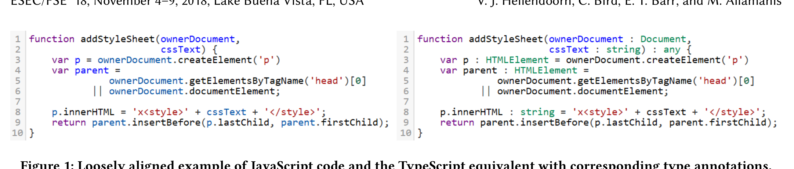
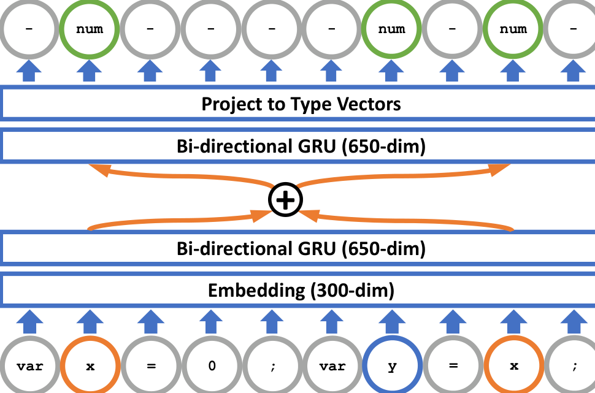
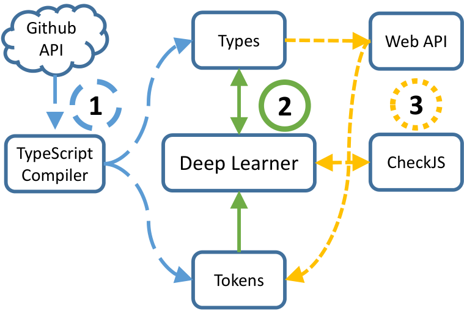
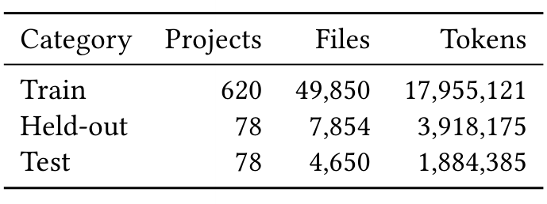
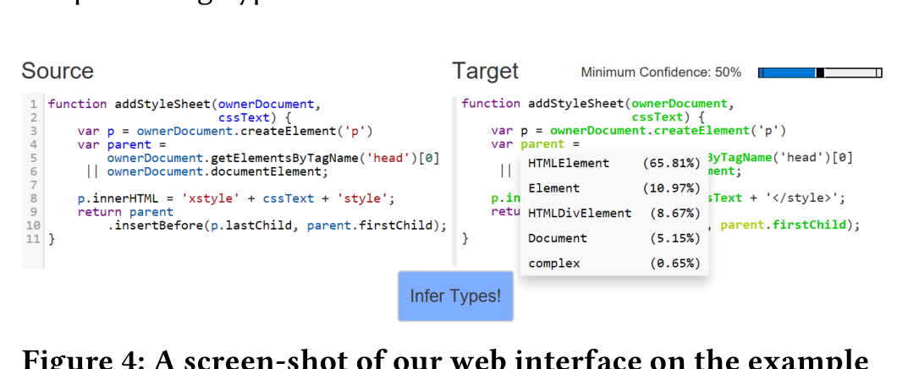
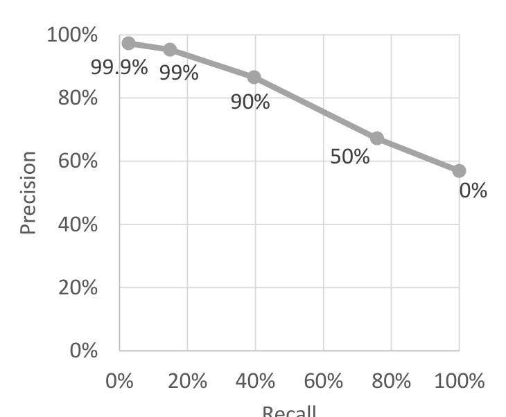
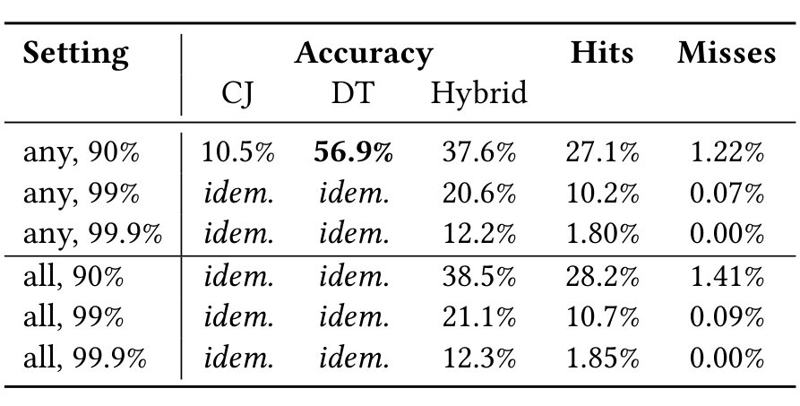

## Deep Learning Type Inference

Vincent J. Hellendoorn*
University of California, Davis
Davis, California, USA
vhellendoorn@ucdavis.edu

Earl T. Barr
University College London
London, UK
e.barr@ucl.ac.uk

Christian Bird
Microsoft Research
Redmond, Washington, USA
cabird@microsoft.com

Miltiadis Allamanis
Microsoft Research Cambridge
Cambridge, UK
miallama@microsoft.com

e.barr@ucl.ac.uk

### ABSTRACT
Dynamically typed languages such as JavaScript and Python are increasingly popular, yet static typing has not been totally eclipsed: Python now supports type annotations and languages like TypeScript offer a middle-ground for JavaScript: a strict superset of JavaScript, to which it transpiles, coupled with a type system that permits partially typed programs. However, static typing has a cost: adding annotations, reading the added syntax, and wrestling with the type system to fix type errors. Type inference can ease the transition to more statically typed code and unlock the benefits of richer compile-time information, but is limited in languages like JavaScript as it cannot soundly handle duck-typing or runtime evaluation via eval. We propose DeepTyper, a deep learning model that understands which types naturally occur in certain contexts and relations and can provide type suggestions, which can often be verified by the type checker, even if it could not infer the type initially. DeepTyper leverages an automatically aligned corpus of tokens and types to accurately predict thousands of variable and function type annotations. Furthermore, we demonstrate that context is key in accurately assigning these types and introduce a technique to reduce overfitting on local cues while highlighting the need for further improvements. Finally, we show that our model can interact with a compiler to provide more than 4,000 additional type annotations with over 95% precision that could not be inferred without the aid of DeepTyper.

> ACM Reference Format:
> Vincent J. Hellendoorn, Christian Bird, Earl T. Barr, and Miltiadis Allamanis. 2018. Deep Learning Type Inference. In Proceedings of the 26th ACM Joint European Software Engineering Conference and Symposium on the Foundations of Software Engineering (ESEC/FSE ’18), November 4–9, 2018, Lake Buena Vista, FL, USA. ACM, New York, NY, USA, 11 pages. https://doi.org/10.1145/3236024.3236051

### 1 INTRODUCTION
Programming language use in real-world software engineering varies widely and the choice of a language often comes with strong beliefs about its design and quality [24]. In turn, the academic community has devoted increasing attention to evaluating the practical impact of important design decisions like the strength of the type system, the trade-off between static/compile-time and dynamic/run-time type evaluation. The evidence suggests that static typing is useful: Hanenberg et al. showed in a large scale user-study that statically typed languages enhance maintainability and readability of undocumented code and ability to fix type and semantic errors [17], Gao et al. found that having type annotations in JavaScript could have avoided 15% of reported bugs [14], and Ray et al. empirically found a modestly lower fault incidence in statically typed functional languages in open-source projects [27].
At the same time, some of the most popular programming languages are dynamically, relatively weakly typed: Python, propelled by interest in deep learning, has risen to the top of the IEEE Spectrum rankings [3]; JavaScript (JS) has steadily increased its foothold both in and out of web-development, for reasons including the comprehensive package ecosystem of NodeJS. Achieving the benefits of typing for languages like JS is the subject of much research [8, 22]. It is often accomplished through dynamic analysis (such as Jalangi [29]), as static type inference for these languages is made complex by features such as duck-typing and JS’s eval().
Several languages, including TypeScript (TS), have been developed that propose an alternative solution: they enhance an existing language with a type system that allows partial typing (allowing, but not requiring, all variables to have type annotations), which can be transpiled back to the original language. In this way, TS can be used and compiled in the IDE, with all the benefits of typing, and can be transpiled into “plain” JS so that it can be used anywhere regular JS can. This lowers the threshold for typing existing code while unlocking (at least partially) the benefits of compile-time type checking.

### CCS CONCEPTS
- Software and its engineering → Software notations and tools; Automated static analysis;
- Theory of computation → Type structures;

### KEYWORDS
Type Inference, Deep Learning, Naturalness

* Work partially completed while author was an intern at Microsoft Research

Permission to make digital or hard copies of all or part of this work for personal or classroom use is granted without fee provided that copies are not made or distributed for profit or commercial advantage and that copies bear this notice and the full citation on the first page. Copyrights for components of this work owned by others than ACM must be honored. Abstracting with credit is permitted. To copy otherwise, or republish, to post on servers or to redistribute to lists, requires prior specific permission and/or a fee. Request permissions from permissions@acm.org.
ESEC/FSE ’18, November 4–9, 2018, Lake Buena Vista, FL, USA
© 2018 Association for Computing Machinery.
ACM ISBN 978-1-4503-5573-5/18/11...$15.00
https://doi.org/10.1145/3236024.3236051

---

Figure 1: Loosely aligned example of JavaScript code and the TypeScript equivalent with corresponding type annotations.

While developers may benefit from typed dialects of JS such as TS, the migration path from JS to TS is challenging as it requires annotating existing codebases, which may be large. This is a time-consuming and potentially error-prone process. Fortunately, the growth of TS' popularity in the open-source ecosystem gives us the unique opportunity to learn type inference from real-world data: it offers a dataset of JS-like code with type annotations, which can be converted into an aligned training corpus of code and its corresponding types. We use this data to train DeepTyper, which uses deep learning on existing typed code to infer new type annotations for JS and TS. It learns to annotate all identifiers with a type vector: a probability distribution over types, which we use to propose types that a verifier can check and relay to a user as type suggestions.

In this work, we demonstrate the general applicability of deep learning to this task: it enriches conventional type inference with a powerful intuition based on both names and (potentially extensive) context, while also identifying the challenges that need to be addressed in further research, mainly: established models (in our case, deep recurrent neural networks) struggle to carry dependencies, and thus stay consistent, across the length of a function. When trained, DeepTyper can infer types for identifiers that the compiler’s type inference cannot establish, which we demonstrate by replicating real-world type annotations in a large body of code. DeepTyper suggests type annotations with over 80% precision at recall values of 50%, often providing either the correct type or at least narrowing down the potential types to a small set. Our contributions are three-fold:

1. A learning mechanism for type inference using an aligned corpus and differentiable type vectors that relax the task of discrete type assignment to a continuous, real-valued vector function.
2. Demonstration of both the potential and challenges of using deep learning for type inference, particularly with a proposed enhancement to existing RNNs that increases consistency and accuracy of type annotations across a file.
3. A symbiosis between a probabilistic learner and a sound type inference engine that mutually enhances performance.

We also demonstrate a mutually beneficial symbiosis with JSNice [28], which tackles a similar problem.

## 2 PROBLEM STATEMENT

A developer editing a file typically interacts with various kinds of identifiers, such as names of functions, parameters and variables. Each of these lives in a type system, which constrains operations to take only operands on which they are defined. Knowledge of the type at compile-time can improve the code’s performance and allow early detection of faults [14, 17, 27]. A stronger type system is also useful for software development tools, for instance improving auto-completion accuracy and debugging information. Although virtually every programming language has a type system, type information can be difficult to infer at compile-time without type annotations in the code itself. As a result, dynamically typed languages such as JavaScript (JS) and Python are often at a disadvantage. At the same time, using type annotations comes with a type annotation tax [14], paid when adding type annotations, navigating around them while reading code, and wrestling with type errors. Perhaps for these reasons, developers voted with their keyboards at the beginning of the 21st century and increasingly turned to dynamically typed languages, like Python and JS.

### 2.1 A Middle Ground

Type annotations have not disappeared, however: adding (partial) type annotations to dynamically typed programming languages has become common in modern software engineering. Python 3.x introduced type hints via its typing package, which is now widely used, notably by the mypy static checker [2]. For JS, multiple solutions exist, including Flow [1] and TypeScript [5]. Two of the largest software houses — Facebook and Microsoft — have invested heavily in these two offerings, which is a testament to the value industry is now placing on returning to languages that provide typed-backed assurances. These new languages differ from their predecessors: to extend and integrate with dynamic languages, their type systems permit programs to be partially annotated,1 not in the sense that some of the annotations can be missing because they can be inferred, but in the sense that, for some identifiers, the correct annotation is unknown. When an identifier’s principal type is unknown, these type systems annotate that identifier with an implicit any, reflecting a lack of knowledge of the identifier’s type. Their support for partial typing makes them highly deployable in JS shops, but taking full advantage of them still requires paying the annotation tax, and slowly replacing anys with type annotations.

One of these languages is TypeScript (TS): a statically typed superset of JS that transpiles to JS, allowing it to be used as a drop-in replacement for JS. In TS, the type system includes primitive types (e.g. number, string), user-defined types (e.g. Promise, HTMLElement), combinations of these and any. TS comes with compile-time type inference, which yields some of the benefits of a static type system but is fundamentally limited in what it can soundly infer due to JS features like duck-typing. Consider

1 We avoid calling these type systems gradual because they violate the clause of the gradual guarantee [30] that requires them to enforce type invariants, beyond those they get "for free" from JS' dynamic type system, at runtime.

---

the JS code on the left-hand side of Figure 1: the type for p may be inferred from the call to createElement, which returns an HTMLElement. 2 On the other hand, the type of cssText is almost certainly string, but this cannot soundly be inferred from its usage here. 3 For such identifiers, developers would need to add type annotations, as shown in the TS code on the right.

### 2.2 Type Suggestion

To the developer wishing to transition from the code on the left to that on the right in Figure 1, a tool that can recommend accurate type annotations, especially where traditional type inference fails, would be helpful. This type suggestion task of easing the transition from a partially to a fully typed code-base is the goal of our work. We distinguish two objectives for type suggestion:

(1) Closed-world type suggestion recommends annotations to the developer from some finite vocabulary of types, e.g. to add to declarations of functions or variables.

(2) Open-world type suggestion aims to suggest novel types to construct that reflect computations in the developer’s code.

As a first step to assisting developers in annotating their code, we restrict ourselves to the first task and leave the second to future work. Specifically, our goal is to learn to recommend the (ca. 11,000) most common types from a large corpus of code, including those shown in Figure 1. To achieve this, we view the type inference problem as a translation problem between un-annotated JS/TS and annotated TS. We chose to base our work on TS because, as a superset of JS, it is designed to displace JS in developers’ IDEs. Thus, a growing body of projects have already adopted it (including well known projects such as Angular and Reactive Extensions) and we can leverage their code to train DeepTyper. We can use TS’ compiler to automatically generate training data consisting of pairs of TS without type annotations and the corresponding types for DeepTyper’s training.

Here, the fact that we are translating between two such closely related languages is a strength of our approach, easing the alignment problem [9, 16] and vastly reducing the search space our models must traverse. 4 We train our translator, DeepTyper, on TS inputs (Figure 1, right), then test it on JS (left) or partially annotated TS files. DeepTyper suggests variable and function annotations, consisting of return, local variable, and parameter types.

## 3 METHOD

To approach type inference with machine learning, we are inspired by existing natural language processing (NLP) tasks, such as part-of-speech (POS) tagging and named entity recognition (NER) [12, 20]. In those tasks, a machine learning model needs to infer the role of a given word from its context. For example, the word “mail” can be either a verb or a noun when viewed in isolation, but when given context in the sentence “I will mail the letter tomorrow”, the part of speech becomes apparent. To solve this ambiguity, NLP research has focused on probabilistic methods that learn from data.

2 Provided the type of ownerDocument is Document, which may itself require an annotation.

3 Grammatically, it could e.g. be number.

4 Vasilescu et al.’s work on deobfuscating JS also successfully leverages machine translation between two closely related languages [33].

Tasks like these are amenable to sequence-to-sequence models, in which a sequence of tokens is transformed into a sequence of types (in our case) [32]. Specifically, our task is a sequence of annotation tasks, in which all elements s_i in an input sequence s1...sN need to be annotated. Therefore, when approaching this problem with probabilistic machine learning, the modeled probability distribution is P(τ0...τN | s0...sN), where τi represents the type annotation of si. In our case, the annotations are the types for the tokens in the input, where we align tokens that have no type (e.g. punctuation, keywords) with a special no-type symbol.

Although deriving type annotations has many similarities to POS tagging and NER, it also presents some unique characteristics. First, our tasks has a much larger set of possible type annotations. The widely used Penn Treebank Project uses only 36 distinct parts-of-speech tags for all English words, while we aim to predict more than 11,000 types (Section 4.2). Furthermore, NLP tasks annotate a single instance of a word, whereas we are interested in annotating a variable that may be used multiple times, and the annotations ought to be consistent across occurrences.

### 3.1 A Neural Architecture for Type Inference

Similar to recent models in NLP, we turn to deep neural networks for our type inference task. Recurrent Neural Networks (RNN) [9, 15, 19] have been widely successful at many natural language annotation tasks such as named entity recognition [12] and machine translation [9]. RNNs are neural networks that work on sequences of elements, such as words, making them naturally fit for our task. The general family of RNNs is defined over a sequence of elements s1...sN as h_t = RNN(x_{s_t}, h_{t-1}) where x_{s_t} is a learned representation (embedding) of the input element s_t and h_{t-1} is the previous output state of the RNN. The initial state h0 is usually set to a null vector (0). Both x and h are high dimensional vectors, whose dimensionality is tunable: higher dimensions allow the model to capture more information, but also increase the cost of training and may lead to overfitting.

As we feed input tokens to the network in order, the vector x for each token is its representation, while h is the output state of the RNN based on both this current input and its previous state. Thus, RNNs can be seen as networks that learn to “summarize” the input sequence s1...st with ht. There are many different implementations of RNNs; in this work, we use GRUs (Gated Recurrent Unit) [9]. For a more extensive discussion of RNNs, we refer the reader to Goodfellow et al. [15].

In general translation tasks (e.g. English to French), the length and ordering of words in the input and output sequence may be different. RNN-based translation models account for these changes by first completely digesting the input sequence, then using their final state (typically plus some attention mechanism [26]) to construct the output sequence, token by token. In our case, however, the token and type sequence are perfectly aligned, allowing us to treat our suggestion task as a sequence annotation task, also used for POS tagging and NER. In this setting, for every input token that we provide to the RNN, we also expect an output type judgement. Since the RNN does not have to digest the full input before making type judgements, using this precise alignment can yield better performance.

---

Figure 2: Architecture of the neural network with an example input and output, where connections between the layers (at every token) are omitted for clarity. ‘num’ is short for ‘number’ and ‘-’ indicates a dummy type for non-identifier tokens (which have no type). Note how, in DeepTyper, the two occurrences of x have an additional custom connection to improve consistency in type assignment.

To a first approximation, we can use an RNN for our sequence annotation task where we represent the “type judgement” context of the token s_t with τ̂_t = h_t. Then, to predict the type vector, i.e. a probability distribution over every type τ in the type vocabulary, we use an output layer to project the hidden state onto a vector of dimension equal to the type vocabulary, followed by a softmax layer to normalize it to a valid categorical probability distribution over types. Each component of the type vector is then:

P_s_t(τ) = exp(τ̂_t^T r_τ + b_τ) / Σ_{τ'} exp(τ̂_t^T r_{τ'} + b_{τ'})   (1)

where r_τ is a representation learned for each type annotation τ, τ̂_t^T r_τ is the inner product of the two vectors and b_τ a scalar bias for each annotation. However, this approach ignores all the relevant context to the right of s_t, i.e. information in s_{t+1} ... s_N. For this reason, we use an architecture called bidirectional RNNs (biRNN), which combines two RNNs running in opposite directions, one traversing the sequence forward and the other in reverse. The representation of the context for a single token s_t becomes the concatenation of the states of the forward (left-to-right) and reverse (right-to-left) RNNs, i.e. we set τ̂_t in Equation (1) to τ̂_t = h_t^{bi} = [h_t^{→}, h_t^{←}]: the concatenation of the hidden state h_t^{→}, the forward RNN, and h_t^{←}, the reverse RNN at position t.

The network architecture we have described so far assumes that the annotations we produce for each token are independent of each other. This tends to be true in natural language but is not the case for source code: a variable may be used multiple times throughout the code, but its true type remains the same as at its declaration. If we were to ignore the interdependencies among multiple tokens, our annotations might turn out inconsistent between usages of the same variable. Although the RNN might learn to avoid such inconsistencies, in practice even long-memory RNNs such as GRUs have quite limited memory that makes it hard to capture such (Which is particularly important for this task; consider annotating x in var x = 0.)

To address this problem, we propose a consistency layer as an extension to the standard biRNN, where the context representation for the token s_t is

τ̂_t = h_t^{bi} + (1 / |V(t)|) Σ_{i ∈ V(t)} h_i^{bi}   (2)

where V(t) is the set of all locations that are bound to the same identifier as the one in location t. Specifically, we average over the token representations after the first bidirectional layer and combine these with the input to the second bidirectional layer, as shown in Figure 2. By concatenating the output vector h_t^{bi} with the average representation of all the bound tokens, we encourage the model to use long-range information from all usages of the identifier. Thus, the model learns to predict types based on both its sequentially local representation and the consensus judgement for all other locations where this identifier occurs. We could restrict the non-local part of Equation (2) to occurrences of the exact same variable only (e.g. by running a def-use analysis), but we found that it is very rare for two differently-typed, but same-named variables to occur in the same file. We chose instead to average over all identifiers with the same name, as this can provide more samples per identifier. Figure 2 shows the resulting network; we call this model DeepTyper.

### Design Decisions

Our neural network encapsulates a set of design decisions and choices which we explain here. Using the biRNN model allows us to capture a large (potentially unbounded) context around each token. Capturing a large context is crucial for predicting the type annotation of a variable, since it allows our model to learn long-range statistical dependencies (such as between a function’s type and its return statement). Additionally, including the identifiers (e.g. variable names) allows the model to incorporate probabilistic naming information to the type inference problem, a concept that has not been well explored in the literature. Also, it should be noted that viewing the input program as a sequence of tokens is a design decision that trades off the potential to use richer structural information (such as ASTs, dependency graphs) for the advantage of using well-understood models for sequence tagging whose training scales well with a large amount of data.

## 4 EVALUATION

Figure 3 gives an overview of our experimental setup. First, we collect data from online open-source projects (Section 4.2). The second step is initializing and training the deep learner (Section 3). Finally, we evaluate our approach against, and in combination with, a type inference engine, and we discuss how to use the trained algorithm for general code fragments, demonstrated through a web API. We conclude this section with an overview of the hardware used and corresponding memory use and timing information.

### 4.1 Objective

As outlined in Section 2, the goal of this work is to suggest useful type annotations from a fixed vocabulary for JavaScript (JS) and TypeScript (TS) code. Here, we define “useful type annotations” as those that developers have manually added in the TS code, and which we remove to produce our training data. In TS, there are

*6 Attention mechanisms [26] could be used to partially relieve this issue, but this extension is left to future work.*

---

Figure 3: Overview of the experimental setup, consisting of three phases: data gathering, learning from aligned types, and evaluation.

Three categories of identifiers that allow optional^7 type annotations: function return types, function parameters and variables. DeepTyper learns to suggest these by learning to assign a probability distribution over types, denoted a type vector, to each identifier occurrence in a file. To improve training, we do not only learn to assign types to definition sites, where the annotation would be added, but to all occurrences of an identifier. This helps the deep learner include more context in its type judgements and allows us to enforce its additional consistency constraint as described in Section 3.

The model is presented with the code as sequential data, with each token aligned with a type. Each token and type are encoded in their respective vocabularies (see Section 4.2) as a one-hot vector (with a one at the index of the correct token/type and zeros otherwise). The type may be a (deterministically assignable) no-type for tokens such as punctuation and keywords; we do not train the algorithms to assign these. Given a sequence of tokens, the model is tasked to predict the corresponding sequence of types.

At training time, the model's accuracy is measured in terms of the cross-entropy between its produced type vector and the true, one-hot encoded type vector. At test time, the model is tasked with inferring the correct annotations at the locations where developers originally added type annotations that we removed to produce our aligned data. Although the model infers types for all occurrences of every identifier (because of the way it is trained), we report our results on the true original type annotations both because this is the most realistic test criterion and to avoid confusion.^8

We evaluate the model primarily in terms of prediction accuracy: the likelihood that the most activated element of the type vector is the correct type. We focus on assigning non-any types (recall that any expresses uncertainty about a type), since those will be most useful to a developer. We furthermore distinguish between evaluating the accuracy at all identifier locations (including non-definition sites, as we do at training time) and inferring only at those positions where developers actually added type annotations in our dataset. For more details, see Section 4.4.

Table 1: Statistics of the dataset used in this study.

## 4.2 Data

Data Collection. We collected the 1,000 top-starred open-source projects on Github that predominantly consisted of TypeScript code on February 28, 2018; this is a similar approach to Ray et al.'s study of programming languages [27]. Each project was parsed with the TypeScript compiler tsc, which infers type information (possibly any) for all occurrences of each identifier. We removed all files containing more than 5,000 tokens for the sequences to fit within a minibatch used in our deep learner. This removed only a small portion of both files (ca. 0.9%) and tokens (ca. 11%). We also remove all projects containing only TypeScript header files, which especially includes all projects from the 'DefinitelyTyped' eco-system. After these steps, our dataset contains 776 TypeScript projects, with statistics listed in Table 1.

Our dataset was randomly split by project into 80% training data, 10% held-out (or validation) data and 10% test data. Among the largest projects included were Karma-TypeScript (a test framework for TS), Angular and projects related to Microsoft's VS Code. We focus only on inter-project type suggestion, because we believe this to be the most realistic use of our tool. That is, the model is trained on a pre-existing set of projects and then used to provide suggestions in a different/new project that was not seen during training. Future work may study an intra-project setting, in which the model can benefit from project-specific information, which will likely improve type suggestion accuracy.

Token and Type Vocabularies. As is common practice in natural language processing, we estimate our vocabularies on the training split and replace all the rare tokens (in our case, those seen less than 10 times) and all unseen tokens in the held-out and test data with a generic UNKNOWN token. Note that we still infer types for these tokens, even though their name provides no useful information to the deep learner. To reduce vocabulary size, we also replaced all numerals with '0', all strings with 's' and all templates with a simple 'template', none of which affects the types of the code. The type vocabulary is similarly estimated on the types of the training data, except that rare types (again, those seen less than 10 times in the training data) and unseen types are simply treated as any. The number of tokens and types strongly correlates with the complexity of the model, so we set the vocabulary cut-off as low as was possible while still making training feasible in reasonable time and memory. The resulting vocabularies consist of 40,195 source tokens and 11,830 types.

Aligning Data. To create an oracle and aligned corpus, we use the compiler to add type annotations to every identifier. We then remove all type annotations from the TS code, in order to create code that more closely resembles JS code. Note that this does not always produce actual JS code since TS includes a richer syntax

7 Here, any is implicit if no annotation is added.

8 In brief, across all identifiers, DeepTyper reaches accuracies close to that of the compiler's type inference and a hybrid of the two was able to yield superior results.

---

Beyond just type annotations, we create two types of oracle datasets from this translation:

1. ALL identifier data (training): we create an aligned corpus between tokens and types, in which every occurrence of every identifier has a type annotation from the compiler. This is the type of oracle data that we use for training. This data likely includes more types than a developer would want to annotate, since many could be inferred by the compiler.

2. GOLD, annotation-only data (testing): we align only the types that developers annotated with the declaration site where the annotation was added. All other tokens are aligned with a no-type. This provides the closest approximation of the annotations that developers care about and serves as our test data.

### 4.3 Experiments and Models

DeepTyper. We study the accuracy and behavior of deep learning networks when applied to type inference across a range of metrics (see Section 4.4). Our proposed model enhances a conventional RNN structure with a consistency layer as described in Section 3 and is denoted DeepTyper. We compare this model against a plain RNN with the same architecture minus the consistency layer.

For our RNNs, we use 300-dimensional token embeddings, which are trained jointly with the model, and two 650-dimensional hidden layers, implemented as a bi-directional network with two GRUs each (Section 3). This allows information to flow forward and backward in the model and improves its accuracy. Finally, we use dropout regularization [31] with a drop-out probability of 50% to the second hidden layer and apply layer-normalization after the embedding layer. As is typical in NLP tasks like this, the token sequence is padded with start- and end-of-sentence tags (with no-type) as cues for the model.

We train the deep learner for 10 epochs with a minibatch size of up to five thousand tokens, requiring ca. 4,100 minibatches per epoch. We use a learning configuration that is typical for these tasks in NLP settings and fine-tuned our hyper-parameters using our validation data. We use an Adam optimizer [23]; we initialize the learning rate to 10^-3 and reduce it every other epoch until it reaches 10^-4, where it remains stable; we set momentum to 1/e after the first 1,000 minibatches and clip total gradients per sample to 15. Validation error is computed at every epoch and we select the model when this error stabilizes; for both of our RNN models, this occurred around epoch 5.

TSC + CheckJS. In the second experiment, we compare our deep learning models against those types that the TypeScript compiler (tsc) could infer (after removing type annotations), when also equipped with a static type-inference tool for JavaScript named CheckJS. CheckJS reads JavaScript and provides best-effort type inference, assigning any to those tokens to which it cannot assign a more precise type. Since TSC + CheckJS (hereafter typically abbreviated “CheckJS”) has access to complete compiler and build information of the test projects (while DeepTyper is evaluated in an inter-project setting), our main aim is not to outperform CheckJS but rather to demonstrate how probabilistic type inference can complement CheckJS by providing plausible, verifiable recommendations precisely where the compiler is uncertain.

9 see https://github.com/Microsoft/TypeScript/wiki/Type-Checking-JavaScript-Files

JSNice. In our final experiment, we compare the deep learner’s performance with that of JSNice [28]. JSNice was proposed as a method to (among others) learn type annotations for JavaScript from dependencies between variables, so we thought it instructive to compare and contrast performances. A perfect comparison is not possible as JSNice differs from our work in several fundamental ways: (1) it focuses on JavaScript code only whereas our model is trained on TypeScript code with a varying degree of similarity to plain JavaScript, (2) it assigns a limited set of types, including number, string, Object, Array, a few special cases of Object such as Element and Document, and ? (unsure), and (3) it requires compiler information (e.g., dependencies, scoping), whereas our approach requires just an aligned corpus and is otherwise language-agnostic.

### 4.4 Metrics

We evaluate our models on the accuracy and consistency of their predictions. Since a prediction is made at each identifier’s occurrence, we first evaluate each occurrence separately. We measure the rank of the correct prediction and extract top-K accuracy metrics. We evaluate the various models’ performances on real-world type annotations (the GOLD data). Unless otherwise stated, we only focus on suggesting the non-any types in our aligned datasets, since inferring any is generally not helpful. The RNN also emits a probability with its top prediction, which can be used to reflect its “confidence” at that location. This can be used to set a minimum confidence threshold, below which DeepTyper’s suggestions are not presented. Thus, we also show precision/recall results when varying this confidence threshold for DeepTyper.

Finally, we are interested in how consistent the model is in its assignment of types to identifiers across their definition and usages in the code. Let X be the set of all type-able identifiers that occur more than once in some code of interest. For DT : X → N, let DT(x) denote the number of types DeepTyper assigns to x, across all of its appearances. Ideally, ∀x ∈ X, DT(x) = 1; indeed, this is a constraint that standard type inference obeys. Like all stochastic approaches, DeepTyper is not so precise. Let Y = { x ∈ X | DT(x) > 1 }. Then the type inconsistency measure of a type inference approach, like DeepTyper, that does not necessarily find the principal type of a variable across all of its uses, is: |Y| / |X|.

### 4.5 Experimental Setup

The deep learning code was written in CNTK [4]. All experiments are conducted on an NVIDIA GeForce GTX 1080 Ti GPU with 11 GB of graphics memory, in combination with an 6-core Intel i7-8700 CPU with 32 GB of RAM. Our resulting model requires ca. 500 MB of RAM to be loaded into memory and can be run on both a GPU and CPU. It can provide type annotations for (reasonably sized) files in well under 2 seconds.

Our algorithm is programmatically exposed through a web API (Figure 4) that allows users to submit JavaScript or TypeScript files and annotates each identifier with its most likely types, subject to a

---

Figure 4: A screen-shot of our web interface on the example from Figure 1.

Table 2: Accuracy results of various models, where DeepTyper includes the proposed consistency layer (Section 3) and naïve assigns each identifier the MLE distribution of types given that identifier from the training data.

| Model    | Top-k Accuracy (GOLD@1) | Top-k Accuracy (GOLD@5) |
|----------|-------------------------:|------------------------:|
| Naïve    | 37.5%                   | 78.9%                  |
| Plain RNN| 55.0%                   | 81.1%                  |
| DeepTyper| 56.9%                   | 81.1%                  |

confidence threshold. All our code for training and evaluating DeepTyper is released on https://github.com/DeepTyper/DeepTyper.

## 5 RESULTS

We present our results in three phases, as per Section 4.3. We first study how well deep learning algorithms are suited for type inference in general, and study the notion of consistency specifically. Then, we compare DeepTyper’s performance with that of the TypeScript compiler plus CheckJS, showing furthermore how the models can be complementary. Finally, we present a comparison (and combination) on plain JS functions with JSNice [28], which tackles a similar, if narrower task.

### 5.1 Deep Learning for Type Inference

We first show the overall performance of the deep learning models on the test data, including both the plain RNN and our variant, DeepTyper, which is enhanced with a consistency layer. Table 2 shows the prediction accuracy (top 1 and 5) of the true types w.r.t. the models in the 78 test projects on the GOLD dataset (Section 4.2). We include a naïve model, which assigns each identifier the type distribution that it has at training time. This model achieves an acceptable accuracy without accounting for any identifier context, giving us a notion of what portion of the task is relatively simple. Xu et al. report a similar result for Python code [34], although we stress that this is not an implementation of their model (See Section 7). DeepTyper substantially outperforms it by including contextual information and achieves a top-1 accuracy of nearly 60% and top-5 accuracy of over 80% across the GOLD dataset.

#### 5.1.1 Consistency

In Table 2, DeepTyper yields higher prediction accuracy than the plain RNN. As we stated in Section 3, we qualitatively found that the plain RNN model yielded poor consistency between its assignments of types to multiple usages of the same identifier. We quantify this concern with the inconsistency metric described in Section 4.4. By this metric, the plain RNN assigns an inconsistent type 17.3% of the time. Our consistency layer has the effect of taking into account the average type assignment for each identifier in a function and achieves a modest, but significant consistency error reduction of around 2 percentage points, to 15.4%. Importantly, it does not accomplish this by sacrificing performance (as it might by gravitating to common types), but instead slightly boosts prediction accuracy as shown above. This shows promise for further investigation into adding global information to these models (Section 6). Thus, we use the DeepTyper model in our experiments going forward.

#### 5.1.2 Performance Characteristics

A few, common types, account for most of the type annotations in the TypeScript data. We study the discrepancies between the predictability of the 10 most common types vs. the ca. 11,000 other types in Table 3. We also include prediction statistics of the any type for reference, which was by far the most common type in the training data, but was substantially less common among the real annotations shown here. Since all identifiers are implicitly typed as any unless another type is provided, recommending this type is not clearly useful. However, developers do evidently explicitly annotate some identifiers as any, so that accuracy on this task may still be useful for a type suggestion tool; this deserves further investigation.

Excluding any, the top 10 types account for most of the typed tokens. Among the most common types are the primitives string, number and boolean, as well as several object types: Array, Promise and HTMLElement. As can be seen, predicting the rarer types is substantially harder for DeepTyper, but it manages a usable top-5 accuracy nonetheless. This is especially true at locations where the model is most confident, as we discuss next.

Table 3: Accuracy on the 10 most common, and all other types, with ‘any’ included for reference

| Type         | Count  | Top-K Accuracy (top-1) | Top-K Accuracy (top-5) |
|--------------|-------:|-----------------------:|-----------------------:|
| Top 10 total | 9,946  | 71.1%                  | 95.6%                 |
| Others total | 5,158  | 29.6%                  | 53.2%                 |
| any*         | 8,452  | 66.8%                  | 97.2%                 |

*included only for reference; suggesting any is typically not helpful to developers.

#### 5.1.3 Recommendation

The deep learning algorithm emits a probability for each type assignment, which allows the use of a threshold to determine which suggestions are likely to be correct (Section 4.4). Figure 5 shows the trade-off in precision and recall when varying this threshold. Precision first exceeds 80% at a threshold of 90%, yielding a recall rate of ca. 50%. At a threshold of 99%, precision exceeds 95% at a still respectable recall rate of ca. 14.9%. At this level, DeepTyper could add more than 2,000 of the ca. 15,000 annotations we extracted across the 78 test projects with very high precision.

10 This indicates that a great many identifiers could not be typed more specifically by the compiler, or were too rare to be included in the vocabulary.

---

Figure 5: Recall vs. Precision of DeepTyper as a recommender on the test data subject to probability thresholds (of the top suggestion) that reflect the model’s confidence.

## 5.2 Conventional Type Inference

We compare our results with those obtained by running the TypeScript compiler with CheckJS (see Section 4.3) on each project in the test corpus. Our main interest is a hybrid model: when the compiler has access to each test project’s complete build information, its type judgements are sound (although CheckJS may contribute a small number of unsound, heuristic predictions). The cases where it is unsure and defaults to any are locations where the deep learner may be able to contribute, since it ‘understands’ what types are natural in various locations. Thus, the hybrid model first assigns each variable its CheckJS type. When CheckJS assigns any to an identifier and DeepTyper is sufficiently confident in its suggestion, the hybrid switches to DeepTyper’s suggested type. Per Figure 5, we use confidence thresholds of 90%, 99% and 99.9% to achieve a balance between high precision (preferred in this setting) and recall.

We also report, as a percentage of all prediction points, how often DeepTyper correctly changes an any into a more specific type (Hits) and how often DeepTyper incorrectly suggests a type when CheckJS was either correct, or had soundly resorted to any (Misses). Crucially, these “Misses” are not sources of unsoundness! In a proper suggestion tool, any suggested type annotation can first be passed through the type checker and ruled out if it is unsound. Although this feedback loop was too costly to run for our automated evaluation, we manually investigated several incorrect annotations and found that ca. half of these could be ruled out by the compiler as unsound, whereas the remainder was sound, even if incorrect. This includes cases where DeepTyper’s type was too broad: HTMLElement where HTMLButtonElement was expected, or different from what the user expected, but correct in the context, like cssText: number would be in Figure 1.

Thus, we conclude that (1) any tool based on our model need not introduce any unsound annotations, and (2) the “Misses” column overstates how many incorrect annotations a user would actually encounter when also employing a type checker. Nonetheless, the balance between “Hits” and “Misses” gives an indication of the precision/effort trade-off at various thresholds.

The top-1 accuracy (CheckJS gives only one suggestion) for the three models is shown in Table 4, which for reference also shows

Table 4: Accuracy of the three models (where DT is DeepTyper and CJ is the TypeScript compiler with CheckJS enabled) on both datasets. “Hits” reflects when DT overrules CJ and improves accuracy; “Misses” where it worsens accuracy. “Setting” specifies whether only CheckJS’ ‘any’ cases or all types can be overruled by DeepTyper, and the minimum confidence for DeepTyper to act. Results for CJ and DT by themselves are shown independent of threshold for clarity (and are thus identical in their columns).

A second set of results where DeepTyper is allowed to alter “all” type judgements (not just anys) when it is sufficiently confident. Although the models proved complementary on our training data, CheckJS could not go beyond DeepTyper here on the real developer annotations at test time. This strongly indicates that developers add annotations predominantly in those places where the type inference tool could not infer the correct type. It also stresses the relevance of our tool: in those cases where developers would need it most, it yields a top-1 accuracy of over 50% (and, referring back to Table 2, a top-5 accuracy of over 80%). Furthermore, the hybrid model proves useful at higher confidence rates by reducing DeepTyper’s incorrect types: at a 90% threshold, DeepTyper can contribute more than 4,000 types with over 95% precision to CheckJS’ own type inference! Allowing DeepTyper to correct all types vs. just any does not appear to be particularly more rewarding in terms of Hits/Misses trade-off. In all cases, setting a higher threshold tends to improve the true positive rate of DeepTyper, which is in line with the precision/recall trade-off seen earlier. Since developers migrating their code are most likely to appreciate very precise suggestions first, DeepTyper has the potential to be a cost-effective aide.

## 5.3 Comparison With JSNice

JSNice was introduced as an approach for (among others) type inference on JavaScript using statistics from dependency graphs learned on a large corpus [28]. As discussed in Section 4.3, its approach is complementary to ours, so we thought it instructive to compare their performance with that of DeepTyper as well. Note that we are again using the original DeepTyper model here, not the “Hybrid” model from the previous section. Because JSNice is available to use via a web form, we manually entered JavaScript functions and recorded the results.

We selected JavaScript functions uniformly at random from public projects on GitHub that were in the top 100 JavaScript projects ranked by number of stars (similar to Ray et al. [27]). To avoid trivial functions, we selected functions that take at least one parameter and that return a value or have at least one declared variable in

---

Table 5: Comparison of DeepTyper, JSNice, and Hybrid of both across thirty randomly selected JavaScript functions.

their body. Thus each function requires two type annotations at the very least. Because the evaluation had to be performed manually, we examined thirty JavaScript functions.11 For each function we manually determined the correct types to use as an oracle for evaluation and comparison, assigning any if no conclusive type could be assigned. As a result, we identified 167 annotations (on function return types, local variables, parameters and attributes) of which 108 were clearly not any types.

Again, we focus on predicting only the non-any types, since these are most likely to be helpful to the user. Cases in which JSNice predicted ? or Object, and cases where DeepTyper predicted any or was not sufficiently confident are all treated as “Unsure”. We again show results for various confidence thresholds for DeepTyper (across a slightly lower range than before, to better match the “Unsure” rate of JSNice) and include another hybrid model, in which DeepTyper may attempt to “correct” any cases in which both JSNice was uncertain (or did not annotate a type at all) and DeepTyper is sufficiently confident. The results are shown in Table 5.

At the lowest threshold, DeepTyper gets both more types correct and wrong than JSNice, whereas at the highest threshold it makes no mistakes at all while still annotating more than one-third of the types correctly. JSNice made one mistake, in which it assigned a type that was too specific given the context.12 We also count “partial” correctness, in which the type given was too specific, but close to the correct type. This includes cases in which both JSNice and DeepTyper suggest HTMLElement instead of Element.

Overall, DeepTyper’s and JSNice’s performances are very similar on this task, despite DeepTyper having been trained primarily on TypeScript code, using a larger type vocabulary and not requiring any information about the snippet beyond its tokens. The two approaches are also remarkably complementary. JSNice is almost never incorrect when it does provide a type, but it is more often uncertain, not providing anything, whereas DeepTyper makes more predictions, but is incorrect more often than JSNice. A Hybrid approach in which JSNice is first queried and DeepTyper is used if JSNice cannot provide a type shows a dramatic improvement over each approach in isolation and demonstrates that JSNice and DeepTyper work well in differing contexts and for differing types. When using a 90% confidence threshold, the Hybrid model boosts the accuracy by 12.9 percentage points (51.9% to 64.8%) while introducing

no additional incorrect or partially correct annotations. At the 0% threshold, the Hybrid model is more than 15 percentage points more likely to be correct than either model separately, while introducing fewer errors than DeepTyper would by itself.

Qualitatively, we find that DeepTyper particularly outperforms JSNice when the type is intuitively clear from the context, such as for cssText in Figure 1. It expresses high confidence (and corresponding accuracy) in tokens whose name include cues towards their type (e.g. “name” for string) and/or are used in idiomatic ways (e.g. concatenation with another string, or invoking element-related methods on HTMLElement-related types). JSNice often declares uncertainty on these because of a possibly ambiguous type (e.g. string concatenation does not imply that the right-hand argument is a string, and other classes may have declared similarly named methods). Vice versa, when JSNice does infer a type, it is very precise: whereas DeepTyper often gravitates to a subtype or supertype (especially any, if a variable is used in several far-apart places) of the true type, JSNice was highly accurate when it did not declare uncertainty and was able to include information (such as dataflow connections) from across the whole function, regardless of size. Altogether, our results demonstrate that these two methods excel at different locations, with JSNice benefiting from its access to global information and DeepTyper from its powerful learned intuition.

## 6 DISCUSSION

### 6.1 Learning Type Inference

Type inference is traditionally an exact task, and for good reason: unsound type inference risks breaking valid code, violating the central law of compiler design. However, sound type inference for some programming languages can be greatly encumbered by features of the language design (such as eval() in JS). Although the TypeScript compiler with CheckJS achieved good accuracy in our experiments in which it had access to the full project, it could still be improved substantially by probabilistic methods, particularly at the many places where it only inferred any. With partial typing now an option in languages such as TypeScript and Python, there is a need for type suggestion engines, that can assist programmers in enriching their code with type information, preferably in a semi-automatic way.

A key insight of our work is that type inference can be learned from an aligned corpus of tokens and their types, and such an aligned corpus can be obtained fully automatically from existing data. This is similar to recent work by Vasilescu et al., who use a JavaScript obfuscator to create an aligned corpus of real-world code and its obfuscated counter-part, which can then be reversed to learn to de-obfuscate [33], although they did not approach this as a sequence tagging problem. This type of aligned corpus (e.g. text annotated with parse tags, named entities) is often a costly resource in natural language processing, requiring substantial manual effort, but comes all-but-free in many software related tasks, primarily because they involve formal languages for which interpreters and compilers exist. As a result, vast amounts of training data can be made available for tasks such as these, to great benefit of models such as the deep learners we used.

the accuracy by 12.9 percentage points (51.9% to 64.8%) while introducing

11 The source of these functions and the functions themselves will be released after anonymity is lifted.

12 We found several more such cases among variables whose true type was deemed any and are thus not included in this table.

---

[5] [n.d.]. TypeScript. https://www.typescriptlang.org/.

[6] Martin Abadi, Cormac Flanagan, and Stephen N. Freund. 2006. Types for safe locking: Static race detection for Java. ACM Transactions on Programming Languages and Systems (TOPLAS) 28, 2 (2006), 207–255.

[7] Miltiadis Allamanis, Earl T. Barr, Christian Bird, and Charles Sutton. 2014. Learning natural coding conventions. In Proceedings of the 22nd ACM SIGSOFT International Symposium on Foundations of Software Engineering. ACM, 281–293.

[8] Esben Andreasen and Anders Møller. 2014. Determinacy in static analysis for jQuery. In ACM SIGPLAN Notices, Vol. 49. ACM, 17–31.

[9] Dzmitry Bahdanau, Kyunghyun Cho, and Yoshua Bengio. 2014. Neural machine translation by jointly learning to align and translate. In ICLR 2015.

[10] Benjamin Bichsel, Veselin Raychev, Petar Tsankov, and Martin Vechev. 2016. Statistical deobfuscation of Android applications. In Proceedings of the 2016 ACM SIGSAC Conference on Computer and Communications Security. ACM, 343–355.

[11] Jonathon Cai, Richard Shin, and Dawn Song. 2017. Making neural programming architectures generalize via recursion. arXiv preprint arXiv:1704.06611 (2017).

[12] Franck Dernoncourt, Ji Young Lee, and Peter Szolovits. 2017. NeuroNER: an easy-to-use program for named-entity recognition based on neural networks. arXiv preprint arXiv:1705.05487 (2017).

[13] Michael Furr, Jong-hoon David An, Jeffrey S. Foster, and Michael Hicks. 2009. Static type inference for Ruby. In Proceedings of the 2009 ACM symposium on Applied Computing. ACM, 1859–1866.

[14] Zheng Gao, Christian Bird, and Earl T. Barr. 2017. To Type or not to Type: On the Effectiveness of Static typing for JavaScript. In Proceedings of the 39th International Conference on Software Engineering. IEEE.

[15] Ian Goodfellow, Yoshua Bengio, and Aaron Courville. 2016. Deep Learning. MIT Press.

[16] Alex Graves, Santiago Fernández, Faustino Gomez, and Jürgen Schmidhuber. 2006. Connectionist temporal classification: labelling unsegmented sequence data with recurrent neural networks. In Proceedings of the 23rd international conference on Machine Learning. ACM, 369–376.

[17] Stefan Hanenberg, Sebastian Kleinschmager, Romain Robbes, Éric Tanter, and Andreas Stefik. 2014. An empirical study on the impact of static typing on software maintainability. Empirical Software Engineering 19, 5 (01 Oct 2014), 1335–1382. https://doi.org/10.1007/s10664-013-9289-1

[18] Abram Hindle, Earl T. Barr, Zhendong Su, Mark Gabel, and Premkumar Devanbu. 2012. On the naturalness of software. In Software Engineering (ICSE), 2012 34th International Conference on. IEEE, 837–847.

[19] Sepp Hochreiter and Jürgen Schmidhuber. 1997. Long short-term memory. Neural computation 9, 8 (1997), 1735–1780.

[20] Zhiheng Huang, Wei Xu, and Kai Yu. 2015. Bidirectional LSTM-CRF models for sequence tagging. arXiv preprint arXiv:1508.01991 (2015).

[21] Svetoslav Karaivanov, Veselin Raychev, and Martin Vechev. 2014. Phrase-based statistical translation of programming languages. In Proceedings of the 2014 ACM International Symposium on New Ideas, New Paradigms, and Reflections on Programming & Software. ACM, 173–184.

[22] Vineeth Kashyap, Kyle Dewey, Ethan A. Kuefner, John Wagner, Kevin Gibbons, John Sarracino, Ben Wiedermann, and Ben Hardekopf. 2014. JSAI: A static analysis platform for JavaScript. In Proceedings of the 22nd ACM SIGSOFT International Symposium on Foundations of Software Engineering. ACM, 121–132.

[23] Diederik P. Kingma and Jimmy Ba. 2014. Adam: A method for stochastic optimization. arXiv preprint arXiv:1412.6980 (2014).

[24] Leo A. Meyerovich and Ariel S. Rabkin. 2012. Socio-PLT: Principles for programming language adoption. In Proceedings of the ACM international symposium on New ideas, new paradigms, and reflections on programming and software. ACM, 39–54.

[25] Anh Tuan Nguyen, Hoan Anh Nguyen, Tung Thanh Nguyen, and Tien N. Nguyen. 2014. Statistical learning approach for mining API usage mappings for code migration. In Proceedings of the 29th ACM/IEEE international conference on Automated software engineering. ACM, 457–468.

[26] Chris Olah and Shan Carter. 2016. Attention and Augmented Recurrent Neural Networks. Distill (2016). https://doi.org/10.23915/distill.00001

[27] Baishakhi Ray, Daryl Posnett, Vladimir Filkov, and Premkumar Devanbu. 2014. A large-scale study of programming languages and code quality in GitHub. In Proceedings of the 22nd ACM SIGSOFT International Symposium on Foundations of Software Engineering. ACM, 155–165.

[28] Veselin Raychev, Martin Vechev, and Andreas Krause. 2015. Predicting program properties from big code. In ACM SIGPLAN Notices, Vol. 50. ACM, 111–124.

[29] Koushik Sen, Swaroop Kalasapur, Tasneem Brutch, and Simon Gibbs. 2013. Jalangi: A selective record-replay and dynamic analysis framework for JavaScript. In Proceedings of the 2013 9th Joint Meeting on Foundations of Software Engineering. ACM, 488–498.

[30] Jeremy G. Siek, Michael M. Vitousek, Matteo Cimini, and John Tang Boyland. 2015. Refined criteria for gradual typing. In LIPIcs-Leibniz International Proceedings in Informatics, Vol. 32. Schloss Dagstuhl-Leibniz-Zentrum für Informatik.

[31] Nitish Srivastava, Geoffrey Hinton, Alex Krizhevsky, Ilya Sutskever, and Ruslan Salakhutdinov. 2014. Dropout: A simple way to prevent neural networks from overfitting. The Journal of Machine Learning Research 15, 1 (2014), 1929–1958.

[32] Ilya Sutskever, Oriol Vinyals, and Quoc V. Le. 2014. Sequence to sequence learning with neural networks. In Advances in Neural Information Processing Systems. 3104–3112.

[33] Bogdan Vasilescu, Casey Casalnuovo, and Premkumar Devanbu. 2017. Recovering clear, natural identifiers from obfuscated JS names. In Proceedings of the 2017 11th Joint Meeting on Foundations of Software Engineering. ACM, 683–693.

[34] Zhaogui Xu, Xiangyu Zhang, Lin Chen, Kexin Pei, and Baowen Xu. 2016. Python probabilistic type inference with natural language support. In Proceedings of the 2016 24th ACM SIGSOFT International Symposium on Foundations of Software Engineering. ACM, 607–618.