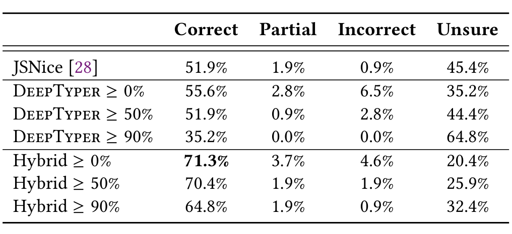

Table 5: Comparison of DeepTyper, JSNice, and Hybrid of both across thirty randomly selected JavaScript functions.

their body. Thus each function requires two type annotations at the very least. Because the evaluation had to be performed manually, we examined thirty JavaScript functions.11 For each function we manually determined the correct types to use as an oracle for evaluation and comparison, assigning any if no conclusive type could be assigned. As a result, we identified 167 annotations (on function return types, local variables, parameters and attributes) of which 108 were clearly not any types.

Again, we focus on predicting only the non-any types, since these are most likely to be helpful to the user. Cases in which JSNice predicted ? or Object, and cases where DeepTyper predicted any or was not sufficiently confident are all treated as “Unsure”. We again show results for various confidence thresholds for DeepTyper (across a slightly lower range than before, to better match the “Unsure” rate of JSNice) and include another hybrid model, in which DeepTyper may attempt to “correct” any cases in which both JSNice was uncertain (or did not annotate a type at all) and DeepTyper is sufficiently confident. The results are shown in Table 5.

At the lowest threshold, DeepTyper gets both more types correct and wrong than JSNice, whereas at the highest threshold it makes no mistakes at all while still annotating more than one-third of the types correctly. JSNice made one mistake, in which it assigned a type that was too specific given the context.12 We also count “partial” correctness, in which the type given was too specific, but close to the correct type. This includes cases in which both JSNice and DeepTyper suggest HTMLElement instead of Element.

Overall, DeepTyper’s and JSNice’s performances are very similar on this task, despite DeepTyper having been trained primarily on TypeScript code, using a larger type vocabulary and not requiring any information about the snippet beyond its tokens. The two approaches are also remarkably complementary. JSNice is almost never incorrect when it does provide a type, but it is more often uncertain, not providing anything, whereas DeepTyper makes more predictions, but is incorrect more often than JSNice. A Hybrid approach in which JSNice is first queried and DeepTyper is used if JSNice cannot provide a type shows a dramatic improvement over each approach in isolation and demonstrates that JSNice and DeepTyper work well in differing contexts and for differing types. When using a 90% confidence threshold, the Hybrid model boosts the accuracy by 12.9 percentage points (51.9% to 64.8%) while introducing

no additional incorrect or partially correct annotations. At the 0% threshold, the Hybrid model is more than 15 percentage points more likely to be correct than either model separately, while introducing fewer errors than DeepTyper would by itself.

Qualitatively, we find that DeepTyper particularly outperforms JSNice when the type is intuitively clear from the context, such as for cssText in Figure 1. It expresses high confidence (and corresponding accuracy) in tokens whose name include cues towards their type (e.g. “name” for string) and/or are used in idiomatic ways (e.g. concatenation with another string, or invoking element-related methods on HTMLElement-related types). JSNice often declares uncertainty on these because of a possibly ambiguous type (e.g. string concatenation does not imply that the right-hand argument is a string, and other classes may have declared similarly named methods). Vice versa, when JSNice does infer a type, it is very precise: whereas DeepTyper often gravitates to a subtype or supertype (especially any, if a variable is used in several far-apart places) of the true type, JSNice was highly accurate when it did not declare uncertainty and was able to include information (such as dataflow connections) from across the whole function, regardless of size. Altogether, our results demonstrate that these two methods excel at different locations, with JSNice benefiting from its access to global information and DeepTyper from its powerful learned intuition.

## 6 DISCUSSION

### 6.1 Learning Type Inference

Type inference is traditionally an exact task, and for good reason: unsound type inference risks breaking valid code, violating the central law of compiler design. However, sound type inference for some programming languages can be greatly encumbered by features of the language design (such as eval() in JS). Although the TypeScript compiler with CheckJS achieved good accuracy in our experiments in which it had access to the full project, it could still be improved substantially by probabilistic methods, particularly at the many places where it only inferred any. With partial typing now an option in languages such as TypeScript and Python, there is a need for type suggestion engines, that can assist programmers in enriching their code with type information, preferably in a semi-automatic way.

A key insight of our work is that type inference can be learned from an aligned corpus of tokens and their types, and such an aligned corpus can be obtained fully automatically from existing data. This is similar to recent work by Vasilescu et al., who use a JavaScript obfuscator to create an aligned corpus of real-world code and its obfuscated counter-part, which can then be reversed to learn to de-obfuscate [33], although they did not approach this as a sequence tagging problem. This type of aligned corpus (e.g. text annotated with parse tags, named entities) is often a costly resource in natural language processing, requiring substantial manual effort, but comes all-but-free in many software related tasks, primarily because they involve formal languages for which interpreters and compilers exist. As a result, vast amounts of training data can be made available for tasks such as these, to great benefit of models such as the deep learners we used.

the accuracy by 12.9 percentage points (51.9% to 64.8%) while introducing

11 The source of these functions and the functions themselves will be released after anonymity is lifted.

12 We found several more such cases among variables whose true type was deemed any and are thus not included in this table.