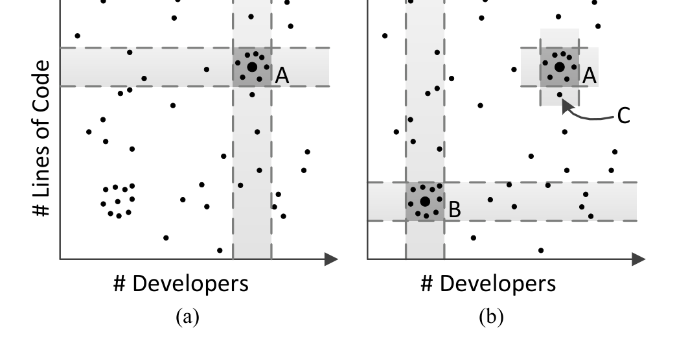
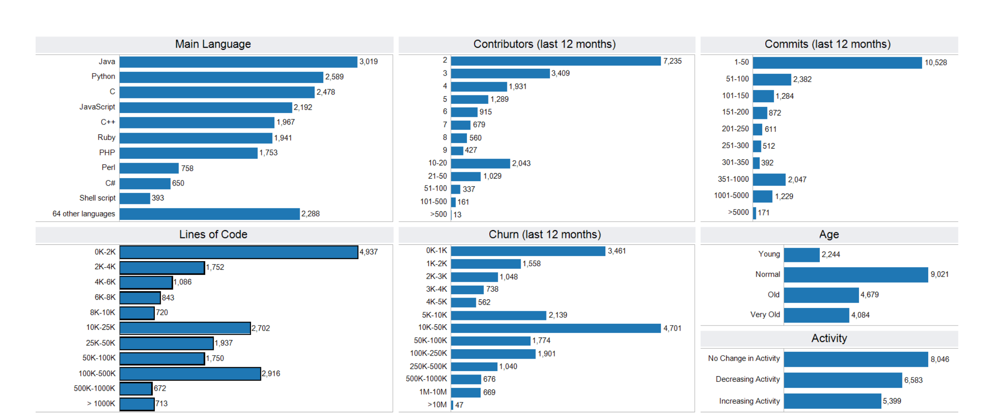
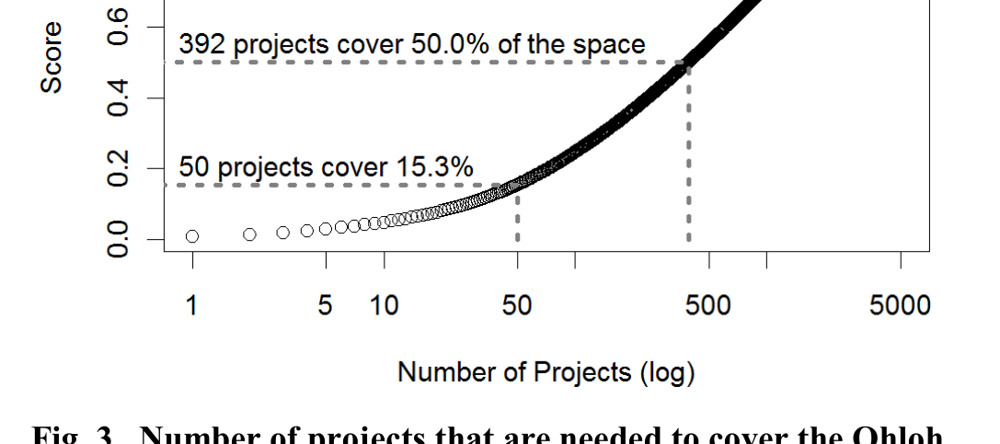
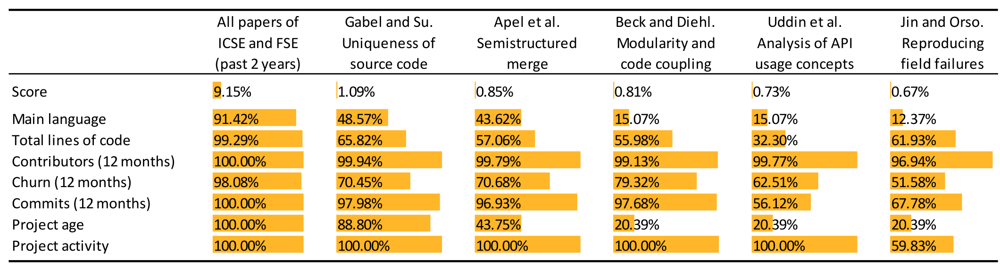

# Diversity in Software Engineering Research

Meiyappan Nagappan Thomas Zimmermann Christian Bird  
Software Analysis and Intelligence Lab Microsoft Research Microsoft Research  
Queen’s University, Kingston, Canada Redmond, WA, USA Redmond, WA, USA  
mei@cs.queensu.ca tzimmer@microsoft.com Christian.Bird@microsoft.com

mei@cs.queensu.ca tzimmer@m

## ABSTRACT
One of the goals of software engineering research is to achieve generality: Are the phenomena found in a few projects reflective of others? Will a technique perform as well on projects other than the projects it is evaluated on? While it is common sense to select a sample that is representative of a population, the importance of diversity is often overlooked, yet as important. In this paper, we combine ideas from representativeness and diversity and introduce a measure called sample coverage, defined as the percentage of projects in a population that are similar to the given sample. We introduce algorithms to compute the sample coverage for a given set of projects and to select the projects that increase the coverage the most. We demonstrate our technique on research presented over the span of two years at ICSE and FSE with respect to a population of 20,000 active open source projects monitored by Ohloh.net. Knowing the coverage of a sample enhances our ability to reason about the findings of a study. Furthermore, we propose reporting guidelines for research: in addition to coverage scores, papers should discuss the target population of the research (universe) and dimensions that potentially can influence the outcomes of a research (space).

## Categories and Subject Descriptors
D.2.6 [Software Engineering]: Metrics

## General Terms
Measurement, Performance, Experimentation

## Keywords
Diversity, Representativeness, Sampling, Coverage

## 1. INTRODUCTION
Over the past twenty years, the discipline of software engineering research has grown in maturity and rigor. Researchers have worked towards maximizing the impact that software engineering research has on practice, for example, by providing techniques and results that are as general (and thus as useful) as possible. However, achieving generality is not easy: Basili et al. [1] remarked that “general conclusions from empirical studies in software engineering are difficult because any process depends on a potentially large number of relevant context variables”.

With the availability of OSS projects, the software engineering research community has moved to more extensive validation. As an extreme example, the study of Smalltalk feature usage by Robbes et al. [2] examined 1,000 projects. Another example is the study by Gabel and Su that examined 6,000 projects [3]. But if care isn’t taken when selecting which projects to analyze, then increasing the sample size does not actually contribute to the goal of increased generality. More is not necessarily better.

As an example, consider a researcher who wants to investigate a hypothesis about, say, distributed development on a large number of projects in an effort to demonstrate generality. The researcher goes to the json.org website and randomly selects twenty projects, all of them JSON parsers. Because of the narrow range of functionality of the projects in the sample, any findings will not be very representative; we would learn about JSON parsers, but little about other types of software. While this is an extreme and contrived example, it shows the importance of systematically selecting projects for empirical research rather than selecting projects that are convenient. With this paper we provide techniques to (1) assess the quality of a sample, and to (2) identify projects that could be added to further improve the quality of the sample.

Other fields such as medicine and sociology have published and accepted methodological guidelines for subject selection [2] [4]. While it is common sense to select a sample that is representative of a population, the importance of diversity is often overlooked yet as important [5]. As stated by the Research Governance Framework for Health and Social Care by the Department of Health in the UK:

> “It is particularly important that the body of research evidence available to policy makers reflects the diversity of the population.” [6]

Similarly the National Institutes of Health in the United States developed guidelines to improve diversity by requiring that certain subpopulations are included in trials [4]. The aim of such guidelines is to ensure that studies are relevant for the entire population and not just the majority group in a population.

Intuitively, the concepts of diversity and representativeness can be defined as follows:

- Diversity. A diverse sample contains members of every subgroup in the population and within the sample the subgroups have roughly equal size. Let’s assume a population of 400 subjects of type X and 100 subjects of type Y. In this case, a perfectly diverse sample would be 1×X and 1×Y.

- Representativeness. In a representative sample the size of each subgroup in the sample is proportional to the size of that subgroup in the population. In the example above, a perfectly representative sample would be 4×X and 1×Y.

Note that based on our definitions diversity (“roughly equal size”) and representativeness (“proportional”) are orthogonal concepts. A highly diverse sample does not guarantee high representativeness and vice versa.

---

In this paper, we combine ideas from diversity and representativeness and introduce a measure called sample coverage, or simply coverage — defined as the percentage of projects in a population that are similar to a given sample. Rather than relying on explicit subgroups that are often difficult to identify in the software domain, we use implicit subgroups (neighborhoods) based on similarities between projects; we will discuss details in Section 2.

Sample coverage allows us to assess the quality of a given sample; the higher the coverage, the better (Section 2.3). Further, it allows prioritizing projects that could be added to further improve the quality of a given sample (Section 2.4). Here the idea is to select projects based on the size of their neighborhood not yet covered by the sample. In other words, select projects first that add the most coverage to a sample. This is a hybrid selection strategy: neighborhoods are typically picked only once (reflecting ideas from diversity) but the neighborhoods with the highest coverage are picked first (reflecting ideas from representativeness).

We make the following contributions with this paper:

1. We introduce a vocabulary (universe, space, and configuration) and technique for measuring how well a sample covers a population of projects.
2. We present a technique for selecting projects in order to maximize the coverage of a study.
3. We provide a publicly available R implementation of the algorithms and the data used in this paper. Both have been successfully evaluated by the ESEC/FSE artifact evaluation committee and found to meet expectations.
4. We assess the sample coverage of papers over two years at ICSE and FSE with respect to a population of 20,000 active open source projects and provide guidance for reporting project selection.

Understanding the coverage of a sample can help to understand the context under which the results are applicable. We hope that the techniques and recommendations in this paper will be used by researchers to achieve consistent methods of selecting and reporting projects for their research.

In the rest of this paper, we first present a general technique for evaluating the coverage of a sample with respect to a population of software projects and selecting a sample with maximum coverage (Section 2). We then demonstrate this technique by calculating the coverage of research over two years at ICSE and FSE (Section 3). Then, we provide appropriate methods of reporting coverage and project selection in general and discuss implications (Section 4). Finally we present related work (Section 5), and our conclusions (Section 6).

## 2. SAMPLE COVERAGE

In this section, we present a technique for assessing the coverage of a sample: we first introduce our terminology (Section 2.1 and 2.2) followed by algorithms to score the coverage of a sample of projects (Section 2.3) and select the projects that increase the coverage the most (Section 2.4).

We implemented both algorithms (from Section 2.3 and 2.4) in the R programming language [8]; they are available as an R package. The appendix has a walkthrough on how to use our implementation.

### 2.1 Universe, Space, and Configuration

The universe is a large set of projects; it is often also called population. The universe can vary for different research areas. For example, research on mobile phone applications will have a different universe than web applications.

Possible universes:
- all open-source projects, all closed-source projects, all web applications, all mobile phone applications, all open-source projects on Ohloh, and many others.

Within the universe, each project is characterized with one or more dimensions.

Possible dimensions:
- total lines of code, number of developers, main programming language, project domain, recent activity, project age, and many others.

The set of dimensions that are relevant for the generality of a research topic define the space of the research topic. Similar to universes, the space can vary between different research topics. For example, we expect program analysis research to have a different space than empirical research on productivity:

Possible space for program analysis research:
- total lines of code, main programming language.

Possible space for empirical research on productivity:
- total lines of code, number of developers, main programming language, project domain, recent activity, project age, and likely others.

The goal for a research study should be to provide a high coverage of the space in a universe. The underlying assumption of this paper is that projects with similar values in the dimensions—that is they are close to each other in the space—are representative of each other. This assumption is commonly made in the software engineering field, especially in effort estimation research [9,10]. For each dimension d, we define a similarity function that decides whether two projects p1 and p2 are similar with respect to that dimension:

similar_d(p1, p2) → {true; false}

The list of the similarity functions for a given space is called the configuration.

configuration C = (similar_1, ..., similar_n)

Similar to universe and space, similarity functions (and the configuration) can vary across research studies. For some research topics, projects written in C might be considered similar to projects written in C++, while for other research they might be considered different.

To identify similar projects within the universe, we require the projects to be similar to each other in all dimensions.

similar(p1, p2) = ∧_d similar_d(p1, p2)

If no similarity function is defined for a dimension, we assume the following default functions, with p[d] the value of project p in dimension d and |e| the absolute (positive) value of the specified expression e:

- For numeric dimensions (e.g., number of developers): We consider two projects to be similar in a dimension if their values are in the same order of magnitude (as computed by log10 and expressed by the 0.5 threshold below).

similar_d(p1, p2) → |log10 p1[d] − log10 p2[d]| ≤ 0.5

---

- For categorical dimensions (e.g., main programming language): We consider two projects to be similar in a dimension if the values are identical.
  similar_d(p1, p2) → p1[d] = p2[d]

As mentioned above the similarity functions can be overridden in a configuration. Different configurations may exist for different research topics and areas. The distinction into numerical and categorical dimensions is a simplification as not all measurements of software are on a numerical and absolute scale. Measurements that are on ordinal scale could easily be accounted for with custom similarity functions.

## 2.2 Example: Coverage and Project Selection

Figure 1(a) shows a sample universe and a sample space: the universe contains 50 projects, each represented by a point. The space is defined by two dimensions: the number of developers (horizontal) and the number of lines of code (vertical). In practice, the universe can be thousands of projects and the space can be defined by numerous dimensions, not just two. We will present a more complex instantiation of our framework in Section 3.

Consider project A in Figure 1(a) which is represented by an enlarged point. The light gray areas indicate the projects that are similar to project A in one dimension (based on the similarity functions that are defined in the configuration). The intersection of the light gray areas (the dark gray area) indicates the projects that are similar to A with respect to the entire space. In total seven other projects are similar to A. Thus project A covers (7+1)/50 = 16% of the universe. We can also compute coverage for individual dimensions: project A covers 13/50 = 26% for number of developers and 11/50 = 22% for lines of code.

Figure 1(b) illustrates how a second project increases the coverage:
- If we add project B, ten additional projects are covered, the universe coverage increases to 18/50 = 36%. The coverage of the developer and lines of code dimensions increases to 60% and 56% respectively.
- However, if we add project C instead of project B, there is only little impact on coverage. All similar projects have been already covered because project C is close to project A. Thus the universe coverage increases only to 18%.



(a) (b)  
Fig. 1. Sample universe of 50 projects defined by a two-dimensional space. (a) The light gray areas indicate projects similar to project A in one dimension. The dark gray areas indicate projects similar to project A in both dimensions. (b) Project B increases the coverage of the space more than project C does, because C is too similar to projects already covered by project A.

### ALGORITHM I. Scoring Projects

```
score_projects(projects P, universe U, space D, config C):
1:  c_space ← ∅
2:  c_dim ← [∅, …, ∅]
3:  for each project p ∈ P:
4:    c_project ← U
5:    for each dimension d ∈ D:
6:      are_similar(p, q) ← C[d](p, q)
7:      sim_projects ← {q | are_similar(p, q)}
8:      c_project ← c_project ∩ sim_projects
9:      c_dim[d] ← c_dim[d] ∪ sim_projects
10:   c_space ← c_space ∪ c_project
11: score ← |c_space| / |U|
12: dim_score ← apply(c_dim, X → |X| / |U|)
13: return (score, dim_score)
```

### ALGORITHM II. Selecting the Next Projects

```
next_projects(K, projects P, universe U, space D, config C):
1:  result ← [ ]
2:  similar(p, q) = C[1](p, q) ∧ … ∧ C[d](p, q)
3:  c_space ← ⋃_{p∈P} { q | similar(p, q) }
4:  candidates ← U − P
5:  for i ∈ {1, …, K}:
6:    c_best ← ∅
7:    p_best ← NA
8:    for each candidate p ∈ candidates:
9:      c_candidate ← { q | similar(p, q) }
10:     c_new ← (c_space ∪ c_candidate) − c_space
11:     if |c_new| > |c_best|:
12:       c_best ← c_new
13:       p_best ← p
14:   if p_best = NA:
15:     break
16:   result ← append(result, p_best)
17:   candidates ← candidates − {p_best}
18:   c_space ← c_space ∪ c_best
19: return (result)
```

This illustrates an important point: to provide a good coverage of the universe, one should select projects that are diverse rather than similar to each other. We now introduce algorithms to score the coverage (score_projects) and to select additional projects such that the coverage is maximized (next_projects).

## 2.3 Computing Coverage

We compute the sample coverage of a set of projects P for a given universe U, an n-dimensional space D, and a configuration (similar1, …, similarn) as follows. (Recall that the definition of similar is similar = similar1 ∧ … ∧ similarn)

coverage = |⋃_{p∈P} { q | similar(p, q) }| / |U|

As discussed before, research topics can have different parameters for universe, space, and configuration. Therefore it is important to not just report the coverage but also the context in which it was computed: What projects is the research intending to be relevant to?

---

for (universe)? What criteria matter for findings to hold for other projects (space, configuration)?

To compute the coverage for a set of projects, we implemented the algorithm shown in Algorithm I in R. For each project p ∈ P, the algorithm computes the set of projects c_project that are covered by p (Lines 3–10). As a naming convention we use the prefix c_ in variable names for sets of covered projects. In addition, the algorithm computes the projects c_dim[d] covered by each dimension d (Line 9). After iterating through the set P, the algorithm computes the coverage score within the entire space (Line 11) and for each dimension (Line 12). The apply function maps the function X → |X|/|U| to the vector c_dim and returns a vector with the result.

### 2.4 Project Selection

In order to guide project selection in such a way that the coverage of a sample is maximized, we implemented the greedy algorithm that is shown in Algorithm II. The input to the algorithm is the number K of projects to be selected, a set of already selected projects P, a universe U, an n-dimensional space D, and a configuration C = (similar1, ... , similar_n).

The algorithm returns a list of up to K projects; the list is ordered decreasingly based on how much the projects increase the coverage of the space. The set of preselected projects P can be empty. By calling the algorithm with P = ∅ and K = |U| one can order the entire universe of projects based on their coverage increase and return the subset of projects that is needed to cover the entire universe (for a score of 100%).

The main part of the algorithm is the loop in Lines 5–18 that is repeated at most K times. The loop is exited early (Lines 14–15) when no project is found that increases the coverage; in this case the entire universe has been covered (score of 100%). The algorithm maintains a candidate set of projects (candidates), which is initialized to the projects in universe U but not in P (Line 4, we use − to denote set difference). The body of the main loop computes for each candidate p ∈ candidates (Lines 8–13) how much its coverage (Line 9) would increase the current coverage c_space (Line 10) and memorizes the maximum increase (Lines 11–13). At the end of an iteration i, the project p_best with the highest coverage increase is appended to the result list and then removed from the candidates list (Lines 16–17); the current coverage c_space is updated to include the projects in c_best (Line 18).

Our R implementation includes several optimizations that are not included in Algorithm I for the sake of comprehension. To reduce the cost of set operations we use index vectors in R (similar to bit vectors). Computing the projects similar to a candidate in Line 9 is an expensive operation and we therefore cache the results across loop iterations. Lastly, starting from the second iteration, we process candidates in Line 10 in decreasing order of their |c_new| values from the previous iteration. The |c_new| values from iteration i − 1 are an upper bound of how much a candidate can contribute to the coverage in iteration i. If the current best increase |c_best| in iteration i is greater or equal than the previous increase |c_new| of the current candidate in iteration i − 1, we can exit the inner loop (Lines 8–13) and skip the remaining candidates. This optimization significantly reduces the search space for projects.

### 2.5 Implementation in R

The R implementation of the algorithms for computing coverage and selecting next projects is publicly available:

http://sailhome.cs.queensu.ca/replication/representativeness/

## 3. THE OHLOH CASE STUDY

In this section we provide an example of how to apply our technique and illustrate how it can be used to quantify the coverage of software engineering research.

### 3.1 The Ohloh Universe

We chose as universe the active projects that are monitored by the Ohloh platform [11]. Ohloh is a social coding platform that collects data such as main programming language, number of developers, licenses, as well as software metrics (lines of code, activity statistics, etc.). Note that the Ohloh data is just one possible universe and there are many other universes that could be used for similar purposes.

To collect data to describe the projects in the universe, we used the following steps:

1. We extracted the identifiers of active projects using the Project API of Ohloh. We decided to include only active projects in the universe because we wanted to measure coverage for ongoing development. We followed Richard Sands' definition [12] of an active project, that is, a project that had at least one commit and at least 2 committers in the last 12 months.
2. For each project identifier, we extracted three different categories of data (each with one call to the API). The first is the Analysis category which has data about main programming language, source code size and contributors. The second is the Activity category which summarizes how much source code developers have changed each month (commits, churn). We accumulated the activity data for the period of June 2011 to May 2012. Finally, we collected what is called the Factoid category. This category contains basic observations about projects such as team size, project age, comment ratio, and license conflicts.
3. We aggregated the XML files returned by the Ohloh APIs and converted them into tab-separated text files using a custom script. We removed projects from the universe that had missing data (156 projects had no main language or an incomplete code analysis) or invalid data (40 projects had a negative number for total lines of code).

After selecting only active projects and removing projects with missing and invalid data, the universe consists of a total of 20,028 projects. This number is comparable to the number of active projects reported by Richard Sands [12].

### 3.2 The Ohloh Space

We use the following dimensions for the space. The list of dimensions is inspired by the comparison feature in Ohloh. The data for the dimensions is provided by Ohloh.

- Main language. The most common programming language in the project. Ohloh ignores XML and HTML when making this determination.
- Total lines of code. Blank lines and comment lines are excluded by Ohloh when counting lines of code.
- Number of contributors (12 months). Contributors with at least one commit in the last 12 months.
- Number of churn (12 months). Number of added and deleted lines of code, excluding comment lines and blank lines, in the last 12 months.
- Number of commits (12 months). Commits made in the last 12 months.

---



Fig. 2. Histograms of the dimensions in the Ohloh universe.

- Project age. The Ohloh factoid for project age: projects less than 1 year old are Young, between 1 year and 3 years they are Normal, between 3 and 5 years they are Old, and above 5 years they are Very Old.
- Project activity. The Ohloh factoid for project activity: if during the last 12 calendar months, there were at least 25% fewer commits than in the prior 12 months, the activity is Decreasing; if there were 25% more commits, the activity is Increasing; otherwise the activity is Stable.

In our case, metrics for the last 12 months are for the period of June 2011 to May 2012. Again this is just one possible space and there will be other dimensions that can be relevant for the generality of research.

Figure 2 shows the distributions of the dimensions in our dataset. There are over 70 programming languages captured in the Ohloh dataset; the most frequently used languages are Java, Python, C, and JavaScript. A large number of projects are very small in terms of size, people, and activity: 4,937 projects are less than 2,000 lines of code; yet 713 projects exceed a million lines of code. Many projects have only 2 contributors (7,235 projects) and not more than 50 commits (10,528 projects) in the last 12 months. Again there are extreme cases with hundreds of contributors and thousands of commits.

### 3.3 Covering the Ohloh Universe

As a first experiment, we computed the set of projects required to cover the entire population of 20,028 Ohloh projects. For this we called the next_projects algorithm with N = 20,028, an empty initial project list P, and the default configuration (see Section 2.1).

```
next_projects(N = 20028, projects P = ∅, universe U = ohloh, space D, config C)
```

Figure 3 shows the results with a cumulative sum plot. Each point (x,y) in the graph indicates that the first x projects returned by next_projects covered y percent of the Ohloh universe. The first 50 projects (or 2.5%) covered 15.3% of the universe, 392 projects covered 50%, and 5030 projects covered the entire universe.

In Table 1 we show the first 15 projects returned by the algorithm next_projects. These are the projects that increase the coverage of the space the most. We draw the following conclusions. First, small software projects written in dynamic languages dominate the list (seven of the first nine are in Ruby or Python and under 2000 LOC). Are researchers exploring the problems faced by these projects? Even when considering all 15 projects, these projects together comprise less than 200,000 LOC and just over 1,000 commits, an order of magnitude lower than for Apache HTTP, Mozilla Firefox, or Eclipse JDT. The time and space required to analyze or evaluate on these projects are fairly low, providing a ripe opportunity for researchers to achieve impact without large resource demands. This result also counters a common criticism of some software engineering research: some people expect that research always has to scale to large software and pay less attention to smaller projects. However, as Table I and Figure 2 show, the space covered by smaller projects is non-negligible.

### 3.4 Covering the Ohloh Universe with the ICSE and FSE conferences

We now apply our technique instantiated with the Ohloh universe to papers from premiere conferences in the software engineering field: the International Conference on Software Engineering (ICSE) and Foundations of Software Engineering (FSE). This section does not mean to make general conclusions about the entire



Fig. 3. Number of projects that are needed to cover the Ohloh universe. Each point in the graph means that x projects can cover y percent of the universe.

---

## TABLE 1. The first 15 projects returned by next_projects (N = 20028, projects P = ∅, universe U = ohloh, space D, config C) with the increase in coverage

| Name | Language | Lines | Contributors | Commits | Churn | Age | Activity | Increase |
|---|---:|---:|---:|---:|---:|---|---|---:|
| serialize_with_options | Ruby | 301 | 2 | 10 | 147 | Normal | Increasing | 0.574% |
| Java Chronicle | Java | 3892 | 4 | 81 | 8629 | Young | Stable | 0.569% |
| Hike | Ruby | 616 | 3 | 11 | 333 | Normal | Stable | 0.559% |
| Talend Service Factory | Java | 20295 | 8 | 162 | 27803 | Normal | Stable | 0.549% |
| OpenObject Library | Python | 1944 | 5 | 36 | 1825 | Normal | Stable | 0.459% |
| ruote-amqp-pyclient | Python | 315 | 4 | 7 | 139 | Normal | Stable | 0.454% |
| sign_server | Python | 1791 | 3 | 63 | 3415 | Young | Stable | 0.414% |
| redcloth-formatters-plain | Ruby | 655 | 4 | 5 | 82 | Normal | Decreasing | 0.384% |
| python-yql | Python | 1933 | 2 | 11 | 93 | Normal | Decreasing | 0.369% |
| mraspaud's mpop | Python | 12664 | 7 | 160 | 22124 | Normal | Stable | 0.369% |
| appengine-toolkit | JavaScript | 18253 | 5 | 110 | 20572 | Normal | Stable | 0.364% |
| socket.io-java | Java | 23533 | 4 | 187 | 46254 | Young | Stable | 0.335% |
| Glinux | C | 41052 | 8 | 55 | 3114 | Very Old | Decreasing | 0.335% |
| Pax URL | Java | 31467 | 7 | 73 | 6923 | Old | Decreasing | 0.330% |
| Honeycrm | Java | 14864 | 2 | 45 | 3810 | Normal | Decreasing | 0.315% |

## TABLE 2. The representativeness of all ICSE and FSE papers in the past 2 years as well as the five most representative papers. The universe is the active Ohloh projects, the space is (Main language, Total lines of code, Contributors, Churn, Commits, Project age, Project activity) and the configuration consists of the default similarity functions.



software engineering community. Rather, results should only be viewed in the context of the papers in those two years of those two conferences (ICSE 2011, 2012 and FSE 2010, 2011).

To create the dataset the first author read each (full) paper of the main technical research track in each conference, looked for the software projects that were analyzed and recorded the number — and, if mentioned, the names of the projects in a spreadsheet. We then queried Ohloh for each of the software projects to find the corresponding identifier, which we used to cross-reference the data with our corpus.

Some projects we could not cross reference with our dataset because of any one of the following reasons: (a) the project was not indexed by Ohloh; (b) the paper used an aggregated set of projects, and particular projects were not named in the paper; (c) the project does not meet the criteria to be included in the universe, e.g., the project has not been under development in the past year, has only one developer, or has missing or invalid data.

The analysis of the ICSE and FSE conferences revealed several large-scale studies that analyzed hundreds, if not thousands, of projects. Some of these papers we had to exclude from our analysis as they either analyzed closed-source projects or did not report the names of the individual projects analyzed or analyzed inactive Ohloh projects.

### What are the most frequently used projects in the ICSE and FSE conferences?

We found 635 unique projects that were analyzed by the ICSE and FSE conferences in the two-year period. Out of these we could map 207 to the universe of active Ohloh projects.

The most frequently studied projects were the Eclipse Java Development Tools (JDT) in 16 papers, Apache HTTP Server in 12 papers, gzip, jEdit, Apache Xalan C++, and Apache Lucene each in 8 papers, and Mozilla Firefox in 7 papers. Another frequently studied project is Linux, which was analyzed in 12 papers. While the Linux project is listed on Ohloh, the code analysis has not yet completed.

---

### How much of the Ohloh universe do the ICSE and FSE conferences cover?

The 207 Ohloh projects analyzed in the two years of the ICSE and FSE conferences covered 9.15% of the Ohloh population. At first glance this score seems low, but one has to keep in mind that it is based on a strict notion of coverage: values in all dimensions have to be similar for a project to be similar to another. Low scores are not bad as we will discuss in Section 4.1.

Our algorithm also measures the coverage for each dimension. Here numbers are very promising (see column “All papers of ICSE and FSE” in Table 2): for all but one dimension the coverage scores exceed 98%, which indicates that research published at ICSE and FSE covers a wide spectrum of software in terms of team size, activity, and project size. The lowest score is for programming language, but still at an impressive 91.42%. The unstudied languages highlight opportunities for future research: Objective-C is used by 245, Vim script by 145, Scala by 119, Erlang by 108, and Haskell by 99 projects.

### What are showcases of research with high coverage?

We identified several outstanding papers in terms of coverage. In Table 2, Columns 3 to 8 show the total coverage score and the dimension scores for the five papers with the highest coverage:

- “A study of the uniqueness of source code” by Gabel and Su [3] analyzed over 6,000 projects of which 30 were named in the paper and analyzed in depth. The score is computed for only the 30 named projects. The bulk of the corpus is from the source distribution of the Fedora Linux distribution (rel. 12). The authors studied multiple programming languages (C, C++, Java).
- “Semistructured merge: rethinking merge in revision control systems” by Apel et al. [13] evaluated a merge algorithm on 24 projects written in the C#, Python, and Java languages.
- “On the congruence of modularity and code coupling” by Beck and Diehl [14] analyzed 16 small to medium sized projects written in Java.
- “Temporal analysis of API usage concepts” by Uddin et al. [15] studied 19 client software projects. They covered a wide spectrum of project size (5.9 to 2991.8 KLOC) but given the nature of their study focused on older projects with larger amounts of history.
- “BugRedux: Reproducing field failures for in-house debugging” by Jin and Orso [16] recreated 17 failures of 15 real world programs. The size of the projects was between 0.5 and 241 KLOC.

Again the total scores seem to be low, which we will discuss in Section 4.1. More importantly, however, the numbers in Table II allow assessing which dimensions papers covered well and which dimensions need improvement. For example, Beck and Diehl [14], Uddin et al. [15], and Jin and Orso [16] focused on a single programming language (Java and C respectively). To further increase the generality, additional languages may be studied. Another example is project age: all three papers focused on older projects, possibly because they needed long project histories that are only available for older projects.

Note that this is not a criticism of this research; these are merely ideas on how to increase the coverage of the Ohloh universe.

Note that the relevant target universe may be different for each paper. For example, research on Java projects may limit itself to a Java universe.

It is noteworthy that several of these papers selected their subjects with respect to a dimension that is not included in our space: the functionality of the software. This dimension could be easily added to our space and accounted for in our score computation, given the availability of data.

### 3.5 Data Availability

All data that has been used for the experiments in this section is available at the following URL. This includes the Ohloh data for universe and space and spreadsheets with the conference data.

http://sailhome.cs.queensu.ca/replication/representativeness/

## 4. DISCUSSION

Having introduced our technique for assessing the coverage of a project sample and demonstrated it on recent software engineering research, we now discuss issues surrounding the use of such a technique in research. The use is not as straightforward as one might think. Here are some considerations.

### 4.1 Understanding (Low) Coverage

One observation that we have made in the course of using our techniques is that many studies have low levels of coverage. At first glance, one might be tempted to conclude that these studies do not contribute much to the body of knowledge in software engineering or that others with higher coverage are better. A low coverage of a study does not devalue the research, but rather gives further insight into the results.

For example, Zhou et al.’s recent result that bug report attributes can be used to automatically identify the likely location of a fix was evaluated on Eclipse JDT, SWT, AspectJ, and ZXing [17]. The coverage score for this paper across the Ohloh universe is 0.0028. The low coverage does not mean that the results are invalid or not useful. Rather, it yields additional insight into the technique. For example, all projects used in this paper were Java and C++ codebases aimed at developers (SWT and ZXing are libraries, Eclipse JDT and AspectJ are tools for Java development) — for a universe of developer-oriented Java libraries and tools, the coverage score would likely be higher. As the paper demonstrated, bugs reported against libraries and Java tools contain relevant information to help identify fix locations. Thus, others building on this work might also evaluate on Java tools and libraries. Other avenues of research include investigating whether the approach also works well for codebases where bug reporters are not as likely to be developers.

> bases where bug reporters are not as likely to be developers.
> Coverage scores do not increase or decrease the importance of research, but rather enhance our ability to reason about it.

### 4.2 The Quest for Generality

The discussion from the previous subsection leads to a related point. Few empirical findings in software engineering are completely general [1]. A finding that is true in the context of large-scale Java development for an enterprise server on a ten-year-old codebase may not hold for a relatively new Android widget. There may be fear when reporting results and trying to achieve generality that unless some hypothesis is confirmed in all cases, it does not contribute to the body of knowledge in software engineering and is not fit for publication. This isn’t so.

Kitchenham’s work on within- and cross-company effort estimation [18] showed that it is indeed possible to estimate effort of one...

---

project based on history of others, but that there is no general rule for effort estimation. Rather they used regression analysis to find that similarities in the size of the development team, number of web pages, and high effort functions between projects in different companies are related to similar effort requirements (i.e., different projects have different effort requirements, but projects that are similar to each other have similar effort needs).

Knowledge can be synthesized even when empirical results differ along dimensions in the space. Systematic reviews rely upon this principle. The recent review of fault prediction performance by Hall et al. [19] essentially constructed a space consisting of modeling techniques, metrics used, and granularity and found that fault prediction approaches performed differently. However, they were also able to conclude that simpler modeling techniques such as Naive Bayes and Logistic regression tended to perform the best. In the same way, selecting projects that cover a large area in the project universe and examining where results are valid and where they are not, does give deeper insight into the research results. As Murphy-Hill et al. explain, “simply explaining the context in which a study occurs goes a long way towards creating impactful research” because this allows someone to “decide whether your research applies to her.” [20]

> Results that differ can still have value, especially in a space that is highly covered.

## 4.3 Reporting Coverage

We have provided a technique for computing coverage scores for samples and for selecting a sample of software projects with high coverage. While selecting projects in a rigorous and systematic way is important, reporting in a consistent and consumable manner is just as important.

Most papers include a summary of characteristics of the projects included (e.g., size, age, number of checkins, number of contributors, language). This is an appropriate place to report the coverage of the selected sample of projects. As illustrated in Section 3, the universe and the space that is used should also be explicitly described and the rationale provided. How was the universe chosen? Why was each dimension in the space selected? For example, one might select only Java projects as a universe if a technique only makes sense in the context of Java.

If projects from different parts of the space show different results, they should be reported and discussed. Differences by dimension or location in the space provide a unique opportunity to refine theories and investigate further.

Finally, issues in sampling can affect external validity. Any potential problems or gaps in coverage should be discussed in a section discussing validity, usually entitled “Threats to Validity” or “Limitations”.

> Always report the universe, space, and configuration with any coverage score.

coverage score.

## 4.4 Next Steps

What do we hope will come from this work? Our goal has not been to claim or imply that prior work is flawed, but rather to show that we can improve our practice and provide methods to do so. It is our hope that researchers will begin to select projects in a more systematic way and improve the reporting on why projects were selected. The concepts introduced in this paper can also be exploited for replication studies: either to strictly replicate a study on similar samples, or otherwise to replicate on different samples, in order to determine whether the previously observed results generalize.

We realize that different studies and techniques are aimed at different problems and thus the goal may not always be to achieve maximum coverage of all software projects. Furthermore, the dimensions that people care about may differ. For instance, when evaluating techniques for mining API rules, the age of each project may not be of concern. Our technique is general enough that researchers can define their own universe (the population they want to target with their research) and space (the dimensions that are relevant for their research). But it does little good if each study reports its coverage using different and opportunistic spaces and universes. We hope that this work sparks a dialog about diverse and representative software engineering research and that some level of consensus on what universes and spaces are appropriate will be achieved. For some areas finding appropriate dimensions that relate to generality and can be easily quantified might be challenging. It is likely that different subdisciplines will arrive at different answers to these questions, which we feel is reasonable.

## 5. RELATED WORK

We identified related work in the areas of representativeness, reporting guidelines, and software testing.

### Representativeness

Some of the earliest research studies on representativeness were by Kahneman and Tversky [21] [22]. In their study, they stated that the sample size is not related to any property of the population and “will have little to no effect on judgment of likelihood”. In their experiments they determined that people's perception of the likelihood of an event depended more on its representativeness to the population than the size of it. Thus they concluded that there is a difference between people's judgment and the normative probabilities. They call this the representative heuristic. In a more recent study, Nilsson et al. [23] investigated the cognitive substrate of the representativeness heuristic. In our study we borrow the concept of representativeness from them. However, unlike their studies, we are not evaluating the likelihood of an event or how people's perception differs from the actual probability of an event. We rather propose the means to measure the representativeness of the sample (software systems used in the case study) to the population (the relevant universe of software).

Selecting samples for case studies has been a challenge in fields such as clinical trials, social sciences, and marketing for decades. Hence studies such as the one by Robinson et al. [24] evaluated selection biases and their effects on the ability to make inferences based on results in clinical trials. They found that biases did exist; certain subgroups were underrepresented (e.g., women) while others were overrepresented (e.g., blacks). Their statistical models found that the selection biases may not influence general outcomes of the trials, but would affect generalizability of results for select subgroups.

### Representativeness in Software Engineering

Another area of research that often encounters the issue of representativeness is the field of systematic literature reviews. If the set of studies selected to be a part of the literature review is not representative of the research field under study, then the conclusions of the reviews can potentially be biased. Hence a variety of guidelines that are written for conducting systematic literature surveys place a large emphasis on the selection of the studies that will be included in the review [25] [26] [27] [28]. All the guidelines suggest that the researchers conducting the review must make the selection and

---

rejection criteria clear for the reader to place the conclusions in context. In literature review studies researchers are not looking for a representative or diverse sample but rather a complete sample. The goal in literature reviews is to obtain every possible sample before including or rejecting them from the study. Hence steps such as searching the gray area of publications and asking experts in the field are suggested to obtain a more inclusive initial sample.

One line of research that attempts to rigorously achieve generality is the work on the COCOMO cost estimation model by Boehm et al. [29]. In this model, they collect software development project data and model it in order to help estimate and plan for the cost, effort and schedule of a project. The “Center for Systems and Software Engineering” at the University of Southern California to this day collects data to have a more representative dataset of projects, and to calibrate the model in order to provide better estimates [30]. Kemerer, in his validation of software cost estimation models, found that using an untuned cost estimation model can produce inaccurate estimates (up to 600% in some cases) [31]. In a more recent study, Chen et al. [32] examined how to prepare the available data in order to obtain better estimates. Unlike Chen et al.'s work, we do not provide techniques to pre-process an individual dataset. Our research goals are more similar to the research goals of the COCOMO model. The COCOMO model builds a statistical model with the available datasets. Then it tries to fit the current project that needs estimation, in this model to determine the particular space in the universe that this project belongs to. We use similar concepts, but attempt to determine how diverse the current set of projects is in terms of the universe.

### Reporting Guidelines

There have been several studies in software engineering on guidelines for conducting and reporting empirical software engineering research [33] [34] [35] [36] [37]. Most of these studies focus on the process to be followed in an empirical study. One of the common themes is that all of the studies include a set of guidelines for reporting the experimental setting. This description will help the reader in understanding the context of the study, and allows future researchers to replicate the study. With respect to the sample of software systems used in the experiments, these studies do not discuss how to select the sample, but rather discuss what to report about the selection.

Unlike these studies, in our work we present a technique for quantifying the coverage of a sample with respect to a population (universe), thereby helping people to better understand the context under which the results of a study are applicable.

### Software Testing

A key step in software development is testing the software to identify software components that may have bugs due to the current set of changes that have been applied to the software. Ideally, in this step, it is best to re-run all available test cases to give the best confidence that all components are bug free. However, due to limited resources, this may not be possible, and hence a test case selection strategy has to be adopted. The primary goal of a test case selection strategy is to identify the minimal set of test cases that are required to be re-run so that the quality of the entire software can be assured at a certain acceptable level. Therefore we can think of test case selection as the process of identifying a relevant sample from all the available test cases that covers the set of changes made by a developer.

The software testing community has extensively studied test case selection strategies [38] [39] [40] [41]. A set of the different approaches that have been proposed for regression test selection is presented in the survey by Yoo and Harman [42]. They identify a set of open research problems that have not been received much attention in the testing community. Graves et al. [43] and Rothermel and Harrold [44], in their respective research also present different test case selection techniques that are available and also empirically compare these techniques.

Orthogonal array testing [45] is a black box testing technique used when the number of inputs to a system is relatively small, but too large to allow for exhaustive testing of every possible input to the systems. Permutations are chosen in such a way that responses each give a unique piece of information. Although related, the approaches for orthogonal array testing are not a good fit for the universe and spaces described in this paper. First, there is a large number of potential input values, for example there are 74 main programming languages and many different magnitudes for size of projects in terms of lines of code and developers. Second, the dimensions in the space are not statistically independent (one of the key assumptions of orthogonal array testing) and many of the permutations identified may not exist in the universe (for example a Haskell project with 500+ contributors and only 1–50 commits in the last twelve months). The techniques in this paper consider only projects that exist in the universe.

Similar to picking test cases or parameter values to assure a certain level of quality, in our research we intend to pick a set of projects from a universe, to be used in a case study that is diverse enough, such that the claims made in the case study are more reliable. At the same time there are some differences: for test coverage, a line (or method or basic block) has to be actually executed in order to be counted for the coverage score. In contrast for sample coverage, it is sufficient if a similar project has been included in the sample. In addition, test selection strategies have different objectives: they optimize test executions in order to reveal failures fast, i.e., the defect detection likelihood. The techniques presented in this paper optimize for maximizing diversity of a sample instead.

## 6. CONCLUSION

With the availability of open source projects, the software engineering research community is examining an increasing number of software projects to test individual hypotheses or evaluate individual tools. However, more is not necessarily better and the selection of projects does count as well. With this paper we provide the research community with a technique to assess how well a research study covers a population of software projects. This helps researchers to make informed decisions about which projects to select for a study. Our technique has three parameters (universe, space, and configuration), which all can be customized based on the research topic and should be reported together with the coverage for any sample that is scored.

In our future work, we will further quantify the trade-off between efficiency and effectiveness: if one reduces the number of projects, while keeping the same coverage one can save time (efficiency), or one can increase the number of projects and increase coverage and the effectiveness of research. To achieve the maximum effectiveness for a given experimental effort, it will be important to quantify the impact of a lack of coverage on the results reported for software engineering experiments.

We hope that this work sparks a dialog about diverse and representative research in software engineering and that some level of consensus on appropriate universes and spaces will be reached, which likely will differ across different subdisciplines. We also hope that more datasets will become available, that allow us to explore alternative universes and spaces.

---

Our technique also extends to researchers analyzing closed source projects. They can now describe the universe and space of their projects without revealing confidential information about the projects or their metrics and place their results in context. Companies can use our technique to place academic research into the context of their own development by computing the coverage against a company-specific universe and space.

## 7. ACKNOWLEDGMENTS

We would like to thank our colleagues at the SAIL lab at Queen’s University and at the ESE group at Microsoft Research as well as the anonymous reviewers of ESEC/FSE and the artifact evaluation committee for valuable feedback on this idea and paper. We would also like to thank all the researchers whose work we looked at! Lastly, we would like to thank Black Duck Software and Ohloh (www.ohloh.net) for collecting and making the data available.

## 8. APPENDIX

### 8.1 How to Compute the Coverage Score

This example below uses the Ohloh universe to score the Mozilla Firefox project along the space (Lines of Code, Developers). The text id ~ total_code_lines+twelve_month_contributor_count is R syntax and commonly used to define models.

```r
url <- "http://sailhome.cs.queensu.ca/replication/representativeness/masterdata.txt"
ohloh <- read.delim(url, header=T, na.strings=c("", "NA"))
sample <- ohloh[ohloh$name=="Mozilla Firefox",]
score <- score.projects(sample, universe=ohloh, id ~ total_code_lines+twelve_month_contributor_count)
```

The resulting total score is in score$score and the dimension scores are in score$dimension.score.

### 8.2 How to Select the Next Projects

This example adds 10 more projects to the sample from the previous example. The result is a data frame np$new.projects with the projects to be added to the sample and the score object of the combined sample np$score.

```r
np <- next.projects(10, sample, universe=ohloh, id ~ total_code_lines+twelve_month_contributor_count)
```

### 8.3 How to Change the Configuration

Provide a list with the similarity functions. Values NA indicates that the default similarity function should be used for a dimension. In the example below the function custom.similarity will be used the first dimension.

```r
score <- score.projects(sample, universe=ohloh, ..., configuration=c(custom.similarity, NA))
```

## 9. REFERENCES

[1] Basili, V.R., Shull, F., and Lanubile, F. Building knowledge through families of experiments. Software Engineering, IEEE Transactions on, 25 (1999), 456--473.

[2] Robbes, R., Tanter, E., and Rothlisberger, D. How developers use the dynamic features of programming languages: the case of smalltalk. Proceedings of the International Working Conference on Mining Software Repositories (2011).

[3] Gabel, M. and Su, Z. A study of the uniqueness of source code. In FSE'10: Proceedings of the International Symposium on Foundations of Software Engineering (2010), 147-156.

[4] NIH. NIH Guideline on The Inclusion of Women and Minorities., 2001. http://grants.nih.gov/grants/funding/women_min/guidelines_amended_10_2001.htm.

[5] Allmark, P. Should research samples reflect the diversity of the population? Journal Medical Ethics, 30 (2004), 185-189.

[6] DEPARTMENT OF HEALTH. Research governance framework for health and social care., 2001.

[7] Mulrow, C.D., Thacker, S.B., and Pugh, J.A. A proposal for more informative abstracts of review articles. Annals of internal medicine, 108 (1988), 613--615.

[8] The R Project for Statistical Computing. http://www.r-project.org/.

[9] Kitchenham, B.A., Mendes, E., and Travassos, G.H. Cross versus Within-Company Cost Estimation Studies: A Systematic Review. IEEE Trans. Software Eng. (TSE), 33, 5 (2007), 316-329.

[10] Hill, P.R. Practical Software Project Estimation. McGraw-Hill Osborne Media, 2010.

[11] BLACK DUCK SOFTWARE. Ohloh, http://www.ohloh.net/.

[12] Sands, R. Measuring Project Activity. http://meta.ohloh.net/2012/04/measuring-project-activity/. 2012.

[13] Apel, S., Liebig, J., Brandl, B., Lengauer, C., and Kästner, C. Semistructured merge: rethinking merge in revision control systems. In ESEC/FSE'11: European Software Engineering Conference and Symposium on Foundations of Software Engineering (2011), 190-200.

[14] Beck, F. and Diehl, S. On the congruence of modularity and code coupling. In ESEC/FSE'11: European Software Engineering Conference and Symposium on Foundations of Software Engineering (2011), 354-364.

[15] Uddin, G., Dagenais, B., and Robillard, M.P. Temporal analysis of API usage concepts. In ICSE'12: Proceedings of 34th International Conference on Software Engineering (2012), 804-814.

[16] Jin, W. and Orso, A. BugRedux: Reproducing field failures for in-house debugging. In ICSE'12: Proceedings of 34th International Conference on Software Engineering (2012), 474-484.

[17] Zhou, J., Zhang, H., and Lo, D. Where should the bugs be fixed? More accurate information retrieval-based bug localization based on bug reports. In International Conference on Software Engineering (2012).

[18] Kitchenham, B.A. and Mendes, E. A comparison of cross-company and within-company effort estimation models for web applications. In Proceedings of the 8th International Conference on Empirical Assessment in Software Engineering (2004), 47-55.

[19] Hall, T., Beecham, S., Bowes, D., Gray, D., and Counsell, S. A systematic review of fault prediction performance in software engineering. IEEE Transactions on Software Engineering, 99 (2011).

[20] Murphy-Hill, E., Murphy, G.C., and Griswold, W.G. Understanding Context: Creating a Lasting Impact in

---

Experimental Software Engineering Research. In Proceedings of the Workshop on Future of Software Engineering (2010), 255-258.

[21] Kahneman, D. and Tversky, A. Subjective probability: A judgment of representativeness. Cognitive Psychology, 3 (1972), 430-454.

[22] Tversky, A. and Kahneman, D. Judgment under Uncertainty: Heuristics and Biases. Science, 185 (1974), pp. 1124-1131.

[23] Nilsson, H., Juslin, P., and Olsson, H. Exemplars in the mist: The cognitive substrate of the representativeness heuristic. Scandinavian Journal of Psychology, 49, 201-212.

[24] Robinson, D., Woerner, M.G., Pollack, S., and Lerner, G. Subject Selection Biases in Clinical Trials: Data From a Multicenter Schizophrenia Treatment Study. Journal of Clinical Psychopharmacology, 16, 2 (April 1996), 170-176.

[25] Khan, K.S. et al., eds. NHS Centre for Reviews and Dissemination, University of York, 2001.

[26] Kitchenham, B. Procedures for undertaking systematic reviews. Technical Report TR/SE-0401, Department of Computer Science, Keele University and National ICT, Australia Ltd (2004).

[27] Brereton, P., Kitchenham, B.A., Budgen, D., Turner, M., and Khalil, M. Lessons from applying the systematic literature review process within the software engineering domain. Journal of Systems and Software, 80 (2007), 571-583.

[28] Standards for Systematic Reviews. www.iom.edu/Reports/2011/Finding-What-Works-in-Health-Care-Standards-for-Systematic-Reviews/Standards.aspx?page=2.

[29] Boehm, B.W., Abts, C., Brown, A.W., Chulani, S., Clark, B.K., Horowitz, E., Madachy, R., Reifer, D.J., and Steece, B.T. S.C.E.W.C.I. NHS Centre for Reviews and Dissemination, University of York, 2000.

[30] Center for Systems and Software Engineering. http://csse.usc.edu/csse/research/COCOMOII/cocomo_main.html.

[31] Kemerer, C.F. An empirical validation of software cost estimation models. Commun. ACM, 30 (May 1987), 416-429.

[32] Chen, Z., Menzies, T., Port, D., and Boehm, D. Finding the right data for software cost modeling. Software, IEEE, 22 (Nov.-Dec. 2005), 38-46.

[33] Wohlin, C., Runeson, P., Host, M., Ohlsson, M.C., Regnell, B., and Wesslen, A. Experimentation in software engineering: an introduction. Kluwer Academic Publishers, 2000.

[34] Kitchenham, B.A., Pfleeger, S.L., Pickard, L.M., Jones, P.W., Hoaglin, D.C., Emam, E.K., and Rosenberg, J. Preliminary Guidelines for Empirical Research in Software Engineering. IEEE Transactions on Software Engineering, 28 (Aug 2002), 721-734.

[35] Jedlitschka, A. and Pfahl, D. Reporting guidelines for controlled experiments in software engineering. In Empirical Software Engineering, 2005. 2005 International Symposium on (Nov. 2005), 10 pp.

[36] Kitchenham, B., Al-Khilidar, H., Babar, M.A., Berry, M., Cox, K., Keung, J., Kurniawati, F., Staples, M., Zhang, H., and Zhu, L. Evaluating guidelines for reporting empirical software engineering studies. Empirical Softw. Engg., 13 (Feb 2008), 97-121.

[37] Runeson, P. and Host, M. Guidelines for conducting and reporting case study research in software engineering. Empirical Softw. Engg., 14 (Apr 2009), 131-164.

[38] Harrold, M.J., Jones, J.A., Li, T., Lian, D., Orso, A., Pennings, M., Sinha, S., Spoon, S.A., and Gujarathi, A. Regression test selection for Java software. In OOPSLA '01: Proceedings of the 16th ACM SIGPLAN conference on Object-oriented programming, systems, languages, and applications (2001).

[39] Briand, L.C., Labiche, Y., and Soccar, G. Automating impact analysis and regression test selection based on UML designs. In ICSM '02: Proceedings of the International Conference on Software Maintenance (2002), 252-261.

[40] Marré, M. and Bertolino, A. Using spanning sets for coverage testing. IEEE Transactions on Software Engineering, 29, 11 (Nov 2003), 974-984.

[41] Li, Z., Harman, M., and Hierons, R.M. Search Algorithms for Regression Test Case Prioritization. IEEE Transactions on Software Engineering, 33, 4 (April 2007), 225-237.

[42] Yoo, S. and Harman, M. Regression testing minimization, selection and prioritization: a survey. Software Testing, Verification and Reliability, 22, 2 (2012), 67-120.

[43] Graves, T.L., Harrold, M.J., Kim, J.-M., Porter, A., and Rothermel, G. An empirical study of regression test selection techniques. In ICSE '98: Proceedings of the 20th International Conference on Software Engineering (1998), 188-197.

[44] Rothermel, G. and Harrold, M.J. Analyzing regression test selection techniques. IEEE Transactions on Software Engineering, 22, 8 (August 1996), 529-551.

[45] Harrell, J.M. Orthogonal Array Testing Strategy (OATS)., 2001. http://www.51testing.com/ddimg/uploadsoft/20090113/OATSEN.pdf.