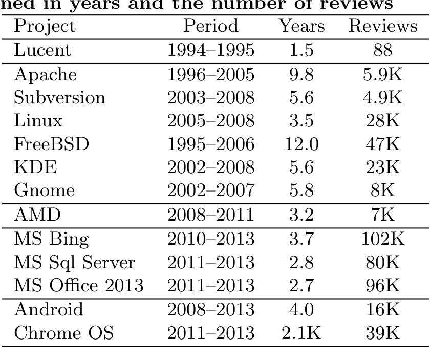
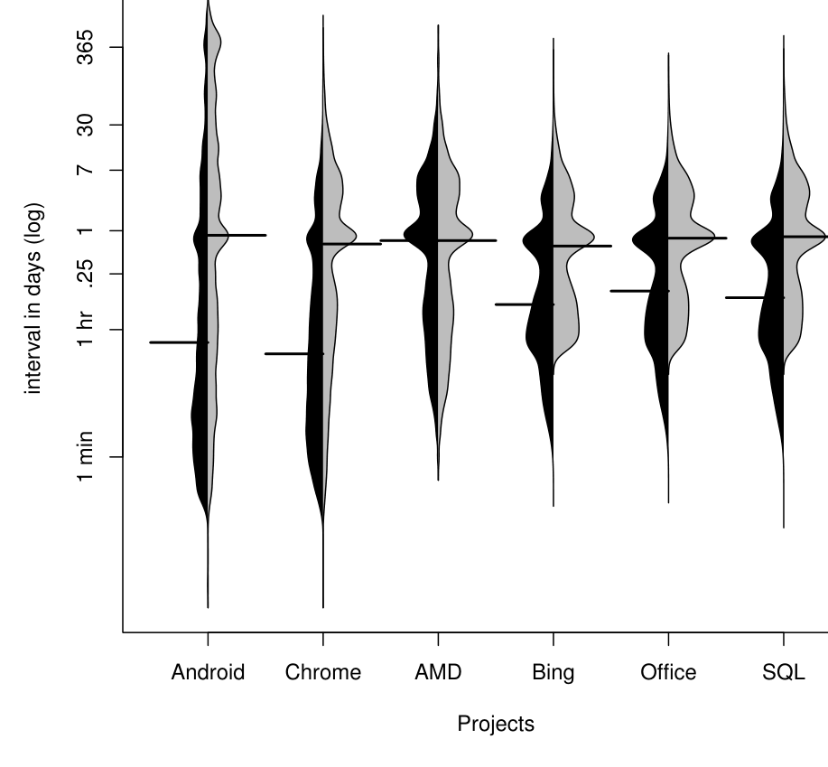
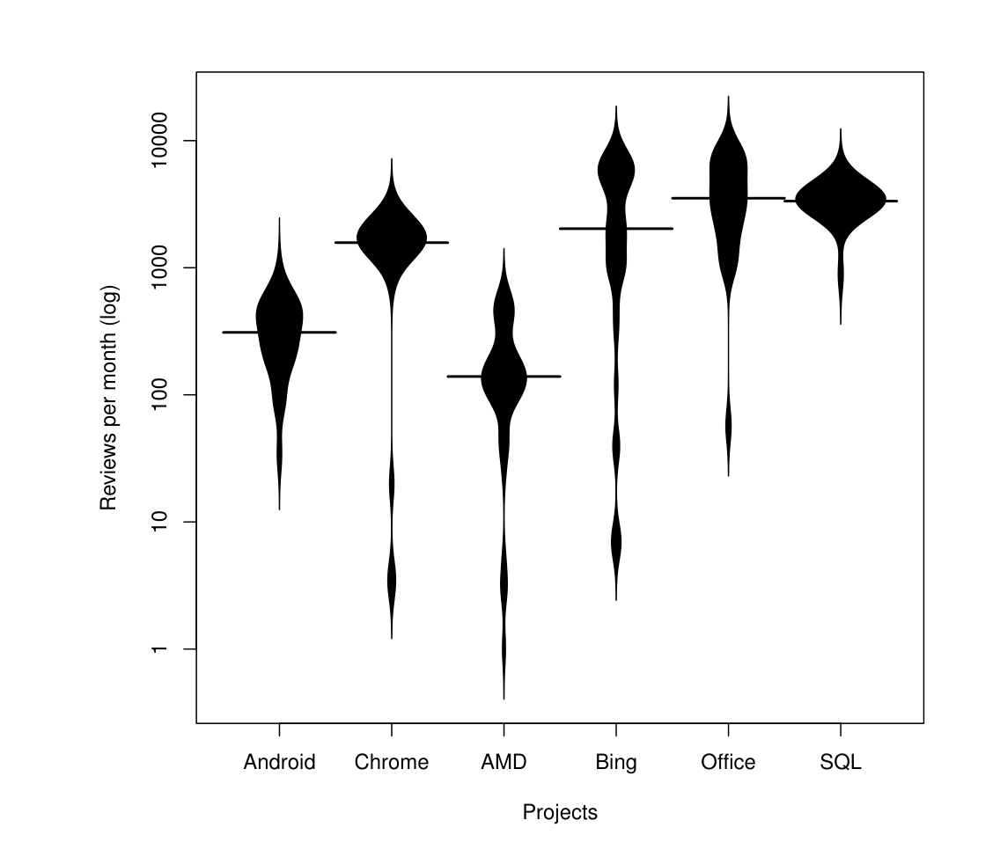
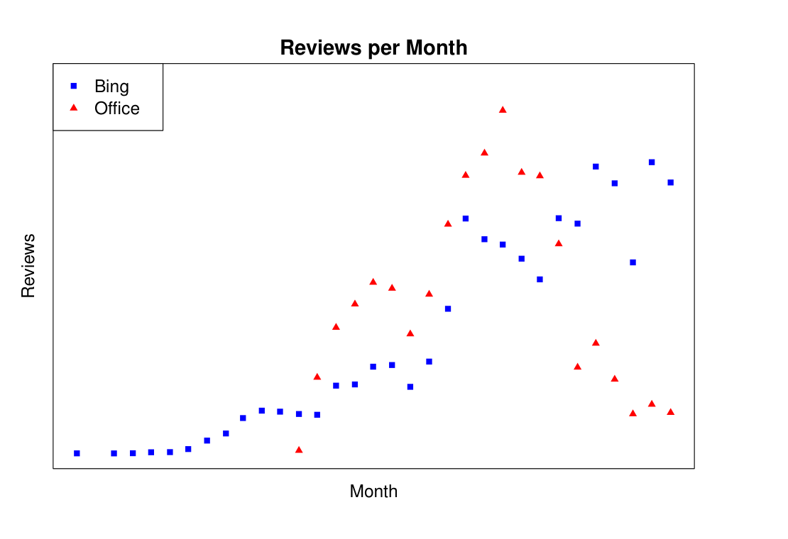
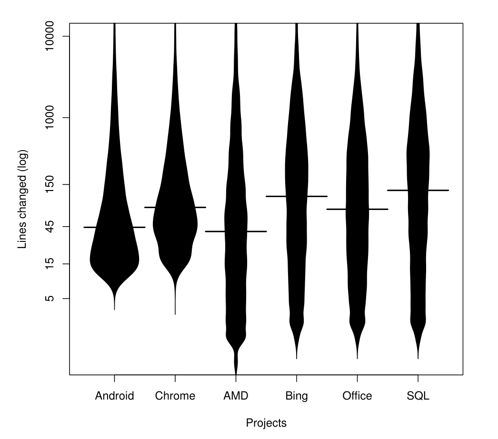
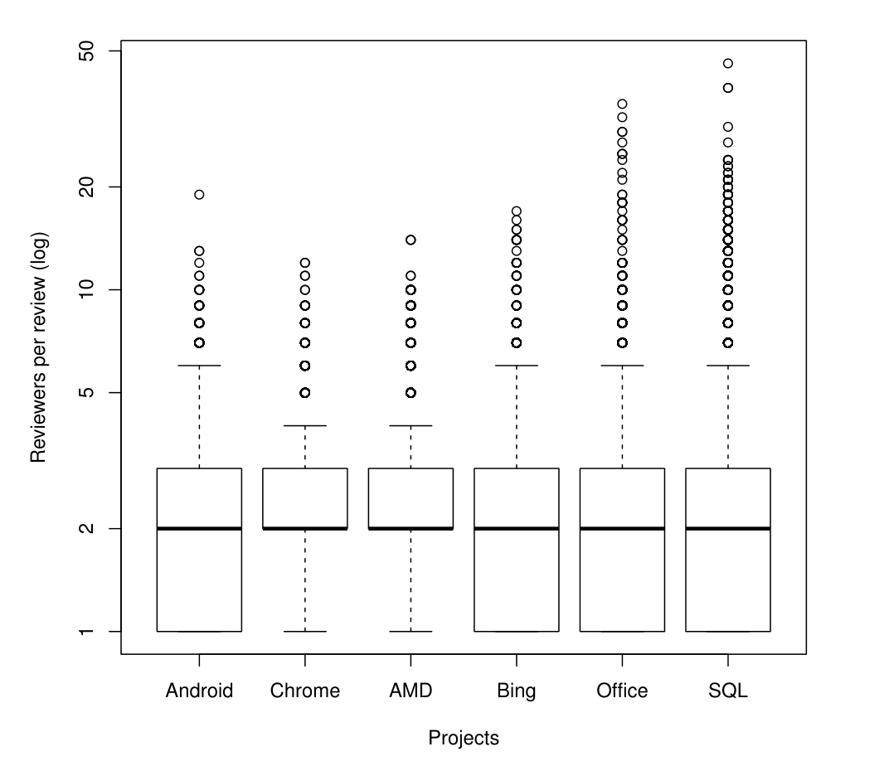
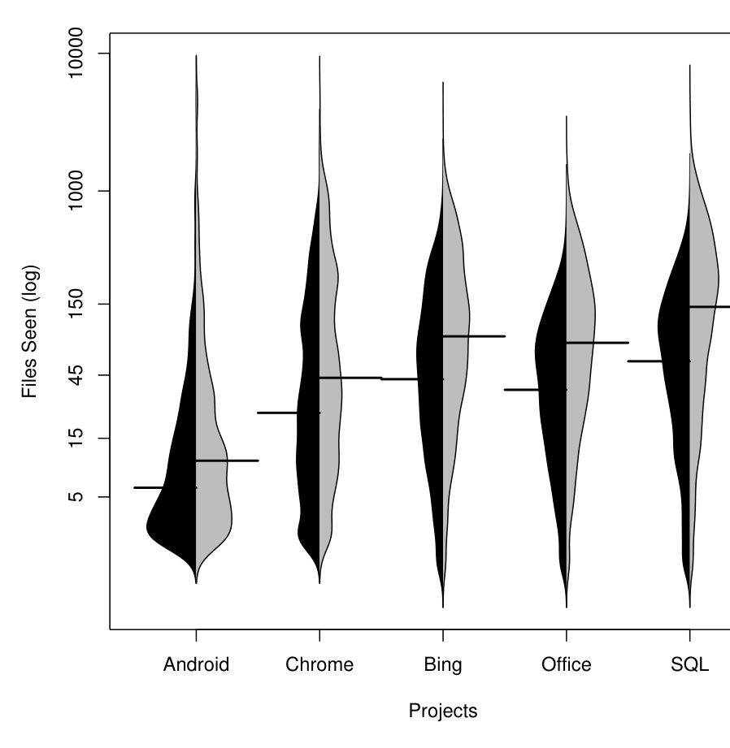

# Convergent Contemporary Software Peer Review Practices

Peter C. Rigby  
Concordia University  
Montreal, QC, Canada  
peter.rigby@concordia.ca

Christian Bird  
Microsoft Research  
Redmond, WA, USA  
cbird@microsoft.com

## ABSTRACT

Software peer review is practiced on a diverse set of software projects that have drastically different settings, cultures, incentive systems, and time pressures. In an effort to characterize and understand these differences we examine two Google-led projects, Android and Chromium OS, three Microsoft projects, Bing, Office, and MS SQL, and projects internal to AMD. We contrast our findings with data taken from traditional software inspection conducted on a Lucent project and from open source software peer review on six projects, including Apache, Linux, and KDE. Our measures of interest include the review interval, the number of developers involved in review, and proxy measures for the number of defects found during review. We find that despite differences among projects, many of the characteristics of the review process have independently converged to similar values which we think indicate general principles of code review practice. We also introduce a measure of the degree to which knowledge is shared during review. This is an aspect of review practice that has traditionally only had experiential support. Our knowledge sharing measure shows that conducting peer review increases the number of distinct files a developer knows about by 66% to 150% depending on the project. This paper is one of the first studies of contemporary review in software firms and the most diverse study of peer review to date.

### Categories and Subject Descriptors

D.2.8 [Software Engineering]: [Metrics]; K.6.3 [Software Management]: [Software development; Software process]

### General Terms

Management, Measurement

### Keywords

Peer code review, Empirical Software Engineering, Inspection, Software firms, Open source software

## 1. INTRODUCTION

Software peer review, in which an independent evaluator examines software artifacts for problems, has been an engineering best practice for over 35 years [9, 10]. While effective in identifying defects, the rigidity of traditional formal review practices has been shown to limit adoption and review efficiency [12, 29]. In contrast, contemporary or modern peer review encompasses a series of less rigid practices [6, 22]. These lightweight practices allow peer review to be adapted to fit the needs of the development team. For example, peer review is widely practiced on open source software (OSS) projects. Rigby et al. [23] described a minimalist OSS process that efficiently fit the development team. However, there was a lack of traceability and tools to support review that made it difficult to externally monitor the progress and quality of an OSS system. Despite a large body of research on peer review in the software engineering literature, little work focuses on contemporary peer review in software firms. There are practitioner reports, but these are experiential [20] or biased by a commercial interest in the review tool being examined [6]. To date, practitioners have driven the development of contemporary peer review and the tools that support it [26, 6]. The proliferation of reviewing tools (e.g., CodeCollaborator, ReviewBoard, Gerrit, Crucible) and the growing number of companies using lightweight review indicates success in terms of adoption (e.g., Google, Cisco, Microsoft), but there is no systematic examination of the efficacy of contemporary peer review in software firms.

We posit that contemporary peer review (review practiced today by many commercial and OSS projects) evolved from the more traditional practice of formal inspections of a decade or more ago. In this paper, we present an exploration of aspects of contemporary peer review in software projects that span varying domains, organizations, and development processes in an attempt to aggregate and synthesize more general results. Our primary conjecture is that if the peer review practices and characteristics in multiple disparate projects (See Table 2) have become similar as they have naturally or organically evolved, then such characteristics may be indicative of convergent practices that represent generally successful and efficient methods of review. As such, these can be prescriptive to other projects choosing to add peer review to their development process.

Our overarching research question is how do the parameters of peer review differ in multiple disparate projects? We operationalize this question for each parameter of review:

---

Table 1: Project data sets: The time period we examined in years and the number of reviews  
Project  Period  Years  Reviews

1. What peer review process (e.g., Fagan inspection vs Commit-then-review) does the project use?  
2. How long do reviews take and how often are reviews performed?  
3. What is the size of artifact under review?  
4. How many people are involved in review?  
5. How effective is review in terms of problems discussed?  
6. Does review spread knowledge about the system across the development team?

With the exception of the last question, these parameters of review have been studied in many experiments over the past 35 years [9, 19, 24]. Our contribution is to compare a large diverse set of projects on these parameters.

This paper is organized as follows. In Section 2, we provide a brief overview of the software peer review literature and describe the review practices of the projects we study in this paper. In Section 3, we describe the data that we mine and our multiple case study methodology. In Section 4, we present our case study findings and describe convergent and divergent practices. In Section 5, we provide a first measurement of the impact of peer review on knowledge sharing in a development team. While we discuss threats to validity throughout the paper, we provide a fuller discussion of them in Section 6. In Section 7, we conclude the paper.

## 2. BACKGROUND AND PROJECT INFORMATION

In this section we introduce three types of peer review: traditional inspection, OSS email-based peer review, and lightweight tool supported review. We also describe the projects and data we have for each review type. The novel data in this paper comes from Advanced Micro Devices (AMD), Microsoft, and Google-led projects. Table 2 is intended to show the time periods and size of data set we have for each project, and is not intended for comparisons among projects. In the remainder of this paper, we normalize and convert the raw data to perform meaningful comparisons.

### 2.1 Software Inspection

Software inspections are the most formal type of review. They are conducted after a software artifact meets predefined exit criteria (e.g., a particular requirement is implemented). The process, originally defined by Fagan [9], involves some variation of the following steps: planning, overview, preparation, inspection, reworking, and follow-up. In the first three steps, the author creates an inspection package (i.e., determines what is to be inspected), roles are assigned (e.g., moderator), meetings are scheduled, and the inspectors examine the inspection package. The inspection is conducted, and defects are recorded but not fixed. In the final steps, the author fixes the defects and the mediator ensures that the fixes are appropriate. Although there are many variations on formal inspections, “their similarities outweigh their differences” [31].

Comparison data: We used data that Porter et al. collected in inspection experiments at Lucent [19] to compare our findings for contemporary review with traditional software inspection. Their study was conducted in a semi-controlled industrial setting. Each condition in their study was designed to emulate a particular variation in inspection process. However, they found that variation in inspection processes accounted for very little variation in the number of defects found during review. People and product measures, such as the expertise of the review, accounted for much more of the variance.

### 2.2 Open Source Software Peer Review

Peer review is a natural way for OSS developers, who rarely meet in person, to ensure that the community agrees on what constitutes a good code contribution. Most large, successful OSS projects see peer review as one of their most important quality assurance practices [23, 18, 1]. On OSS projects, a review begins with a developer creating a patch. A patch is a development artifact, usually code, that the developer feels will add value to the project. Although the level of formality of the review processes varies among OSS projects, the general steps are consistent across most projects:
1. The author submits a contribution by emailing it to the developer mailing list or posting to the bug or review tracking system.  
2. One or more people review the contribution.  
3. It is modified until it reaches the standards of the community.  
4. It is committed to the code base.

Many contributions are ignored or rejected and never make it into the code base [3]. This style of review is called review-then-commit (RTC). In contrast to RTC, some projects allow trusted developers to commit contributions (i.e., add their contributions to the shared code repository) before they are reviewed. The main or core developers for the project are then expected to review all commits. This style of review is called commit-then-review (CTR). All projects use RTC, but some also use CTR depending on the status of the committer and the nature of the patch [23].

Comparison data: We have data from six large, successful OSS projects (which we will refer to as the “OSS projects” in this paper1): the Apache httpd server, the Subversion version control system, the Linux operating system, the FreeBSD

1 Although Chrome and Android have open source licenses, they are led by Google.

---

operating system, KDE desktop environment, and Gnome desktop environment. The results from these projects have been published by Rigby et al. [24, 25] and are used here only for comparison purposes.

## 2.3 Peer Review at Microsoft

Microsoft has slowly been evolving its code review process. While code review has been an integral practice at Microsoft for many years, the method used has shifted from sending patches and discussing them on large email lists to using centralized tools.

A few years ago, Microsoft developed an internal tool, CodeFlow, to aid in the review process. In many projects (including the Microsoft projects that we examined for this study), code review is primarily accomplished via CodeFlow and occurs once a developer has completed a change, but prior to checkin into the version control system. A developer will create a review by indicating which changed files should be included, providing a description of the change (similar to a commit message), and specifying who should be included in the review. Those included receive email notifications and then open the review tool which displays the changes to the files and allows the reviewers to annotate the changes with their own comments and questions. The author can respond to the comments within the review and can also submit a new set of changes that addresses issues that the reviewers have brought up. Once a reviewer is satisfied with the changes, he can “sign off” on the review in CodeFlow.

While many teams have policies regarding code review sign off, there is no explicit connection between the review system and version control that disables checkin until a review has been signed off. Teams’ review policy may vary in many ways. For example, some require just one reviewer to sign off while others require more; some specify who should sign off for changes in different components and some leave it up to the developer; etc. For more details, we refer the reader to an earlier empirical study [2] in which we investigated the purposes for code review (e.g., finding defects, sharing knowledge) along with the actual outcomes (e.g., creating awareness and gaining code understanding) at Microsoft.

New Data: In this paper, we present the results of analyzing review data drawn from three large projects at Microsoft that use CodeFlow as the primary mechanism for code review and that differ in their domain and development methodology – Bing, Microsoft Office 2013, and Microsoft SQL Server. Bing is an Internet search engine; it is continuously being developed and deployed and undergoes constant development. Office is a suite of business applications that ships as a boxed product and follows a more traditional process with phases for planning, implementation, stabilization, and shipping. SQL Server is a database management and business intelligence application that follows a development cycle similar to Office. We present details of data gathering for these projects in subsection 3.1.

## 2.4 Google-based Gerrit Peer Review

When the Android project was released as OSS, the Google engineers working on Android wanted to continue using the internal Mondrian code review tool used at Google [28]. Gerrit is an OSS, git-specific implementation of the code review practices used internally at Google, created by Google Engineers [11]. Gerrit centralizes git, acting as a barrier between a developer’s private repository and the shared centralized repository. Developers make local changes in their private git repositories and then submit these changes for review. Reviewers make comments via the Gerrit web interface. For a change to be merged into the centralized source tree, it must be approved and verified by another developer. The review process has the following stages:

1. "Verified" - Before a review begins, someone must verify that the change merges with the current master branch and does not break the build. In many cases, this step is done automatically.
2. "Approved" - While anyone can comment on the change, someone with appropriate privileges and expertise must approve the change.
3. "Submitted/Merged" - Once the change has been approved it is merged into Google’s master branch so that other developers can get the latest version of the system.

New Data: In this paper, we present results from two Google-led, OSS projects that use the Gerrit peer review tool: Android and Chromium OS. Android is an operating system developed for mobile and tablet devices. It is Open Source Software and was initiated by a group of companies known as Open Handset Alliance, which is led by Google.2 Google Chromium OS, referred to as Chrome, is an operating system which runs only web apps and revolves around the Chromium web browser.3 We present details of data gathering for these projects in subsection 3.1.

## 2.5 AMD and CodeCollaborator

Ratcliffe [20] presented a practitioners report on the adoption of a CodeCollaborator-based peer review practice on an internal AMD project, which served as the model for other projects at AMD. The practice used at AMD involves the following steps: 1) the author uploads the software artifacts for review in the web interface, 2) reviewers are assigned to the review, 3) a review discussion occurs and problems are fixed, 4) once a review is approved it is committed. The CodeCollaborator tool allows for assignment of rules and the specification and enforcement of business rules (e.g., a review must be approved by 2 reviewers before it can be committed). While asynchronous discussion can occur, a chat interface can also be used. Cohen, the founder of the company that sells CodeCollaborator, performed a detailed evaluation of the tool at Cisco [6].

New data: Ratcliffe’s practitioners report was mainly qualitative. In this work, we present the quantitative results from the use of CodeCollaborator at AMD. The AMD data set is limited, so we indicate below when we are unable present results for AMD.

## 2.6 Contemporary Peer Review Process

Comparing the above review processes, we find that contemporary peer review is characterized by being lightweight

2http://source.android.com/
3http://www.chromium.org/chromium-os

---

and occurring before the code is added to a version control repository that many developers depend upon (e.g., the master branch). This process contrasts sharply with traditional software inspection where large completed artifacts are reviewed in co-located meeting with rigidly defined goals and participant roles. Contemporary OSS review is lightweight and fits the development team, but when it is conducted on a mailing list it is difficult to track. Some OSS projects and all the software firms we examine use a review tool, which makes the process traceable through the collection of review metrics. Contemporary reviews are typically conducted asynchronously and measures of review are recorded automatically.

> Convergent Practice 1: Contemporary peer review follows a lightweight, flexible process

In general, contemporary review involves the following steps.

1. The author creates a change and submits it for review.
2. Developers discuss the change and suggest fixes. The change can be re-submitted multiple times to deal with the suggested changes.
3. One or more reviewers approve the change and it is added to the "main" version control repository. The change may also be rejected.

## 3. METHODOLOGY AND DATA

We use Yin’s multiple cases study methodology [32]. Case study findings “generalize” or are transferable through analytical generalizations. Unlike statistical generalization, which derives samples from and generalizes to a defined population, analytic generalization requires researchers to develop a theory or framework of findings related to a particular phenomenon. We use theoretical sampling to select a diverse set of cases and then contrast our findings developing a framework that describes the convergent and divergent practices of contemporary peer review.

We began by collecting data on Microsoft review practices and were surprised to see convergences with the practices observed by Rigby on OSS projects [23]. These practices tended to coincide with those seen at AMD [20] and Cisco [6]. We collected data on the Google-led OSS projects, Chromium OS and Android, to understand the practices of hybrid projects. We also have data on the traditional inspection practices at Lucent [19] that we use for comparison purposes.

We quantify how lightweight, tool-supported review is conducted. Since each case study has different data points and measures, a further contribution of this work is the conversion of raw and summary data from past and current cases to report comparable measures. We contribute a unified set of findings across a large, diverse sample of projects.

In this section, we give an overview of the data we have for each project. In each subsequent section, we discuss in detail the pertinent data and measures. We also discuss limitations in our data and construct validity issues.

### 3.1 Data Extraction

The data extraction for the following projects is described in other work: Lucent [19], OSS projects [23], and AMD [20]. The former two data sets are used for comparison purposes, while the AMD data had not been quantitatively reported in previous work. In previous work, we described the extraction process and resulting data for Google Chrome and Android; the data is also available for other researchers [17]. This work did not involve analysis of the data. In the remainder of this section, we discuss what constitutes a review for each project and briefly describe how we extracted peer review data.

Microsoft: The Microsoft data for this study was collected from the CodeFlow tool. This tool stores all data regarding code reviews in a central location. We built a service to mine the information from this location and keep a database up to date for tools to leverage and for empirical analysis. For each review, we record information including who created the review, what files were modified, how many sets of changes were submitted, the comments that reviewers added, and who signed off.

One difficulty with this data is knowing when a review is complete. There are a number of states that a review can be in, one of which is “Closed”. However, to be in the “Closed” state, someone must explicitly set the review to that state. We observed that in practice, a developer may check in his changes once reviewers had signed off without first changing the review to “Closed”. In other cases, there was evidence that a member of a project closed reviews as a form of maintenance (one person closed thousands of reviews in a matter of minutes). To deal with this, we use the heuristic that a review is considered completed at the time of the last activity by a participant in the review (i.e., the date of the last comment or the last sign off, whichever is later). For all the case studies in this work, reviews with no comments or sign offs were excluded from the data set as no review discussion occurs.

Google Chrome and Android: We consider reviews in the merged and abandoned states; open reviews are not considered in this work. Reviews must also have one comment from a human reviewer who is not the author (verifications by bots are removed). To collect peer review data from these projects, we reverse engineered the Gerrit JSON API and queried the Gerrit servers for data regarding each review for both projects, gathering information such as the author’s and reviewers’ activity, files changed, comments made, and dates of submission and completion. We stored this information on peer reviews in a database for further analysis. The extracted data and details of our technique are available to other researchers [17].

AMD: We attained a summary of the data dump from the CodeCollaborator tool [20]. Unfortunately, this data set does not have all the parameters of review we wish to measure, such as the number of comments per review. In this data set, we only include review discussions that have at least one reviewer.

Lucent: Siy attended inspection meetings and collected self-report data from reviewers on a compiler project at Lucent [19]. The roles and number of participants were

---

specified in advance. Since this is comparison data, we discuss differences, but do not present this data in figures.

OSS project: Rigby et al.'s work considered six OSS projects, Apache, Subversion, Linux, FreeBSD, KDE, and Gnome [24, 25, 23]. The review data was extracted from developer mailing lists. For a review to be considered valid it had to contain the following: 1) a change or 'diff' and 2) one or more emails from reviewers (i.e. not the author of the change). Both accepted and rejected changes that were reviewed are in the data set. Like the Lucent data, we do not report this data in our figures.

Plotting the Data: We use two types of plots: beanplots and boxplots. Beanplots show the distribution density for multiple samples along the y-axis (rather than more commonly along the x-axis) to enable easy visual comparison and in this work contain a horizontal line that represents the median [13]. Beanplots are best for a large range of non-normal data as they show the entire distribution (they essentially show the full distribution drawn vertically, and show whether there are peaks and valleys in a distribution) while boxplots are better for smaller ranges. When we have count data that is highly concentrated, we use a boxplot. For all the boxplots in this work, the bottom and top of the box represent the first and third quartiles, respectively. Each whisker extends 1.5 times the interquartile range. The median is represented by the bold line inside the box. Since our data are not normally distributed, regardless of the style of plot, we report and discuss median values.

## 4. MULTIPLE CASE STUDY FINDINGS

In this section, we present our convergent and divergent findings in the context of iterative development, reviewers selection practices, review discussions and defects, and knowledge sharing through review. For each finding, we place it in the context of the Software Engineering literature on peer review, summarize it in a "Convergent Practice" box, and then discuss the evidence that we have for each practice.

### 4.1 Iterative Development

The concept of iterative development is not new and can be traced back to the many successful projects in the early days of software development [14]. However, progressive generations of software developers have worked in shorter and shorter intervals. For example, "continuous builds" [8] and "release early, release often" [21]. Peer review is no exception.

An original goal of software inspection was to find software defects by exposing artifacts to criticism early in the development cycle. For example, Fagan inspection introduced early and regular checkpoints (e.g., after finishing a major component) that would find defects before the software’s release. However, the time from when the review started to when the discussion ended (i.e. the review interval) was on the order of weeks [9]. In 1998, Porter [19] reported inspection intervals at Lucent to have a median of 10 days. OSS projects like Apache and Linux have review intervals on the order of a few hours to a day [23].

Figure 1: First Response on left (we do not have first response data for AMD) and Full interval on right

> Convergent Practice 2: Reviews happen early (before a change is committed), quickly, and frequently

AMD, Microsoft, and the Google-led projects exemplify the convergent practice of frequent reviews, Figure 2, that happen quickly, Figure 1. The reviews are always done early (i.e. before the code is checked into the version control system).

AMD: AMD has short review intervals, with the median review taking 17.5 hours. The number of reviews per month is also high and increases from a few reviews per month when the tool and practice was introduced, to over 500 reviews per month.

Microsoft: Bing, SQL, and Office also show short intervals for reviews with median completion times of 14.7, 19.8, and 18.9 hours respectively. In terms of reviews per month, all three projects are very active, but show different trends. SQL has a median of 3739 reviews per month and is fairly consistent month to month. In contrast, Bing has a median of 2290, but has shown a steady increase over time since its initial adoption of CodeFlow. Office has the highest median at 4384, and it follows a typical release cycle with an initial ramp up of reviews and a fall-off near release.

Google Chrome and Android: The median frequency is 1576 and 310 for Chrome and Android, respectively. The median completion time is 15.7 and 20.8 hours, for Chrome and Android, respectively.

Project Comparisons: The review interval, which is on the order of hours and with a median around a day, shows

---

Figure 2: The number of reviews per month

remarkable consistency across all projects. Figure 1 also shows the amount of time it takes for the first response to a review. We can see for all projects that most reviews are picked up within a few hours, indicating that reviewers are regularly watching and performing review.

The number of reviews per month, or the review frequency, is very high in comparison to traditional inspection practices, but tends to vary with the stage, development style, and size of the project (a divergent finding). In Figure 2, we can see three distinct types of projects: adoption (e.g., Bing), cyclic (e.g., Office), and stable (e.g., Chrome). The long tails in each beanplot show that adoption took place, and with AMD and Bing the amount of review is still increasing with each month. This trend can be seen in Figure 3, which plots Bing data as a time series. In contrast to this monotonic trend, cyclic projects, like Android, FreeBSD, and Office show an irregular cone shape, with gradual fluctuations in the amount of development and review (see Office in Figure 2). Finally, Chrome and SQL show a relatively stable number of reviews. Linux and KDE exhibit similar trends.

> Convergent Practice 3: Change sizes are small

Having a short interval cannot be achieved without changes to other aspects of software development. By creating smaller changes, developers can work in shorter intervals. For example, Mockus et al. noted that Apache and Mozilla had much smaller change sizes than the industrial projects they used for comparison, but did not understand why [15, 22]. On the OSS projects studied by Rigby et al., the median change on OSS projects varies from 11 to 32 lines changed. They argued that the small change on OSS projects facilitates frequent review of small independent changes.

Figure 3: Number of reviews per month in Bing and Office. We were requested to keep raw numbers and dates confidential, but this plot shows the trends in code review as a tool is adopted (Bing) and over the course of a release cycle (Office).

From Figure 4, both Android and AMD have a median change size of 44 lines. This median change size is larger than Apache, 25 lines, and Linux, 32 lines, but much smaller than Lucent where the number of non-comment lines changed is 263 lines. Bing, Office, SQL, and Chrome have larger median changes than the other projects examined, but are still much smaller than Lucent. For example, Chrome’s median change is 78 lines and includes 5 files. However, for Chrome, only 23% of changes are the same size or larger than a median Lucent change. Furthermore, the distribution of changes on Google-led and the other OSS projects are left skewed indicating that the majority of changes are small. While the distribution for the commercial firms is also left skewed, it is almost log normal.

### 4.2 Selecting Reviewers

Traditionally, developers are assigned to review an artifact. On OSS projects, developers select the changes that they are interested in reviewing and no reviews are assigned. Many review tools allow for assignment as well as self-selection incorporating a positive mix of both techniques [26, 11, 6]. The self-selection used in review tools is accomplished by adding a group (e.g., a mailing list) to the reviewer list, then individuals from this group can find the review [20, 2]. In this section, we discuss the optimal number of reviewers as well as different reviewer selection techniques.

The optimal number of inspectors involved in a meeting has long been contentious (e.g., [5, 30]). Reviews are expensive because they require reviewers to read, understand, and critique an artifact. Any reduction in the number of reviewers that does not lead to a reduction in the number of defects found will result in cost savings. Buck [5] found no difference in the number of defects found by teams of three, four, and five individuals. Bisant and Lyle [4] proposed two person inspection teams that eliminated the moderator. In examining the sources of variation in inspections, Porter

---

Figure 4: Churn: Lines added and removed. Note: we do not show proportion of changes over 10,000 lines.

Figure 5: Two reviewers involved in review in the median case

et al. [19] found that two reviewers discovered as many defects as four reviewers. The consensus seems to be that two inspectors find an optimal number of defects [27]. In OSS review, the median number of reviewers is two; however, since the patch and review discussions are broadcast to a large group of stakeholders, there is the potential to involve a large number of interested reviewers if necessary [25].

> Convergent Practice 4: Two reviewers find an optimal number of defects

At AMD the median number of reviews is 2. While reviewers are typically invited, Ratcliffe describes how CodeCollaborator allows invites to be broadcast to a group of developers [20]. He further describes how CodeCollaborator suggests potential reviewers based on who has worked on the file in the recent past.

For Google Chrome and Android, there is a median of two reviewers; see Figure 5. Gerrit allows developers to subscribe to notifications when a review includes changes to a particular part of the system [28]. Reviewers can also be invited when the author includes their email address in the review submission sent to Gerrit.

At Microsoft the median number of reviewers invited to each review in Bing, Office, and SQL respectively are 3, 3, and 4. As Figure 5 shows, the median number of people that actually take part in a review (other than the author) is 2. Interestingly, we found that there was only a minimal increase in the number of comments about the change when more reviewers were active and there was no increase in the number of change sets submitted (i.e., the same number of “rounds of reviewing”). We also investigated, both qualitatively and

quantitatively, reviews that had many more reviewers than the median and found that the author or the reviewers will invite additional developers after a round of reviewing has taken place. This can be the result of a developer realizing that someone else is better fit to examine the change or concluding that the change carries a high risk and should be reviewed by “more eyes”. The general practice appears to involve inviting three to four reviewers and then letting the review take its course which may lead to involving additional participants.

### 4.3 Defects vs Discussion

The rigid time constraints of synchronous review meetings forced traditional inspections to focus exclusively on finding defects, discussions of other topics, such as solutions to the defect, were strictly forbidden [9]. Inspection used explicit roles, such as reader and secretary, to ensure that defects were accurately recorded and that developers were not distracted from finding defects [9]. At Lucent there is a median of 3 true defects found per review [19]. An additional 4 defects per review were found to be false positives. Inspections also found a large number of soft maintenance issues, median 13 per review, which included coding conventions, and the addition of comments. This type of soft maintenance code improvements was also observed at Microsoft and in OSS review [2, 25]. In contrast to software inspection, asynchronous reviews have less rigid time constraints allowing for detailed discussions of software artifacts. For example, on OSS projects, the discovery of the defect is not the focal point. Instead developers discuss potential defects and solutions to these defects. These team discussions mean that the author is no longer isolated from his or her peers when

---

Figure 6: Number of comments per review

Figure 7: Number of submissions per review

fixing the defects found during review [25]. In this section, we also provide proxy measures for the number of defects found and show that they are comparable to those found during inspection.

> Convergent Practice 5: Review has changed from a defect finding activity to a group problem solving activity

Examining contemporary practices in software firms, we find convergence with OSS: defects are not explicitly recorded. AMD uses CodeCollaborator, which has a field to record the number of defects found; however, 87% of reviews have no recorded defects, and only 7% have two or more defects found. Measures of review activity indicate a median of two participants per review and qualitative analysis by Ratcliffe [20] found that discussions did occur but focused on fixing defects instead of recording the existence of a defect. The disconnect between explicitly recorded defects and activity on a review indicates that reviewers are examining the system, but that developers are not recording the number of defects found. Microsoft’s CodeFlow review tool provides further evidence – it does not provide a way for developers to record the defects found during review. This design decision results from the way that code review is practiced at Microsoft. When an author submits a change for review, the author and other reviewers have a joint goal of helping the code reach a satisfactory level before it is checked in. We have observed that reviewers will comment on style, adherence to conventions, documentation, defects, missed corner cases, and will also ask questions about the changes [2] in an effort to help the author make the code acceptable. It is unclear which of these represent defects and which do not (e.g. would the comment "Are you sure you don’t need to check against NULL here?" be a defect?). In addition, recording the defects found during review would not aid in the aforementioned goal. CodeFlow does provide the ability for an author to mark any thread of conversation with a status of "open", "ignored", "resolved", or "closed", enabling participants to track the various discussions within the changes. For our purposes, the closest artifact to a defect is a thread of discussion that has been marked as resolved, as a problem found within the code would need to be resolved by the author prior to check-in. The caveat is that a reviewer might make comments or ask questions that lead to discussion and are eventually marked as resolved, but that don't represent a defect found or result in any code being changed.

On the Google Chrome and Android projects, the Gerrit review tool does not provide any field to explicitly record the number of defects found. However, as we discussed in section 2, reviews pass through three stages: verified to not break the build, reviewed, and merged. The goal of these stages is not to simply identify defects, but to remove any defects before merging the code into a central, shared repository. As we can see from Figure 6, there is a median of 4 and 3 comments per review for Chrome and Android respectively – discussion occurs on these projects at similar levels to other OSS projects. On the Industrial side, the medians are the same, with 4, 3, and 3 comments for Bing, Office, and SQL respectively.

"You can't control what you can't measure" [7]

The contemporary software projects we studied do not record the number of defects found during review, in part because it distracts developers from their primary task of immediately fixing the defects found in review. However, without this

---

Table 2: Descriptive statistics for the number of comments, threads of discussion and threads marked as resolved in Bing, Office, and SQL.

Project Comments Threads Resolved

measure can software projects improve their process and product in the long term? Are there alternative measures of review effectiveness?

We suggest three alternative measures that when taken together provide an approximation of review effectiveness. First, the number of comments during review is an upper bound on the number of defects found per review (See Figure 6). The underlying assumption is that each comment represents a distinct defect. This assumption is often invalid as many comments will be related to the discussion of a single defect. In our manual analyses, we found that it was extremely rare for a comment to include more than one substantive defect; however, trivial formatting issues were often reported in a single comment. Second, a better estimate is the number of comment threads (See Table 2). The assumption is that each thread contains a single defect; however, sometimes a comment thread will contain discussions of multiple related defects, other times it will contain false positives, such as developer questions that do not uncover a defect. Third, a lower bound on the number of defects found in a review is the number of artifact resubmissions (See Figure 7). For non-trivial defects, a revised artifact may be submitted for re-review. However, a revision will cover all the fixed defects identified during a review session. Since CodeFlow is the only tool that tracks threads of conversation, we report the summary statistics of the number of comments, threads, and threads marked as resolved in Table 2.

These measures provide non-intrusive techniques (i.e. the data is implicitly recorded during the primary activity of discussing the software) to approximate review effectiveness. We do not want to make strong claims about review effectiveness because these measures are proxies of the number of defects found and artifact sizes tend to be smaller than in traditional inspection. However, we feel that the level of discussion during review and patch resubmissions suggests that contemporary review does find defects at a comparable level to traditional inspection. These measures and review practices on contemporary projects raise a larger philosophical question that deserves future work: is it more important to have a discussion about the system or to find and report defects?

## 5. SHARING KNOWLEDGE THROUGH REVIEW

The number of defects found during review is known to be a limited measure of review effectiveness because it ignores many of the other benefits of review, such as the sharing of knowledge among developers [12]. Some of the benefits of spreading knowledge across the development team include having co-developers who can do each other’s work if a developer leaves a project and involving new developers in reviews to familiarize them with a project’s codebase. While qualitative evidence from practitioners indicates that review does indeed spread knowledge across the development team [2, 20], we are unaware of any empirical studies that measure this phenomenon.

To provide a preliminary measurement of the knowledge spreading effect of peer review, we extend the expertise measure developed by Mockus and Herbsleb [16]. They measured the number of files a developer has modified (submitted changes to). We also measure the number of files a developer has reviewed and the total number of files he knows about (submitted ∪ reviewed). Figure 8 shows that the number of files a developer has modified (on the left) compared to the total number of files he or she knows about (on the right).4 For example, in the median case, a Google Chrome developer submits changes to 24 distinct files, reviews 38 distinct files, and knows about a total of 43 distinct files. Without review, in the median case, a Chrome developer would know about 19 fewer files, a decrease of 44%. Similarly, in the median case for Bing, Office, and SQL, review increases the number of files a developer knows about by 100, 122, and 150%, respectively.

Both Google Chrome and Android appear to have a larger number of developers who have submitted to and reviewed few files. OSS projects are known to have, what one interviewee called “drive-by” developers, who submit a single change [25] (e.g., a bug fix that affects the developer). Figure 8 shows that this effect is especially pronounced on the Android project where 54% of developers have modified fewer than five files. The increase in the number of files seen through review is also lower for Android, a 66% increase in the median case. If we exclude developers who have modified five or fewer files, we see the median number of files modified jumps from 6 to 16 and the total number of files goes from 10 to 25.

Our measure of knowledge sharing through peer review has shown a substantial increase in the number of files a developer knows about exclusively by conducting reviews. This measure deserves future study. Enhancements to the measure could also be used to gauge the diversity of the knowledge of developers assigned to a review. If a review has developers from diverse parts of the system reviewing the code and discussing it, it is less likely that there will be downstream integration problems.

4 We conservatively exclude submissions and reviews that contain more than 10 files.

---

Figure 8: On left, the number of files submitted for review. On right, the total number of files either submitted for review or reviewed

## 6. THREATS TO VALIDITY

We studied a large, diverse sample of projects; however, each project has different tools, processes, incentives, etc., so the data we collected is not as controlled and free from confounds as it would be in an experimental setting. We have attempted to clean and report the data using similar measures and methods and have discussed limitations throughout the paper.

When a finding was unusual we would read the associated anomalous reviews and discuss them with developers. For example, we have removed reviews that received no activity from the Microsoft data sets (reviews that had no comments, no sign offs, and only one submitted changeset). Upon initially finding these in our data set, we inquired of the developers who created the reviews. They indicated that sometimes reviews are more for awareness (e.g., alerting a manager to a feature being implemented or showing a tester code that they should write a test for) than actually reviewing the changes and that the complete lack of activity represents reviews that are used for awareness purposes only. It is possible that a portion of these reviews were actually intended as actual code reviews rather than for awareness and simply received no attention from the invited reviewers. This type of review has also been removed from the Google-led projects and from the OSS projects studied by Rigby et al. [24] and used for comparison purposes in this paper. In some cases, we re-ran measures on Rigby’s raw data sets. The AMD and Lucent data sets presented further difficulties because we have summary instead of raw data. We have converted the raw data to make it comparable with the other data we collected; however, we are often missing the required data.

## 7. CONCLUSION

The variations in traditional, formal software inspections were found to have little impact on its effectiveness as a peer review process, with product and process factors being better predictors of the number of defects found in review [19, 27]. Furthermore, as Wiegers points out in his practical guide to peer review, the “similarities [in formal inspection process] outweigh their differences” [31].

Contemporary peer review represents a lightweight, “stripped-down” version of software inspection that removes the rigidity of the formal inspection processes, while leaving the effective defect-finding technique of having an expert peer examine software artifacts before they are added to the shared version control repository.

Contemporary peer review has evolved from the needs of practitioners and these practitioners have driven the development of review tools [6]. The large body of literature on software inspection has largely ignored these contemporary practices. In this paper, we have presented findings on the peer review practices used on three projects representative of development at Microsoft, AMD projects, and two Google-led OSS projects. We have compared parameters of review, such as review interval and the number of comments in review discussions, of these six projects with the data from Rigby’s study of six OSS projects [23]. We also use data from inspection at Lucent as a contrast. We found that while there were some minor divergences in contemporary practice, “their similarities outweighed their differences,” i.e., the findings converged.

The convergent contemporary peer review practices can be described as the following.

1. Contemporary review is performed regularly and quickly just before the code is committed instead of when a larger work product is complete as in inspection.
2. Contemporary review usually involves two reviewers. However, the number of reviewers is not fixed and can vary to accommodate other factors, such as the complexity of a change.
3. Contemporary reviewers prefer discussion and fixing code over reporting defects.
4. Tool-supported review provides the benefits of traceability, when compared to email-based review, and can record implicit measures, when compared to traditional inspection. The rise in adoption of review tools provides an indicator of success.

A final contribution of this paper was a novel measure of the degree to which reviews spread knowledge across the development team. This measure provides a quantification of knowledge spread that has previously only had experiential support. We find that review increases the number of distinct files a developer knows about by 66% to 150% depending on the project. We feel that future work is necessary to determine whether lightweight measures, such as the diversity and amount of discussion during review, can be used as new release quality measures. Instead of counting the number of defects found in a module, a manager might ask, “have developers with sufficiently diverse backgrounds discussed this new section of code enough for it to be released?”

---

## 8. REFERENCES

[1] J. Asundi and R. Jayant. Patch review processes in open source software development communities: A comparative case study. In HICSS: Proceedings of the 40th Annual Hawaii International Conference on System Sciences, page 10, 2007.

[2] A. Bacchelli and C. Bird. Expectations, outcomes, and challenges of modern code review. In Proceedings of the International Conference on Software Engineering. IEEE, 2013.

[3] C. Bird, A. Gourley, and P. Devanbu. Detecting patch submission and acceptance in OSS projects. In MSR: Proceedings of the Fourth International Workshop on Mining Software Repositories, page 4. IEEE Computer Society, 2007.

[4] D. Bisant and J. Lyle. A two-person inspection method to improve programming productivity. IEEE Transactions on Software Engineering, 15(10):1294–1304, 1989.

[5] F. Buck. Indicators of quality inspections. IBM Syst. Commun. Division, Tech. Rep. TR, 21, 1981.

[6] J. Cohen. Best Kept Secrets of Peer Code Review. Smart Bear Inc., 2006.

[7] T. DeMarco. Controlling Software Projects: Management, Measurement, and Estimation. Prentice Hall, 1986.

[8] P. M. Duvall, S. Matyas, and A. Glover. Continuous integration: improving software quality and reducing risk. Addison-Wesley Professional, 2007.

[9] M. Fagan. Design and Code Inspections to Reduce Errors in Program Development. IBM Systems Journal, 15(3):182–211, 1976.

[10] M. Fagan. A history of software inspections. Software pioneers: contributions to software engineering, Springer-Verlag, Inc., pages 562–573, 2002.

[11] Gerrit. Web based code review and project management for git based projects. http://code.google.com/p/gerrit/.

[12] P. M. Johnson. Reengineering inspection. ACM Communications, 41(2):49–52, 1998.

[13] P. Kampstra. Beanplot: A boxplot alternative for visual comparison of distributions. Journal of Statistical Software, Code Snippets 1, 28:1–9, 2008.

[14] C. Larman and V. Basili. Iterative and incremental developments: a brief history. Computer, 36(6):47–56, June 2003.

[15] A. Mockus, R. T. Fielding, and J. Herbsleb. Two case studies of open source software development: Apache and Mozilla. ACM Transactions on Software Engineering and Methodology, 11(3):1–38, 2002.

[16] A. Mockus and J. D. Herbsleb. Expertise browser: a quantitative approach to identifying expertise. In ICSE: Proceedings of the 24th International Conference on Software Engineering, pages 503–512. ACM Press, 2002.

[17] M. Mukadam, C. Bird, and P. C. Rigby. Gerrit software code review data from Android. In Proceedings of the 10th Working Conference on Mining Software Repositories, MSR '13, pages 45–48, Piscataway, NJ, USA, 2013. IEEE Press.

[18] M. Nurolahzade, S. M. Nasehi, S. H. Khandkar, and S. Rawal. The role of patch review in software evolution: an analysis of the mozilla firefox. In International Workshop on Principles of Software Evolution, pages 9–18, 2009.

[19] A. Porter, H. Siy, A. Mockus, and L. Votta. Understanding the sources of variation in software inspections. ACM Transactions Software Engineering Methodology, 7(1):41–79, 1998.

[20] J. Ratcliffe. Moving software quality upstream: The positive impact of lightweight peer code review. In Pacific NW Software Quality Conference, 2009.

[21] E. S. Raymond. The Cathedral and the Bazaar. O’Reilly and Associates, 1999.

[22] P. Rigby, B. Cleary, F. Painchaud, M. Storey, and D. German. Contemporary peer review in action: Lessons from open source development. Software, IEEE, 29(6):56–61, Nov.-Dec. 2012.

[23] P. C. Rigby. Understanding Open Source Software Peer Review: Review Processes, Parameters and Statistical Models, and Underlying Behaviours and Mechanisms. http://hdl.handle.net/1828/3258 University of Victoria, Canada, Dissertation, 2011.

[24] P. C. Rigby, D. M. German, and M.-A. Storey. Open source software peer review practices: A case study of the apache server. In ICSE: Proceedings of the 30th international conference on Software Engineering, pages 541–550, 2008.

[25] P. C. Rigby and M.-A. Storey. Understanding broadcast based peer review on open source software projects. In Proceeding of the 33rd international conference on Software engineering, ICSE '11, pages 541–550, New York, NY, USA, 2011. ACM.

[26] G. V. Rossum. An open source app: Rietveld code review tool. https://developers.google.com/appengine/articles/rietveld.

[27] C. Sauer, D. R. Jeffery, L. Land, and P. Yetton. The Effectiveness of Software Development Technical Reviews: A Behaviorally Motivated Program of Research. IEEE Transactions Software Engineering, 26(1):1–14, 2000.

[28] R. Schwartz. Interview with Shawn Pearce, Google Engineer, on FLOSS Weekly. http://www.youtube.com/watch?v=C3MvAQMhC_M.

[29] L. G. Votta. Does every inspection need a meeting? SIGSOFT Softw. Eng. Notes, 18(5):107–114, 1993.

[30] E. Weller. Lessons from three years of inspection data. IEEE Software, 10(5):38–45, 1993.

[31] K. E. Wiegers. Peer Reviews in Software: A Practical Guide. Addison-Wesley Information Technology Series. Addison-Wesley, 2001.

[32] R. K. Yin. Case Study Research: Design and Methods, volume 5 of Applied Social Research Methods Series. Sage Publications Inc., 3 edition, 2003.