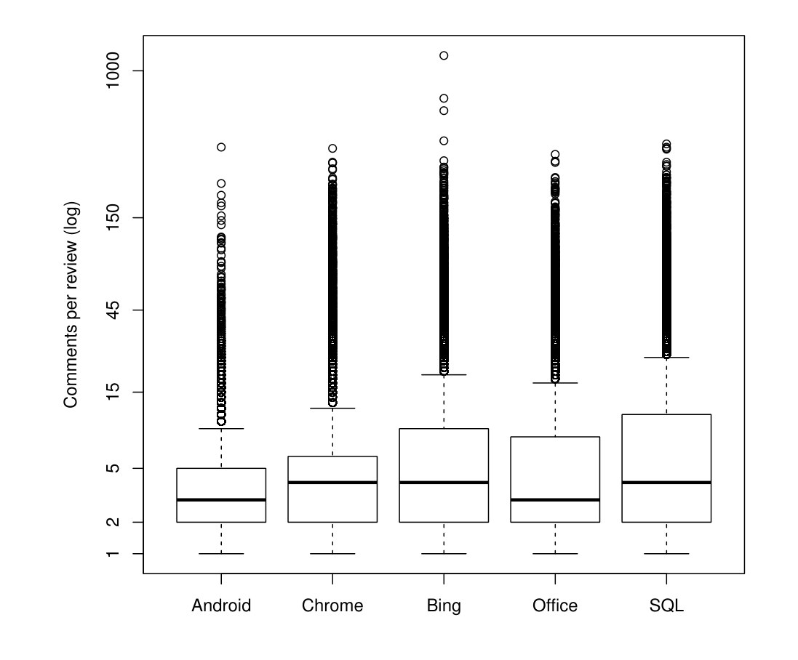
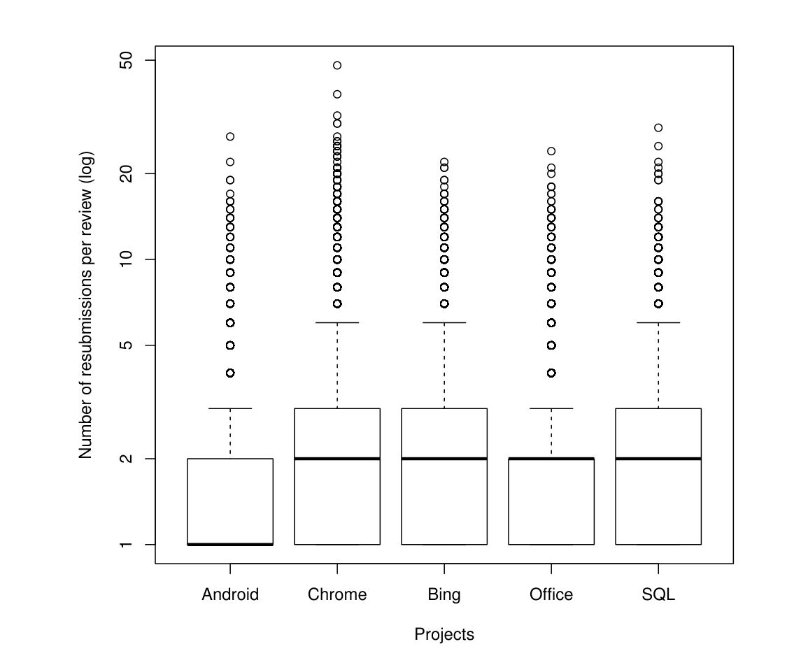

Figure 6: Number of comments per review

Figure 7: Number of submissions per review

fixing the defects found during review [25]. In this section, we also provide proxy measures for the number of defects found and show that they are comparable to those found during inspection.

> Convergent Practice 5: Review has changed from a defect finding activity to a group problem solving activity

Examining contemporary practices in software firms, we find convergence with OSS: defects are not explicitly recorded. AMD uses CodeCollaborator, which has a field to record the number of defects found; however, 87% of reviews have no recorded defects, and only 7% have two or more defects found. Measures of review activity indicate a median of two participants per review and qualitative analysis by Ratcliffe [20] found that discussions did occur but focused on fixing defects instead of recording the existence of a defect. The disconnect between explicitly recorded defects and activity on a review indicates that reviewers are examining the system, but that developers are not recording the number of defects found. Microsoft’s CodeFlow review tool provides further evidence – it does not provide a way for developers to record the defects found during review. This design decision results from the way that code review is practiced at Microsoft. When an author submits a change for review, the author and other reviewers have a joint goal of helping the code reach a satisfactory level before it is checked in. We have observed that reviewers will comment on style, adherence to conventions, documentation, defects, missed corner cases, and will also ask questions about the changes [2] in an effort to help the author make the code acceptable. It is unclear which of these represent defects and which do not (e.g. would the comment "Are you sure you don’t need to check against NULL here?" be a defect?). In addition, recording the defects found during review would not aid in the aforementioned goal. CodeFlow does provide the ability for an author to mark any thread of conversation with a status of "open", "ignored", "resolved", or "closed", enabling participants to track the various discussions within the changes. For our purposes, the closest artifact to a defect is a thread of discussion that has been marked as resolved, as a problem found within the code would need to be resolved by the author prior to check-in. The caveat is that a reviewer might make comments or ask questions that lead to discussion and are eventually marked as resolved, but that don't represent a defect found or result in any code being changed.

On the Google Chrome and Android projects, the Gerrit review tool does not provide any field to explicitly record the number of defects found. However, as we discussed in section 2, reviews pass through three stages: verified to not break the build, reviewed, and merged. The goal of these stages is not to simply identify defects, but to remove any defects before merging the code into a central, shared repository. As we can see from Figure 6, there is a median of 4 and 3 comments per review for Chrome and Android respectively – discussion occurs on these projects at similar levels to other OSS projects. On the Industrial side, the medians are the same, with 4, 3, and 3 comments for Bing, Office, and SQL respectively.

"You can't control what you can't measure" [7]

The contemporary software projects we studied do not record the number of defects found during review, in part because it distracts developers from their primary task of immediately fixing the defects found in review. However, without this