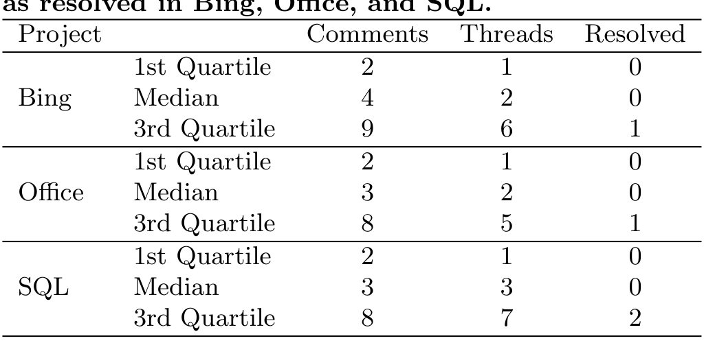

Table 2: Descriptive statistics for the number of comments, threads of discussion and threads marked as resolved in Bing, Office, and SQL.

Project Comments Threads Resolved

measure can software projects improve their process and product in the long term? Are there alternative measures of review effectiveness?

We suggest three alternative measures that when taken together provide an approximation of review effectiveness. First, the number of comments during review is an upper bound on the number of defects found per review (See Figure 6). The underlying assumption is that each comment represents a distinct defect. This assumption is often invalid as many comments will be related to the discussion of a single defect. In our manual analyses, we found that it was extremely rare for a comment to include more than one substantive defect; however, trivial formatting issues were often reported in a single comment. Second, a better estimate is the number of comment threads (See Table 2). The assumption is that each thread contains a single defect; however, sometimes a comment thread will contain discussions of multiple related defects, other times it will contain false positives, such as developer questions that do not uncover a defect. Third, a lower bound on the number of defects found in a review is the number of artifact resubmissions (See Figure 7). For non-trivial defects, a revised artifact may be submitted for re-review. However, a revision will cover all the fixed defects identified during a review session. Since CodeFlow is the only tool that tracks threads of conversation, we report the summary statistics of the number of comments, threads, and threads marked as resolved in Table 2.

These measures provide non-intrusive techniques (i.e. the data is implicitly recorded during the primary activity of discussing the software) to approximate review effectiveness. We do not want to make strong claims about review effectiveness because these measures are proxies of the number of defects found and artifact sizes tend to be smaller than in traditional inspection. However, we feel that the level of discussion during review and patch resubmissions suggests that contemporary review does find defects at a comparable level to traditional inspection. These measures and review practices on contemporary projects raise a larger philosophical question that deserves future work: is it more important to have a discussion about the system or to find and report defects?

## 5. SHARING KNOWLEDGE THROUGH REVIEW

The number of defects found during review is known to be a limited measure of review effectiveness because it ignores many of the other benefits of review, such as the sharing of knowledge among developers [12]. Some of the benefits of spreading knowledge across the development team include having co-developers who can do each other’s work if a developer leaves a project and involving new developers in reviews to familiarize them with a project’s codebase. While qualitative evidence from practitioners indicates that review does indeed spread knowledge across the development team [2, 20], we are unaware of any empirical studies that measure this phenomenon.

To provide a preliminary measurement of the knowledge spreading effect of peer review, we extend the expertise measure developed by Mockus and Herbsleb [16]. They measured the number of files a developer has modified (submitted changes to). We also measure the number of files a developer has reviewed and the total number of files he knows about (submitted ∪ reviewed). Figure 8 shows that the number of files a developer has modified (on the left) compared to the total number of files he or she knows about (on the right).4 For example, in the median case, a Google Chrome developer submits changes to 24 distinct files, reviews 38 distinct files, and knows about a total of 43 distinct files. Without review, in the median case, a Chrome developer would know about 19 fewer files, a decrease of 44%. Similarly, in the median case for Bing, Office, and SQL, review increases the number of files a developer knows about by 100, 122, and 150%, respectively.

Both Google Chrome and Android appear to have a larger number of developers who have submitted to and reviewed few files. OSS projects are known to have, what one interviewee called “drive-by” developers, who submit a single change [25] (e.g., a bug fix that affects the developer). Figure 8 shows that this effect is especially pronounced on the Android project where 54% of developers have modified fewer than five files. The increase in the number of files seen through review is also lower for Android, a 66% increase in the median case. If we exclude developers who have modified five or fewer files, we see the median number of files modified jumps from 6 to 16 and the total number of files goes from 10 to 25.

Our measure of knowledge sharing through peer review has shown a substantial increase in the number of files a developer knows about exclusively by conducting reviews. This measure deserves future study. Enhancements to the measure could also be used to gauge the diversity of the knowledge of developers assigned to a review. If a review has developers from diverse parts of the system reviewing the code and discussing it, it is less likely that there will be downstream integration problems.

4 We conservatively exclude submissions and reviews that contain more than 10 files.