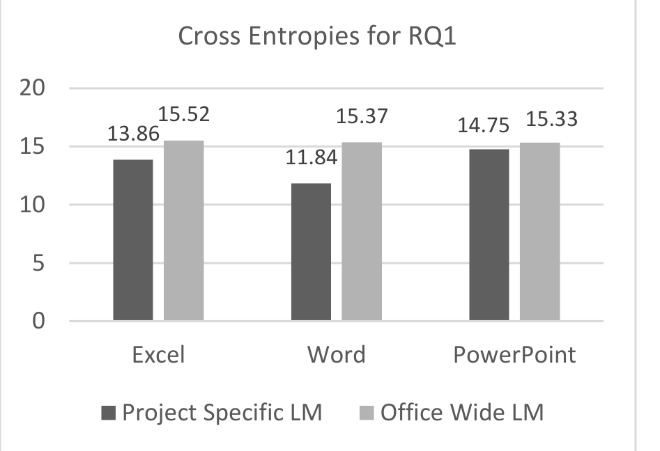
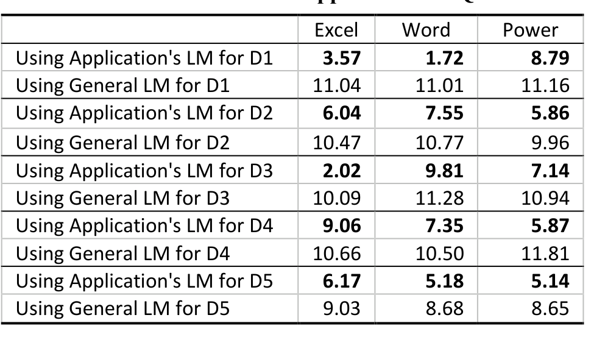
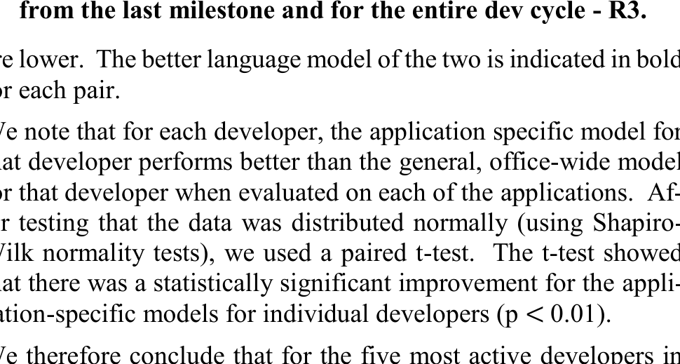

## Products, Developers, and Milestones: How Should I Build My N-Gram Language Model

Juliana Saraiva — Federal University of Pernambuco, Recife, Brazil — jags2@cinf.ufpe.br  
Christian Bird — Microsoft Research, Redmond, WA, USA — cbird@microsoft.com  
Thomas Zimmermann — Microsoft Research, Redmond, WA, USA — tzimmer@microsoft.com

### ABSTRACT
Recent work has shown that although programming languages enable source code to be rich and complex, most code tends to be repetitive and predictable. The use of natural language processing (NLP) techniques applied to source code such as n-gram language models show great promise in areas such as code completion, aiding impaired developers, and code search. In this paper, we address three questions related to different methods of constructing language models in an industrial context. Specifically, we ask: (1) Do application-specific, but smaller language models perform better than language models across applications? (2) Are developer-specific language models effective and do they differ depending on what parts of the codebase a developer is working in? (3) Finally, do language models change over time, i.e., does a language model from early development change later on in development? The answers to these questions enable techniques that make use of programming language models in development to choose the model training corpus more effectively.

We evaluate these questions by building 28 language models across developers, time periods, and applications within Microsoft Office and present the results in this paper. We find that developer and application-specific language models perform better than models from the entire codebase, but that temporality has little to no effect on language model performance.

### Categories and Subject Descriptors
D.2.3 [Software Engineering]: Coding Tools and Techniques

### General Terms
Measurement, Experimentation

### Keywords
N-gram Models, Natural Language Processing

### 1. INTRODUCTION
In their work on the naturalness of software, Hindle et al. showed that n-gram based language models perform quite well when used in the software engineering domain on source code [1]. A language model assigns a probability to a sequence of words (n-grams); the probability is typically learned from a training corpus. In recent years, these language models trained on source code corpora have been leveraged to aid in a wealth of tasks in software engineering including code completion [1] [2], detecting and enforcing team coding conventions [3], generating comments [4], suggesting accurate names of program entities [5], improving error messages [6] and migrating code between languages [7].

A language model assigns probabilities to sequences of token (also called n-grams) based on frequencies of the sequences in the training corpus. These probabilities can then be used to help developers in common programming tasks. A simple example is code completion, e.g., after encountering the sequence "for (int i=0; i<n;", a tool would automatically suggest the suffix "i++)" because it is the most frequent suffix for such code.

When training language models on source code, one faces two competing forces:

- **Specificity.** Language models can only provide help in source code that is similar to source code that it has seen before. Thus, the data sparsity problem, i.e., the need to see instances of many code contexts, drives the use of larger and larger corpora to train the model.

- **Generality.** On the other hand, the more disparate code bases are used, the less specific the model is and the less nuanced the help that it can provide. Put concretely, training a model on Apache Lucene will lead to a model that has Lucene-specific knowledge, but the model may not have suggestions or help for code contexts outside of the text search domain. In contrast, training a model on all of the code on GitHub will lead to models that contain general "knowledge" of programming for virtually every API, code construct, or pattern, but will not be specific to any particular application.

Given these tradeoffs, practitioners hoping to use language models in their own work are faced with the question, "How should I train my language model?" In this paper, we shed light on this question by sharing our experience on building language models on several different "slices" of the same codebase and comparing the results.

Specifically, we examine the code of Microsoft Office (hereafter referred to as Office). Office is a prime subject for such a study because the code is large, i.e., tens of millions of lines of code, and can be partitioned along a number of dimensions.

- Office is a suite of office productivity software applications including a word processor (Word), a spreadsheet application (Excel), and a presentation creator (PowerPoint). Thus we can naturally divide the code by application and train application-specific language models.

- Office is developed by thousands of full time developers, which allows us to partition the changes by the individuals and train developer-specific models.

- Finally, Office is developed in development milestones allowing us to train language models on the changes that are made in certain periods, i.e., time-specific models.

---

We use Office to answer the following three research questions. The answers will help developers make informed decisions about how to train language models for their software engineering tools:

- RQ1: Does a smaller application-specific language model perform better than a language model built from multiple applications?
- RQ2: Does a programmer generate the same patterns (n-grams) regardless of where he/she is working?
- RQ3: Does a model built from changes over the last milestone perform as well as one trained over the whole history of changes (i.e., is there a temporal relationship to the language models)?

## 2. METHOD

We examined the C# code and changes in Office 2013 since that was the last full release (and development cycle) for the Office codebase. We used the Roslyn API to extract the lexical tokens from the C# code (http://msdn.com/roslyn); we did not include comments in the analysis. We used 3-grams (also called trigrams) because the majority of the works related to NLP used 2-grams and/or 3-grams [8] and when n-gram models are applied to source code, cross-entropy saturates around 3 and 4-grams [1]. We implemented the language model generation and evaluation ourselves in C# and R.

Application-specific models. We built four language models based on the n-grams of tokens taken from the source code of (1) Excel, (2) Word, (3) PowerPoint, and (4) the entire Office source code.

Developer-specific models. We selected the five most active developers in Office (D1...D5). Each developer’s language model was built considering all their respective source code changes. For each change made by the developer, we generated two multi-sets of n-grams with their frequencies: (i) the n-grams in the version of the file prior to the change, and (ii) the n-grams in the version after the change. The n-grams used to generate the developer-specific language model are the multi-set difference between the “after” n-grams and the “before” n-grams. If an n-gram occurred in the original file twice and in the modified file five times, then we would add three occurrences of the n-gram to the language model for that developer (if an n-gram occurs the same amount or lower in the changed file, the count for that n-gram is 0). The n-grams that were added as a result of a developer’s changes allow us to build a language model based on implementation patterns by developers.

Time-specific models. We use a similar technique for extracting n-grams when building language models for different time periods, e.g., the last milestone of the Office development. For each change in the milestone period, we extract the n-grams from the file both before and after the change and use the added n-grams to build a language model for the last milestone.

In summary, we built a total of 28 distinct language models.
- 1 general model for all code in Office
- 3 application-specific models: all code in (i) Word, (ii) Excel, and (iii) PowerPoint
- 20 developer-specific models, i.e., 4 models for each of the 5 most active developers (D1…D5): changes by the developer in (i) Office, (ii) Word, (iii) Excel, and (iv) PowerPoint
- 4 time-specific models: changes in the last milestone of (i) Office, (ii) Word, (iii) Excel, and (iv) PowerPoint

### 2.1 Language Model Quality Evaluation

To evaluate language models we split each corpus into two halves: a training corpus and a test corpus. It is important to highlight that for our test data, we chose files (and in cases of changes, changes to those files) distinct from those used to train the language models.

To evaluate the quality of language models we use cross-entropy, the standard measure of language model quality [1], which measures how surprising a test corpus is to a language model built from a training corpus. Lower values indicate a better model. The formula to compute cross-entropy H is shown below. An n-gram in the testing corpus is represented by the tokens a1…an. M represents the language model, and pM is the probability of encountering the token ai after encountering tokens a1…ai-1.

H_M(s) = - (1/n) * sum_{i=1..n} log p_M(a_i | a_1 ... a_{i-1})

The cross-entropy calculation depends on the probability of the occurrence of a certain token given a previous sequence of tokens. However, there are some cases where the probability of the occurrence of a particular token following a given sequence is 0 for a trained language model. This occurs when an n-gram that occurs in the testing corpus does not occur in the training corpus (which is not uncommon given that one source file may contain identifiers such as names of local variables or private methods that do not occur in any other file). As the cross-entropy measurement is based on a log function, and the log of 0 tends to negative infinity we use smoothing techniques [9], which attempt to estimate the likelihood of encountering a particular n-gram even if it has not been seen before, to avoid these situations. We used the Additive Smoothing technique because prior studies [9] have found that it works well and it is used frequently in practice.

For each research question, we computed different groups of cross-entropies and compared their values with others to determine if certain models perform better than others.

In this section we present the research hypotheses that we evaluate to answer each of our research questions.

RQ1: The goal is to determine if a general language model generated from all of the C# code in Office performs well for each of the individual applications (Excel, Word, PowerPoint) or if application-specific language models are better in terms of cross-entropy. The common wisdom is that general models, which are based on larger data sets, perform better (observed by Hindle et al. [1]). However, application-specific models may be more effective in capturing application-specific programming idioms or API. We therefore trained four models: a general model for all of Office and application-specific models for Word, Excel, and PowerPoint. We then computed the cross-entropy of these models with the test sets for Word, Excel, and PowerPoint (again, note that there is no overlap in the training and test sets).

RQ2: The goal is to determine if developers write code differently in different parts (applications) of the code base. This answers the question whether a single language model for a developer is sufficient (e.g., for code completion) and whether context-specific models should be built for developers, e.g., one language model for each application that a developer is working on. From the Office codebase, we identified 84 developers who worked on all three applications in the same development cycle and selected the five most active developers (based on the number of changes that they made in each application) for our analysis.

RQ3: This research question asks if we can represent all of the changes across an entire development cycle with a language model created from the changes from just one milestone. Put more simply, is the language model for an application time independent? To answer this question we built models using only changes from the last milestone in the development cycle and compare with models built from the changes during the entire development cycle. To compare

---

> **Image description:** Bar chart comparing cross-entropy (lower is better) for application-specific (dark bars) and Office-wide (light bars) 3-gram language models on Excel, Word, and PowerPoint test corpora. Application-specific models have lower cross-entropies in all three cases: Excel 13.86 vs 15.52, Word 11.84 vs 15.37, and PowerPoint 14.75 vs 15.33. The largest improvement is for Word (≈3.53 reduction) and the smallest for PowerPoint (≈0.58), supporting the paper’s finding that application-specific models outperform a general Office model for RQ1.

Project Specific LM  Office Wide LM  
Figure 1. Cross-Entropy Results by Application - RQ1.

## 3. RESULTS

The main goal of this research is to understand what factors have an effect on the quality of a language model. By understanding the answers to these questions, we can generate high quality language models to aid and improve development activities through techniques such as code completion, anomaly detection, and assistance of disabled developers [1]. We now present the results of our analysis in an attempt to provide evidence to answer our research questions.

### RQ1: Does an application specific language model perform better than a language model across all of Microsoft Office?

The Excel, Word, and PowerPoint applications were analyzed to answer this RQ. In each case we compared the quality of an application-specific language model to the general, office-wide language model. In all cases, the application-specific model performed better than the general model. The same testing corpora were used for each pair of cross-entropy calculations. Figure 1 shows the cross-entropy values. The dark bars represent the values obtained when using the application-specific models and the light bars indicate values when using the general model.

In all three cases, the cross-entropies were lower when the application-specific language model was used on the test corpus. PowerPoint shows the least difference with a delta of 0.58 in Figure 1. We conclude that in the case of the applications examined within Office, our answer to RQ1 is: "Yes, an application-specific language model performs better than a model across the entire codebase".

### RQ2: Does a programmer generate the same patterns and idioms (n-grams) regardless of where he/she is working?

Five developers who all made changes to Word, Excel, and PowerPoint between January 1st, 2011 and July 31st, 2012 were analyzed in this study. Table 1 shows the cross-entropies results.

The first column indicates which language model (LM) was used on the testing data. The second, third, and fourth columns represent the cross-entropies results found for Excel, Word, and PowerPoint, respectively. Observing Table 1, we can confirm once again that the language model generated specifically from an application performed better than a general language model (that is, a general language model for a specific developer), i.e., the cross-entropy values

Table 1. Cross-Entropy Results for Developers by Application and Across All Applications– RQ2

> **Image description:** Table of cross-entropy values (lower is better) comparing, for five developers (D1–D5), language models built from a developer’s changes restricted to an application versus a developer’s general, office-wide model. For every developer and application shown, the application-specific model has a substantially lower cross-entropy (for example, D1 on Excel: 3.57 vs 11.04; D1 on Word: 1.72 vs 11.01; D3 on Excel: 2.02 vs 10.09), indicating better predictive performance. All 15 application-specific vs. general comparisons favor the application-specific model; the paper reports this improvement is statistically significant (paired t-test, p < 0.01).

are lower. The better language model of the two is indicated in bold for each pair.

We note that for each developer, the application-specific model for that developer performs better than the general, office-wide model for that developer when evaluated on each of the applications. After testing that the data was distributed normally (using Shapiro-Wilk normality tests), we used a paired t-test. The t-test showed that there was a statistically significant improvement for the application-specific models for individual developers (p < 0.01).

We therefore conclude that for the five most active developers in Office, our answer to RQ2 is: "No, individual developers use slightly different patterns and write less predictable code across applications". The implication of this result is that when building developer specific models, it is better to use less data per model and build multiple context-specific models per developer than to build one large model per developer.

Figure 2. Cross-Entropy Results for models generated from the last milestone and for the entire dev cycle - RQ3.

> **Image description:** Grouped bar chart comparing cross-entropy (y-axis; lower is better) for four test corpora — Excel, Word, PowerPoint, and Office — with two bars per group: dark bars for models trained on the entire development cycle and light-gray bars for models trained only on the last milestone. For Excel, PowerPoint, and the overall Office corpus the two bars are very close (small differences), and in those cases the last-milestone model is slightly better in the figure. For Word there is a clear gap: the entire-development-cycle model (dark bar) has substantially lower cross-entropy than the last-milestone model, indicating the whole-cycle model performs markedly better for Word.

### RQ3: Is there a temporal relationship to the language models? Does a model built from changes over the last milestone perform as well as one trained over the whole history of changes?

The intention of this research question was to determine if a language model drawn from a shorter period of time performs well across all of the changes in an entire development cycle. This has implications on how frequently language models need to be updated as well as the resources needed to build these language models (data from a full development cycle requires more resources to generate a language model than data from one milestone). Figure 2 shows the cross-entropies for Excel, Word, PowerPoint, and the general Office language models for the last milestone and the entire development cycle.

---

development cycle evaluated against a test corpus for each application drawn from the entire development cycle. The dark bars represent the cross-entropies resulting from the whole application’s language model, and the light gray bars indicate the cross-entropies of the last milestone’s language model.

Analyzing Figure 2, in three of the four cases, there is only a small difference in the cross-entropies, with the last milestone model actually performing better. However, for Word, the language model built from the entire development cycle performed much better than the last milestone language model.

We thus conclude that for RQ3: “For most, but not all, cases, a language model generated from the last milestone performs as well as a language model generated from the entire development cycle.” The answer to this question indicates that it may be a fruitful direction for further research. We are unaware of any other research on the effects of temporality factors on language model quality.

## 4. THREATS TO VALIDITY

Our work is subject to many of the usual threats to validity in an industrial software engineering empirical study. The primary threat in such studies is of external validity; while Office is a large product suite, it is still just one software project thus it is unclear how generalizable our results are. Nonetheless, we believe that this study provides some insight for industrial software projects considering using language models to aid in various development tasks. We encourage others to investigate similar ecosystems of projects such as GNOME, KDE, the Apache family of projects, or in proprietary codebases.

## 5. RELATED WORK

We are unaware of work that evaluates how to select the training corpus for language models. Hindle et al. [1] built language models from Java and C codebases and evaluated cross-entropy for each corpus and between corpora, but did not investigate different sets of documents along dimensions such as time or developer.

The applications of language models in software engineering are varied. The most common is code completion, as demonstrated by Raychev et al. [2] and Franks et al. [11]. However, Allamanis et al. have shown that language models can be used to detect and enforce team coding conventions [3] as well as suggesting accurate names of program entities such as variables, methods, and classes [5]. Hellendoorn showed that language models can be used to determine how well a code contribution to a project matches the project’s coding style and thus can indicate if a contribution will be rejected and need further work [12].

Language models can also be used to improve natural text that is tightly coupled to code. For example, Movshovitz-Attias and Cohen demonstrated how to use LMs to generate code comments [4] and Campbell et al. showed they could improve error reporting [6].

Our work is orthogonal to the applications of language models as this study is focused on how to select the corpus of source code to train a language model before using it in various tasks.

## 6. CONCLUSION

In this work, we have investigated how different aspects of language model generation affect their quality. We used the standard metric of cross-entropy for evaluating various language models. We found that the more specific a language model is, the better its performance, even when models are tailored to specific developers and less data to train a model is available. In contrast, we found that in many cases, the temporality of the models has little impact. We recommend that language models used to improve development tasks (such as code completion) should consider the context such as the application or the developer.

This is an initial step into the realm of exploring the various methods of generating language models. Similar to defect prediction, bug triage, and other research problems, we hope that others will build on these ideas and investigate the effects of considering various attributes when building language models in an effort to build knowledge and guidelines for those applying n-gram based language models to development tasks.

## 7. REFERENCES

[1] A. Hindle, Z. Su, P. Devanbu, M. Gabel and E. T. Barr, "On the Naturalness of Software," in ICSE, Zurich, 2012.

[2] V. Raychev, M. Vechev and E. Yahav, "Code completion with statistical language models," in Proceedings of the 35th ACM SIGPLAN Conference on Programming Language Design and Implementation, 2014.

[3] M. Allamanis, E. T. Barr, C. Bird and C. Sutton, "Learning Natural Coding Conventions," in Proceedings of the 22nd International Symposium on Foundations of Software Engineering, 2014.

[4] D. Movshovitz-Attias and W. W. Cohen, "Natural Language Models for Predicting Programming Comments.," in ACL (2), 2013.

[5] M. Allamanis, E. T. Barr, C. Bird and C. Sutton, "Suggesting Accurate Method and Class Names," in Proceedings of the the joint meeting of the European Software Engineering Conference and the ACM SIGSOFT Symposium on The Foundations of Software Engineering (ESEC/FSE), 2015.

[6] J. C. Campbell, A. Hindle and J. N. Amaral, "Syntax errors just aren't natural: improving error reporting with language models," in Proceedings of the 11th Working Conference on Mining Software Repositories, 2014.

[7] A. T. Nguyen, T. T. Nguyen and T. N. Nguyen, "Lexical statistical machine translation for language migration," in Proceedings of the 2013 9th Joint Meeting on Foundations of Software Engineering, 2013.

[8] P. F. Brown, P. V. Desouza, R. L. Mercer, V. J. D. Pietra and J. C. Lai, "Class-based n-gram models of natural language," Computational linguistics, vol. 18, pp. 467--479, 1992.

[9] S. F. Chen and J. Goodman, "An empirical study of smoothing techniques for language modeling," in Proceedings of the 34th annual meeting on Association for Computational Linguistics, 1996.

[10] M. Allamanis and C. Sutton, "Mining source code repositories at massive scale using language modeling," in Mining Software Repositories (MSR), 2013 10th IEEE Working Conference on, 2013.

[11] C. Franks, Z. Tu, P. Devanbu and V. Hellendoorn, "CACHECA: A Cache Language Model Based Code Suggestion Tool," ICSE Demonstration Track, 2015.

[12] V. J. Hellendoorn, P. T. Devanbu and A. Bacchelli, "Will they like this? Evaluating Code Contributions With Language Models," in Proceedings of the International Conference on Mining Software Repositories, 2015.