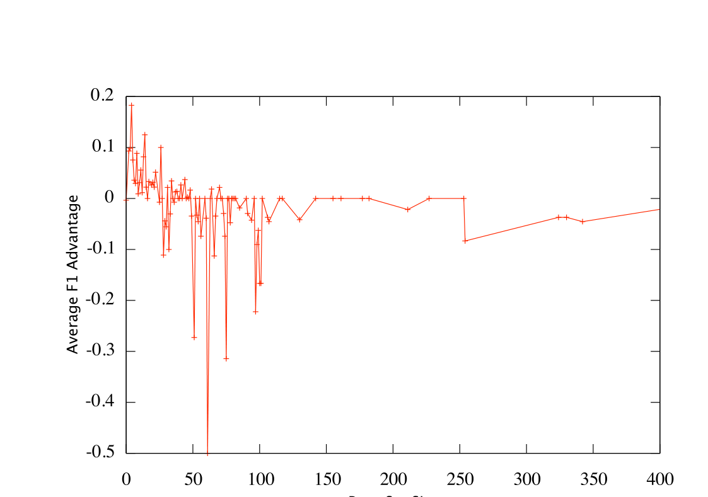
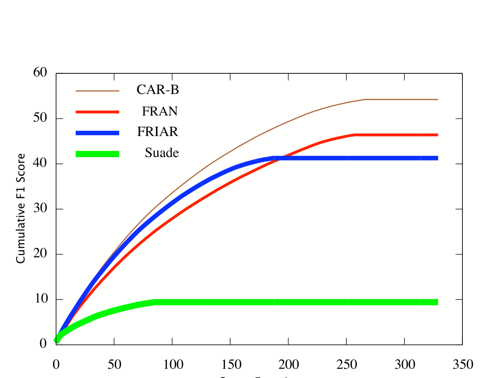

(a) FRAN has advantage over FRIAR for small base set sizes.

(b) A base-set size aware combined algorithm is favorable.

Figure 4: The effect of the base-set size and a cumulative comparison of the methods.

[5] D. Cubranic, G. Murphy, J. Singer, and K. Booth. Hipikat: a project memory for software development. Software Engineering, IEEE Transactions on, 31(6):446–465, 2005.

[6] D. Engler, D. Chen, S. Hallem, A. Chou, and B. Chelf. Bugs as deviant behavior: a general approach to inferring errors in systems code. Proceedings of the eighteenth ACM symposium on Operating systems principles, pages 57–72, 2001.

[7] Y. Hahsler, B. Grün, and K. Hornik. A computational environment for mining association rules and frequent item sets. Journal of Statistical Software, 14:1–25, 2005.

[8] M. Hollander and D. A. Wolfe. Nonparametric Statistical Methods. 2nd edition, 1999.

[9] K. Inoue, R. Yokomori, H. Fujiwara, T. Yamamoto, M. Matsushita, and S. Kusumoto. Component rank: relative significance rank for software component search. Proceedings of the 25th international conference on Software engineering, pages 14–24, 2003.

[10] J. Kleinberg. Authoritative sources in a hyperlinked environment. In Proceedings, 9th SIAM Symposium on Discrete Algorithms, New York, NY, 1998. ACM, ACM.

[11] Z. Li and Y. Zhou. PR-Miner: automatically extracting implicit programming rules and detecting violations in large software code. In ESEC/FSE-13: Proceedings of the 10th European software engineering conference held jointly with 13th ACM SIGSOFT international symposium on Foundations of software engineering, 2005.

[12] V. B. Livshits and T. Zimmermann. Dynamine: Finding common error patterns by mining software revision histories. In Proceedings of the 13th ACM SIGSOFT International Symposium on the Foundations of Software Engineering (FSE-13), Sept. 2005.

[13] A. Michail. Data mining library reuse patterns using generalized association rules. International Conference on Software Engineering, pages 167–176, 2000.

[14] D. Poshyvanyk, Y. Gueheneuc, A. Marcus, G. Antoniol, and V. Rajlich. Combining Probabilistic Ranking and Latent Semantic Indexing for Feature Identification. Proceedings of 14th IEEE International Conference on Program Comprehension (ICPC’06), Athens, Greece, pages 137–148, 2006.

[15] M. Robillard. Automatic generation of suggestions for program investigation. ACM SIGSOFT Software Engineering Notes, 30(5):11–20, 2005.

[16] M. P. Robillard. Automatic generation of suggestions for program investigation. In SIGSOFT Symposium on the Foundations of Software Engineering, 2005.

[17] N. Wilde, M. Buckellew, H. Page, V. Rajlich, and L. Pounds. A comparison of methods for locating features in legacy software. Journal of Systems and Software, 65(2):105–114, 2003.

[18] C. Williams and J. K. Hollingsworth. Automatic mining of source code repositories to improve bug finding techniques. IEEE Transactions on Software Engineering, 31, 2005.

[19] T. Xie and J. Pei. MAPO: mining API usages from open source repositories. Proceedings of the 2006 international workshop on Mining software repositories, pages 54–57, 2006.

[20] A. Ying, G. Murphy, R. Ng, and M. Chu-Carroll. Predicting source code changes by mining change history. IEEE Transactions on Software Engineering, 30(9):574–586, 2004.

[21] C. Zhang and H.-A. Jacobsen. Efficiently mining crosscutting concerns through random walks. In AOSD ’07: Proceedings of the 6th international conference on Aspect-oriented software development, pages 226–238, New York, NY, USA, 2007. ACM Press.

[22] W. Zhao, L. Zhang, Y. Liu, J. Sun, and F. Yang. SNIAFL: Towards a static noninteractive approach to feature location. ACM Transactions on Software Engineering and Methodology (TOSEM), 15(2):195–226, 2006.

[23] T. Zimmermann, A. Zeller, P. Weissgerber, and S. Diehl. Mining version histories to guide software changes. Software Engineering, IEEE Transactions on, 31(6):429–445, 2005.