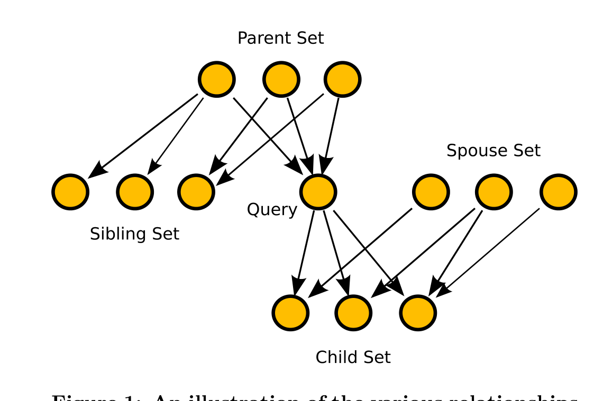

Figure 1: An illustration of the various relationships in the call graph of the parent set, child set, sibling set and spouse set to the query function.

Inspired by the web search community, we call this union set the base set. We're abusing the term somewhat; our base set is not the same set of nodes (relative to the query node) as the base set in Kleinberg’s well-known paper [10]. For us, the base set is an enriched set of results related to the query function for the programmer to consider. However, the base set itself is frequently too large for a human to easily explore. Therefore, it is desirable to rank the functions in the base set based on their relevance to the query.

In order to rank the results in the base set, we first observe that software contains functions that aggregate functionality and functions that largely implement functionality without aggregating, and we note that there is a circular relationship between these two types of functions. Aggregating functions call implementing functions and implementing functions are called by aggregators. A similar relationship exists in the context of world wide web pages where the aggregating pages are called hubs and the implementing pages are called authorities. The Hypertext Induced Topic Selection (HITS) algorithm due to Kleinberg takes advantage of this relationship between hubs and authorities to rank a set of web pages based on degree of authority. In FRAN, we use HITS on the subgraph of the callgraph induced by the base set to assign ranking scores to the nodes in the base set, allowing us to sort the elements of our base set. HITS applied to software callgraphs works as follows.

For a collection of functions in a callgraph, assign each function, f, an authority score, x<f>, and a hub score, y<f>. As noted above, strong hubs (aggregators) call many strong authorities (implementors). To capture this relationship, define two operations I and O. I updates the authority weights based on the hub weights, and O updates the hub weights based on the authority weights.

I: x<f> = sum_{g | g calls f} y<g>    (1)  
O: y<f> = sum_{g | f calls g} x<g>    (2)

In HITS, these two rules are applied one after the other iteratively:

> Algorithm 4.1: HITS Algorithm()  
> repeat  
>  x_{i+1} ← I(y_i), updating the authority scores.  
>  y_{i+1} ← O(x_{i+1}), updating the hub scores.  
>  Normalize x_{i+1} and y_{i+1}  
> until x_i − x_{i+1} < a stopping threshold.

Let A be the adjacency matrix of the graph in question. If there exist two functions represented by numerical ids f and g, and if f calls g, then the (f, g)th entry of A is 1; every other entry of A is 0. Kleinberg gives a proof that the sequence lim x_i → x* and lim y_i → y* where x* is the principal eigenvector of A^T A and y* is the principal eigenvector of A A^T [10]. Therefore, the HITS algorithm converges and could, in fact, be implemented using any standard eigenvector finding method.

This convergence result has an interesting interpretation in the context of Markov chains. The matrices A^T A and A A^T can be thought of as reachability matrices. The matrix A^T A has a 1 in position (i, j) if j is in the sibling set of i. Another way of saying this is that the i-th row of A^T A indicates all of the functions reachable from i by traversing back a function call to a parent, and then traversing forward to a sibling. Similarly, the i-th row in A A^T gives the spouse set of i.

If the rows of A^T A and A A^T are normalized to sum to 1, they can be thought of as transition matrices for Markov chains describing the actions of two programmers randomly attempting to understand a program, and the eigenvectors of these matrices indicate the steady-state probabilities of the Markov chains. Thus, the authority score of a function represents the probability that the random programmer who always investigates sibling functions will end up in the function, and the hub score is the probability that the random programmer who only considers spouse functions will end up in that function. The FRAN algorithm simply returns the top n authorities, where n is selected by the user.

FRAN performs better in this setting than Suade; the Suade algorithm only returns results that are adjacent to the query function in the graph. However, if more data are available, Suade does allow graphs other than the callgraph to be used as the basis for the search (e.g., the “member referenced by” graph). In the callgraph, only functions called by or called from the query function are returned. Hence, Suade only finds the results that a programmer might quickly find using “grep”, and in addition it only finds results in the layers above and below the query function rather than finding the most relevant results, which lie in that layer.

It is also important to note that FRAN is fast. The implementation for this paper returns query results interactively with no perceptible wait time.

### 4.2 The FRIAR algorithm

Our second algorithm, Frequent Itemset Automated Recommender (FRIAR) is inspired by the data mining practice Association Rule Mining. Association Rule Mining was developed to analyze purchasing patterns [7]. Define a transaction as a set of items purchased together. Then, given a set of transactions, association rule mining attempts to discover rules of the form A ⇒ B, where A and B are small