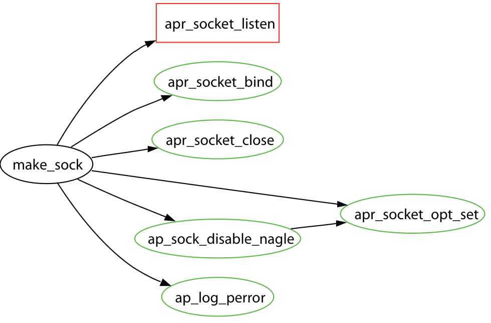

fairly thorough quantitative comparison of performance, for this specific task. For the case study part, we focus on a few cases where FRAN retrieves more answers than the other algorithms and examine whether these recommendations are relevant to the given functions.

## 5.1 Case Study

Given the large number of cases where FRAN retrieves more ersatz related functions than FRIAR, our goal in the case study is to determine a) Are these extra functions really related, or are they just random junk? b) Why does FRAN retrieve more answers? So we focus on cases where FRAN retrieves more answers than both Suade and FRIAR and critically review the answers. Our cases are all drawn from the Apache portability layer. In each case, we issued the query to all 3 algorithms and examined the retrieved set. The answers were examined by 3 of us (Bird, Devanbu, and Saul). Bird and Devanbu have over the last two years conducted extensive mining and hypotheses testing on the Apache repository. Saul has worked professionally as a Unix systems programmer and has prior experience constructing a web server, so he is familiar with the design of web servers. With our prior experience and careful reading of the Apache documentation, we were able to critically evaluate the answers returned.

Case 1: apr_collapse_spaces is a function in the Apache Portability layer, in the String Routines module.4 The APR documentation states that the function will “Strip spaces from a string.” For this function, FRIAR returns nothing; Suade returns a function that is called from within the body of a standard C library: this function is normally invisible to C programmers, and is of little value to a developer. FRAN returns several recommendations, ranked by authority scores. Of the top 5, the first is ap_cfg_getline, which is described5 as “Reads a line from a file, stripping whitespace.” The second is a simple function read_quoted, which (from the Apache source code) is readily determined to remove quotes from strings. The rest of the top 5 are irrelevant. Further analysis reveals the reason that FRAN outperforms the other methods is that FRAN includes the spouse set in the set of potential results. The function from the body of the C library is called by apr_collapse_spaces, but it is also called by ap_cfg_getline and read_quoted. Suade and FRIAR do not consider the spouse set so they miss this relationship.

Case 2: apr_socket_listen is a function which is described in the documentation6 as “Listen to a bound socket for connections.” When this function is given as a query, the top-ranked responses are apr_socket_opt_set which is used to set up options for a socket, apr_socket_close (closes a socket) and apr_socket_bind (binds a socket to an associated port). All of the above are clearly relevant. The fifth one, ap_log_perror is an error logging routine that is called often. For this query, Suade retrieves listen which is a Unix system call described as “Listen for connections on a call” in the BSD System Calls manual listing (See listen(2)). This function is relevant, but clearly belongs in a lower layer of abstraction, and would normally be abstracted.

4 See http://docx.itscales.com/group__apr__strings.html  
5 See http://httpd.apache.org/dev/apidoc/apidoc_ap_cfg_getline.html  
6 See http://docx.itscales.com/group__apr__network_io.html

Figure 2: The neighborhood of apr_socket_listen with the sibling set highlighted in green.

by the Apache Portability Layer to apr_socket_listen; programmers would normally shun functions in the lower layer to avoid platform-specificity. Suade also retrieves the function make_sock, which sets up the server’s socket to listen for connections; clearly, this function is also relevant. Interestingly, comments on this code state that this routine is “begging and screaming to be in the portability layer.” This function is also retrieved by FRAN, but it is ranked number 7, after another function ap_sock_disable_nagle which is a function to disable a particular network buffering algorithm. FRIAR retrieves nothing in this case. As can be seen in figure 2, the functions returned by FRAN are all siblings, and thus in the same layer. Suade only considers the direct neighbors of a function as possible related functions; since apr_socket_listen has only one parent, make_sock, it finds nothing else but that.

Case 3: apr_pool_terminate. Like many large systems, Apache uses a pool-based memory management.7 It allocates memory in big hunks, called pools, and uses internal functions to allocate smaller pieces from this pool. apr_pool_terminate is a function which will “Tear down all of the internal structures required to use pools.” The first two retrieved functions are apr_pool_destroy, which destroys the pool and frees the memory, and apr_pool_clear, which clears the memory without de-allocating it. The next function is destroy_and_exit_process which shuts down the server. This function actually calls apr_terminate (#5 on the retrieved list) to tear down the memory pools. The fourth on this list is start_connect which has no obvious relevance. Suade retrieves apr_terminate and apr_pool_destroy, which are both relevant, but does not retrieve the others. FRIAR retrieves none.

Case 4: apr_file_eof is one of the Apache File/IO handling routines.8 It checks “Are we at the end of the file.” FRAN retrieves only 3 functions. The first is apr_file_read, which is clearly related; it also retrieves ap_rputs which “Outputs a string for the current request” and do_emit_plain which

7 http://apr.apache.org/docs/apr/0.9/group__apr_pools.html  
8 http://docx.itscales.com/group__apr__file__io.html  
9 http://docx.itscales.com/group___a_p_a_c_h_e___c_o_r_e___p_r_o_t_o.html  
10 From comments in mod_autoindex.c in Apache HTTPD source code