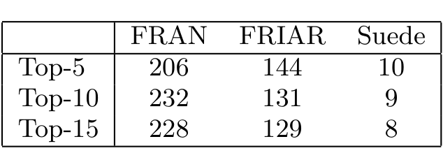

“emit(s) a plain file.” Analysis of the callgraph reveals that do_emit_plain calls the other three. We judged all of these are quite relevant, since they are useful when reading from file and writing the contents back to the request. Suade retrieves only one item: the parent function, do_emit_plain. As FRIAR looks at frequent itemsets that occur at least twice in the code, it won’t ever see apr_file_eof because this function is called only once.

Admittedly, these are a limited set of samples; our focus was also on the cases where FRAN retrieves more items, to check if these extra items were indeed relevant, and to explain the differences in behaviors between the algorithms. As discussed earlier, it is laborious and time-consuming to conduct comparative case studies on a large scale. Therefore, we devote the rest of our evaluation to a more automated, comprehensive quantitative evaluation of the performance of these algorithms on a more specific (but still very core) task of recommender algorithms, as we now describe.

## 5.2 Quantitative Study

To perform this quantitative evaluation, we focus on a specific task in the Apache system. Apache has a portability layer (PL), which consists of 32 separate groupings of functions, or portability layer modules (PLM). Each PLM includes a closely related set of functions that perform tasks such as file operations, socket operations, thread management, locking operations and memory pool management. When a programmer is working on a method that performs a particular operation on the memory pool, e.g., she may seek related functions that operate on the memory pool.

In Apache, the directory structure naming conventions of the PL generally allow this task to be done just using file structuring and “grep”. However, this type of a-priori grouping and documentation may not be available to programmers, and, worse, potentially misleading exceptions to established naming conventions can exist. For example, most of the function names in the Apache “File I/O” PLM are prefixed with the string “apr_file_”. However, some functions from this PLM such as “apr_temp_dir_get” and “apr_dir_make” do not follow the naming convention.

However, because the extensive Apache PL documentation groups the functions into PLMs, we can use these PLMs as a valuable oracle, quantitatively evaluating the performance of FRAN, FRIAR and Suade on one specific task:

Task: Given a query function and a callgraph, retrieve other functions in the same PL module.

It has been suggested that we could evaluate our algorithm’s performance when a set of query functions is given as input (rather than a single query function); however, due to space and time constraints, that task remains for future work.

Also, it can certainly be argued that there are other ways to do the current task in Apache than using FRAN, FRIAR and Suade; in response, we have three rejoinders: a) Yes, but the type of extensive documentation available in Apache is rare in large systems, b) Even when it exists, documentation is not always in sync with the code, which never lies! c) Finding related functions in the same API module is a task that most C programmers have to deal with, since the language is not object-oriented, and d) The fact that the documentation exists makes Apache a useful setting to perform a thorough, and we believe unprecedented, type of quantitative evaluation. For this portion of the study our goal is

Table 1: Number of queries (out of 330) for which the top-k recommendations from each algorithm pass the 0.05 False Discovery Rate.

to quantitatively evaluate both the statistical significance of the results, as well as the recall and precision.

### 5.2.1 Significance of the Recommendation Sets

Our two algorithms FRAN and FRIAR, as well as Suade, recommend a number of related functions in ranked-order. Based on the interest and resources of the programmer she can choose the top-k of the ranked functions on which to perform her work. We call this top-k set the recommendation set.

To objectively quantify the ability of our algorithms to return significant recommendations we tested statistical hypotheses that their efficacy is no better than that of the behavior of a “programmer new to the project” (statistical null-hypothesis). Such a programmer would look at a large candidate set of potentially related functions, possibly as small as some well-defined neighborhood in the callgraph around the query function (although still potentially consisting of hundreds of functions), or in some cases even as big as the whole callgraph. Out of those candidate related functions the programmer would uniformly at random choose a smaller set of recommendations.

Using this null-hypothesis programmer model allows us to quantitatively evaluate each set of recommendations of our algorithms as possibly not doing better than chance recommendations. Rejecting the null-hypothesis at a certain significance threshold, say 0.05, would let us believe that the recommendation set would not be guessed by a “programmer new to the project” 95% of the time.

We compared the significances of the three algorithms at three recommendation set size cutoffs, top-5, top-10 and top-15, over all 330 query functions. We used the PL module documentation as a Rosetta stone (see above). For each recommendation cutoff k (5, 10 and 15), we counted how many of the top-k recommendations for a given query function appear in that function’s PL module. The hypergeometric distribution was used to obtain the chance probability of observing the number of functions from a module within each query recommendation set. More specifically, the probability of observing at least x functions from a PL module within a recommendation set of size k is given by:

p = 1 − sum_{i=0}^{x-1} [ C(f, i) * C(g − f, k − i) / C(g, k) ]

where f is the total number of functions within the PL module and g is the total number of functions in the initial large candidate set (i.e. the population). This is also known as the p-value and is equal to 1 − the significance.

In order to assess the relative performance of the algorithms in retrieving related functions it is sufficient to choose a common population set for the functions, for all algorithms (corresponding to the initial candidate set.) In our case we