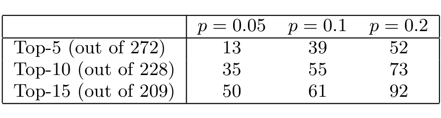

Table 2: Number of queries for which the top-k recommendations from FRAN pass a False Discovery Rate threshold.

chose the whole call graph, i.e. g = 2308. We submitted each of the 330 unique functions from the PL modules as queries to the algorithms and, using the above significance formula, counted how many of the recommended sets were significant at 95%, or have a p-value lower than 0.05. Given that each query is in fact a hypothesis, this testing procedure amounts to multiple testing of 330 hypotheses. To maintain an overall false positive rate of below 0.05 (i.e. the False Discovery Rate), the individual p-values during the testings were adjusted (lowered) using the Benjamini-Hochberg adjustment for multiple hypothesis testing [2]. The results of the relative comparison for all three algorithms are given in Table 1.

We also performed a statistical significance study to determine how well FRAN ranks the initial candidate functions. For the population set here we used the FRAN base set as described before in Sec. 4.1. The idea is to compare the performance of FRAN to that of a “programmer new to the project” (null-hypothesis) who is given the same base set of functions in the neighborhood of a given query function and asked to uniformly at random select the top-k as recommendations. Rejecting the null hypothesis at a certain threshold would give us confidence that FRAN’s performance is not based solely on the selection of the base set. We ran the study similarly to the previous one, except we counted how many FRAN recommendation sets had (multiple hypothesis testing adjusted) p-values lower than p = 0.05, p = 0.1 and p = 0.2. The results are given in Table 2. Since not all queries returned recommendations, the total numbers of recommended sets are different from 330 and noted in the table. Clearly FRAN does more than choose randomly from the base sets, even at a very stringent p-value of 0.05. The pattern of increasing number of recommendation sets below a given p-value with the increase of their size has been noted and is possibly interesting, but its further exploration was beyond the scope of this paper.

### 5.2.2 Recall/Precision Comparisons

We sought to compare the effectiveness of the three algorithms in retrieving related functions. In information retrieval, three measures of performance are used repeatedly: precision, recall and the F1-measure. All are defined over the set of documents retrieved by the algorithm, Retrieved, and the set of all relevant documents, Relevant. Precision is defined as p = |Relevant ∩ Retrieved| / |Retrieved| and recall as r = |Relevant ∩ Retrieved| / |Relevant|. (Precision and recall are also defined in the area of classification theory and are known as positive-predictive value and sensitivity, respectively.)

The F1-measure (F-measure) is the equally-weighted harmonic mean of the recall and precision measures, defined as F = 2pr / (p + r), and is often used as a combined measure of the recall and precision. Note that all three measures have a range of [0..1].

As in the significance study above, we used the functions’ partition into PL modules and compared the performance of the three algorithms at three recommendation set size cutoffs, top-5, top-10 and top-15. We used the F-measure as indicator of performance. To calculate it, for each query function we took the recommended set of functions returned by an algorithm as the Retrieved set and the set of functions in the query function’s PL module as the Relevant set.

The results of comparing the FRAN and Suade algorithms at the top-10 cutoff are given in Fig. 3(a). The query functions on the x axis are sorted in increasing order of their F-measure values and grouped in three parts, the first when FRAN was favorable, second when Suade was favorable and third when they were tied. It is apparent that FRAN is favorable across the majority of recommendation sets and significantly so. In the small number of cases when Suade is favorable the difference is very small, with only a few (five) FRAN values scoring zeros. The F-measure score comparison for the top-5 and top-15 is omitted here to save space since the story is essentially the same.

We next compared the FRAN and FRIAR algorithms in the same way, and the results are given in Fig. 3(b). Here the situation is more interesting as there are many recommendation sets for which either one is better than the other and there are some for which the two algorithms are tied. A statistical test was performed, Wilcoxon–Mann–Whitney rank sum [8], and we could reject the hypothesis that FRAN is not favorable to FRIAR in more than 50% of comparisons in the top-10 and top-15 cases (p-values of 0.0034 and 0.00034 respectively), but not in the top-5 case (p-val of 0.83). Thus, statistically, FRAN more often than not does better than FRIAR.

#### Factors influencing performance

It is clear from the above results that the two favorable algorithms FRAN and FRIAR work in a complementary way. We suspected that the reasons for the complementarity lie in the core assumptions, the selection of the base set for FRAN and the construction of the frequent item sets for FRIAR. Namely, the FRAN base set choice favors functions called by few other functions, while FRIAR discourages small item sets, especially in the extreme cases of 0 or 1 callers. Thus FRAN would do better for small base set sizes than FRIAR would, which would in turn do better for larger item sets. In trying to explain the cases when one of the algorithms betters the other and vice-versa, we looked at how the difference in the F-measure values (or advantage) between FRAN and FRIAR changes with the base set size of the query function in the call graph. The results Fig. 4(a) show that FRAN wins for small base set sizes while FRIAR wins for large base sets, in support of our complementarity hypothesis.

#### Combining Algorithms

The quantitative approach we undertook in this project allows to both assess how well we are performing with respect to the original task, as well as obtain insight into the factors influencing that performance. Above we illustrated how one such hypothesis, the effect of base set size on FRAN’s performance, can be confirmed. Once there is empirical support for such insight, as well as intuitive or theoretical explanation for it, the algorithms can be bettered by including that knowledge in them.

Here we illustrate this point by combining the FRAN and FRIAR algorithms into an algorithm we call Combined Automated Recommender based on the base set size, or CARB. Given a query function and a call graph, this algorithm